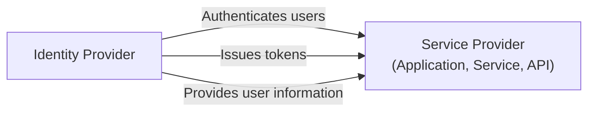
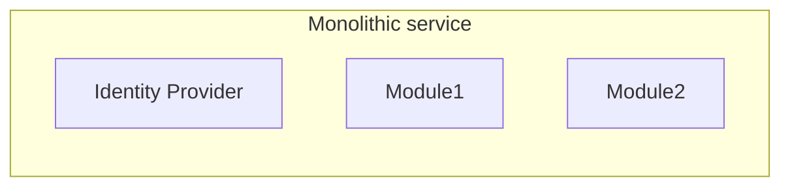
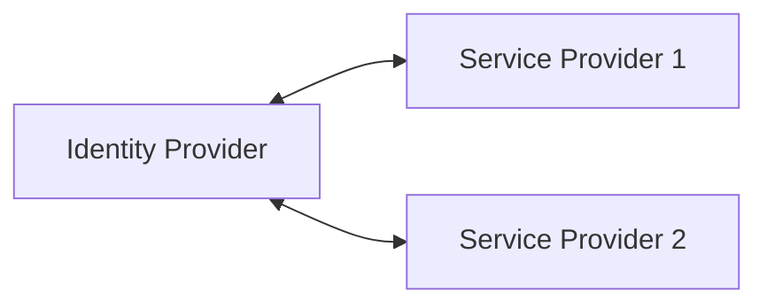

## 신원 제공자 (IdP)란 무엇인가?

<Ref slug="iam" /> 영역에서, 신원 제공자 (IdP)는 신원을 관리하는 중심 서비스입니다. 사용자를 인증하고 신원 토큰을 발행하며 <Ref slug="service-provider">서비스 제공자</Ref> (예: 애플리케이션, 서비스, API)에 사용자 정보를 제공합니다.

현대 신원 제공자는 <Ref slug="authentication" />뿐만 아니라 <Ref slug="authorization" /> (<Ref slug="access-control" /> 정책 집행)도 담당하며 <Ref slug="single-sign-on" /> 및 <Ref slug="multi-tenancy" />와 같은 고급 기능을 지원합니다.

## 신원 제공자 표준

신원 관리의 특성과 상호 운용성의 필요성으로 인해 표준 없이 신원 제공자를 구축하는 것은 비현실적이고 비효율적입니다. 다음은 일반적인 시나리오입니다:

- 두 신원 제공자가 사용자 정보를 교환하기 위해 서로 통신해야 할 때 (예: 소셜 로그인).
- 애플리케이션이 여러 신원 제공자를 사용하여 사용자를 인증해야 할 때 (예: 연합 신원).
- 신원 제공자가 여러 유형의 클라이언트를 지원해야 할 때 (예: 웹, 모바일, IoT).

이러한 시나리오를 해결하기 위해 업계는 신원 제공자를 위한 여러 인기있는 표준을 개발했습니다:

- <Ref slug="oauth-2.0" />: 응용 프로그램이 사용자 또는 서비스의 대리인으로 액세스를 얻을 수 있게 하는 널리 사용되는 인가 프레임워크.
- <Ref slug="openid-connect" />: OAuth 2.0 위에 구축된 신원 계층으로 인증 및 사용자 정보를 제공합니다.
- <Ref slug="saml" />: 보안 도메인 간의 인증 및 인가 데이터를 교환하기 위한 표준.

새로운 애플리케이션에 대해서는, 신원 제공자를 구축하거나 기존 신원 제공자와 통합하기 위해 OpenID Connect (OIDC)가 권장되는 표준입니다.

## 신원 제공자 아키텍처

"신원 제공자"라는 용어는 특정 아키텍처나 구현을 지정하지 않습니다. 즉, 신원 제공자는 모놀리식 애플리케이션, 마이크로서비스 또는 클라우드 서비스일 수 있습니다.

신원 관리의 복잡성과 중요성 때문에, 현대 애플리케이션은 독립 서비스 또는 벤더 솔루션인 전문 신원 제공자를 사용하는 경향이 있습니다.

## 신원 제공자 기능

현대 신원 제공자는 다양한 사용 사례와 요구 사항을 지원하기 위해 광범위한 기능을 제공합니다. 다음은 일반적인 기능입니다:

- <Ref slug="authentication" />: 다양한 방법(예: 사용자명/비밀번호, 소셜 로그인, <Ref slug="mfa" />)을 사용하여 사용자의 신원을 확인합니다.
- <Ref slug="authorization" />: 접근 제어 정책을 시행하고 사용자 권한을 관리합니다 (예: <Ref slug="rbac" />, <Ref slug="abac" />).
- **사용자 관리**: 사용자 계정 및 프로필을 생성, 업데이트, 삭제하고 사용자 데이터를 <Ref slug="service-provider">서비스 제공자</Ref>에 제공합니다.
- **토큰 관리**: 신원 토큰(예: ID 토큰, 액세스 토큰, 리프레시 토큰)을 발행하고 관리합니다.
- <Ref slug="single-sign-on" />: 사용자가 한 번 인증하고 여러 애플리케이션에 접근할 수 있도록 합니다.
- <Ref slug="multi-tenancy" />: 여러 조직이나 테넌트를 지원하고 격리된 사용자 데이터 및 구성을 제공합니다.

<SeeAlso slugs={["service-provider", "iam", "openid-connect", "oauth-2.0"]} />

<Resources
  urls={[
    "https://blog.logto.io/secure-cloud-apps-with-oauth-and-openid-connect",
    "https://blog.logto.io/incorporate-identity-solution",
    "https://blog.logto.io/centralized-identity-system"
  ]}
/>