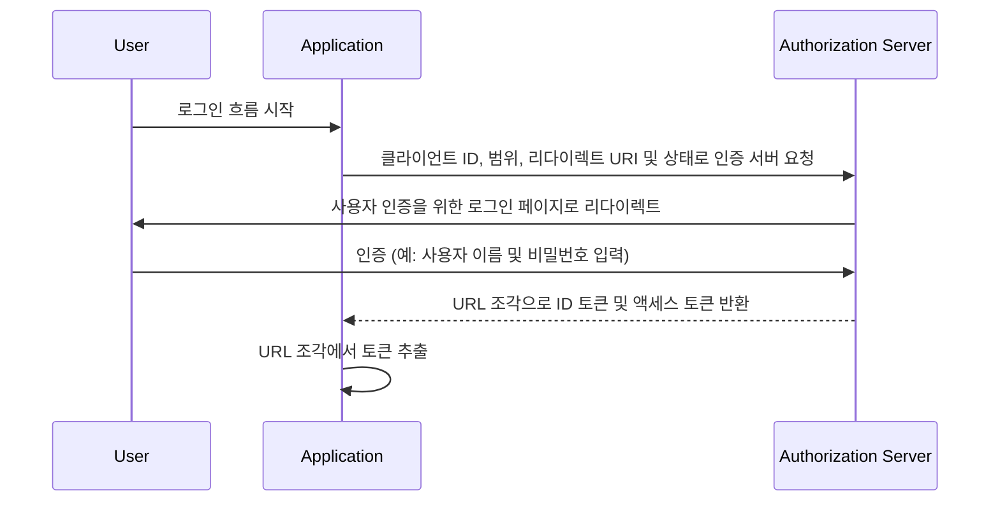

## 암시적 흐름 (Implicit flow)이란 무엇인가

OIDC (OpenID Connect) 암시적 흐름 (Implicit flow)은 주로 스크립팅 언어를 사용해 브라우저에서 구현된 클라이언트 애플리케이션 (e.g., 단일 페이지 애플리케이션 (Single-Page Applications, SPA))에서 사용되는 인증 (Authentication) 프로세스입니다. 이는 클라이언트 애플리케이션이 클라이언트 인증 (Authentication)을 수행하지 않고도 인증 서버로부터 직접 ID 토큰과 액세스 토큰 (Access Tokens)을 얻을 수 있게 합니다.

## 암시적 흐름 (Implicit flow)은 어떻게 작동하는가?

암시적 흐름 (Implicit flow)의 주요 단계는 다음과 같습니다:

1. **인증 요청 (Authentication Request) 전송**: 사용자는 일반적으로 애플리케이션에서 로그인할 링크나 버튼을 클릭하여 흐름을 시작합니다. 애플리케이션은 인증 서버의 인증 엔드포인트에 인증 요청 (Authentication Request)을 보냅니다. 인증 서버는 매개변수를 검증하고 사용자를 인증 서버의 로그인 페이지로 리다이렉트합니다.
2. **사용자 인증 (Authentication)**: 사용자가 인증 서버에서 인증 (예: 사용자 이름과 비밀번호 입력)을 수행합니다.
3. **인증 서버 응답**: 인증 서버가 클라이언트 애플리케이션에 ID 토큰과, 요청 시, 액세스 토큰 (Access Token)을 URL 조각으로 반환합니다.
4. **클라이언트 토큰 처리**: 클라이언트 애플리케이션이 URL 조각에서 토큰을 추출합니다.



### 인증 요청 (Authentication Request)

요청 매개변수는 다음과 같습니다:
- **client_id**: 필수. 유효한 OAuth 2.0 클라이언트 식별자로, Logto에서는 애플리케이션 ID 또는 app ID로 제공됩니다.
- **scope**: 필수. 이 값은 사용자가 인증 서버로부터 요청하는 리소스 집합을 지정합니다. 예: `openid profile email`
- **response_type**: 필수. 값은 `id_token` 또는 `id_token token`이며, 값이 `id_token`일 경우 액세스 토큰은 반환되지 않습니다.
- **redirect_uri**: 필수. 인증 응답이 전송될 URI이며, 클라이언트가 <Ref slug="openid-connect" headingId="openid-provider-op" />에 사전 등록한 리다이렉트 URI와 정확히 일치해야 합니다. 예: Logto Admin Console의 `Sign-in redirect URI`.
- **nonce**: 필수. 리플레이 공격을 방지하기 위해 사용되는 랜덤 문자열로, 인증 요청에서 ID 토큰 클레임으로 그대로 전달됩니다.

### 인증 요청의 예

```bash
curl -X GET "https://authorization-server.com/auth" \
  -d "response_type=id_token token" \
  -d "client_id=YOUR_APPLICATION_ID" \
  -d "redirect_uri=https://yourapp.com/callback" \
  -d "scope=openid profile email" \
  -d "nonce=RANDOM_STRING"
```

## 한계

암시적 흐름 (Implicit flow)은 브라우저가 크로스 오리진 리소스 공유 (Cross-Origin Resource Sharing, CORS)를 광범위하게 채택하지 않았던 시기에 개발되었습니다. 따라서, 다른 도메인에 호스팅된 인증 서버에 POST 요청을 보내는 것이 허용되지 않습니다.

이 제한으로 인해, 인증 서버는 URL 조각에 직접 토큰을 반환하여, 최종 사용자 및 최종 사용자의 사용자 에이전트에 액세스할 수 있는 애플리케이션에 노출될 수 있습니다.

게다가, 암시적 흐름 (Implicit flow)에서는 클라이언트 인증이 수행되지 않아, 브라우저 기반 애플리케이션에서는 클라이언트 ID가 항상 노출되므로 어떤 애플리케이션이라도 클라이언트로 가장하여 인증을 요청할 수 있습니다.

위의 제한 사항으로 인해, 암시적 흐름 (Implicit flow)은 일반적으로 인증 코드 흐름 (Authorization Code Flow)보다 안전성이 낮다고 간주됩니다.

## 암시적 흐름 (Implicit flow)의 대안

암시적 흐름 (Implicit flow)의 보안 제한 사항 때문에, 다른 흐름이 종종 추천됩니다:
- **인증 코드 흐름 (Authorization Code Flow)**: 이 흐름은 클라이언트가 토큰을 위한 인증 코드를 교환하는 추가 단계를 포함하여 보안 계층을 제공합니다.
- **PKCE (Proof Key for Code Exchange)**: 인증 코드 흐름 (Authorization Code Flow)의 확장으로 코드 검증자와 코드 챌린지를 사용하여 보안성을 추가합니다.

<SeeAlso slugs={['device-flow', 'authorization-code-flow', 'client-credentials-flow']} />

<Resources
  urls={[
    "https://blog.logto.io/implicit-flow-is-dead",
    {
      url: "https://tools.ietf.org/html/rfc6749#section-4.2",
      result: {
        ogTitle: "The OAuth 2.0 Authorization Framework: Implicit Grant",
        ogDescription: "The implicit grant type is used to obtain access tokens (it does not support the issuance of refresh tokens) and is optimized for public clients known to operate a particular redirection URI. These clients are typically implemented in a browser using a scripting language such as JavaScript."
      }
    },
    "https://openid.net/specs/openid-connect-core-1_0.html",
  ]}
/>
