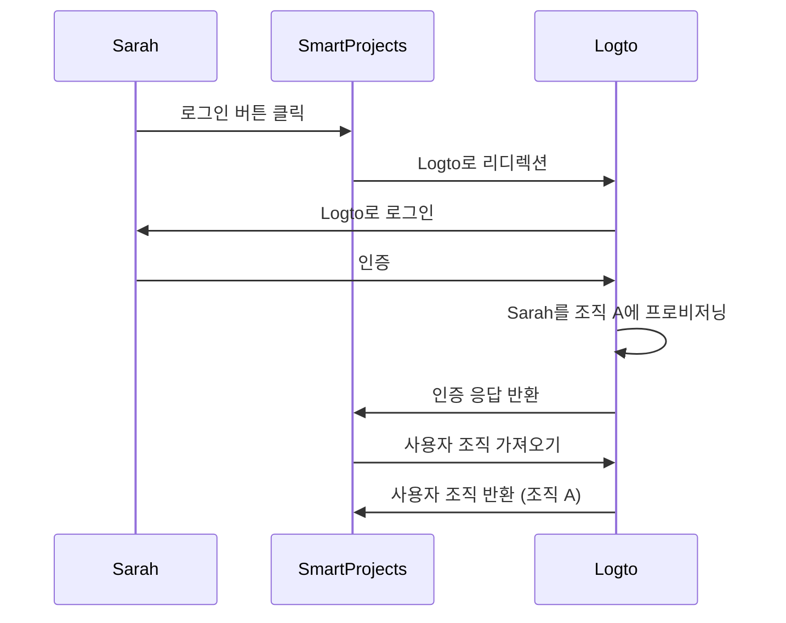
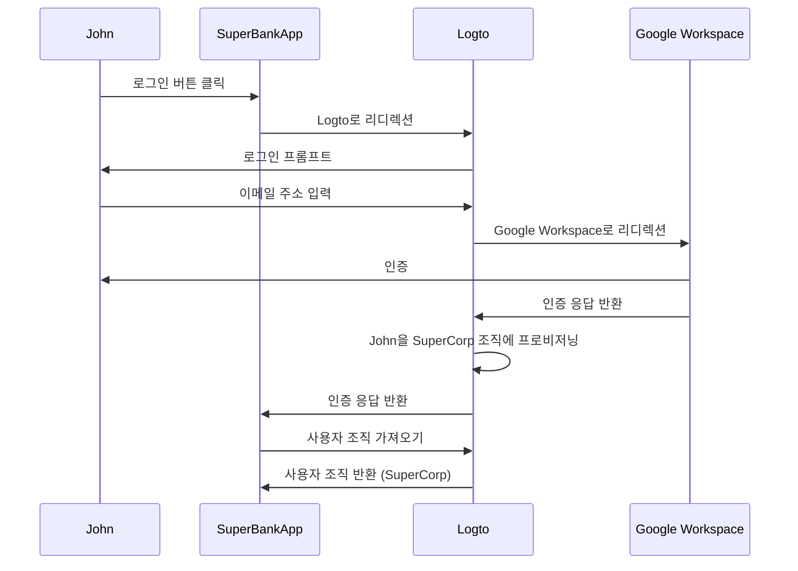

## Just-in-time 프로비저닝이란 무엇인가?

Just-in-time (JIT) 프로비저닝은 사용자가 처음으로 로그인하려고 시도할 때 사용자의 신원과 시스템의 구성에 따라 사용자 계정을 즉석에서 프로비저닝하는 <Ref slug="iam" />에서 사용되는 프로세스입니다.

## Just-in-time 프로비저닝의 사용 사례는 무엇인가?

이러한 사례는 다중 테넌트 아키텍처, Enterprise SSO (엔터프라이즈 SSO) 또는 팀 온보딩 기능이 필요한 B2B 앱을 구축할 때 일반적입니다. 여기에는 당신이나 당신의 고객이 직면할 수 있는 몇 가지 예시 시나리오가 있습니다.

### 직원 온보딩

당신의 고객 중 하나인 *SuperFantasy*가 빈번한 채용이나 급속한 성장을 경험하고 있다고 상상해보세요. JIT 프로비저닝을 사용하여 새로운 직원의 사용자 계정을 신속하게 설정할 수 있습니다. *SuperFantasy*는 Logto를 ID 및 액세스 관리에 사용하고 SmartProjects를 프로젝트 관리에 사용합니다. 새로운 직원인 Sarah가 SmartProjects에 처음 로그인할 때, 그녀의 계정은 Logto 자격 증명에 따라 자동으로 생성되고 구성됩니다.

위의 다이어그램에 따르면, Sarah가 SmartProjects에 처음 로그인할 때, 그녀의 계정은 Logto의 조직 A에 자동으로 프로비저닝됩니다. 이 프로세스는 IT 팀의 수동 개입 없이 Sarah가 SmartProjects에 필요한 액세스를 갖도록 보장합니다.

### 엔터프라이즈 고객 온보딩

또 다른 고객인 *SuperBank*가 고객에게 온라인 뱅킹 서비스를 제공하는 금융 기관이라고 상상해보세요. *SuperBank*는 Logto를 ID 및 액세스 관리에 사용하고 SuperBankApp을 온라인 뱅킹에 사용합니다. *SuperBank*는 최근 새로운 엔터프라이즈 고객인 *SuperCorp*와 계약을 체결하여 직원들에게 온라인 뱅킹 서비스를 제공하기로 했습니다.

*SuperCorp*는 직원 계정에 Google Workspace를 사용합니다. SuperBankApp은 *SuperCorp*의 직원이 처음 로그인할 때 계정이 Logto의 *SuperCorp* 조직에 자동으로 추가되도록 해야 합니다.

위의 다이어그램에서, John이 SuperBankApp에 처음 로그인할 때, 그의 계정은 Google Workspace 신원에 따라 Logto의 SuperCorp 조직에 자동으로 프로비저닝됩니다.

## SAML 및 Enterprise SSO에만 해당되나요?

Just-in-time (JIT) 프로비저닝은 SAML 인증에서 <Ref slug="enterprise-sso" />와 자주 연관되지만, <Ref slug="saml" />에만 국한되지는 않습니다. JIT 프로비저닝은 <Ref slug="oauth-2.0" /> 및 <Ref slug="openid-connect" />와 같은 다른 인증 프로토콜에서도 사용할 수 있으며, 항상 <Ref slug="enterprise-sso" /> 설정이 필요한 것은 아닙니다.

예를 들어, 이메일 기반 JIT 프로비저닝은 <Ref slug="identity-provider" />가 이 기능을 지원할 때 사용할 수 있습니다. 이 경우, 사용자의 이메일 주소는 프로비저닝에 필요한 유일한 속성이며, 인증 프로토콜이나 SSO 구성과는 무관합니다.

## 앱의 신규 사용자 또는 기존 사용자에게 적용되나요?

Just-in-time (JIT) 프로비저닝은 일반적으로 앱에 처음 접근하려는 시도를 의미합니다. 그러나 다양한 제품은 이 기능을 다르게 인식합니다. 일부는 JIT 프로비저닝을 신원 및 계정 생성에만 사용하고, 다른 일부는 재프로비저닝 및 속성 동기화와 같은 즉시 계정 업데이트도 포함합니다.

예를 들어, SAML JIT 프로비저닝은 프로비저닝의 일환으로 그룹 멤버십을 부여하고 취소할 수 있습니다. 또한 <Ref slug="service-provider" /> 저장소의 속성을 <Ref slug="identity-provider" /> 사용자 저장소 속성과 동기화하여 프로비저닝된 사용자를 업데이트할 수 있습니다.

기존 사용자 로그인 시나리오를 고려하고 싶다면, JIT 시스템과 함께 강력한 프로비저닝 시스템을 갖추어야 합니다. 예를 들어:

- **충돌 해결**: JIT 프로세스 중 IdP에서 제공한 정보와 다른 정보로 계정이 이미 존재하는 경우 충돌을 처리하기 위한 전략이 있어야 합니다. 이는 조직의 정책 및 IdP 구성에 대한 세부적인 제어가 필요할 수 있습니다.
- **감사 추적**: 보안 및 규정 준수를 위해 JIT 프로세스를 통해 생성된 새로운 계정 생성 및 기존 계정 업데이트의 로그를 유지하는 것이 중요합니다.
- **성능**: JIT 프로비저닝은 빠르게 이루어지지만, 특히 기존 사용자의 정보를 매 로그인 시 업데이트하는 경우 로그인 시간에 미치는 잠재적 영향을 고려해야 합니다.
- **데이터 일관성**: 기존 사용자 계정을 업데이트할 때 특히 데이터 일관성을 유지하도록 JIT 프로비저닝 프로세스를 보장해야 합니다.

## JIT와 교차 도메인 ID 관리 시스템 (SCIM)의 차이점은 무엇인가?

SCIM은 다양한 시스템 및 도메인 간의 사용자 ID 관리를 단순화하고 자동화하기 위해 설계된 개방형 표준 프로토콜입니다. 디렉토리 동기화 시나리오에서 일반적으로 사용됩니다.

JIT와 SCIM의 주요 차이점은 JIT는 일반적으로 앱에 처음 접근하려는 시도(또는 신규 사용자 온보딩)를 의미하며, 사용자 계정을 동적으로 프로비저닝하는 프로세스를 설명하는 광범위한 용어인 반면, SCIM은 시스템 간 사용자 수명 주기를 관리하기 위한 특정 프로토콜이며 첫 로그인에 국한되지 않는다는 점입니다.

또한, JIT는 시스템 간 표준화된 구현이 부족한 반면, SCIM은 ID 관리를 위한 표준화된 프로토콜로 [RFC 7644](https://datatracker.ietf.org/doc/html/rfc7644)로 정의되어 있습니다.

일부 대규모 조직은 계정 프로비저닝에 SCIM을 사용하여 자체 시스템과 통합합니다. 이는 매우 복잡할 수 있으며 사례별로 다를 수 있습니다. 대부분의 사용 사례에서는 JIT 프로비저닝이 더 간단하고 직관적인 접근 방식입니다.

<Resources urls={['https://blog.logto.io/jit-provisioning', 'https://datatracker.ietf.org/doc/html/rfc7644']} />