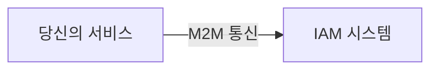
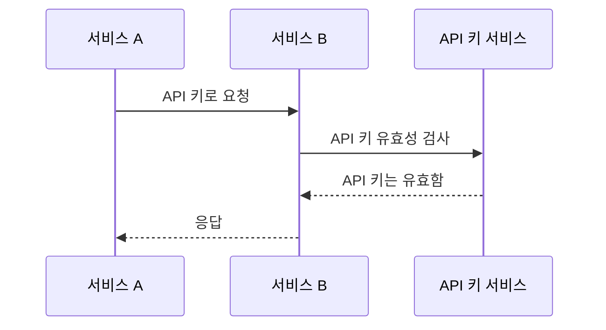
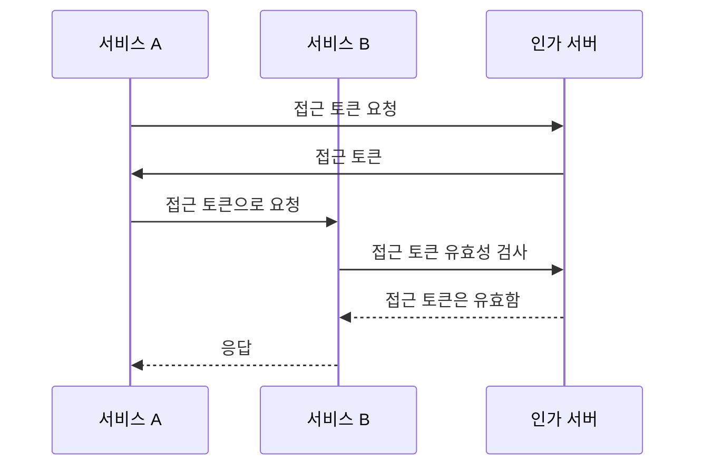
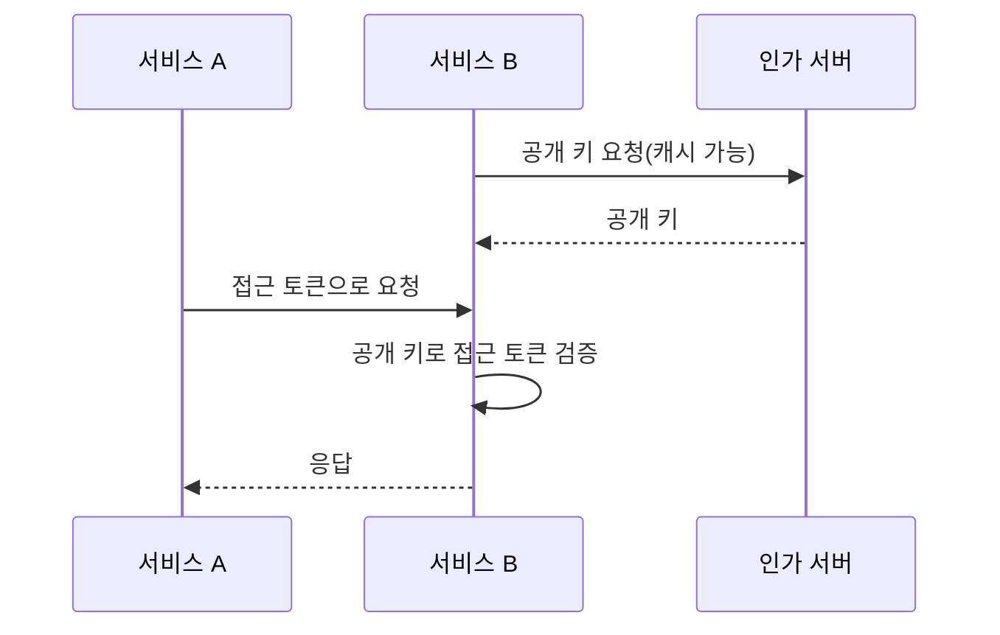

## 기계 대 기계 통신이란 무엇인가?

기계 대 기계 (M2M) 통신은 기기 간에 사람이 개입하지 않고 데이터를 자동으로 교환하는 것을 의미합니다. 인증 (Authentication) 및 인가 (Authorization) 측면에서 M2M 통신은 종종 리소스에 액세스해야 하는 클라이언트 애플리케이션이 관련되며, 이 클라이언트 애플리케이션은 기계(서비스) 또는 사용자를 대신하는 기계입니다.

## 왜 기계 대 기계 통신을 처리해야 하나요?

단일 서비스만 있고 그 무엇에도 의존하지 않는 경우 다른 서비스와 통신할 필요가 없을 가능성이 높습니다. 시스템이 성장하거나 아이덴티티 및 접근 관리(IAM) 시스템과 통합하려고 할 때, 기계 대 기계 통신을 처리해야 합니다.

그러나 여전히 단순해 보입니다 - 서비스 식별과 인증만 하면 됩니다. 그러나 실제로는 해결해야 할 여러 가지 과제가 있습니다:

### 1. 인증 (Authentication)

서비스를 어떻게 인증할 것인가? 사용자가 없기 때문에 사용자 이름과 비밀번호를 사용할 수 없습니다. 대신 API 키 (API key), 클라이언트 인증서, 또는 OAuth 클라이언트 인증 정보를 사용해야 합니다.

### 2. 인가 (Authorization)

서비스를 인증한 후에는 서비스가 무엇을 할 수 있는지를 어떻게 결정할 것인가? 사용자에게 부여하는 것과 유사하게 서비스에 대한 권한과 역할을 정의해야 합니다. 소스 코드에 권한을 하드코딩하지 않는 것이 중요합니다.

### 3. 보안

서비스 간의 통신이 안전하도록 어떻게 보장할 것인가? 인증 정보가 정기적으로 업데이트될 것인가? 어떻게 통신을 모니터링하고 감사할 것인가?

### 4. 확장성

서비스의 수가 늘어남에 따라 각 서비스의 인증 (Authentication) 및 인가 (Authorization)를 어떻게 관리할 것인가?

## 기계 대 기계 통신에 대한 일반적인 접근 방식

이와 같은 과제를 염두에 두고, 업계에서는 몇 가지 일반적인 접근 방식을 시행하고 있습니다:

### 1. API 키 (API key)

<Ref slug="api-key">API 키 (API key)</Ref>는 서비스를 인증하는 간단한 방법입니다. 각 서비스는 하나 이상의 API 키를 가질 수 있으며, 이는 인증 (및 때때로 인가)에 사용됩니다. 일부 서비스에서는 요청 헤더에 `X-API-Key: your-api-key`와 같은 API 키 입력을 요구할 수 있습니다.

API 키가 작동하는 비공식적인 예:

장점:

- 구현하고 사용하기 간단.
- 안전한 무작위 생성과 충분한 길이를 가진 경우, API 키는 추측하기 어려움.
- 유효성 검사가 동적이어서 언제든지 API 키를 취소 가능.

단점:

- API 키를 검증하기 위해 네트워크 통신이 필요.
- 자체 포함되어 있지 않으며, 조사에 서비스가 필요.
- API 키 소유 서비스만큼 다른 서비스도 동일한 수준의 접근 권한을 가짐(부분적으로는 API 게이트웨이 사용으로 완화될 수 있음).
- 서비스 간에 많은 API 키를 관리하기 어려움.

### 2. OAuth 클라이언트 인증 정보 (Client credentials flow)

OAuth (또는 OpenID Connect, OpenID Connect는 OAuth 2.0을 기반으로 하기 때문에) <Ref slug="client-credentials-flow" />는 서비스를 인증하는 더 발전된 방법입니다. 이는 사용자 인증 (Authentication) 및 인가 (Authorization)에도 널리 사용되는 OAuth 2.0 프레임워크를 기반으로 합니다. OAuth 클라이언트 인증 정보를 사용하면, 서비스를 인가 서버에 클라이언트 ID와 클라이언트 비밀을 제공하여 접근 토큰을 얻을 수 있습니다.

OAuth 클라이언트 인증 정보가 작동하는 비공식적인 예:

일반적으로, 접근 토큰은 서비스 및 그 권한에 대한 정보를 포함하는 JSON 웹 토큰 (JWT)입니다. 그러면 다른 서비스는 인가 서버와의 통신 없이 JWT 서명을 검증하기 위한 공개 키만 있으면 접근 토큰을 검증할 수 있습니다. 워크플로우는 다음과 같이 됩니다:

JSON 웹 토큰에 대한 자세한 정보는 <Ref slug="jwt" />를 참조하세요.

장점 (JWT 사용 시):

- 자체 포함되어 있어 추가적인 네트워크 통신 없이도 다른 서비스가 즉시 권한과 같은 필요한 정보를 알 수 있음.
- 접근 토큰은 단기 생명으로 유지되어 오용의 위험을 줄임.
- 다른 서비스는 클라이언트 비밀을 알 필요 없이 JWT 서명을 검증하기 위한 공개 키만 필요.
- 접근 토큰을 사용하여 서비스의 행동을 감사할 수 있음(예: 어떤 서비스가 어떤 리소스를 접근했는지).
- 서비스 간의 명확한 경계를 설정하여 많은 서비스를 쉽게 관리할 수 있음.

단점:

- API 키보다 구현하고 사용하기 조금 더 복잡함.
- 다른 서비스가 오프라인 검증만 수행하는 경우, 접근 토큰이 취소되었는지 알 수 없음.

### 3. 상호 TLS (Mutual TLS)

상호 TLS (mTLS)는 클라이언트 인증서를 사용하여 서비스를 인증하는 방식입니다. mTLS를 사용하면 각 서비스가 비공개 키와 함께 클라이언트 인증서를 보유하고, 다른 서비스에서 공개 키를 사용하여 인증서를 검증합니다. 그러나, mTLS는 TLS 계층에 중점을 두고 있어 단독으로는 애플리케이션 수준의 인증 (Authentication) 및 인가 (Authorization)에는 일반적으로 적합하지 않습니다.

고급 사용 사례를 위해, mTLS는 인증서 바인드 접근 토큰과 결합되어 통신을 더욱 안전하게 할 수 있습니다. 자세한 내용은 [RFC 8705: OAuth 2.0 상호 TLS 클라이언트 인증 및 인증서 바인드 접근 토큰](https://datatracker.ietf.org/doc/html/rfc8705)을 참조하세요.

장점:

- 공개 키 암호화 기반으로 강력한 인증 제공.
- 기본적으로 암호화되어 있어 통신이 안전함.
- JWT와 유사하게 클라이언트 인증서를 사용하여 서비스를 식별 가능.

단점:

- API 키 및 OAuth 클라이언트 인증 정보보다 구현하고 관리하기 더 복잡함.
- 클라이언트 인증서는 정기적으로 업데이트되어야 함.
- 클라이언트 인증서를 올바르게 관리하기 위한 더 많은 기술 지식이 필요.
- 다른 서비스가 mTLS를 지원하지 않을 수 있어 대체 메커니즘이 필요.

<SeeAlso slugs={["api-key", "client-credentials-flow", "jwt"]} />