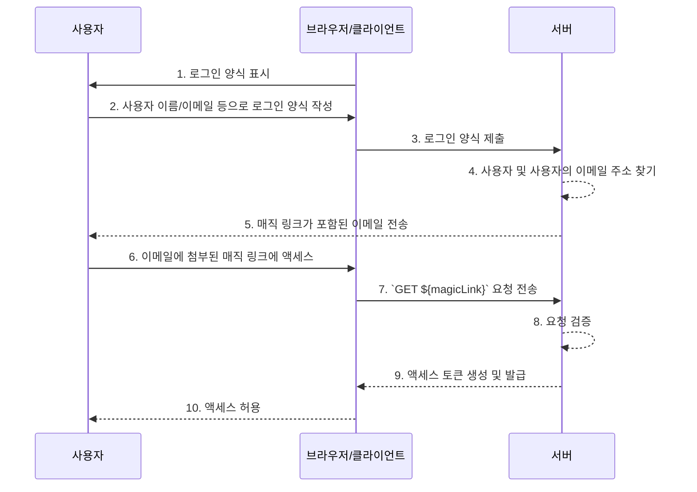

## 매직 링크 (Magic link)란 무엇인가요?

매직 링크 (Magic link)는 인증 프로세스 중 사용자에게 전송되는 일회성 링크입니다.

이 링크에 액세스함으로써 사용자는 원하는 리소스에 액세스하기 위해 필요한 authorization flow (인가 흐름)를 완료하고 적절한 리소스에 대한 액세스 권한을 부여받습니다. 이후 매직 링크는 무효화됩니다.

## 매직 링크 (Magic link)와 일회성 비밀번호 (OTP)의 차이점은 무엇인가요?

사용자가 이메일을 사용하여 매직 링크 (Magic link) 또는 <Ref slug='otp' />를 받는다고 가정해봅시다.

많은 경우, 사용자는 로그인 확인 또는 <Ref slug='mfa' />의 추가 확인 요소로 OTP를 받기 위해 이메일을 사용합니다. 이메일 매직 링크와 이메일 OTP를 사용하는 것의 차이점은 무엇일까요?

OTP를 사용할 경우, 사용자는 이메일을 확인하고 OTP를 기억한 후 로그인/확인 프로세스에 입력해야 합니다. 이는 사용자가 여러 앱이나 페이지 간에 수동으로 반복적으로 전환해야 함을 의미합니다.

이메일 매직 링크를 사용할 경우, 사용자는 이메일 앱에서 매직 링크가 포함된 이메일을 열고 링크를 클릭하기만 하면 됩니다. 이는 더 간단한 사용자 경험을 제공합니다.

또한, 매직 링크를 사용하면 링크에 일회성 토큰 외에도 로그인과 관련된 세션 정보를 포함할 수 있어 보안과 사용자 경험을 모두 향상시킬 수 있습니다.

## 매직 링크 (Magic link)는 어떻게 작동하나요?

이 시퀀스 다이어그램에서는 사용자가 매직 링크를 사용하여 적절한 리소스에 액세스하는 방법을 설명합니다.

이 시퀀스 다이어그램에서는 매직 링크가 이메일을 통해 전송된다고 가정합니다. 그러나 매직 링크를 전송하는 다른 방법도 있으며, 예를 들어 휴대폰으로 문자 메시지를 통해 전송할 수 있습니다. 이러한 대안은 흐름이 거의 동일하기 때문에 여기서는 다루지 않습니다.

1. **로그인 양식 표시**
브라우저/클라이언트는 사용자에게 로그인 양식을 표시하여 인증 프로세스를 시작합니다.
2. **사용자가 로그인 양식을 작성**
사용자는 사용자 이름, 이메일 주소 또는 전화번호와 같은 식별자를 로그인 양식에 입력합니다.
제공된 정보는 시스템이 고유한 사용자를 식별하는 데 충분해야 합니다. 예를 들어, 대부분의 시스템에서는 로그인에 사용되는 사용자 이름이 고유합니다. 이러한 시스템에서는 사용자가 로그인하려는 계정을 고유하게 식별하기 위해 사용자 이름만 제공하면 됩니다.
3. **로그인 양식 제출**
브라우저/클라이언트는 2단계에서 설명한 사용자의 정보를 포함하여 양식을 서버에 제출합니다.
4. **사용자 및 이메일 찾기**
서버는 데이터베이스에서 고유한 사용자를 찾아 사용자의 관련 이메일 주소를 검색하여 요청을 처리합니다.
5. **매직 링크가 포함된 이메일 전송**
서버는 사용자의 이메일 주소로 매직 링크가 포함된 이메일을 전송합니다. 이 이메일에는 인증을 위한 매직 링크가 포함되어 있습니다.
6. **사용자가 매직 링크에 액세스**
사용자는 이메일을 받고 그 안에 제공된 매직 링크를 클릭합니다.
7. **매직 링크로 GET 요청 전송**
브라우저/클라이언트는 매직 링크 URL을 사용하여 서버에 `GET` 요청을 보냅니다.
8. **요청 검증**
서버는 매직 링크가 유효하고 사용되지 않았으며 만료되지 않았는지 확인하기 위해 요청을 검증합니다.
9. **액세스 토큰 생성 및 발급**
요청이 검증되면 서버는 액세스 토큰을 생성하고 브라우저/클라이언트에 발급합니다.
10. **액세스 허용**
브라우저/클라이언트는 액세스 토큰을 수신하고 사용자가 요청한 리소스에 액세스할 수 있도록 허용합니다.

## 매직 링크 (Magic link)의 이점은 무엇인가요?

매직 링크는 토큰 기반 상호작용 모델을 사용하여 인증 시스템의 보안 아키텍처를 강화합니다. 각 링크는 고유하게 암호화되어 있으며 일반적으로 만료 타임스탬프를 포함합니다. 그 일시적인 특성 덕분에 매직 링크가 가로채이거나 유출되더라도 그 짧은 유효성 기간은 악의적인 이용의 기회를 제한합니다.

또한, 매직 링크를 사용하는 것은 신뢰할 수 있는 이메일 주소나 전화번호와 같은 사용자 제어 수신 방법을 필요로 하기 때문에 사용자 이름과 비밀번호 외에도 추가적인 확인 방법을 제공하여 계정 보안을 강화합니다. 그리고 매직 링크는 자격 증명을 입력할 필요를 없애므로 사용자의 계정 보안이 더 잘 보호되고 프로세스가 더 편리해집니다.