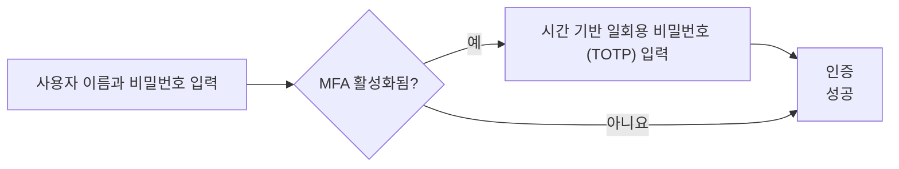
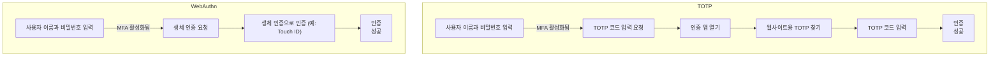

## 다요소 인증 (Multi-factor authentication, MFA)이란 무엇인가?

다요소 인증 (MFA)은 사용자가 자신의 신원을 확인하기 위해 여러 형태의 식별 정보를 제공하도록 요구함으로써 보안을 강화합니다. 이는 <Ref slug="authentication" /> 프로세스에 추가적인 보안 계층을 제공하며, 공격자가 무단 접근을 얻기 어렵게 만듭니다.

다음은 MFA의 예입니다:

### "요소"의 정의

위의 예에서 두 가지 요소가 있습니다:

1. 사용자 이름과 비밀번호
2. 모바일 앱의 <Ref slug="totp" />

각 요소는 사용자를 인증하는 데 사용할 수 있는 다른 범주의 자격 증명(내가 누구라고 말하는지 증명)을 나타냅니다. 실제로 요소는 세 가지 주요 유형으로 분류될 수 있습니다:

|            | 의미         | 검증 요소                                                                    |
| ---------- | ------------ | ------------------------------------------------------------------------------|
| 지식       | 당신이 아는 것 | 비밀번호, 이메일 인증 코드, 백업 코드                                        |
| 소유       | 당신이 가진 것 | SMS 인증 코드, 인증 앱 OTP, 하드웨어 OTP (보안 키), 스마트 카드                           |
| 내재       | 당신이 누구인가 | 지문, 얼굴 인식 등 생체 인증                                                    |

일반적인 MFA 설정은 비밀번호(지식)와 인증 앱의 <Ref slug="totp" /> (소유)와 같이 다른 범주에서 두 가지 요소를 결합하는 것입니다.

### MFA가 중요한 이유는 무엇인가?

> 완벽한 보안이라는 것은 없으며, 단지 다양한 수준의 불안정성만 있을 뿐이다. —Salman Rushdie

MFA의 중요성은 수치에서 명백합니다: MFA는 전체 인구에서 99.22%, 유출된 자격 증명의 경우 98.56%로 타협의 위험을 줄입니다[^1]. MFA의 도움으로 민감한 데이터에 접근하고 금융 거래를 수행하는 것과 같은 더 중요한 작업을 자신 있게 수행할 수 있습니다. 이는 비밀번호나 단일 요소 인증보다 훨씬 높은 보안 수준을 제공하는 간단하면서도 효과적인 방법입니다.

## 현대 애플리케이션에서의 MFA

이름에서 알 수 있듯이, MFA는 두 개 이상의 요소를 포함할 수 있습니다. 요소의 수가 증가함에 따라 보안 수준과 인증 프로세스의 복잡성이 증가하여 사용자 친화적이지 않게 될 수 있습니다. 최근 몇 년 간 <Ref slug="totp" />가 인기 있는 선택이었지만, <Ref slug="passkey" />와 같은 새로운 기술이 더 안전하고 사용자 친화적인 MFA 경험을 제공하기 위해 등장하고 있습니다.

예를 들어, 현대 애플리케이션은 <Ref slug="webauthn" /> API를 사용하여 공개 키 암호화로 보호된 피싱 방지 자격 증명인 패스키를 사용한 MFA를 구현할 수 있습니다. Apple과 같은 회사는 생체 인증(Touch ID, Face ID)과 패스키를 통합하여 MFA 프로세스에 본질적 요소를 추가하여 보안과 사용자 편의성을 높였습니다.

더 나은 이해를 위해 빠르게 비교해 보겠습니다. 사용자가 다음과 같은 경우를 가정해 보겠습니다:

1. TOTP 코드를 생성하기 위해 그들의 전화기에 인증 앱을 설치했습니다.
2. 그들의 디바이스의 생체 인증과 통합된 패스키가 있습니다.

그들이 노트북에서 MFA가 활성화된 웹사이트에 로그인할 때, 두 프로세스는 다음과 같습니다:

WebAuthn 프로세스는 사용자에게 훨씬 적은 단계와 시간을 소요함을 알 수 있습니다. 더욱이 Apple과 같은 회사는 디바이스 간 패스키 동기화(iPhone, iPad, Mac 등)를 지원하여 높은 수준의 보안을 유지하면서 MFA 프로세스를 부드럽게 만듭니다.

## 보안 고려 사항

MFA를 구현할 때 몇 가지 보안 고려 사항을 고려해야 합니다:

- 다른 범주의 요소를 결합하여 보다 높은 수준의 보안을 확보합니다. 예를 들어, 비밀번호(지식)와 TOTP 코드(소유)를 결합합니다.
- SIM 스와핑 공격에 취약하기 때문에 SMS를 MFA 요소로 사용하는 것을 피합니다.
- 복구 옵션은 MFA를 우회하지 않아야 합니다. 예를 들어, 사용자가 인증 앱을 잃어버린 경우, 백업 코드나 다른 MFA 요소를 사용하여 접근을 복구해야 합니다.
- brute-force 공격을 방지하기 위해 실패한 MFA 시도 사이에 쿨다운 기간을 시행합니다.

[^1]: [다요소 인증은 사이버 공격을 얼마나 억제할 수 있을까?](https://query.prod.cms.rt.microsoft.com/cms/api/am/binary/RW166lD)

<SeeAlso slugs={["totp", "webauthn", "passkey"]} />

<Resources
  urls={[
    "https://blog.logto.io/elaborate-mfa",
    "https://blog.logto.io/web-authn-and-passkey-101",
    "https://blog.logto.io/webauthn-base-knowledge",
  ]}
/>