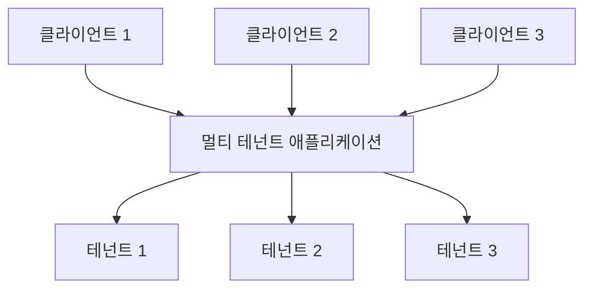
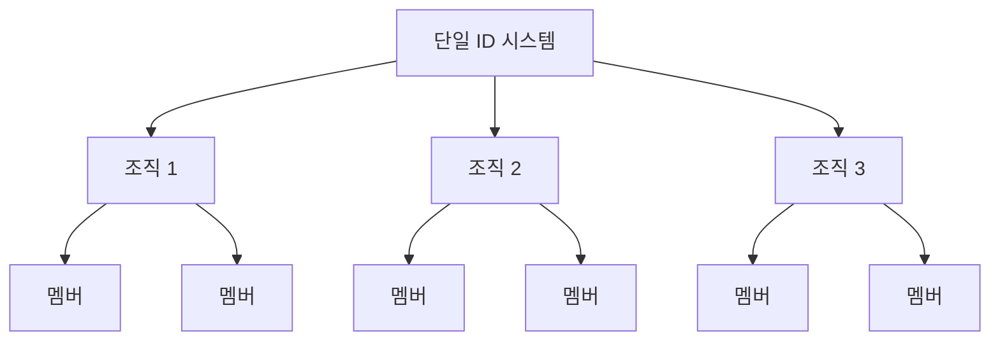

## 멀티 테넌시란 무엇인가?

소프트웨어 멀티 테넌시는 단일 소프트웨어 인스턴스가 서버에서 실행되며 여러 테넌트를 서비스하는 소프트웨어입니다. 이러한 방식으로 설계된 시스템은 "공유"됩니다(전용 또는 격리된 것이 아님).

테넌트는 소프트웨어 인스턴스에 특정 권한으로 공통 접근을 공유하는 사용자 그룹입니다.

예를 들어, CRM(고객 관계 관리) 시스템은 모든 클라이언트에게 동일한 서비스를 제공하기 위해 멀티 테넌트 아키텍처를 자주 사용합니다.

멀티 테넌시의 핵심 원칙은 "공유"입니다. 이는 솔루션의 모든 부분이 공유된다는 의미가 아니라, 적어도 일부 구성 요소가 여러 테넌트 간에 재사용된다는 의미입니다. 이 넓은 개념을 이해하면 클라이언트의 요구를 더 잘 해결할 수 있습니다.

## 멀티 테넌트 제품의 사용 사례는 무엇인가?

멀티 테넌트 앱은 생산성 도구, 협업 소프트웨어 등과 같은 소프트웨어-서비스(SaaS) 제품에서 일반적으로 사용됩니다. 이 설정에서 각 "테넌트"는 일반적으로 여러 사용자가 있는 비즈니스 고객(일반적으로 직원)을 나타냅니다. 다른 제품에서는 맥락에 따라 테넌트, 워크스페이스 또는 프로젝트로 언급될 수 있습니다. 단일 비즈니스도 다른 부서나 조직을 나타내기 위해 여러 테넌트를 가질 수 있습니다.

SaaS를 넘어선 B2B 애플리케이션과 같은 더 복잡한 경우에는 멀티 테넌트 앱이 다양한 팀, 비즈니스 클라이언트 및 파트너 회사가 서비스를 액세스할 수 있는 공유 플랫폼을 제공합니다.

## SaaS 제품에서 멀티 테넌시를 사용해야 하는 이유

### 멀티 테넌시로 확장하기

엔터프라이즈 비즈니스의 경우, 멀티 테넌시는 가용성, 자원 관리, 비용 관리 및 데이터 보안에 대한 요구를 효과적으로 충족하는 열쇠입니다. 기술적 수준에서 멀티 테넌트 접근 방식을 채택하면 개발 프로세스를 간소화하고 기술적 문제를 최소화하며 원활한 확장을 촉진합니다.

### 통합된 경험 창출

SaaS 제품의 근원을 살펴보면, 이는 다양한 아파트를 수용하는 건물과 유사합니다. 모든 테넌트는 물, 전기, 가스와 같은 공통 유틸리티를 공유하지만, 자신의 공간과 자원을 관리하는 데 독립적인 통제를 유지합니다. 이 접근 방식은 자산 관리를 간소화합니다.

### 테넌트 격리를 통한 보안 보장

멀티 테넌시 아키텍처에서 "테넌트"라는 용어는 공유 인스턴스 내에서 서로 다른 테넌트의 자원과 데이터를 분리하고 보호하기 위해 도입됩니다. 이는 각 테넌트의 데이터와 작업이 동일한 기본 자원을 사용하더라도 독립적이고 안전하게 유지되도록 보장합니다.

## 멀티 테넌시 아키텍처에서 테넌트 격리를 어떻게 달성할 수 있는가?

멀티 테넌트 애플리케이션을 논의할 때, 항상 **테넌트 격리**를 달성해야 합니다. 이는 공유 시스템(예: 클라우드 인프라 또는 멀티 테넌트 애플리케이션) 내에서 서로 다른 테넌트의 데이터와 자원을 분리하고 안전하게 유지하는 것을 의미합니다. 이는 다른 테넌트의 자원에 대한 무단 접근 시도를 방지합니다.

### 테넌트 격리는 멀티 테넌시의 "공유" 개념과 일치합니다

이는 테넌트 격리가 반드시 인프라 자원 수준의 구조가 아닐 수 있기 때문입니다. 멀티 테넌시와 격리의 영역에서, 일부는 격리를 실제 인프라 자원 간의 엄격한 분할로 봅니다. 이는 일반적으로 각 테넌트가 별도의 데이터베이스, 컴퓨팅 인스턴스, 계정 또는 프라이빗 클라우드를 갖는 모델로 이어집니다. 멀티 테넌트 앱과 같은 공유 자원 시나리오에서는 격리를 달성하는 방법이 논리적 구조일 수 있습니다.

### 인증 (Authentication)과 권한 부여 (Authorization)는 "격리"와 같지 않습니다

SaaS 환경에 대한 접근을 제어하기 위해 인증 (Authentication)과 권한 부여 (Authorization)를 사용하는 것은 중요하지만, 이는 "격리"를 보장하지 않습니다. 격리는 서로 다른 사용자나 데이터 세트를 분리하여 한 사용자의 데이터나 작업이 다른 사용자에게 간섭하거나 접근되지 않도록 하는 것을 의미합니다.

예를 들어, 사용자가 로그인하고 권한을 정의하는 토큰을 받는 인증 (Authentication)과 권한 부여 (Authorization)를 설정했더라도, 이는 보안을 향상시키지만 사용자가 서로 완전히 격리되도록 보장하지는 않습니다. "격리"를 달성하기 위해 다른 맥락이 도입되어야 합니다.

### 테넌트 격리를 달성하기 위해 SaaS 제품 테넌트를 나타내는 맥락으로 "조직"을 사용하십시오

인증 (Authentication)과 권한 부여 (Authorization)만으로는 적절한 역할을 가진 사용자가 다른 테넌트의 자원에 접근하는 것을 방지할 수 없습니다. 접근을 제한하려면 테넌트 ID, 조직 ID 또는 워크스페이스 ID와 같은 "테넌트" 맥락을 추가해야 합니다. 이러한 식별자는 벽, 문, 자물쇠처럼 작용하여 테넌트를 분리합니다.

"조직"이라는 용어는 테넌트 격리를 위해 일반적으로 사용됩니다. 많은 <Ref slug="identity-provider" />는 통합된 ID 시스템을 유지하면서 테넌트를 격리하는 데 도움이 되는 "조직" 기능을 포함합니다. 조직 내 사용자는 "멤버"라고 불립니다.

## 멀티 테넌트 앱에서 ID는 어떻게 관리되는가?

첫 번째 핵심 질문은 비즈니스나 제품의 일부가 별도의 ID 시스템을 필요로 하는지 생각하는 것입니다. 이는 시스템 설계를 안내할 것입니다. 다음은 두 가지 예입니다:

1. 하나의 ID 시스템: 단일 사용자가 동일한 ID 시스템 내에서 두 개의 ID를 가질 수 있습니다. 예를 들어, Sarah는 개인 이메일을 등록하고 <Ref slug="enterprise-sso" />를 통해 연결된 회사 이메일을 사용할 수 있습니다.
2. 여러 ID 시스템: 사용자는 완전히 관련 없는 제품에 대해 별도의 ID 시스템에서 두 개의 별개 ID를 가질 수도 있습니다.

대부분의 멀티 테넌트 앱에서는 ID가 단일 풀에서 관리되며 각 테넌트의 자원은 분리되어 유지됩니다.

## 멀티 테넌트 앱을 계획하고 구축할 때 고려 사항

1. 모델에 집중하세요: B2B 또는 B2C.
2. ID 관리 작업을 누가 처리할 것인가: 개발자, 클라이언트의 관리자, 또는 최종 고객?
3. B2B의 경우, 클라이언트가 조직의 ID를 관리해야 하는가?
4. 조직에 대해 정의해야 할 권한 (<Ref slug="scope" />) 및 <Ref slug="role" />은 무엇이며, 정의할 필요가 없는 것은 무엇인가?
5. 클라이언트가 <Ref slug="enterprise-sso" />를 필요로 하는가?
6. 초대와 같은 협업 기능 추가를 고려하세요.

<Resources
  urls={[
    "https://blog.logto.io/implement-multi-tenancy",
    "https://blog.logto.io/multi-tenant-ultimate-guide",
    "https://blog.logto.io/case-study-multi-tenancy",
    "https://blog.logto.io/multi-tenancy-explained",
    "https://blog.logto.io/are-multi-tenant-apps-equal-saas",
    "https://blog.logto.io/tenancy-models",
    "https://blog.logto.io/do-you-need-multiple-tenants-identity-model",
  ]}
/>