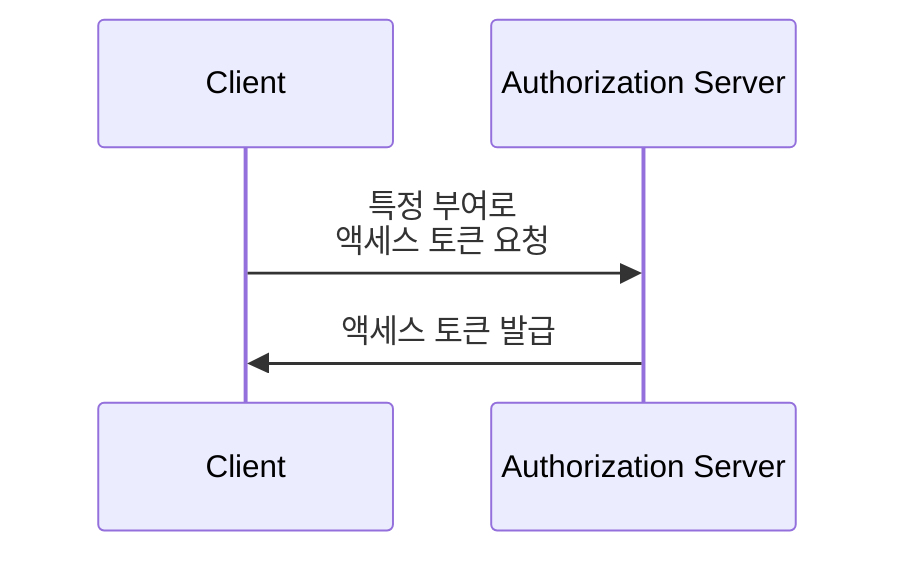

## OAuth 2.0 인증 부여 (Grant)란 무엇인가?

OAuth 2.0 인증 부여는 <Ref slug="client" />가 <Ref slug="authorization-server" />에서 <Ref slug="access-token" />을 요청할 수 있도록 하는 인증 프로세스입니다. 이 개념과 관련된 다른 용어들도 들을 수 있으니, 더 깊이 들어가기 전에 이것들을 명확히 해봅시다:

- **OAuth 2.0 인증 부여 (Grant)**: "OAuth 2.0 grant type", "OAuth 2.0 flow", 또는 "OAuth 2.0 authorization grant"라고도 합니다. 대부분의 문맥에서 이 용어들은 같은 개념을 가리킵니다.
- <Ref slug="authorization-server" />: 클라이언트에게 액세스 토큰을 발급하는 서버입니다. OpenID Connect (OIDC)에서는 인증 서버가 <Ref slug="openid-connect" headingId="openid-provider-op" />와 동일합니다.
- <Ref slug="authorization-request" />: 클라이언트가 액세스 토큰을 받기 위해 인증 서버에 보내는 요청입니다. OpenID Connect (OIDC)에서는 이를 <Ref slug="authentication-request" />라고도 합니다.

명확성을 위해, 우리는 이 글 전체에서 위에 나열된 최초의 용어들을 일관되게 사용할 것입니다.

OAuth 2.0 인증 부여의 고수준 프로세스는 꽤 간단합니다:

클라이언트가 액세스 토큰을 받으면, 사용자를 대신하여 또는 자신을 대신하여 보호된 리소스(예: API)에 액세스하는 데 사용할 수 있습니다.

특정 부여에 따라, 클라이언트와 인증 서버는 추가 정보를 교환하고 프로세스에서 더 많은 단계를 포함할 수 있습니다. 예를 들어, <Ref slug="authorization-code-flow">승인 코드 부여</Ref>는 사용자 인증 및 권한 부여, 코드 생성, 토큰 교환을 포함합니다.

## 다양한 OAuth 2.0 인증 부여 (Grants)

기본 OAuth 2.0 명세서에서는 클라이언트가 액세스 토큰을 얻기 위해 사용할 수 있는 네 가지 부여를 정의합니다:

1. <Ref slug="authorization-code-flow">승인 코드 부여</Ref>: 대부분의 애플리케이션에 대해 가장 안전하고 권장되는 부여입니다. <Ref slug="oauth-2.1" />에서는 모든 클라이언트에게 <Ref slug="pkce" /> 사용을 강제합니다.
2. <Ref slug="implicit-flow">암시적 부여</Ref>: 보안 문제로 인해 OAuth 2.1에서 사용이 중단된 간소화된 부여입니다.
3. [리소스 소유자 비밀번호 자격 증명(ROPC) 부여](https://datatracker.ietf.org/doc/html/rfc6749#section-4.3): 사용자의 자격 증명을 직접 액세스 토큰으로 교환하는 부여입니다. 보안 위험 때문에 대부분의 애플리케이션에 권장되지 않습니다.
4. <Ref slug="client-credentials-flow">클라이언트 자격 증명 부여</Ref>: 사용자 개입 없이 <Ref slug="client" headingId="confidential-clients" />가 액세스 토큰을 얻는 데 사용되는 부여입니다.

산업 발전에 따라, 더 안전하고 표준화된 흐름을 위해 암시적 부여와 ROPC 부여는 [사용이 중단되고 있습니다](https://blog.logto.io/oauth-2-1). 새로운 애플리케이션의 경우 선택은 명확합니다:

- 사용자 인증 및 권한 부여를 위해, PKCE를 사용하는 승인 코드 부여를 사용하세요.
- <Ref slug="machine-to-machine" /> 통신을 위해, 클라이언트 자격 증명 부여를 사용하세요.

### 다른 OAuth 2.0 인증 부여 (Grants)

기본적인 네 가지 부여 외에도 특정 사용 사례에 대한 새로운 부여를 정의하는 다른 확장들이 있습니다. 예를 들어:

- <Ref slug="device-flow">디바이스 인증 부여</Ref>는 스마트 TV 및 IoT 디바이스와 같은 입력 기능이 제한된 디바이스를 위해 설계된 부여입니다.
- <Ref slug="hybrid-flow">하이브리드 흐름 (Hybrid flow)</Ref>은 승인 코드 부여와 암시적 부여를 결합한 OpenID Connect의 부여입니다.

## OpenID Connect (OIDC)에서의 부여 (Grants)

<Ref slug="openid-connect" />에서는 사용자의 신원 정보를 나타내는 <Ref slug="id-token">ID 토큰</Ref>을 액세스 토큰 외에도 포함하여 부여의 개념이 확장됩니다. OIDC는 두 가지 OAuth 2.0 부여(승인 코드 및 암시적)를 ID 토큰을 포함하도록 확장하며, 둘 다를 결합하는 새로운 부여인 <Ref slug="hybrid-flow">하이브리드 흐름</Ref>을 소개합니다.

> OAuth 2.0과 마찬가지로, OIDC에서는 사용자 인증 및 권한 부여를 위해 PKCE를 사용하는 승인 코드 부여만 사용하는 것이 권장됩니다.

한편, OIDC는 OAuth 2.0 위에 구축되었기 때문에, 클라이언트 자격 증명 부여와 같은 다른 부여들도 인증 서버에서 지원하는 한 계속해서 사용할 수 있습니다.

<SeeAlso slugs={["pkce", "oauth-2.1", "authorization-code-flow", "implicit-flow", "client-credentials-flow", "device-flow"]} />

<Resources
  urls={[
    "https://blog.logto.io/implicit-flow-is-dead",
    "https://datatracker.ietf.org/doc/html/rfc6749",
    "https://openid.net/specs/openid-connect-core-1_0.html"
  ]}
/>
