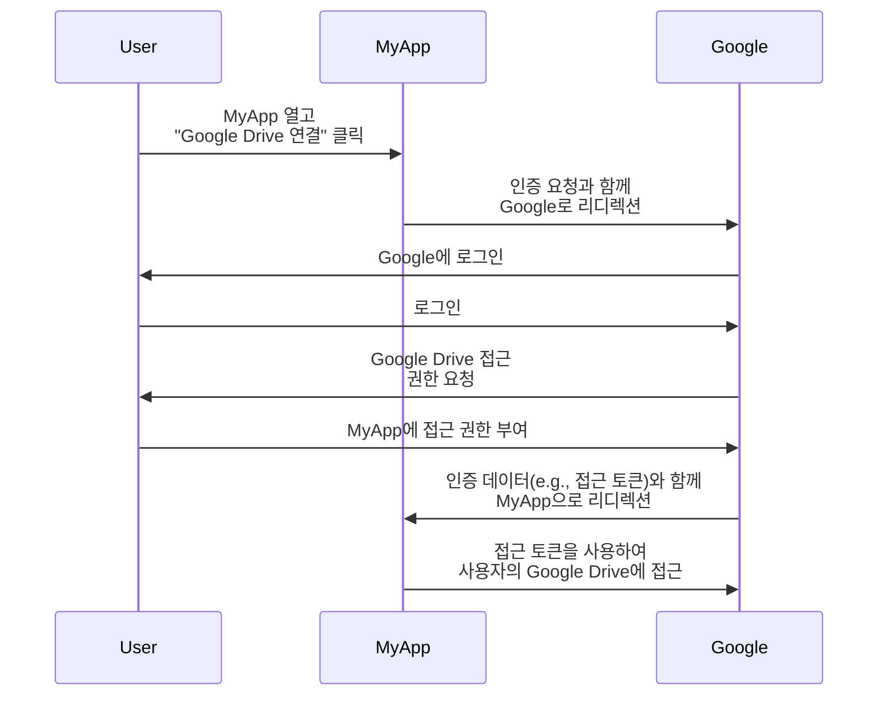
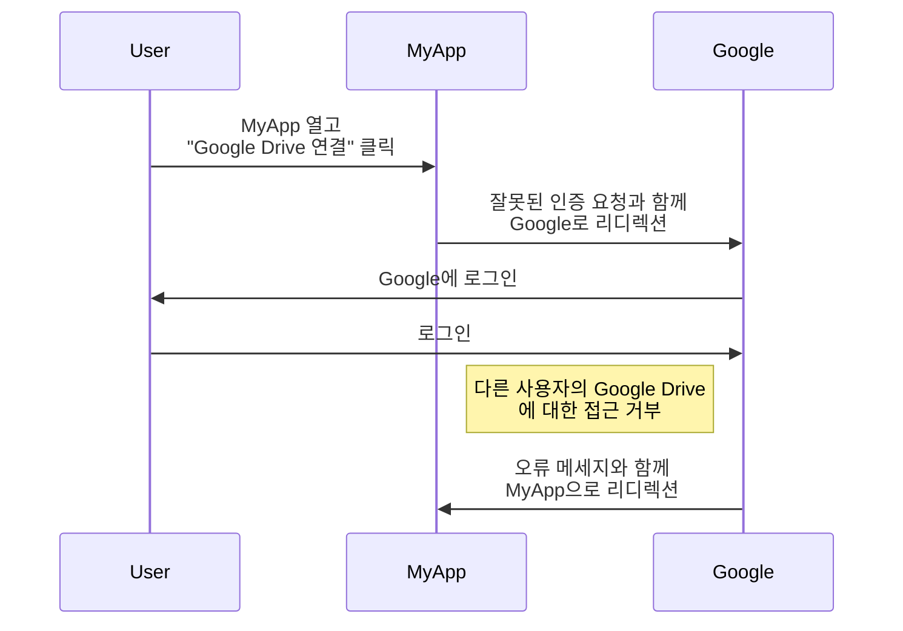
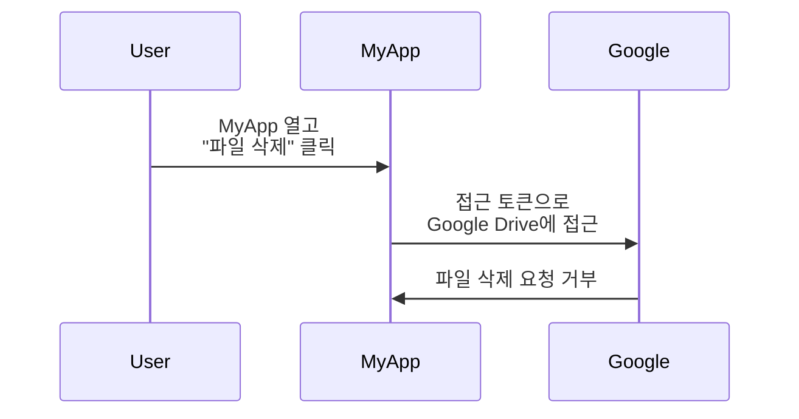

## OAuth 2.0이란?

OAuth 2.0은 인증(Authorization)에 대한 사실상의 표준이며 웹 전반에서 널리 사용됩니다. 이는 애플리케이션이 사용자 프로필이나 데이터와 같은 다른 애플리케이션의 보호된 리소스에 대해 비밀번호와 같은 자격 증명을 노출하지 않고도 안전하게 제한된 접근 권한을 얻을 수 있도록 합니다.

더 나은 이해를 위해 실제 예제를 살펴보겠습니다. 웹 애플리케이션인 MyApp이 사용자의 Google Drive에 접근하려고 합니다. 사용자가 자신의 Google Drive 자격 증명을 공유하도록 요구하는 대신, MyApp은 OAuth 2.0을 사용하여 사용자를 대신하여 Google Drive에 접근을 요청할 수 있습니다. 다음은 간단한 흐름입니다:

이 흐름에서 MyApp은 사용자의 Google Drive 자격 증명을 전혀 보지 않습니다. 대신, Google로부터 사용자를 대신하여 Google Drive에 접근할 수 있는 <Ref slug="access-token" />을 받습니다.

### OAuth 2.0의 핵심 구성 요소

위의 예제에서 MyApp은 <Ref slug="client" />이고, Google은 <Ref slug="authorization-server" />와 <Ref slug="resource-server" /> 역할을 모두 하며, 사용자는 <Ref slug="resource-owner" />입니다. 이 흐름에는 OAuth 2.0의 모든 핵심 구성 요소가 포함됩니다:

- **클라이언트**: 보호된 리소스에 접근하려는 애플리케이션. "클라이언트"와 "애플리케이션"은 종종 교환하여 사용됩니다.
- **리소스 소유자**: 보호된 리소스를 소유한 사용자. 리소스 소유자는 클라이언트에 접근을 부여(인증)하거나 거부할 수 있습니다.
- **인증 서버**: 인증(일반적으로 인증과 함께)을 수행하고 클라이언트에게 접근 토큰을 발급하는 서버.
- **리소스 서버**: 보호된 리소스를 호스팅하는 서버. 접근 토큰을 검증하고 클라이언트에게 보호된 리소스를 제공합니다.

## OAuth 2.0 인증(Grant) (플로우)

<Ref slug="oauth-2.0-grant">Grant</Ref>는 OAuth 2.0의 기초를 구성하며 클라이언트가 인증 서버에서 접근 토큰을 얻는 방법을 정의합니다. 기본 OAuth 2.0 명세는 네 가지 인증을 정의합니다:

- <Ref slug="authorization-code-flow">권한 코드 인증</Ref>
- <Ref slug="implicit-flow">암묵적 인증</Ref>
- [리소스 소유자 비밀번호 자격 증명 (ROPC) 인증](https://datatracker.ietf.org/doc/html/rfc6749#section-4.3)
- <Ref slug="client-credentials-flow">클라이언트 자격 증명 인증</Ref>

각 인증의 세부 사항에 들어가지 않고, 이 인증들은 두 가지 카테고리로 기대할 수 있습니다:

- **권한 인증**: 클라이언트가 사용자에 대한 리소스에 접근해야 할 때 사용됩니다. 즉, 사용자 인증이 필요합니다.
- **클라이언트 자격 증명 인증**: 클라이언트가 자체적인 리소스에 접근해야 할 때 사용됩니다. 이 인증은 <Ref slug="machine-to-machine" /> 통신에 적합합니다.

### 권한 인증

인증 유형과 관계없이, 권한 인증은 다음의 공통 단계를 가지고 있습니다:

1. 클라이언트가 인증 서버로 <Ref slug="authorization-request" />를 시작합니다.
2. 인증 서버는 사용자(리소스 소유자)를 인증하고 리소스에 대한 접근 권한을 요청합니다.
3. 사용자는 클라이언트에 접근 권한을 부여합니다.
4. 인증 서버가 클라이언트에게 접근 토큰을 발급합니다.
5. 클라이언트가 <Ref slug="resource-server" />에서 보호된 리소스에 접근하기 위해 접근 토큰을 사용합니다.

인증 유형에 따라 정확한 단계와 매개변수는 다를 수 있습니다. 예를 들어, <Ref slug="authorization-code-flow">권한 코드 인증</Ref>은 코드 생성 및 교환과 같은 더 많은 단계가 포함됩니다.

### 클라이언트 자격 증명 인증

<Ref slug="client-credentials-flow">클라이언트 자격 증명 인증</Ref>은 훨씬 간단하며 사용자 인증이 필요하지 않습니다. 다음은 간단한 흐름입니다:

1. 클라이언트가 인증 서버로 <Ref slug="token-request" />를 보냅니다.
2. 인증 서버는 클라이언트를 인증하고 접근 토큰을 발급합니다.
3. 클라이언트는 <Ref slug="resource-server" />에서 보호된 리소스에 접근하기 위해 접근 토큰을 사용합니다.

---

OAuth 2.0 인증에 대한 심도 있는 토론은 <Ref slug="oauth-2.0-grant" /> 및 특정 인증 관련 articles를 참조하세요.

## OAuth 2.0을 사용한 접근 제어

OAuth 2.0은 클라이언트가 요청하는 권한을 지정하기 위해 <Ref slug="scope" /> 매개변수를 정의합니다. 인증 서버는 요청된 범위를 전적으로 또는 부분적으로 무시하고, 자체 접근 제어 정책에 따라 접근을 부여할 수 있습니다.

그러나 OAuth 2.0은 인증 서버가 <Ref slug="access-control" />을 어떻게 시행할 것인지에 대한 재량을 남겨둡니다. 이는 인증 서버가 주체(사용자 또는 클라이언트)가 접근할 수 있는 리소스와 해당 리소스에서 수행할 수 있는 액션을 결정할 수 있다는 것을 의미합니다.

Google Drive 예제를 계속 사용해봅시다. MyApp이 실수로 다른 사용자의 Google Drive에 접근하는 인증 요청을 시작할 수 있습니다. 이 경우, Google의 인증 서버는 요청을 거부해야 합니다. 왜냐하면 사용자가 다른 사용자의 Google Drive에 접근할 필요 조건이 없기 때문입니다.

또 다른 경우는 MyApp이 Google로부터 사용자의 Google Drive에서 파일을 읽을 수 있는 접근 토큰을 받을 때 발생합니다. 그러나 MyApp이 파일을 읽는 대신 삭제하려고 하면, 리소스 서버(Google)는 요청을 거부해야 합니다.

두 경우 모두 OAuth 2.0을 구현할 때 왜 <Ref slug="access-control" />이 필요한지를 보여줍니다. <Ref slug="authorization-server" />와 <Ref slug="resource-server" />는 리소스를 보호하기 위해 접근 제어 정책을 시행하기 위해 협력해야 합니다.

### 접근 제어 모델

접근 제어를 올바르게 처리하기 위해, <Ref slug="rbac" /> 및 <Ref slug="abac" />와 같은 표준 접근 제어 모델을 사용하는 것이 권장됩니다. 이러한 모델은 산업에서 효과적임이 입증되었으며 미래 요구 사항에 대한 확장성을 제공합니다.

## OAuth 2.1

<Ref slug="oauth-2.1" />은 수 년간의 산업 경험에 따라 보안성과 사용성을 개선하고자 하는 OAuth 2.0 사양에 대한 제안된 업데이트입니다. OAuth 2.1은 아직 완료되지 않았지만, 제안된 변경 사항을 배우고 현재 OAuth 2.0 구현에 어떻게 영향을 미칠지 이해할 수 있습니다. OAuth 2.1은 산업에서 널리 채택된 모범 사례와 보안 권고 사항의 공식화로 간주될 수 있습니다.

## OAuth 2.0과 OpenID Connect (OIDC)

OAuth 2.0은 인증 프로세스만 정의하고 사용자 인증 또는 ID를 다루지 않습니다. 이러한 이유로, <Ref slug="openid-connect" />가 OAuth 2.0 상에 ID 레이어로 도입되었습니다. OIDC는 사용자 인증과 ID 정보를 <Ref slug="id-token" />의 형태로 제공하기 위해 OAuth 2.0을 확장합니다.

OpenID Connect는 ID 토큰을 포함하도록 두 가지 OAuth 2.0 인증(권한 코드 및 암묵적)을 확장하고, 둘을 결합한 새로운 인증인 <Ref slug="hybrid-flow">하이브리드 플로우</Ref>를 도입합니다.

즉, 당신의 모든 OAuth 2.0 지식과 실천은 직접 OIDC에 적용될 수 있으며, <Ref slug="pkce" /> 및 <Ref slug="resource-indicator" />와 같은 모든 OAuth 2.0 확장은 OIDC에서도 사용할 수 있습니다.

<SeeAlso slugs={["oauth-2.0-grant", "oauth-2.1", "openid-connect"]} />

<Resources
  urls={[
    "https://blog.logto.io/secure-cloud-apps-with-oauth-and-openid-connect",
    "https://blog.logto.io/oauth-2-1",
    "https://datatracker.ietf.org/doc/html/rfc6749",
    "https://datatracker.ietf.org/doc/draft-ietf-oauth-v2-1/",
  ]}
/>
