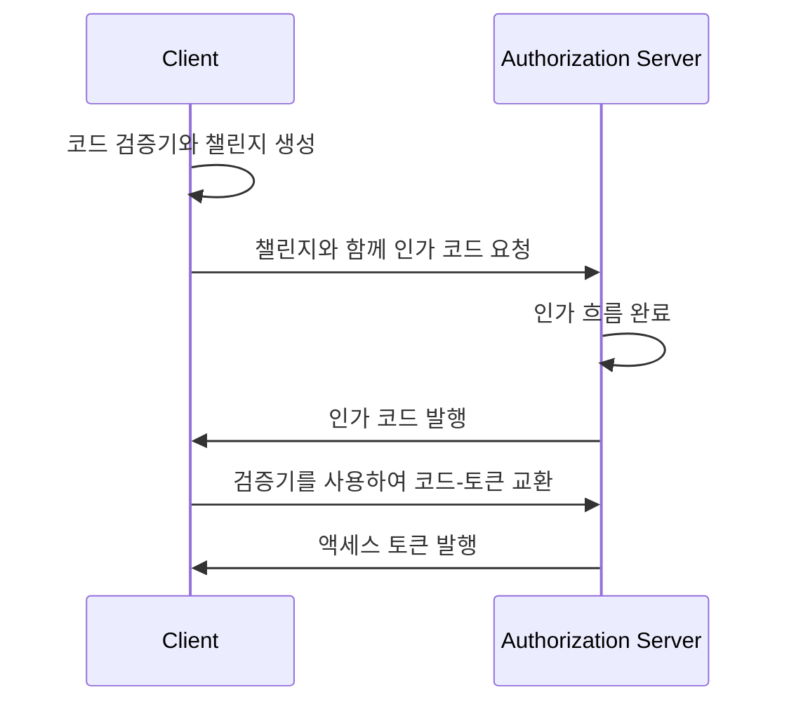

## OAuth 2.1이란 무엇인가요?

OAuth 2.1은 기존의 OAuth 2.0 인가 프레임워크에 대한 제안된 업데이트입니다. 이는 업계에서 널리 채택된 모범 사례와 보안 개선 사항을 통합하는 일련의 변경 사항 및 권장 사항을 포함합니다.

OAuth 2.1의 주된 업데이트는 다음과 같습니다:

1. 보안 문제로 인해 <Ref slug="implicit-flow">암묵적 부여</Ref> 및 [리소스 소유자 비밀번호 자격 증명 (ROPC) 부여](https://datatracker.ietf.org/doc/html/rfc6749#section-4.3) 사용 중단.
2. <Ref slug="client" headingId="confidential-clients">기밀 (비공개) 클라이언트</Ref>를 포함한 모든 클라이언트에 대해 <Ref slug="pkce" /> 사용을 강제.
3. <Ref slug="redirect-uri">리디렉션 URI</Ref>의 정확한 일치.
4. <Ref slug="client">클라이언트</Ref> 유형 (공개 및 기밀 클라이언트)의 명확한 정의.
5. <Ref slug="refresh-token">리프레시 토큰</Ref>에 대한 보안 요구 사항.

## 암묵적 부여의 사용 중단

암묵적 부여는 단일 페이지 애플리케이션 (SPA) 및 클라이언트 비밀을 안전하게 저장할 수 없는 브라우저 기반 애플리케이션을 위해 설계되었습니다. 그러나 보안 위험으로 인해 더 이상 사용되지 않습니다: 이 부여는 프론트 채널 (URL 프레그먼트)에 액세스 토큰을 반환하여 브라우저 기록 및 리퍼러 헤더를 통해 공격자에게 노출될 수 있습니다.

OAuth 2.1은 브라우저 기반 애플리케이션에 대해 <Ref slug="pkce" />를 사용한 <Ref slug="authorization-code-flow">인가 코드 부여</Ref>를 사용할 것을 권장합니다.

## ROPC 부여의 사용 중단

ROPC 부여는 사용자의 자격 증명을 직접 액세스 토큰으로 교환할 수 있는 클라이언트를 허용합니다. 이는 인가 코드 흐름을 지원할 수 없는 레거시 애플리케이션을 위해 설계되었습니다. 그러나 이 부여는 다음과 같은 방식으로 보안 위험을 초래합니다:

- 클라이언트에게 사용자의 자격 증명을 노출.
- 인가 서버의 동의 화면을 무시.
- <Ref slug="mfa" />와 같은 다른 보안 조치를 인가 서버가 강제할 수 있는 능력을 제한.

OAuth 2.1은 사용자 인증 및 인가를 위해 <Ref slug="pkce" />를 사용한 <Ref slug="authorization-code-flow">인가 코드 부여</Ref>를 사용할 것을 권장합니다.

## 모든 클라이언트에 PKCE 강제 적용

<Ref slug="pkce" />는 인가 코드 가로채기 공격 위험을 완화하기 위한 인가 코드 흐름의 보안 확장입니다. 이는 클라이언트가 코드 검증기와 코드 챌린지를 생성하고, 인가 서버가 토큰 교환 동안 챌린지를 검증하는 과정을 포함합니다.

다음은 PKCE가 포함된 인가 코드 흐름의 간단한 시퀀스 다이어그램입니다:

처음에는 <Ref slug="client" headingId="public-clients">공개 클라이언트</Ref>에 대해 PKCE 사용이 권장되었으나, OAuth 2.1은 이를 모든 클라이언트를 위한 필수 요구 사항으로 확장하여 <Ref slug="client" headingId="confidential-clients">기밀 (비공개) 클라이언트</Ref>도 포함합니다.

## 리디렉션 URI의 정확한 일치

<Ref slug="redirect-uri">리디렉션 URI</Ref>는 클라이언트가 인가 서버로부터 인가 응답을 받을 수 있도록 사용됩니다. OAuth 2.1은 인가 요청에 사용된 리디렉션 URI가 클라이언트가 <Ref slug="authorization-server" />에 등록한 리디렉션 URI와 스킴, 호스트, 경로를 포함하여 정확히 일치해야 한다는 새로운 요구 사항을 도입합니다.

일부 OAuth 2.0 구현에서는 리디렉션 URI가 부분적 일치하거나 와일드카드 문자를 허용하는 유연성이 있었습니다. 그러나 이러한 유연성은 보안 위험을 초래할 수 있습니다, 예를 들면, 열린 리디렉션 취약성 등.

## 클라이언트 유형의 명확한 정의

OAuth 2.0은 클라이언트 유형을 명시적으로 정의하지 않습니다. 업계에서 다양한 구분이 있을 수 있습니다, 예를 들면 접근 수준 (공개 대 기밀) 또는 애플리케이션 유형 (웹 앱 대 모바일 앱)으로. OAuth 프레임워크에는 클라이언트가 구현되는 방법이 중요하지 않지만 (클라이언트의 비즈니스 속성에 관한 것이기 때문에), 보안 요구 사항에서는 접근 수준이 차이를 만듭니다.

따라서, OAuth 2.1은 클라이언트 유형을 명확히 정의합니다:

- <Ref slug="client" headingId="public-clients" />: 자격 증명의 기밀성을 유지할 수 없는 클라이언트 (예: SPA, 모바일 앱).
- <Ref slug="client" headingId="confidential-clients" />: 자격 증명의 기밀성을 유지할 수 있는 클라이언트 (예: 서버 측 웹 앱, 네이티브 데스크탑 앱).

## 리프레시 토큰에 대한 보안 요구 사항

<Ref slug="refresh-token">리프레시 토큰</Ref>은 클라이언트가 사용자 상호 작용 없이 새 액세스 토큰을 얻기 위해 사용하는 장기 토큰입니다. 한편, 이들은 공격자에게 높은 가치의 목표가 됩니다. 공개 클라이언트가 자격 증명을 안전하게 저장할 수 없기 때문에, OAuth 2.1은 인가 서버가 다음 방법 중 하나를 사용하여 리프레시 토큰을 보호해야 한다고 명시합니다:

- <Ref slug="refresh-token" headingId="sender-constrained-refresh-tokens">발신자 제한 리프레시 토큰</Ref> 발행.
- 리프레시 토큰의 사용 가능성과 수명을 제한하기 위한 <Ref slug="refresh-token" headingId="refresh-token-rotation">리프레시 토큰 회전</Ref> 사용.

## OAuth 2.1과 OpenID Connect (OIDC)

<Ref slug="openid-connect" />가 OAuth 2.0을 기반으로 만들어졌기 때문에, OAuth 2.1에서 도입된 변경 사항 역시 OIDC에 적용됩니다. 예를 들어, 모든 OIDC 클라이언트는 사용자 인증 및 인가를 위해 PKCE가 포함된 인가 코드 흐름을 사용해야 합니다.

<SeeAlso slugs={["oauth-2.0", "authorization-code-flow", "pkce", "implicit-flow", "openid-connect"]} />

<Resources
  urls={[
    "https://datatracker.ietf.org/doc/draft-ietf-oauth-v2-1/",
    "https://blog.logto.io/oauth-2-1",
  ]}
/>
