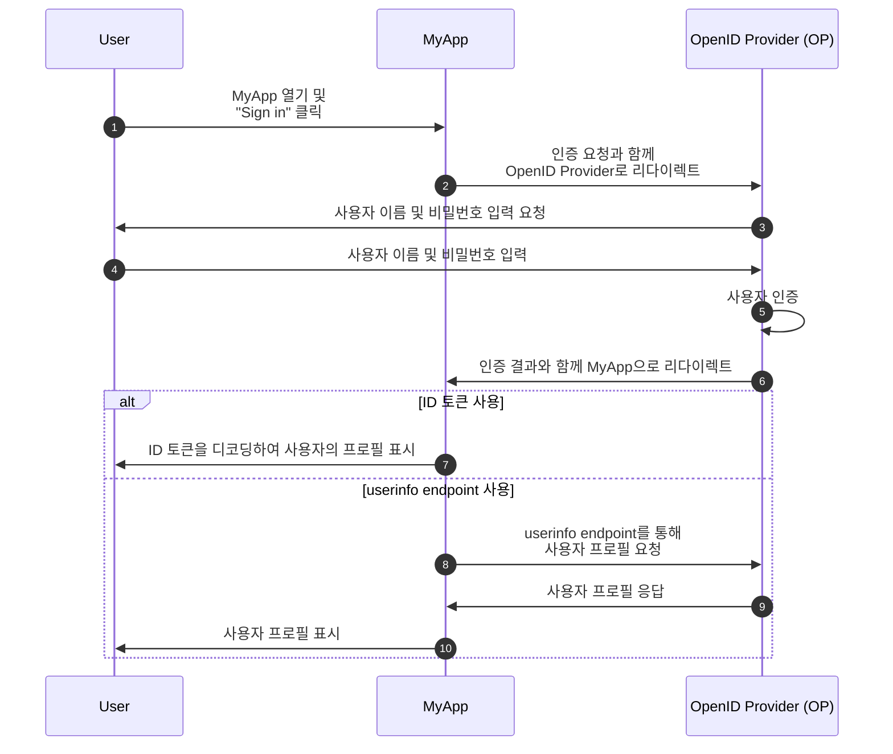
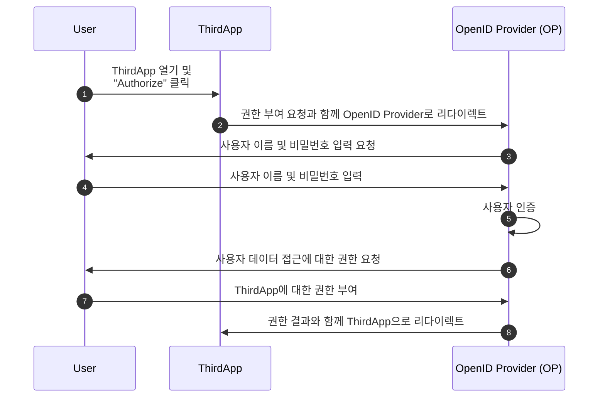

## OpenID Connect (OIDC)란?

OpenID Connect (OIDC)는 <Ref slug="oauth-2.0" />이라는 권한 부여 프레임워크에 인증 기능을 추가하여 그 위에 신원 레이어를 도입합니다. OIDC는 클라이언트가 사용자를 인증하고 <Ref slug="id-token">ID 토큰</Ref> 및 <Ref slug="userinfo-endpoint" /> 응답 형태로 신원 정보를 획득할 수 있게 합니다.

예를 들어 보겠습니다. MyApp이라는 웹 애플리케이션이 있고 사용자가 사용자 이름과 비밀번호를 사용해 로그인할 수 있으며, 로그인 후 자신의 프로필 정보를 볼 수 있다고 가정해 보겠습니다. 다음은 간단한 흐름입니다:



어떤 용어들은 생소할 수 있으므로 다음에서 이를 명확히 하겠습니다:

### OpenID Provider (OP)

OpenID Provider (OP)는 OIDC 및 OAuth 2.0 사양을 구현한 <Ref slug="identity-provider" />입니다. 즉, OP는 또한 OAuth 2.0 <Ref slug="authorization-server" />이기도 합니다.

OP는 사용자를 인증하고 클라이언트에 ID 토큰 및 접근 토큰을 발행할 책임이 있습니다.

### 토큰

- <Ref slug="id-token">ID 토큰</Ref>은 사용자 신원 정보를 나타내는 <Ref slug="jwt">JSON Web Tokens</Ref>로, 이름, 이메일, 프로필 사진 등을 포함할 수 있습니다.
- <Ref slug="access-token">Access tokens</Ref>은 사용자를 대신하여 보호된 리소스에 접근하는 데 사용됩니다 (OAuth 2.0에서와 동일), 예를 들어, userinfo endpoint.

### 인증 요청 및 결과

- <Ref slug="authentication-request" />는 클라이언트가 사용자 인증을 위해 OP로 보내는 요청입니다. 인증 프로세스에 영향을 미칠 특정 요구 사항을 지정하는 매개변수를 포함합니다.
- 인증 요청에 따라 인증 결과는 다를 수 있습니다. 당장 클라이언트가 사용자를 식별하기 위한 정보를 얻는다는 사실만 알면 됩니다.

### Userinfo endpoint

<Ref slug="userinfo-endpoint" />는 클라이언트가 사용자 프로필 정보를 검색할 수 있는 OIDC 전용 엔드포인트입니다. userinfo endpoint는 일반적으로 ID 토큰보다 더 자세한 사용자 정보를 제공하므로 이는 ID 토큰을 사용하는 것에 대한 대안이 될 수 있습니다.

OIDC는 OpenID Provider (OP)에게 ID 토큰 및 userinfo 응답에 포함할 정보를 결정하도록 합니다. 따라서 ID 토큰을 구문 분석하거나 userinfo endpoint를 호출하기 전에 OP의 문서를 확인하여 어떤 정보가 사용 가능한지 이해해야 합니다.

## OAuth 2.0과 OIDC의 용어 차이

OIDC는 OAuth 2.0 위에 구축되었기 때문에 많은 용어가 두 사양 간에 공유됩니다. 그러나 OAuth 2.0이 권한 부여에 초점을 맞추고 있는 반면, OIDC는 인증과 신원을 도입하여 일부 용어가 OIDC의 문맥에서는 적합하지 않게 만들었습니다. 다음은 몇 가지 주목할 만한 차이점입니다:

| OAuth 2.0             | OpenID Connect (OIDC)  |
|-----------------------|------------------------|
| Authorization server  | OpenID Provider (OP)   |
| Authorization request | Authentication request |
| Grant                 | Flow                   |

본질적으로, 위의 용어들은 동일한 주제를 지칭할 수 있지만, OAuth 2.0과 OIDC의 문맥에서는 의미가 다릅니다:

- **OpenID Provider (OP)**는 사용자를 인증하고 ID 토큰을 발행할 수 있는 OAuth 2.0 <Ref slug="authorization-server" />입니다.
- **<Ref slug="authentication-request" />**는 OIDC 전용 매개변수를 사용하여 최종 사용자 인증을 요청하고 ID 토큰을 획득하는 OAuth 2.0 <Ref slug="authorization-request" />입니다.
- **Flow**는 여러 단계와 상호작용을 포함할 수 있는 사용자 인증 및 권한 부여 과정을 설명하는 OIDC에서 사용되는 보다 일반적인 용어로, 이는 <Ref slug="oauth-2.0-grant" />와 본질적으로 동일합니다.

## OIDC 흐름

위의 예에서 알 수 있듯이, OIDC 흐름은 OP에게 인증 요청을 통해 클라이언트 (예: MyApp)에 의해 시작됩니다. 인증 요청은 사용할 수 있는 흐름을 지정하며, 다음 중 하나일 수 있습니다:

- **<Ref slug="authorization-code-flow" />**: 사용자 인증과 권한 부여를 위한 가장 안전하고 권장되는 흐름. <Ref slug="oauth-2.1" />에서 <Ref slug="pkce" />는 모든 클라이언트에 대해 강제됩니다.
- **<Ref slug="implicit-flow" />**: 보안상의 이유로 OAuth 2.1에서 폐기된 간소화된 흐름.
- **<Ref slug="hybrid-flow" />**: 권고되지 않는 OIDC 흐름으로 보안 문제로 인해 새로운 애플리케이션에 권장되지 않습니다.

인가 코드 흐름과 암묵적 흐름은 ID 토큰을 포함하도록 OAuth 2.0에서 확장된 것이며, 하이브리드 흐름은 둘을 결합한 OIDC 전용 흐름입니다. 각 흐름에 대한 자세한 내용을 보려면 위의 링크를 클릭하세요.

## OIDC 범위와 클레임

OAuth 2.0과 마찬가지로, OIDC는 클라이언트가 요청하는 권한을 지정하기 위해 <Ref slug="scope" /> 값을 사용합니다. <Ref slug="id-token">ID 토큰</Ref>이 <Ref slug="jwt">JSON Web Tokens</Ref>이기 때문에, <Ref slug="authentication-request" />에서 요청한 범위에 따라 사용자 신원 정보를 나타내는 <Ref slug="claim">클레임</Ref> (이름-값 쌍)을 포함할 수 있습니다. 이러한 클레임은 또한 <Ref slug="userinfo-endpoint" /> 응답에도 반환됩니다.

OIDC는 클라이언트가 인증 요청에서 요청할 수 있는 몇 가지 표준 범위와 해당 클레임을 정의합니다:

- **openid**: 클라이언트가 OIDC 클라이언트이며 ID 토큰을 요청함을 나타냅니다.
- **profile**: 사용자의 기본 프로필 클레임에 대한 액세스를 요청합니다. 기본 프로필 클레임은 `name`, `family_name`, `given_name`, `middle_name`, `nickname`, `preferred_username`, `profile`, `picture`, `website`, `gender`, `birthdate`, `zoneinfo`, `locale`, `updated_at`입니다.
- **email**: 사용자의 `email` 및 `email_verified` 클레임에 대한 액세스를 요청합니다.
- **address**: 사용자의 `address` 클레임에 대한 액세스를 요청합니다.
- **phone**: 사용자의 `phone_number` 및 `phone_number_verified` 클레임에 대한 액세스를 요청합니다.
- **offline_access**: 사용자 상호작용 없이 클라이언트가 새 액세스 토큰을 얻을 수 있도록 리프레시 토큰을 요청합니다.

OIDC 사양의 [Standard Claims](https://openid.net/specs/openid-connect-core-1_0.html#StandardClaims) 및 [Requesting Claims using Scope Values](https://openid.net/specs/openid-connect-core-1_0.html#ScopeClaims)를 참고하여 범위 및 클레임에 대한 더 많은 정보를 확인하세요. 또한 `offline_access` 범위에 대한 자세한 설명을 위해 <Ref slug="offline-access" />를 확인하세요.

> [!Note]
> OpenID Providers (OPs)는 표준 범위를 넘어 추가적인 범위 및 클레임을 지원할 수 있습니다. 자세한 내용은 OP의 문서를 확인하세요.

## OIDC에서의 권한 부여

OAuth 2.0에 익숙하다면 위의 예가 <Ref slug="authorization" /> 프로세스를 포함하지 않는다는 것을 알 수 있습니다. 위의 예에서는 MyApp이 첫 번째 파티 애플리케이션으로, 타사 액세스 권한 부여가 포함되지 않는다고 가정하여 사용자 동의 부분을 생략했습니다. 권한 부여는 여전히 OP에 의해 시행되지만, 흐름에서는 명시적으로 나타나지 않습니다.

사용자 동의는 타사 클라이언트 (예: OP에 의해 소유되지 않은 애플리케이션)가 사용자 데이터에 대한 액세스를 요청할 때 필수적입니다. 이 경우, OP는 클라이언트에 ID 토큰이나 액세스 토큰을 발행하기 전에 사용자에게 권한을 부여하도록 요청합니다. 예를 들어 ThirdApp이라는 타사 애플리케이션이 사용자 데이터에 액세스하려고 한다고 가정합시다:



권한 부여 프로세스가 완료되고 ThirdApp이 권한 결과(보통은 <Ref slug="access-token" />)를 수신하면 <Ref slug="resource-server" />에서 사용자의 데이터에 액세스할 수 있습니다.

OAuth 2.0 및 권한 부여 흐름에 대한 자세한 내용은 <Ref slug="oauth-2.0" />을 참조하세요.

### 범위

OAuth 2.0과 마찬가지로, OIDC는 클라이언트가 요청하는 권한을 지정하기 위해 <Ref slug="scope" /> 값을 사용합니다. [OIDC 범위 및 클레임](#oidc-scopes-and-claims)에서 표준 범위와 클레임을 다루었습니다. 이러한 범위와 클레임은 OIDC에서 예약된 값으로 취급해야 합니다. 즉, 비즈니스별 목적으로 사용하지 말아야 합니다.

실제로, OpenID Provider (OP)는 비즈니스 요구에 맞는 사용자 지정 범위 및 클레임을 지원할 수 있습니다. 사용자 지정 범위 및 클레임에 대한 자세한 내용은 OP의 문서를 참조하십시오. 사용자 지정 범위 및 클레임을 정의하지 않으면 OP는 이를 직접 무시하거나 오류 응답을 반환할 수 있습니다.

### 리소스 인디케이터

OIDC와 OP와 같은 프레임워크는 특정 목적을 위해 특정 범위 및 클레임을 예약할 수 있으므로 일반적으로 OP는 사용자 지정 범위 및 클레임을 정의할 때 예약된 값과의 충돌을 피하기 위해 접두사나 네임스페이스를 사용하는 것을 권장합니다. 예를 들어, 애플리케이션에 특정한 사용자 지정 범위임을 나타내기 위해 `myapp:` 접두사를 사용할 수 있습니다.

```json
{
  "scope": "myapp:custom_scope"
}
```

그러나 이것은 사용자 지정 범위 및 클레임이 미래의 예약된 값과 충돌하지 않도록 보장할 수 없으며, 이는 토큰 크기를 증가시킬 수 있습니다. <Ref slug="resource-indicator">리소스 인디케이터</Ref>라는 OAuth 2.0 확장은 동일한 목표를 보다 유연하고 확장 가능하게 달성할 수 있는 방법을 제공합니다. 리소스 인디케이터는 요청된 리소스를 나타내는 URI이며, 실제 API 엔드포인트를 사용하여 실제 리소스를 반영할 수 있습니다. 예를 들어, 클라이언트가 액세스하려는 API 리소스를 나타내기 위해 `https://api.myapp.com`을 리소스 인디케이터로 사용할 수 있습니다.

다시 한번, OIDC는 OAuth 2.0 위에 구축되어 있기 때문에 적절히 구성된 경우 OIDC 인증 요청에서 리소스 인디케이터를 사용할 수 있습니다. 다음은 리소스 인디케이터를 사용한 인증 요청의 비규범적인 예입니다:

```http
GET /authorize?response_type=code
  &client_id=YOUR_CLIENT_ID
  &redirect_uri=https%3A%2F%2Fclient.example.com%2Fcallback
  &scope=openid%20profile
  &resource=https%3A%2F%2Fapi.example.com HTTP/1.1
Host: your-openid-provider.com
```

리소스 인디케이터를 사용하려면 먼저 OP가 이 확장(RFC 8707)을 지원하는지 확인해야 합니다. 지원되는 경우, OP와 함께 리소스 인디케이터 URI를 등록하고 인증 요청의 `resource` 매개변수에서 사용해야 합니다.

리소스 인디케이터에 대한 자세한 정보는 <Ref slug="resource-indicator" />를 참조하세요.

## OIDC 보안 고려 사항

### 안전한 통신

클라이언트, OP, 및 리소스 서버 간의 모든 통신은 데이터를 엿보거나 변조하지 않도록 HTTPS를 사용하여 보안되어야 합니다.

### 안전한 흐름 선택

OIDC를 구현할 때, 다음을 사용하는 것이 권장됩니다:

- 사용자 인증 및 권한 부여를 위한 <Ref slug="pkce" />가 포함된 <Ref slug="authorization-code-flow" /> (모든 클라이언트에 대해 <Ref slug="oauth-2.1" />에서 시행됨).
- 머신 간의 통신을 위한 <Ref slug="client-credentials-flow" />.

암묵적 흐름과 하이브리드 흐름은 보안 문제로 인해 폐기되었으므로 새로운 애플리케이션에는 사용하지 말고 기존 애플리케이션을 보다 안전한 흐름으로 마이그레이션하는 것을 고려하십시오.

### ID 토큰 검증

OP로부터 ID 토큰을 수신했을 때, 클라이언트는 토큰의 무결성과 진위성을 보장하기 위해 이를 검증해야 합니다. 검증 과정은 **적어도** 다음과 같은 확인을 포함해야 합니다:

- **발급자**: `iss` 클레임은 OP의 issuer URL과 일치해야 합니다.
- **청중**: `aud` 클레임은 클라이언트의 클라이언트 ID와 일치해야 합니다.
- **만료**: `exp` 클레임은 미래여야 합니다.
- **서명**: 토큰은 OP의 <Ref slug="signing-key" />에 의해 서명되어 있어야 합니다.

### 액세스 토큰 사용

Access tokens은 사용자를 대신하여 보호된 리소스에 액세스하는 데 사용됩니다. 클라이언트는 액세스 토큰을 민감한 정보로 취급하고 다음의 모범 사례를 따르십시오:

- **토큰 저장**: 액세스 토큰을 안전하게 저장하고 미승인된 당사자에게 노출되지 않도록 하십시오.
- **토큰 만료**: 액세스 토큰은 만일의 경우를 대비해 짧은 만료 시간을 설정해야 합니다 (예: 1시간).
- **토큰 폐기**: 필요시 액세스 토큰을 무효화할 수 있도록 토큰 폐기 메커니즘을 구현하십시오.

### 사용자 동의

타사 클라이언트가 사용자 데이터에 대한 액세스를 요청할 때, OP는 사용자가 요청된 권한을 명확히 인지하고 동의를 부여하도록 해야 합니다. 사용자 동의 과정은 투명해야 하며, 접근되는 데이터와 그 사용 방법에 대한 명확한 정보를 제공해야 합니다.

<SeeAlso slugs={["oauth-2.0", "authorization-code-flow", "implicit-flow", "hybrid-flow", "pkce", "resource-indicator"]} />

<Resources
  urls={[
    "https://blog.logto.io/secure-cloud-apps-with-oauth-and-openid-connect",
    "https://openid.net/specs/openid-connect-core-1_0.html",
  ]}
/>