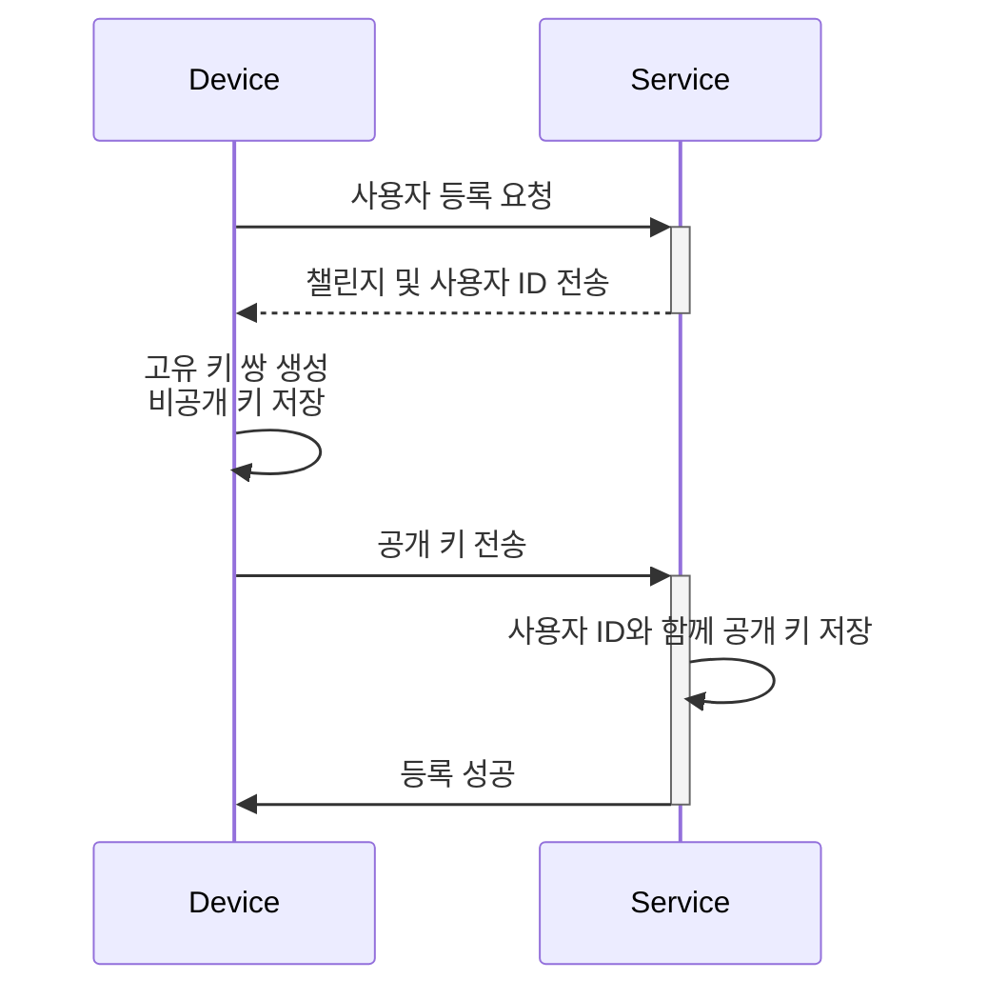
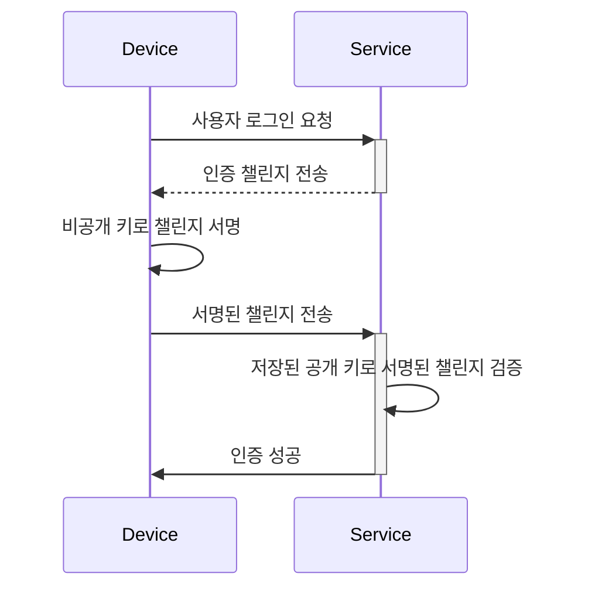

## 패스키 (Passkey)란 무엇인가?

**패스키 (Passkey)**는 전통적인 비밀번호에 대한 [FIDO](https://fidoalliance.org/) 기반의 안전하고 편리한 대안입니다. 이들은 고급 암호화를 사용하여 계정을 [피싱](https://en.wikipedia.org/wiki/Phishing) 공격으로부터 보호합니다.

- **각 서비스에 고유함**: 서비스를 등록할 때, 기기는 특정 서비스의 도메인에 연결된 고유한 패스키를 생성합니다.
- **기기 연결**: 패스키는 일반적으로 전화, 노트북, 생체 인식 장치 또는 하드웨어 보안 키와 같은 기기에 연결됩니다.
- **공개-비공개 키 쌍**: 기기는 비공개 키를 보관하고, 공개 키는 서비스와 공유됩니다. 이러한 암호화 키 쌍을 패스키라고 합니다. ([FIDO](https://fidoalliance.org/how-fido-works/)에서 인용)
- **다양한 인증 방법**: 지문 스캔, 얼굴 인식, 기기 PIN, QR 코드 스캔 또는 보안 키를 사용하여 패스키로 인증할 수 있습니다.
- **기기 간 동기화**: 패스키는 안전한 클라우드 저장소(예: Apple의 iCloud 키체인 또는 Google 비밀번호 관리자)를 사용하여 여러 기기 간에 동기화할 수 있으며, 이를 통해 지원되는 모든 기기에서 로그인할 수 있습니다.

## 패스키 (Passkey) 워크플로우는 어떻게 생겼나요?

여기 실제 예시를 통해 더 잘 이해할 수 있습니다. 웹 서비스 MyApp이 비밀번호 기반 로그인 대신 패스키 로그인을 구현하고자 합니다. 사용자는 패스키 인증 방법으로 지문 스캔을 사용하여 현재 기기를 선택합니다.

**패스키 (Passkey)**는 공개 키 암호화를 활용하여 안전한 자격 증명을 제공합니다.

- **패스키 등록**
    - 서비스를 등록할 때, 기기는 해당 서비스에 연결된 고유한 암호화 키 쌍을 생성합니다.
    - **비공개 키**는 기기에 남아 있으며, **공개 키**는 서비스와 공유됩니다.

- **패스키 인증**
    - 로그인 시도 시, 서비스는 기기에 **챌린지**를 보냅니다.
    - 기기는 **비공개 키**를 사용하여 챌린지를 기반으로 암호화 **서명**을 생성합니다.
    - **서명**은 서비스로 전송되며, 서비스는 **공개 키**를 사용하여 이를 검증합니다.
    - 서명이 유효하면 인증이 성공합니다.

패스키를 구현하기 위한 API인 <Ref slug="webauthn" />을 읽어보세요.

## 패스키 최종 사용자 흐름은 어떻게 생겼나요?

패스키는 로컬 및 클라우드 사용을 위한 두 가지 유형의 인증기를 제공하며, 사용자는 서비스에 대해 하나 또는 둘 다 활성화할 수 있습니다.

- **플랫폼 인증기 (내부 인증기)**: 특정 기기 OS(예: 전화, 노트북)에 연결되어 생체 인식 또는 기기 암호를 사용하여 승인합니다. 빠르고 편리합니다.
    - 예시: Apple 기기의 iCloud 키체인(Touch ID, Face ID 또는 기기 암호로 확인), Windows Hello, Android의 Google 비밀번호 관리자.
- **로밍 인증기 (외부 인증기)**: 보안 키, 스마트폰과 같은 휴대용 기기 또는 소프트웨어. 여러 기기에서 사용할 수 있지만 QR 코드 스캔 또는 NFC/Bluetooth 페어링과 같은 추가 단계가 필요할 수 있습니다.
    - 예시: YubiKey 및 스마트폰의 클라우드 기반 계정. 모바일 인증기는 종종 데스크톱 기기와 연결하기 위해 QR 코드 스캔이 필요하며, 기기 간 인증은 인증기가 근처에 있음을 보장하기 위해 Bluetooth, NFC 또는 USB를 통해 연결해야 합니다.

## 패스키를 언제 사용해야 하나요?

패스키는 첫 번째 또는 두 번째 요소로 사용할 수 있는 현대적인 인증 요소입니다.

- **패스키 로그인**: 패스키는 전통적인 비밀번호에 비해 더 빠르고 안전한 비밀번호 없는 인증 방법을 제공합니다.
    - 현대 애플리케이션은 일반적으로 로그인 페이지에 "패스키로 로그인" 버튼을 제공하여 사용자가 이 옵션을 적극적으로 선택하도록 유도합니다.
    - 또한, 로그인 페이지는 사용자가 패스키가 등록된 동일한 기기와 브라우저에 액세스하고 있음을 인식하면 자동으로 패스키 로그인 팝업을 표시할 수 있습니다.
- **패스키 MFA**: 패스키는 MFA의 두 번째 요소로도 사용할 수 있습니다.
    - 사용자가 로그인 시도를 할 때, 먼저 이메일과 비밀번호(또는 다른 첫 번째 요소)를 입력한 후, 서비스는 패스키를 사용하여 2단계 인증을 완료하도록 요청합니다.
    - 브라우저에 기존 세션이 있는 경우, 서비스는 사용자가 비밀번호를 다시 입력하지 않고도 패스키로 로그인하도록 직접 요청할 수 있습니다. 이 과정은 MFA를 완료하는 것으로 알려져 있으며, 패스키는 현재 기기에 바인딩되고 생체 인식, PIN 또는 기타 하드웨어 방법을 통해 사용자를 검증하여 높은 수준의 보안을 제공합니다.
- **보안 검증**: 고보안 환경에서는 패스키가 종종 사용자 신원을 이중 확인하는 데 사용됩니다. 예를 들어, 민감한 금융 정보를 액세스하거나 중요한 작업(은행, 정부, 기업 시스템)을 수행할 때 사용됩니다.

### 왜 패스키가 가장 안전한 인증 방법인가요?

패스키는 **공개 키 암호화**를 사용하기 때문에 일반 고객이 로그인하는 가장 안전한 방법 중 하나입니다. 비밀번호나 일회용 코드(TOTP)와 달리, 비공개 키는 절대 기기를 떠나지 않습니다. 공격자가 공개 키를 훔치더라도 유효한 로그인 시도를 위조할 수 없습니다.

다음은 패스키가 훨씬 더 안전한 이유를 설명하는 비교입니다:

| 공격 유형 | 패스키 | 소프트웨어 TOTP (인증기) |
| --- | --- | --- |
| **피싱 공격** | 비공개 키가 기기를 떠나거나 어디에도 수동으로 입력되지 않기 때문에 피싱에 매우 강합니다. | 소프트웨어 TOTP는 화면에 표시되므로 공격자가 가짜 웹사이트에서 이를 유도할 수 있어 피싱에 취약합니다. |
| **중간자 공격 (MitM)** | 강력한 암호화 프로토콜로 인해 비공개 키가 기기에만 남아 있어 MitM에 대한 강력한 보호를 제공합니다. | MitM에 취약하며, TOTP가 MitM 공격자에 의해 가로채어져 공격자가 이를 사용하여 로그인할 수 있습니다. |
| **재생 공격** | 각 패스키 요청이 고유하여 공격자가 캡처하여 나중에 재생하는 것이 쓸모없기 때문에 재생 공격에 대한 강력한 보호를 제공합니다. | TOTP는 주기적으로 변경되지만 만료되기 전에 가로채면 무단 액세스에 재사용될 수 있어 재생 공격이 가능합니다. |

<SeeAlso slugs={["webauthn", "authentication", "authorization"]} />

<Resources
  urls={[
    "https://fidoalliance.org/passkeys/",
    "https://webauthn.io/"
  ]}
/>