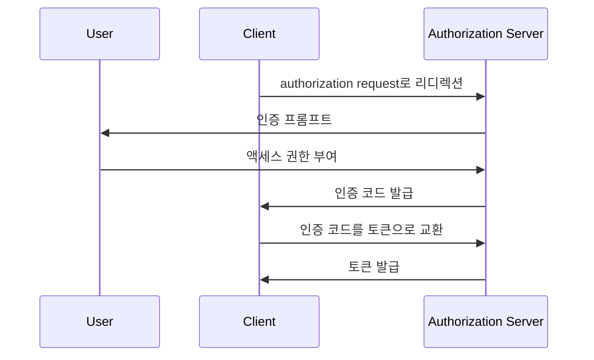

## 코드 교환을 위한 증명 키 (PKCE)란?

코드 교환을 위한 증명 키 (PKCE)는 <Ref slug="oauth-2.0" />에서 <Ref slug="authorization-code-flow" />를 위한 보안 확장으로, 특히 <Ref slug="client" headingId="public-clients" />와 <Ref slug="client" headingId="confidential-clients">비공개 (개인) 클라이언트</Ref>에서 클라이언트 비밀(Secret)이 안전하지 않은 공용 클라이언트에서 인증 코드가 가로채지는 것을 방지하기 위해 설계되었습니다.

<Ref slug="oauth-2.1" />부터는, PKCE는 모든 유형의 클라이언트에 대해 시행됩니다.

## PKCE는 어떻게 작동하나요?

PKCE는 <Ref slug="client" />가 흐름을 시작한 클라이언트와 동일한 클라이언트임을 보장하기 위해 인증 코드 흐름에 몇 가지 추가 단계를 도입합니다.

> [!Note]
> PKCE는 <Ref slug="openid-connect" /> 흐름에도 적용되며, 이는 인증 코드 흐름에 의존합니다. 단순화를 위해 OAuth 2.0 구현을 중심으로 다루겠습니다.

우선, PKCE에 대해 알아보기 전에 표준 인증 코드 흐름을 빠르게 검토해보겠습니다:



이제 PKCE가 인증 코드 흐름을 어떻게 강화하는지 살펴보겠습니다.

### 1. 인증 요청 준비하기

#### 1.1. 클라이언트가 코드 검증자 생성

<Ref slug="authorization-request" />를 시작하기 전에, 클라이언트는 **코드 검증자**라는 랜덤 문자열을 생성해야 합니다. 이 문자열은 최소 43자에서 최대 128자의 고(高)엔트로피 암호화 랜덤 URL 안전 문자열이어야 합니다.
  
다음은 JavaScript를 사용하여 코드 검증자를 생성하는 예입니다:

```javascript
// `js-base64`는 Node.js와 브라우저에서 모두 사용할 수 있는 범용 라이브러리입니다.
import { fromUint8Array } from 'js-base64';

// 두 번째 인자 `true`는 출력이 URL 안전해야 함을 나타냅니다.
const codeVerifier = fromUint8Array(crypto.getRandomValues(new Uint8Array(64)), true);
```

#### 1.2. 클라이언트가 코드 챌린지 생성

클라이언트는 **코드 검증자**를 SHA-256과 같은 암호화 해시 함수로 해싱하고, 해시를 URL 안전 Base64 문자열로 인코딩해야 합니다. 생성된 문자열은 **코드 챌린지**라고 부릅니다.

다음은 JavaScript를 사용하여 코드 챌린지를 생성하는 예입니다:

```javascript
// `js-base64`는 Node.js와 브라우저에서 모두 사용할 수 있는 범용 라이브러리입니다.
import { fromUint8Array } from 'js-base64';

const encodedCodeVerifier = new TextEncoder().encode(codeVerifier);
const codeChallenge = new Uint8Array(await crypto.subtle.digest('SHA-256', encodedCodeVerifier));

// 두 번째 인자 `true`는 출력이 URL 안전해야 함을 나타냅니다.
return fromUint8Array(codeChallenge, true);
```

#### 1.3. 클라이언트가 인증 요청에 코드 챌린지 포함

클라이언트가 인증 요청을 시작할 때, 요청에 `code_challenge`와 `code_challenge_method` 매개변수를 포함해야 합니다. `code_challenge` 매개변수는 이전 단계에서 생성한 **코드 챌린지**를 포함하고, `code_challenge_method` 매개변수는 **코드 챌린지**를 생성하는 데 사용된 해싱 알고리즘(e.g., `S256` for SHA-256)을 지정합니다.

지원되는 `code_challenge_method` 값은 `plain`과 `S256`입니다. `plain`은 **코드 챌린지**가 해싱 없이 그대로 전송됨을 나타내며, 일반적으로 더 나은 보안을 위해 `S256`이 추천됩니다.

다음은 PKCE와 함께하는 인증 요청의 비규범적 예입니다:

```http
GET /authorize?response_type=code
  &client_id=YOUR_CLIENT_ID
  &redirect_uri=https%3A%2F%2Fclient.example.com%2Fcallback
  &scope=openid%20profile
  &code_challenge=YOUR_CODE_CHALLENGE
  &code_challenge_method=S256
  &state=abc123
  &nonce=123456 HTTP/1.1
```

### 2. 인증 코드를 토큰으로 교환하기

클라이언트는 나중에 사용할 **코드 검증자**를 저장하고, 인증 흐름을 계속 진행해야 합니다. 클라이언트가 인증 코드를 수신하면, <Ref slug="token-request" />를 **코드 검증자**와 함께 인증 서버로 보내야 합니다.

다음은 PKCE와 함께하는 토큰 요청의 비규범적 예입니다:

```http
POST /token HTTP/1.1
Host: your-authorization-server.com
Content-Type: application/x-www-form-urlencoded

grant_type=authorization_code
  &code=YOUR_AUTHORIZATION_CODE
  &redirect_uri=https%3A%2F%2Fclient.example.com%2Fcallback
  &client_id=YOUR_CLIENT_ID
  &code_verifier=YOUR_CODE_VERIFIER
```

인증 서버는 **코드 검증자**와 **코드 챌린지**를 검증하여 클라이언트가 흐름을 시작한 것과 동일한 엔티티임을 확인합니다. 검증이 실패하면, 인증 서버는 토큰 요청을 거절합니다.

## PKCE가 보안을 강화하는 방법

PKCE의 주된 보안 이점은 공용 클라이언트에서 발생할 수 있는 인증 코드 가로채기 공격을 방지하는 것입니다. 예를 들어, 공격자가 인증 코드를 가로채더라도, **코드 검증자** 없이 이를 토큰으로 교환할 수 없습니다. PKCE는 흐름을 시작한 클라이언트만이 토큰 교환을 완료할 수 있도록 보장합니다.

<SeeAlso slugs={['oauth-2.1', 'authorization-code-flow']} />

<Resources
  urls={[
    "https://blog.logto.io/how-pkce-protects-the-authorization-code-flow-for-native-apps",
    "https://datatracker.ietf.org/doc/html/rfc7636",
  ]}
/>
