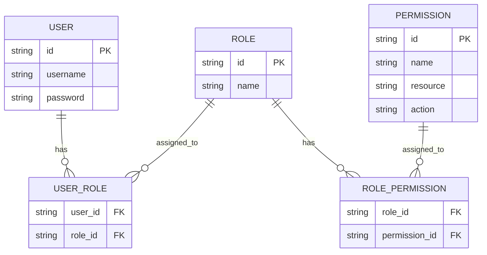
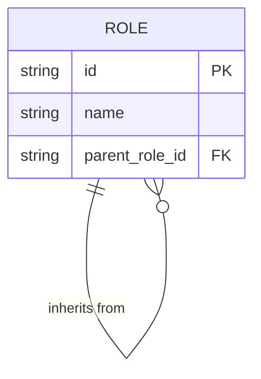
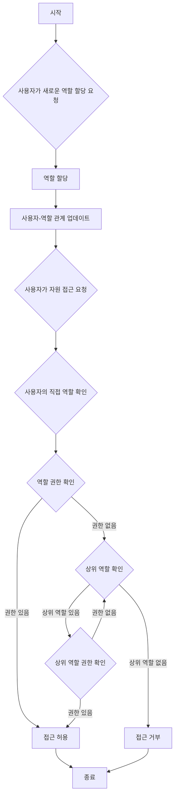
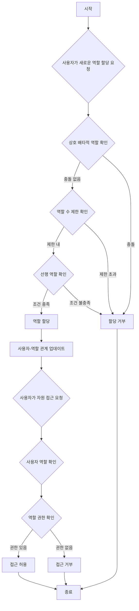

## 역할 기반 접근 제어 (RBAC)란 무엇인가?

역할 기반 접근 제어 (RBAC)는 "역할"이라는 개념을 도입하여 사용자와 권한을 분리하는 널리 채택된 접근 제어 모델로, 유연하고 효율적인 권한 관리 시스템을 제공합니다.

RBAC의 핵심 아이디어는 간단하면서도 강력합니다: 사용자에게 직접 권한을 할당하는 대신, 권한을 역할에 할당하고, 그 역할을 사용자에게 할당합니다. 이러한 간접적인 권한 할당 방법은 접근 권한 관리 과정을 크게 단순화합니다.

## RBAC의 주요 개념은 무엇인가?

RBAC 모델은 네 가지 주요 요소를 중심으로 구성됩니다:

1. 사용자: 시스템 내의 개인, 일반적으로 실제 사람들.
2. 역할: 조직 내의 직무 기능이나 책임을 나타냅니다.
3. 권한: 특정 자원에 대한 특정 작업을 수행할 수 있는 권한.
4. 세션: 사용자가 특정 역할을 활성화하는 동적 환경.

RBAC의 기본 워크플로우는 다음과 같이 요약할 수 있습니다:
1. 조직 구조나 비즈니스 요구 사항에 따라 역할을 정의합니다.
2. 각 역할에 적절한 권한을 할당합니다.
3. 사용자의 책임에 따라 하나 이상의 역할을 할당합니다.
4. 사용자가 자원에 접근하려고 할 때, 시스템은 할당된 역할이 필요한 권한을 가지고 있는지 확인합니다.

## RBAC는 실제 애플리케이션에서 어떻게 사용되는가?

일반적인 비즈니스 애플리케이션에서 RBAC를 사용할 때, 다음 세 가지 기본 질문에 답함으로써 시작할 수 있습니다:

1. 시스템에서 보호해야 할 자원은 무엇인가?
2. 이러한 자원에 대해 제어해야 할 작업은 무엇인가?
3. 실제 시나리오에서 이러한 자원과 작업을 수행할 책임이 있는 역할은 무엇인가?

전자 상거래 시스템을 예로 들어보겠습니다.

먼저 보호해야 할 자원을 식별할 수 있습니다:

- 제품
- 주문

그런 다음, 이러한 자원에 대해 제어해야 할 작업을 결정할 수 있습니다, 즉, 이러한 자원에 대한 권한을 정의합니다:

- 제품
  - `read:product`
  - `create:product`
  - `delete:product`
- 주문
  - `read:order`
  - `create:order`
  - `delete:order`

위의 권한을 통해, 실제 시나리오의 역할에 기반하여 다음과 같은 권한 관리 모델을 정의할 수 있습니다:

- 제품 관리자
  - 제품
    - `read:product`
    - `create:product`
    - `delete:product`
- 주문 관리자
  - 주문
    - `read:order`
    - `create:order`
    - `delete:order`

마지막으로, 사용자의 책임에 따라 역할을 할당합니다:

- Alice: 제품 관리자
- Bob: 주문 관리자

사용자가 자원에 접근할 때, 시스템은 사용자가 할당받은 역할이 필요한 권한을 가지고 있는지 확인합니다.

예를 들어, Alice가 제품 정보를 읽으려고 할 때, 시스템은 먼저 그녀의 역할 정보를 검색하고 그녀가 제품 관리자 역할을 가지고 있음을 발견합니다.

그런 다음, 시스템은 해당 역할과 관련된 권한을 조회하고, `read:product`, `create:product`, `delete:product`를 포함하고 있음을 확인합니다.

시스템은 필요한 `read:product` 권한이 그녀의 권한 목록에 있는지 확인합니다.

이 권한이 존재하므로, 시스템은 Alice가 제품 목록에 접근할 수 있도록 허용합니다. 필요한 권한이 목록에 없으면, 시스템은 접근 요청을 거부합니다.

## 왜 역할을 직접 접근 제어에 사용해서는 안 되는가

RBAC 구현에서 흔히 저지르는 실수는 역할을 직접 접근 제어에 사용하는 것입니다:

```typescript
// ❌ 문제 있는 접근 방식
if (user.hasRole('product_admin')) {
  await deleteProduct(productId);
}
```

이 접근 방식은 간단해 보이지만, 시스템이 성장함에 따라 문제를 일으킵니다. 예를 들어:
- 마케팅 팀이 제품 설명을 업데이트해야 할 때, 마케팅 역할을 확인하도록 코드를 수정해야 합니다.
- 특정 제품 관리자에게는 제품 삭제 권한을 주지 않고 게시만 하도록 하고 싶을 때, 관련 작업에 대한 새로운 역할 검사를 만들어야 합니다.
- 새로운 콘텐츠 팀이 일부 제품에만 접근할 수 있도록 해야 할 때, 다시 코드를 업데이트해야 합니다.

대신, 항상 특정 권한을 확인해야 합니다:

```typescript
// ✅ 권장 접근 방식
if (user.hasPermission('delete:product')) {
  await deleteProduct(productId);
}
```

이 권한 기반 접근 방식은 여러 가지 장점을 제공합니다:

1. 세분화된 권한 제어: 권한은 특정 자원 작업에 정확히 매핑될 수 있습니다:

- 제품 생성: `create:product`
- 제품 업데이트: `update:product`
- 제품 삭제: `delete:product`
- 제품 게시: `publish:product`

2. 유연한 역할 구성: 권한은 코드 변경 없이 역할에 자유롭게 결합될 수 있습니다:

```typescript
const roles = {
  product_admin: ['create:product', 'update:product', 'delete:product', 'publish:product'],
  content_editor: ['update:product'],
  publisher: ['publish:product']  // 새로운 역할을 쉽게 추가할 수 있습니다
};
```

이 설계는 비즈니스 성장에 맞게 시스템을 적응시킵니다:
- 새로운 역할 추가는 권한 구성만 필요합니다
- 역할 권한 조정은 구성으로 처리됩니다
- 새로운 기능은 새로운 권한 항목만 필요합니다

기억하세요: 역할은 권한의 컨테이너일 뿐, 접근 제어 결정을 위한 기반이 되어서는 안 됩니다. 이 설계는 RBAC가 최대의 가치를 제공할 수 있도록 합니다.

## RBAC 모델과 그 진화

### RBAC0: 기초

RBAC0은 사용자, 역할, 권한, 세션의 핵심 개념을 정의하는 기본 모델입니다. 이는 다른 모든 RBAC 모델의 기초가 됩니다.

주요 특징:
- 사용자-역할 연관: 다대다 관계
- 역할-권한 연관: 다대다 관계



이 다이어그램은 사용자, 역할, 권한 간의 관계를 보여주는 RBAC0의 기본 구조를 설명합니다.

주요 작업:
1. 사용자에게 역할 할당
2. 역할에 권한 할당
3. 사용자가 특정 권한을 가지고 있는지 확인

RBAC0은 견고한 출발점을 제공하지만 몇 가지 한계가 있습니다:
1. 역할 폭발: 시스템 복잡성이 증가함에 따라 역할 수가 급격히 증가할 수 있습니다.
2. 권한 중복: 다른 역할이 유사한 권한 세트를 필요로 할 수 있어 중복이 발생할 수 있습니다.
3. 계층 구조 부족: 역할 간의 상속 관계를 나타낼 수 없습니다.

### RBAC1: 역할 계층 도입

RBAC1은 역할 상속 개념을 추가하여 RBAC0을 기반으로 구축됩니다.

```plaintext
RBAC1 = RBAC0 + 역할 상속
```

주요 특징:
- 역할 계층: 역할은 상위 역할을 가질 수 있습니다
- 권한 상속: 하위 역할은 상위 역할의 모든 권한을 상속받습니다



이 다이어그램은 RBAC1에서 역할이 다른 역할로부터 상속받을 수 있는 방법을 보여줍니다.

주요 작업:



이 플로우차트는 RBAC1에서 역할 할당 및 권한 확인 과정을 역할 상속 측면을 포함하여 설명합니다.

RBAC1은 여러 가지 장점을 제공합니다:
1. 역할 수 감소: 상속을 통해 더 적은 기본 역할을 생성할 수 있습니다
2. 간단한 권한 관리: 조직 계층 구조를 쉽게 반영할 수 있습니다

그러나 RBAC1은 여전히 몇 가지 한계가 있습니다:
1. 제약 메커니즘 부족: 잠재적으로 상충하는 역할을 동시에 보유하지 못하도록 사용자 제한 불가
2. 성능 고려 사항: 권한 확인 시 전체 역할 계층을 탐색해야 할 수 있음

### RBAC2: 제약 구현

RBAC2는 RBAC0을 기반으로 하지만 제약 개념을 도입합니다.

```plaintext
RBAC2 = RBAC0 + 제약
```

주요 특징:
1. 상호 배타적 역할: 사용자는 이러한 역할을 동시에 할당받을 수 없습니다
2. 역할 수 제한: 특정 역할에 할당될 수 있는 사용자 수 제한
3. 선행 역할: 다른 역할에 할당되기 전에 특정 역할을 가져야 함



이 플로우차트는 다양한 제약을 포함하여 RBAC2에서 역할 할당 및 접근 제어 과정을 설명합니다.

RBAC2는 과도한 권한 집중을 방지하고 보다 정밀한 접근 제어를 가능하게 하여 보안을 강화합니다. 그러나 각 역할 할당에 대해 여러 제약 조건을 확인해야 하므로 시스템 복잡성이 증가하고 성능에 영향을 미칠 수 있습니다.

### RBAC3: 종합 모델

RBAC3는 역할 상속과 제약 메커니즘을 모두 제공하여 RBAC1과 RBAC2의 기능을 결합합니다：

```plaintext
RBAC3 = RBAC0 + 역할 상속 + 제약
```

이 종합 모델은 최대의 유연성을 제공하지만 구현 및 성능 최적화에 있어 도전 과제를 제시합니다.

## RBAC (역할 기반 접근 제어)의 장점은 무엇인가?

1. 간단한 권한 관리: 역할을 통한 대량 권한 부여로 개별 사용자 권한 관리의 복잡성을 줄입니다.
2. 보안 강화: 사용자 권한에 대한 보다 정밀한 제어로 보안 위험을 줄입니다.
3. 관리 비용 절감: 역할 권한을 수정하면 자동으로 모든 관련 사용자에게 영향을 미칩니다.
4. 비즈니스 논리와의 정렬: 역할은 종종 조직 구조나 비즈니스 프로세스에 대응하여 이해하고 관리하기 쉽습니다.
5. 업무 분리 지원: 상호 배타적 역할과 같은 제약을 통해 중요한 책임을 분리할 수 있습니다.

## 실제 구현 고려 사항은 무엇인가?

실제 시나리오에서 RBAC를 구현할 때, 개발자는 다음의 주요 측면을 고려해야 합니다:

1. 데이터베이스 설계: RBAC 구조를 효과적으로 저장하고 쿼리하기 위해 관계형 데이터베이스를 활용합니다.
2. 성능 최적화: 특히 복잡한 RBAC3 모델의 경우 캐싱 전략을 구현하고 권한 확인을 최적화합니다.
3. API 및 프론트엔드 통합: 사용자, 역할 및 권한을 관리하기 위한 명확한 API를 설계하고 프론트엔드 애플리케이션에서 RBAC를 사용하는 방법을 고려합니다.
4. 보안 및 감사: RBAC 시스템 자체의 보안을 보장하고 자세한 로깅 및 감사 기능을 구현합니다.
5. 확장성: 더 복잡한 권한 규칙을 지원하거나 다른 시스템과 통합하는 등의 미래 확장을 염두에 두고 설계합니다.
6. 사용자 경험: 시스템 관리자가 RBAC 구조를 쉽게 구성하고 유지할 수 있도록 직관적인 인터페이스를 설계합니다.

<SeeAlso slugs={['abac', 'access-control']} />

<Resources
  urls={[
    "https://blog.logto.io/rbac-and-abac",
    "https://blog.logto.io/mastering-rbac",
    "https://blog.logto.io/organization-and-role-based-access-control",
    "https://docs.logto.io/docs/recipes/rbac/",
    "https://en.wikipedia.org/wiki/Role-based_access_control"
  ]}
/>