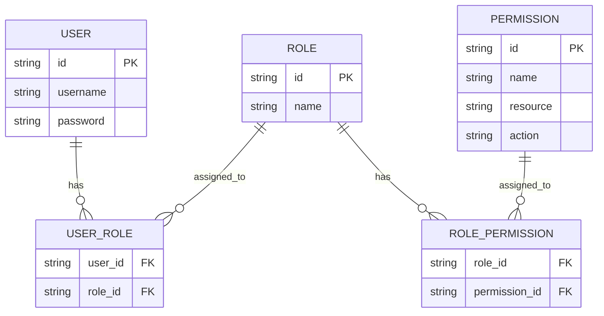
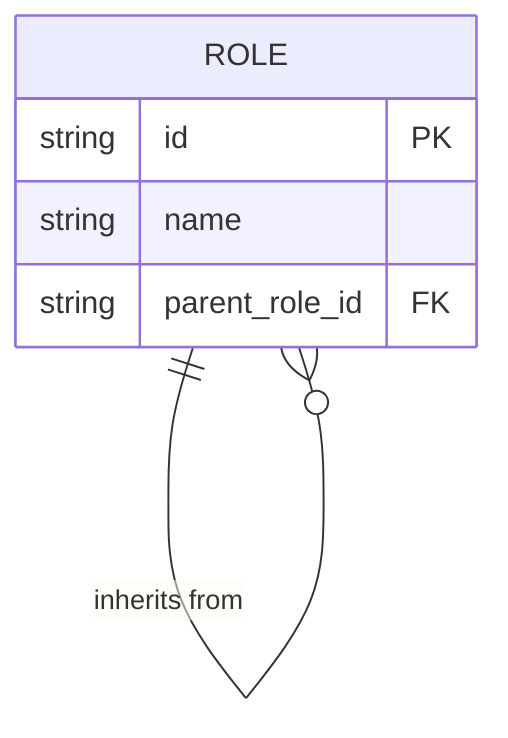
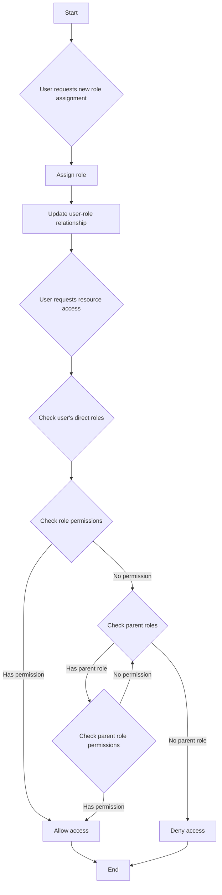
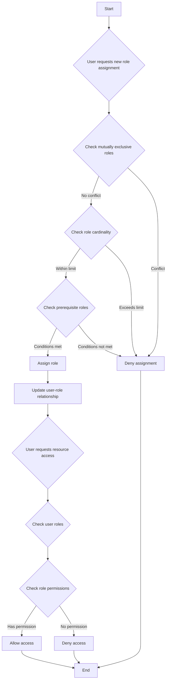

## 역할 기반 액세스 제어 (RBAC)란 무엇인가?

역할 기반 액세스 제어 (RBAC)는 "역할"의 개념을 도입하여 사용자와 권한을 분리함으로써 유연하고 효율적인 권한 관리 시스템을 제공하는 널리 채택된 액세스 제어 모델입니다.

RBAC의 핵심 아이디어는 간단하지만 강력합니다: 사용자에게 직접 권한을 할당하는 대신, 권한을 역할에 할당하고, 그런 다음 역할을 사용자에게 할당합니다. 이 간접적인 권한 할당 방법은 액세스 권한을 관리하는 과정을 크게 단순화합니다.

### RBAC의 주요 개념

RBAC 모델은 네 가지 주요 요소를 중심으로 돌아갑니다:

1. 사용자: 시스템 내의 개인, 일반적으로 실제 사람들.
2. 역할: 조직 내의 직무 기능이나 책임의 표현.
3. 권한: 특정 자원에 특정 작업을 수행할 수 있는 승인.
4. 세션: 사용자가 특정 역할을 활성화하는 동적 환경.

RBAC의 기본 워크플로는 다음과 같이 요약할 수 있습니다:
1. 조직 구조 또는 비즈니스 요구 사항을 기반으로 역할 정의.
2. 각 역할에 적절한 권한 할당.
3. 사용자에게 그들의 책임에 따라 하나 이상의 역할 할당.
4. 사용자가 자원에 액세스하려고 할 때, 시스템은 할당된 역할이 필요한 권한을 가지고 있는지 확인합니다.

### RBAC의 유형

#### RBAC0: 기초 모델

RBAC0는 사용자, 역할, 권한 및 세션의 핵심 개념을 정의하는 기본 모델입니다. 이는 다른 모든 RBAC 모델의 기초로 사용됩니다.

주요 특징:
- 사용자-역할 연관: 다대다 관계
- 역할-권한 연관: 다대다 관계



이 다이어그램은 사용자, 역할 및 권한 간의 관계를 보여주는 RBAC0의 기본 구조를 설명합니다.

주요 작업:
1. 사용자에게 역할 할당
2. 역할에 권한 할당
3. 사용자가 특정 권한을 가지고 있는지 확인

RBAC0는 견고한 출발점을 제공하지만 다음과 같은 몇 가지 한계점이 있습니다:
1. 역할 폭발: 시스템 복잡성이 증가함에 따라 역할의 수가 급증할 수 있음.
2. 권한 중복: 서로 다른 역할이 유사한 권한 세트를 필요로 하여 중복이 발생할 수 있음.
3. 계층 구조의 부족: 역할 간의 상속 관계를 표현할 수 없음.

#### RBAC1: 역할 계층 도입

RBAC1은 RBAC0에 역할 상속 개념을 추가하여 구축되었습니다.

```plaintext
RBAC1 = RBAC0 + Role Inheritance
```

주요 특징:
- 역할 계층 구조: 역할이 부모 역할을 가질 수 있음
- 권한 상속: 하위 역할은 부모 역할로부터 모든 권한을 상속받음



이 다이어그램은 RBAC1에서 역할이 다른 역할로부터 상속받는 방법을 보여줍니다.

주요 작업:



이 플로우차트는 RBAC1에서 역할 할당 및 권한 확인 과정을 역할 상속 측면을 포함하여 설명합니다.

RBAC1은 다음과 같은 몇 가지 이점을 제공합니다:
1. 역할의 수 감소: 상속을 통해 더 적은 수의 기본 역할 생성 가능
2. 권한 관리 간소화: 조직의 계층 구조를 반영하기 쉬움

그러나 RBAC1은 여전히 다음과 같은 제한이 있습니다:
1. 제약 메커니즘 부족: 잠재적으로 상충하는 역할을 동시에 가질 수 있는 사용자를 제한할 수 없음
2. 성능 고려: 권한 확인에 전체 역할 계층 구조를 탐색해야 할 수 있음

#### RBAC2: 제약 구현

RBAC2도 RBAC0을 기반으로 하지만 제약의 개념을 도입했습니다.

```plaintext
RBAC2 = RBAC0 + Constraints
```

주요 특징:
1. 상호 배타적 역할: 사용자가 이러한 역할을 동시에 할당받을 수 없음
2. 역할 카디널리티: 특정 역할에 할당될 수 있는 사용자 수 제한
3. 필수 역할: 다른 역할을 할당받기 전에 특정 역할을 가지고 있어야 함



이 플로우차트는 다양한 제약을 포함하는 RBAC2에서의 역할 할당 및 액세스 제어 과정을 설명합니다.

RBAC2는 권한의 과도한 집중을 방지하고 보다 정밀한 액세스 제어를 가능하게 하여 보안을 강화합니다. 그러나 다양한 제약 조건을 확인해야 하므로 시스템 복잡성을 증가시키고 성능에 영향을 미칠 수 있습니다.

### RBAC3: 종합 모델

RBAC3은 RBAC1과 RBAC2의 기능을 결합하여 역할 상속과 제약 메커니즘을 모두 제공합니다：

```plaintext
RBAC3 = RBAC0 + Role Inheritance + Constraints
```

이 종합 모델은 최대한의 유연성을 제공하지만 구현 및 성능 최적화에서 도전을 제공합니다.

## RBAC (역할 기반 액세스 제어)의 장점은 무엇인가?

1. 권한 관리의 간소화: 역할을 통한 대량 승인으로 개별 사용자 권한 관리를 복잡하지 않게 함.
2. 보안 강화: 사용자 권한에 대한 보다 정밀한 통제가 보안 위험을 줄임.
3. 관리 비용 감소: 역할 권한 수정이 자동으로 모든 관련 사용자에게 영향을 미침.
4. 비즈니스 논리와의 일치: 역할이 종종 조직 구조나 비즈니스 프로세스에 상응하여 이해하고 관리하기 쉬움.
5. 의무 분리 지원: 상호 배타적 역할과 같은 제약을 통해 중요한 책임을 분리 가능.

## 실질적인 구현 고려사항은 무엇인가?

실제 시나리오에서 RBAC을 구현할 때 개발자는 다음과 같은 중요한 측면을 고려해야 합니다:

1. 데이터베이스 설계: RBAC 구조를 효과적으로 저장하고 쿼리하기 위해 관계형 데이터베이스 활용.
2. 성능 최적화: 특히 복잡한 RBAC3 모델의 권한 확인을 최적화하고 캐싱 전략을 구현.
3. API 및 프론트엔드 통합: 사용자, 역할 및 권한 관리를 위한 명확한 API 설계 및 프론트엔드 애플리케이션에서 RBAC을 사용하는 방법 고려.
4. 보안 및 감사: RBAC 시스템 자체의 보안을 보장하고 세부적인 로깅 및 감사 기능 구현.
5. 확장성: 장래 확장을 염두에 두고 설계, 예를 들어 더 복잡한 권한 규칙 지원 또는 다른 시스템과의 통합.
6. 사용자 경험: 시스템 관리자가 RBAC 구조를 쉽게 구성하고 유지할 수 있는 직관적인 인터페이스 설계.

<SeeAlso slugs={['abac', 'access-control']} />

<Resources
  urls={[
    "https://blog.logto.io/rbac-and-abac",
    "https://blog.logto.io/mastering-rbac",
    "https://blog.logto.io/organization-and-role-based-access-control",
    "https://docs.logto.io/docs/recipes/rbac/",
    "https://en.wikipedia.org/wiki/Role-based_access_control"
  ]}
/>
