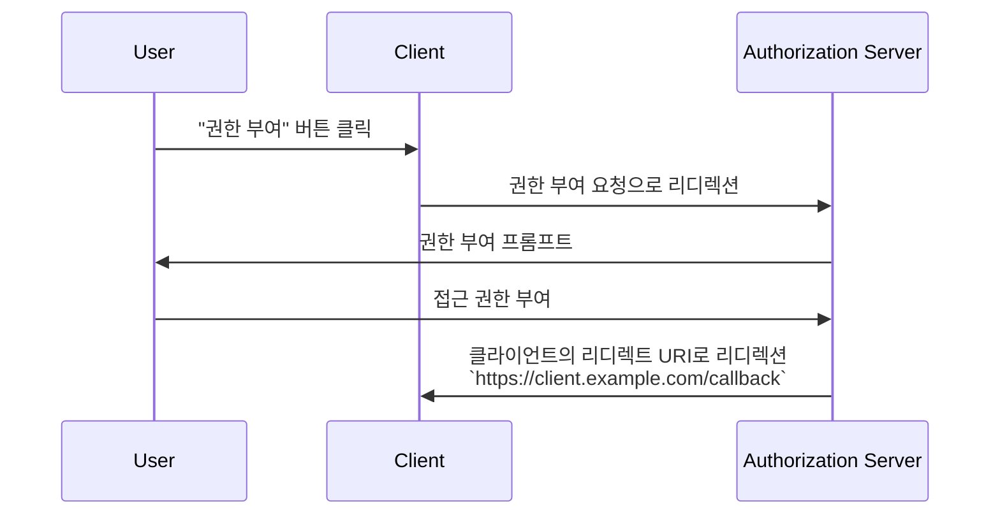

## 리디렉트 URI란 무엇인가?

리디렉트 URI는 콜백 URL 또는 리디렉션 URL이라고도 하며, <Ref slug="authorization-server" />가 <Ref slug="authorization-request" />를 완료한 후 사용자 에이전트를 어디로 리디렉션할지를 나타내는 URI입니다.

> 범용 리소스 식별자 (URI)는 종종 URL (Uniform Resource Locator)과 혼동됩니다. 자세한 내용은 [URI, URL 및 URN 공개](https://blog.logto.io/unveiling-uri-url-and-urn)를 참조하세요.

리디렉트 URI가 포함된 인증 요청의 예를 살펴보겠습니다:

```http
GET /authorize?response_type=code
  &client_id=YOUR_CLIENT_ID
  &redirect_uri=https%3A%2F%2Fclient.example.com%2Fcallback
  &scope=openid%20profile%20email
  &state=abc123
  &nonce=123456 HTTP/1.1
```

이 예에서는 `redirect_uri` 매개변수의 원시 값이 URL 인코딩된 `https%3A%2F%2Fclient.example.com%2Fcallback`입니다. 실제 값은 `https://client.example.com/callback`입니다.

## 리디렉트 URI는 어떻게 작동하나요?

> <Ref slug="openid-connect" />의 맥락에서, OAuth 2.0의 <Ref slug="authorization-request" />와 <Ref slug="authorization-server" />의 워크플로우가 유사하게 적용됩니다. 리디렉트 URI는 OAuth 2.0에서처럼 <Ref slug="authentication-request" />와 <Ref slug="openid-connect" headingId="openid-provider-op" />의 경우에서도 동일하게 작동합니다.

예를 들어, <Ref slug="client" />가 `https://client.example.com` URL에서 인증 요청을 시작한다고 가정합시다. 사용자가 인증 프로세스를 완료하면, 인증 서버는 사용자 에이전트(브라우저)를 다시 `https://client.example.com/callback`으로 리디렉션합니다.



위의 시나리오에서 보듯이 리디렉트 URI는 인증 서버가 사용자 에이전트를 인증 프로세스가 완료된 후에 다시 리디렉트하는 데 필수적입니다. 또한, 리디렉트 URI는 흐름에 따라 인증 코드나 토큰을 수신하는 데 사용됩니다.

다음은 <Ref slug="authorization-code-flow" />에서 실제 리디렉트를 어떻게 나타낼 수 있는지에 대한 비정규 예입니다:

```http
HTTP/1.1 302 Found
Location: https://client.example.com/callback?code=AUTHORIZATION_CODE&state=abc123
```

여기서 인증 서버가 추가한 URL 매개변수 `code`와 `state`는 리디렉트 URI에 포함됩니다. 클라이언트는 인증 프로세스를 계속하기 위해 URL에서 `code`와 `state` 매개변수를 추출해야 합니다.

## 왜 리디렉트 URI가 필요한가?

위 예에서 볼 수 있듯이, 인증 서버는 성공적인 인증 요청 후에 어디로 리디렉트할지를 알아야 합니다. 이는 여러 클라이언트(즉, <Ref slug="single-sign-on" />)가 있을 때 특히 유용하며, 각 클라이언트는 다른 리디렉트 URI를 가집니다.

<Ref slug="authorization-code-flow" />에서는 리디렉트 URI가 인증 코드를 클라이언트에게 전달하는 데 사용되며, 프론트 채널(브라우저)을 통해 토큰을 노출하지 않도록 방지합니다.

[리소스 소유자 비밀번호 자격 증명 (ROPC) 인증 부여](https://datatracker.ietf.org/doc/html/rfc6749#section-4.3)를 사용하여 리디렉트 URI 없이 사용자를 위한 토큰을 얻을 수도 있지만, 보안 우려로 인해 <Ref slug="oauth-2.1" />에서는 사용되지 않습니다.

## 보안 고려사항

리디렉트 URI는 중요한 매개변수이며 공격자들이 흔히 표적으로 삼습니다. 다음은 염두에 두어야 할 몇 가지 보안 고려사항입니다:

- **리디렉트 URI 화이트리스트**: 클라이언트는 인증 서버에 등록된 리디렉트 URI만 허용해야 합니다. 이는 공격자가 악성 사이트로 사용자를 리디렉션하는 것을 방지합니다.
- **HTTPS 사용**: 클라이언트와 인증 서버 간의 통신을 보안하기 위해 항상 HTTPS를 사용하세요.
- **정확한 매치**: 리디렉트 URI는 등록된 URI와 정확히 일치해야 합니다. 인증 서버는 넓은 매칭 패턴을 허용하지 않는 엄격한 매칭 규칙을 시행할 수 있습니다.
- **상태 매개변수**: <Ref slug="csrf" /> 공격을 방지하기 위해 `state` 매개변수를 사용하십시오. 클라이언트는 `state` 매개변수를 검증하여 인증 요청에 보낸 값과 일치하는지 확인해야 합니다.

<SeeAlso slugs={["csrf", "oauth-2.1", "authorization-code-flow"]} />

<Resources
  urls={[
    "https://blog.logto.io/oauth-2-1",
    "https://blog.logto.io/csrf",
    "https://blog.logto.io/redirect-uri-in-authorization-code-flow",
  ]}
/>
