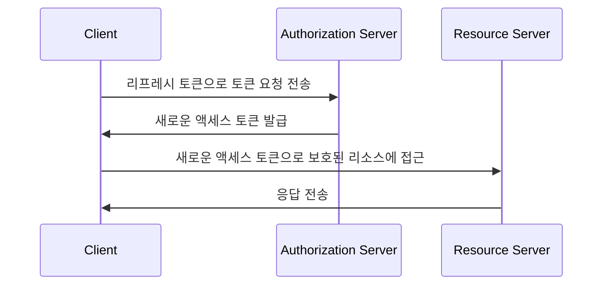

## 리프레시 토큰이란?

리프레시 토큰은 일반적으로 임의의 문자열로, 사용자가 다시 인증할 필요 없이 새로운 <Ref slug="access-token">액세스 토큰</Ref>을 얻기 위해 사용되는 장기 자격 증명입니다. OAuth 2.0 및 OpenID Connect (OIDC) 컨텍스트에서 <Ref slug="authorization-server">인증 서버</Ref>는 <Ref slug="offline-access" />를 요청할 때 클라이언트(애플리케이션)에게 리프레시 토큰을 발급할 수 있습니다.

[OAuth 2.0 RFC](https://datatracker.ietf.org/doc/html/rfc6749#section-1.5)는 리프레시 토큰의 고차원적인 생명 주기를 정의하고 있지만, 구현 세부사항은 인증 서버와 클라이언트마다 다를 수 있습니다. 이후 섹션에서 이를 탐구할 것입니다.

## 리프레시 토큰은 어떻게 작동하나요?

리프레시 토큰은 일반적으로 클라이언트가 <Ref slug="offline-access" />를 요청할 때 액세스 토큰과 함께 발급됩니다. 오프라인 액세스를 요청하는 업계 표준은 <Ref slug="authorization-request" />에 `offline_access` 스코프를 포함하는 것이며, <Ref slug="openid-connect" />는 이를 위해 공식적으로 `offline_access` 스코프를 정의합니다 (<Ref slug="authentication-request" />에 사용 가능).

다음은 `offline_access` 스코프가 포함된 인증 요청의 비정규 예제입니다:

```http
GET /authorize?response_type=code
  &client_id=YOUR_CLIENT_ID
  &redirect_uri=https%3A%2F%2Fclient.example.com%2Fcallback
  &scope=openid%20profile%20email%20offline_access
  &state=abc123
  &nonce=123456 HTTP/1.1
```

클라이언트가 리프레시 토큰을 받으면 현재 액세스 토큰이 만료되었을 때 이를 사용하여 새로운 액세스 토큰을 요청할 수 있습니다. 다음은 리프레시 토큰을 사용하는 간단한 예제입니다:



시퀀스 다이어그램이 보여주는 것처럼, 리프레시 토큰의 사용은 클라이언트와 인증 서버 모두의 지원이 필요합니다:

- 클라이언트는 리프레시 토큰을 안전하게 저장하고 <Ref slug="token-request" />에서 새로운 액세스 토큰을 얻기 위해 사용해야 합니다.
- 인증 서버는 리프레시 토큰을 검증하고 클라이언트가 유효한 리프레시 토큰을 제시했을 때 새로운 액세스 토큰을 발급해야 합니다.

리프레시 토큰은 <Ref slug="resource-server">리소스 서버</Ref>와 공유되지 않아야 합니다. 액세스 토큰만이 리소스 서버가 인증을 위해 확인해야 하는 토큰입니다.

다음은 리프레시 토큰을 사용하는 토큰 요청의 비정규 예제입니다:

```http
POST /token HTTP/1.1
Host: your-authorization-server.com
Content-Type: application/x-www-form-urlencoded

grant_type=refresh_token
  &refresh_token=YOUR_REFRESH_TOKEN
  &client_id=YOUR_CLIENT_ID
  &client_secret=YOUR_CLIENT_SECRET
  &scope=openid%20profile%20email
```

## 보안 고려사항 ||security-considerations||

리프레시 토큰은 장기적 (예: 며칠, 몇 주)으로 유효하고 사용자 상호작용 없이 새로운 액세스 토큰을 얻는 데 사용될 수 있기 때문에 액세스 토큰(예: 몇 분, 몇 시간)에 비해 보안 위험이 높습니다. 리프레시 토큰의 사용은 잠재적 보안 위협을 완화하기 위해 신중하게 고려되고 구현되어야 합니다. 다음은 고려할 몇 가지 모범 사례입니다:

### 안전한 저장

리프레시 토큰을 클라이언트 측에서 안전하게 저장하여 무단 접근을 방지합니다. 이러한 저장 메커니즘에는 다음이 포함됩니다:

- **HTTP 전용 쿠키**: 토큰을 HTTP 전용 쿠키에 저장하여 클라이언트 측 자바스크립트가 접근할 수 없도록 합니다.
- **암호화된 저장**: 모바일 기기의 경우 Keychain (iOS) 또는 KeyStore (Android)와 같은 안전한 저장소나, 웹 애플리케이션에서의 암호화된 데이터베이스를 사용합니다.

### 리프레시 토큰 회전 ||refresh-token-rotation||

리프레시 토큰은 장기 유효하지만 주기적으로 또는 특정 조건(예: 성공적인 토큰 교환 후)에 기반하여 회전시키면 무단 접근의 위험을 상당히 줄일 수 있습니다. 정확한 회전 전략은 애플리케이션의 보안 요구 사항 및 인증 서버의 기능에 따라 달라질 수 있습니다.

다음은 일반적인 두 가지 토큰 회전 전략입니다:

- **시간 기반 회전**: 특정 기간 후 (예: 7일마다) 리프레시 토큰을 회전합니다.
- **이벤트 기반 회전**: 특정 이벤트 후 (예: 성공적인 토큰 교환 후, 비밀번호 변경 후) 리프레시 토큰을 회전합니다.

리프레시 토큰이 회전될 때 이전의 리프레시 토큰은 재사용을 방지하기 위해 무효화되어야 합니다. 이러한 전략은 세션 TTL (time-to-live)과 결합하여 리프레시 토큰의 유효성에 관계없이 일정 기간 후에는 사용자가 재인증해야 함을 보장합니다.

### 송신자 제한 리프레시 토큰 ||sender-constrained-refresh-tokens||

송신자 제한 리프레시 토큰은 클라이언트가 <Ref slug="client" headingId="confidential-clients">비밀 클라이언트</Ref>가 아닌 경우에 이를 요청한 클라이언트에 리프레시 토큰을 바인딩하는 보안 메커니즘입니다. 일반적인 방법은 [DPoP](https://datatracker.ietf.org/doc/html/rfc9449)와 [mTLS](https://datatracker.ietf.org/doc/html/rfc8705)입니다.

### 클라이언트 유형

리프레시 토큰의 사용을 <Ref slug="client" headingId="confidential-clients">비밀(비공개) 클라이언트</Ref>에 제한하는 것이 좋습니다.

- 공용 클라이언트(예: 단일 페이지 애플리케이션)는 소스 코드가 클라이언트 측에 노출되므로 공격자가 리프레시 토큰을 추출하고 남용하기가 더 쉽습니다. 리프레시 토큰이 필요할 경우 공용 클라이언트에는 보통 <Ref slug="pkce" />와 리프레시 토큰 회전과 같은 더 안전한 메커니즘이 사용됩니다.
- 반면에 비밀 클라이언트는 소스 코드와 환경이 클라이언트 측에 노출되지 않는 안전한 서버 환경에서 실행됩니다. 이런 환경에서는 리프레시 토큰을 더 안전하게 사용할 수 있습니다.

### 토큰 철회

리프레시 토큰은 보통 <Ref slug="opaque-token">불투명 토큰</Ref>(즉, 클라이언트에게 의미없음)이며 인증 서버에 의해 검증되어야 하므로, 인증 서버는 필요한 경우 리프레시 토큰을 무효화하기 위한 토큰 철회 메커니즘을 쉽게 구현할 수 있습니다. 이는 사용자 로그아웃, 계정 위협, 토큰 남용과 같은 시나리오에서 유용할 수 있습니다.

<SeeAlso slugs={["access-token", "id-token", "jwt", "opaque-token"]} />

<Resources urls={[
  "https://blog.logto.io/understanding-refresh-token-rotation",
  "https://blog.logto.io/understanding-tokens-in-oidc",
  {
    url: "https://openid.net/specs/openid-connect-core-1_0.html#OfflineAccess",
    result: {
      ogTitle: "Offline Access in OpenID Connect Core 1.0",
    }
  },
  {
    url: "https://datatracker.ietf.org/doc/html/rfc6749#section-1.5",
    result: {
      ogTitle: "Refresh Token in OAuth 2.0",
      ogDescription: "Refresh tokens are credentials used to obtain access tokens."
    },
  },
]} />
