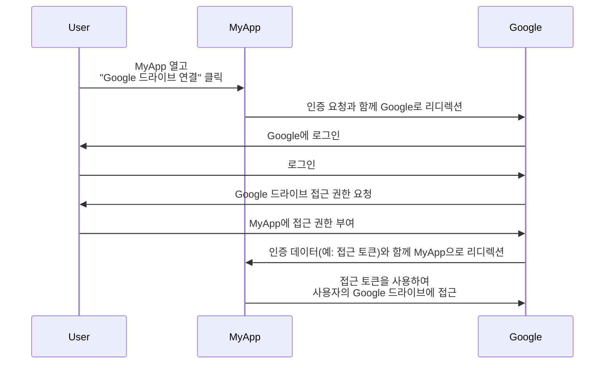

## 리소스 소유자란 무엇인가?

<Ref slug="oauth-2.0" />의 맥락에서 리소스 소유자는 보호된 리소스(예: 데이터, 파일 또는 서비스)에 대한 접근 권한을 부여할 수 있는 주체(일반적으로 사용자)입니다.

예를 들어, 웹 애플리케이션 MyApp이 사용자의 Google 드라이브에 접근하려고 합니다. 다음은 일반적인 OAuth 2.0 흐름입니다:

이 흐름에서 **사용자**는 MyApp에게 자신의 Google 드라이브에 대한 접근을 부여하는 **리소스 소유자**입니다. **MyApp**은 보호된 리소스를 접근하려는 <Ref slug="client" />이며, **Google**은 <Ref slug="authorization-server" />이자 <Ref slug="resource-server" />입니다.

이름에서 알 수 있듯이, 리소스 소유자는 <Ref slug="resource-server" />에 있는 일부 리소스를 소유하며 <Ref slug="oauth-2.0" />의 맥락에서 클라이언트가 이를 대신 접근할 수 있도록 권한을 부여할 수 있습니다.

## 리소스 소유자가 중요한 이유는 무엇인가?

<Ref slug="authorization" /> 과정에서 리소스 소유자는 자신의 리소스에 대한 접근을 명시적으로 허가하거나 거부하는 주체이기 때문에 무시할 수 없습니다. 리소스 소유자의 동의는 기술적 및 준수 상 필수적입니다:

- **기술적**: 리소스 소유자의 동의는 클라이언트가 리소스에 접근하기 위한 필요한 권한을 가지고 있음을 보장합니다. 모든 것이나 아무것도 아닌 접근 대신, 리소스 소유자는 클라이언트의 요청에 따라 부분적인 접근 권한을 부여할 수 있습니다. 반면에, 리소스 소유자는 언제든지 명시적으로 접근을 철회할 수도 있습니다. 이러한 접근 방식은 <Ref slug="access-control" />을 위한 명확하고 감사를 받을 수 있는 방법을 제공합니다.
- **준수**: 리소스 소유자의 동의는 특히 민감한 데이터를 다룰 때 많은 관할권에서 법적 요구 사항입니다. 예를 들어, 일반 데이터 보호 규정(GDPR)은 데이터 처리 활동에 대해 데이터 주체(리소스 소유자)가 명시적인 동의를 제공해야 한다고 규정하고 있습니다.

## 리소스 소유자 vs. 리소스 서버

<Ref slug="resource-server">리소스 서버</Ref>는 **보호된 리소스**를 호스팅하고 제공하는 책임을 가지고 있습니다. 그들은 접근 토큰을 검증하고 클라이언트에게 리소스를 제공합니다.

반면에 리소스 소유자는 <Ref slug="access-control" /> 정책에 따라 리소스 서버에 있는 보호된 리소스에 대해 전체 또는 부분적인 통제권을 가질 수 있습니다.

<SeeAlso slugs={["resource-server", "oauth-2.0", "resource-indicator", "access-control"]} />

<Resources
  urls={[
    "https://tools.ietf.org/html/rfc6749",
  ]}
/>
