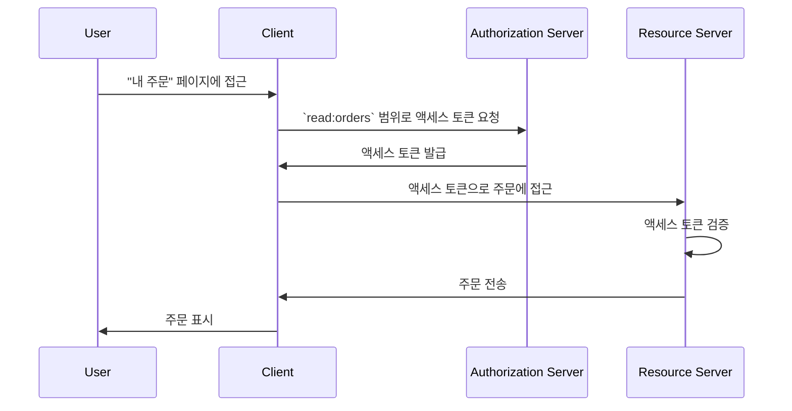

## 리소스 서버란 무엇인가?

<Ref slug="oauth-2.0" />의 맥락에서, **리소스 서버**는 <Ref slug="client" />가 접근하고자 하는 **보호된 리소스**를 호스팅하는 서버입니다. 리소스 서버는 또한 <Ref slug="access-token" />을 검증하고 <Ref slug="access-control" /> 정책에 따라 보호된 리소스를 클라이언트에게 제공하는 책임이 있습니다.

예를 들어, MyApp이라는 웹 애플리케이션이 사용자의 Google 드라이브에 접근하고자 하는 시나리오를 고려해보세요:

- **MyApp**은 보호된 리소스에 접근하고자 하는 클라이언트입니다.
- **Google**은 사용자의 Google 드라이브를 호스팅하는 리소스 서버입니다.
- **Google**은 또한 MyApp에게 액세스 토큰을 발급하는 <Ref slug="authorization-server" />입니다.

또 다른 예로, 전자상거래 웹사이트가 내부 주문 서비스에서 사용자의 주문 내역에 접근하고자 하는 경우를 생각해볼 수 있습니다:

- **전자상거래 웹사이트**는 보호된 리소스에 접근하고자 하는 클라이언트입니다.
- **주문 서비스**는 사용자의 주문 내역을 호스팅하는 리소스 서버입니다.
- 전자상거래 웹사이트가 OAuth 2.0 서비스 또는 OpenID 공급자와 통합하는 경우, 해당 서비스(공급자)는 인증 서버로 작동합니다.

## 리소스 서버는 어떻게 작동하나요?

OAuth 2.0은 관심사의 명확한 분리를 제공하기 위해 리소스 서버와 인증 서버의 역할을 별도로 정의합니다. 그러나 프레임워크 내에서 리소스 서버의 구체적인 표현을 정의하지 않고, 보호된 리소스를 호스팅하는 가상의 개념으로 언급합니다. <Ref slug="client" />는 액세스하고자 하는 보호된 리소스에 대해 <Ref slug="scope">범위</Ref>를 지정해야 합니다.

예를 들어, 클라이언트가 주문 서비스에서 사용자의 주문 내역에 접근하고자 한다고 가정해보겠습니다. 주문에 접근하기 위한 <Ref slug="token-request" /> 전송의 비표준적인 예는 다음과 같습니다:



위 시퀀스 다이어그램에서 클라이언트는 인증 서버에 `read:orders` 범위로 액세스 토큰을 요청합니다. 모든 당사자는 `read:orders` 범위의 의미에 동의한다고 가정합니다: 이는 클라이언트가 리소스 서버에서 제공하는 `orders`에 대해 `read` 작업을 수행하고자 함을 지정합니다. 클라이언트는 그런 다음 액세스 토큰을 사용하여 리소스 서버에서 주문을 접근합니다.

> [!Note]
> 범위의 의미와 구조는 OAuth 2.0에서 정의되지 않으며 클라이언트, 인증 서버, 리소스 서버 간에 합의해야 합니다.

리소스 서버는 액세스 토큰을 검증하고 클라이언트가 요청된 리소스에 접근할 수 있는 권한이 있는지를 <Ref slug="access-control" /> 정책에 따라 결정하는 책임이 있습니다. 구현에 따라 액세스 토큰은 <Ref slug="opaque-token" />일 수도 있고 <Ref slug="jwt" />일 수도 있습니다.

## 명명 규칙

애플리케이션의 컨텍스트에 따라 리소스 서버의 이름을 유연하게 설정할 수 있습니다. OAuth 2.0은 <Ref slug="scope" /> 파라미터 내에서 리소스 서버의 특정 표현을 정의하지 않으므로, 산업 내에서 여러 가지 관례를 볼 수 있습니다:

- 리소스 서버 이름을 생략하고 동작만 사용하는 것: 예를 들어 `read`와 `write`.
- `[동사]:[리소스]`: 일반적인 관례는 `동사`와 `리소스`를 조합하여 클라이언트가 리소스에 대해 수행할 수 있는 작업을 지정하는 것입니다. 예를 들어, `read:orders`와 `write:profile`. 때때로 `orders:read`와 `profile:write`로 반전됩니다.
- `[uri]:[동작]`: 또 다른 관례는 리소스의 URI 및 클라이언트가 수행할 수 있는 동작을 사용하는 것입니다. 예를 들어, `https://api.example.com/orders:read`와 `https://api.example.com/profile:write`.

## 리소스 지시자

<Ref slug="authentication-request" />에서 scope 파라미터의 예제를 살펴보겠습니다(디코딩됨):

```plaintext
openid profile email https://api.example.com/orders:read
```

이 예에서, `scope` 파라미터에는 `openid`, `profile`, `email` 범위가 포함되어 있으며, 이는 <Ref slug="openid-connect" /> 표준 범위와 `https://api.example.com/orders:read` 범위를 포함하여 리소스 서버의 위치와 리소스를 읽을 수 있는 권한을 지정합니다.

이 특정한 경우에는 괜찮아 보이지만, 리소스와 범위 수가 증가함에 따라 범위를 관리하고 이해하기가 어려워질 수 있습니다. 이를 해결하기 위해 OAuth 2.0은 <Ref slug="resource-indicator">리소스 지시자</Ref> (RFC 8707)라는 확장을 도입하여 클라이언트가 URI를 사용하여 접근하려는 리소스를 지정할 수 있게 하여, 리소스 서버를 과정에서 더욱 명확하게 만듭니다.

인증 요청에 리소스 지시자 파라미터(`resource=https://api.example.com/orders`)를 추가한 후, scope 파라미터는 다음과 같이 간소화될 수 있습니다:

```plaintext
openid profile email read
```

이는 더욱 깔끔해 보이며 관리하기 쉽습니다.

> [!Note]
> 모든 인증 서버 (OpenID 공급자)가 리소스 지시자 확장을 지원하는 것은 아닙니다. 사용하기 전에 인증 서버의 문서를 두 번 확인해 주세요.

<SeeAlso slugs={["access-control", "resource-indicator", "resource-owner", "client"]} />

<Resources
  urls={[
    "https://datatracker.ietf.org/doc/html/rfc8707",
  ]}
/>
