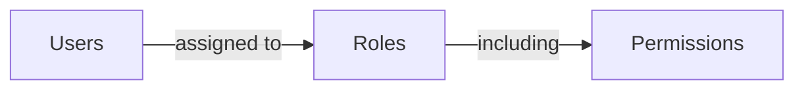

## 역할 (Role)

역할은 <Ref slug="rbac" />의 핵심 구성 요소 중 하나입니다. 이는 사용자에게 할당할 수 있는 권한의 컨테이너로 작용하며, 사용자와 그들의 접근 권한 사이의 중개자 역할을 합니다.



일반적인 역할 구조는 이름과 권한 세트를 포함합니다:

```typescript
const role = {
  name: 'order_admin',
  permissions: [
    'read:orders',   // 주문 세부 정보 보기
    'write:orders',  // 주문 수정
    'read:products'  // 제품 보기
  ]
}
```

> [!Note]
> 역할은 주로 권한 관리를 위해 사용됩니다. 접근 제어 구현을 위해서는 역할보다는 권한을 직접 확인하는 것이 권장됩니다. 자세한 내용은 <Ref slug="rbac" />를 참조하세요.

<SeeAlso slugs={["rbac", "authorization", "access-control"]} />