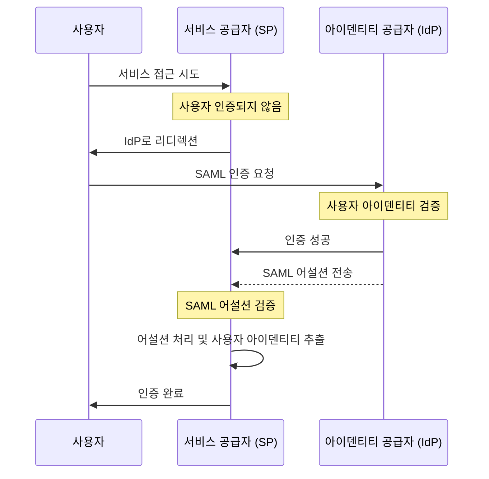

## SAML이란?

SAML (일반적으로 SAML 2.0으로 불림)은 <Ref slug="identity-provider" />와 <Ref slug="service-provider" /> 두 당사자 간의 인증 (authentication) 및 권한 부여 (authorization) 데이터를 교환하기 위한 XML 기반 표준입니다. 아이덴티티 연합 및 <Ref slug="enterprise-sso" /> 솔루션에 널리 사용됩니다.

이름에서 알 수 있듯이, SAML은 사용자 아이덴티티와 속성에 대한 어설션을 전달합니다. 이러한 어설션은 그 무결성과 기밀성을 보장하기 위해 디지털 서명되며 선택적으로 암호화됩니다.

## SAML은 어떻게 작동하나요?

SAML 인증 (authentication) 흐름에 들어가기 전에, 아이덴티티 공급자와 서비스 공급자가 서로를 인식하고 신뢰할 수 있는 방법을 이해할 필요가 있습니다. 이 신뢰는 메타데이터 교환을 통해 이루어지며, 양쪽 파티는 다음과 같은 정보를 공유합니다:

- **엔터티 ID**: 아이덴티티 공급자나 서비스 공급자의 고유 식별자.
- **공개 키**: SAML 어설션의 디지털 서명을 검증하는 데 사용됨.
- **엔드포인트**: 인증 (authentication) 요청 및 응답과 같은 다양한 SAML 작업의 URL.

신뢰가 구축되면, SAML 인증 흐름이 진행될 수 있습니다:

### RelayState

SAML 흐름에서 `RelayState` 매개변수는 인증 (authentication) 프로세스 동안 사용자의 상태를 유지하는 데 사용됩니다. 이는 사용자가 아이덴티티 공급자로 리디렉션되기 전에 생성한 원래 요청에 대한 참조 역할을 합니다. 서비스 공급자는 인증에 성공한 후 사용자를 원래 페이지나 자원으로 다시 리디렉션하는 데 이 매개변수를 사용할 수 있습니다.

RelayState는 인증 완료 후 사용자가 올바른 페이지로 리디렉션되도록 하여 <Ref slug="csrf" /> 공격을 방지하는 데에도 사용됩니다.

### SAML 어설션

SAML 어설션은 SAML 프로토콜의 핵심 구성 요소입니다. 이들은 사용자의 아이덴티티, 속성 및 인증 상태에 대한 정보를 포함합니다. SAML 어설션에는 세 가지 유형이 있습니다:

- **인증 어설션**: 사용자가 아이덴티티 공급자에 의해 인증 (authentication) 되었음을 나타냅니다.
- **속성 어설션**: 사용자에 대한 추가 정보, 예를 들어 역할, 권한 및 프로필 데이터를 포함합니다.
- **권한 부여 결정 어설션**: 특정 자원에 대한 사용자의 접근 권한을 명시합니다.

## SAML 채택을 위한 고려사항

SAML은 2000년대 초반부터 기업 환경에서 널리 채택되었습니다. 응용 프로그램에 SAML을 채택할 때의 주요 고려사항은 다음과 같습니다:

- 복잡성: SAML 구현은 특히 <Ref slug="oauth-2.0" /> 및 <Ref slug="openid-connect" />와 같은 최신 프레임워크와 비교했을 때 응용 프로그램과 통합할 때 복잡할 수 있습니다.
- 전송 효율성: SAML 메시지는 XML 포맷으로 인해 크기가 클 수 있으며, 이는 네트워크 성능에 영향을 줄 수 있습니다.
- 보안: SAML 어설션은 변조 및 감청으로부터 보호되어야 합니다. SAML 구현이 암호화 및 디지털 서명에 대한 모범 사례를 따르는지 확인하십시오.

이러한 고려 사항에도 불구하고, SAML은 기업 환경에서 안전한 아이덴티티 연합 및 싱글 사인 온 솔루션을 위한 강력하고 널리 사용되는 표준으로 남아 있습니다. 그러나 새로운 응용 프로그램이나 서비스의 경우, 더 가볍고 개발자 친화적인 인증 (authentication) 및 권한 부여 (authorization) 접근 방식을 위해 OAuth 2.0 및 OpenID Connect와 같은 현대적인 대안을 고려할 수 있습니다.

<SeeAlso slugs={["enterprise-sso", "oauth-2.0", "openid-connect"]} />

<Resources
  urls={[
    "https://blog.logto.io/saml-security-cheat-sheet",
    "https://blog.logto.io/picking-your-sso-method",
    "https://blog.logto.io/differences-between-saml-and-oidc",
  ]}
/>
