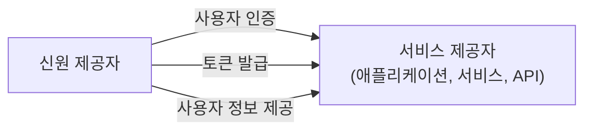

## 서비스 제공자 (SP)란 무엇인가?

<Ref slug="iam" /> 영역에서 서비스 제공자 (SP) (또는 <Ref slug="openid-connect" /> 문맥에서 **의존하는 당사자**)는 <Ref slug="identity-provider" />에 인증 (Authentication) 및 인가 (Authorization)를 의존하는 애플리케이션 또는 서비스입니다. 사용자를 위한 서비스를 제공하고 신원 제공자가 발급한 토큰을 기반으로 한 <Ref slug="access-control" /> 정책을 시행하는 책임이 있습니다.

## 서비스 제공자 표준

서비스 제공자에는 엄격한 표준이 없으며, 아이덴티티 관리가 필요한 모든 유형의 애플리케이션 또는 서비스가 될 수 있습니다. 그러나 서비스 제공자는 일반적으로 의존하는 신원 제공자가 설정한 표준을 따릅니다. 예를 들어, 신원 제공자가 <Ref slug="openid-connect" />를 지원하는 경우, 서비스 제공자는 일반적으로 OIDC를 사용하여 인증 및 인가를 처리합니다.

## 서비스 제공자 아키텍처

"서비스 제공자"라는 용어는 특정한 아키텍처나 구현을 지정하지 않습니다. 일반적으로 서비스 제공자는 신원 제공자와 등록하여 신뢰를 구축하고 안전한 통신을 가능하게 해야 합니다. 등록 과정에는 대개 메타데이터 및 클라이언트 자격 증명 교환이 포함됩니다.

예를 들어, OpenID Connect 문맥에서 서비스 제공자 메타데이터는 일반적으로 다음을 포함합니다:

- **클라이언트 ID**: 서비스 제공자의 고유 식별자.
- **클라이언트 비밀**: 서비스 제공자를 인증하는 데 사용되는 공유 비밀.
- **<Ref slug="redirect-uri">리디렉트 URI</Ref>**: 신원 제공자가 인증 및 인가 후 사용자를 다시 리디렉션할 URI.

등록 후, 서비스 제공자는 사용자를 신원 제공자가 지정한 엔드포인트로 리디렉션하여 <Ref slug="authentication" /> 프로세스를 시작할 수 있습니다.

상호 작용이 필요 없는 사용 사례를 위해 서비스 제공자가 구축될 때, 이는 종종 <Ref slug="client">클라이언트</Ref>로 불리며, <Ref slug="machine-to-machine" /> 통신이 필요합니다.

<SeeAlso slugs={["identity-provider", "openid-connect", "oauth-2.0"]} />

<Resources
  urls={[
    "https://blog.logto.io/secure-cloud-apps-with-oauth-and-openid-connect",
    "https://blog.logto.io/incorporate-identity-solution",
    "https://blog.logto.io/centralized-identity-system"
  ]}
/>
