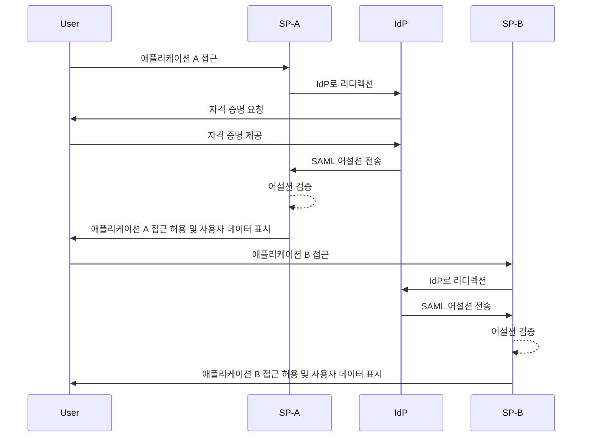
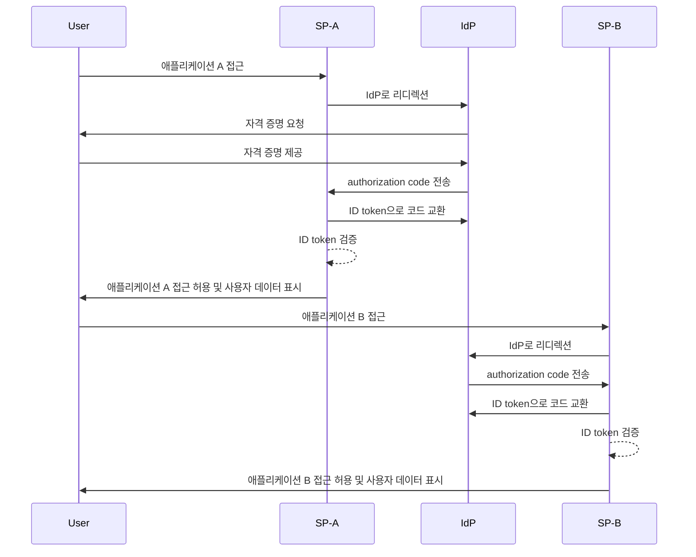

## 단일 로그인 (Single sign-on, SSO)이란 무엇인가?

단일 로그인 (Single sign-on, SSO)은 사용자가 하나의 자격 증명 세트로 여러 애플리케이션이나 서비스에 접근할 수 있게 하는 <Ref slug="authentication" /> 방법입니다. 각 시스템에 대해 별도의 로그인을 관리하는 대신, 사용자는 한 번 인증하면 모든 연결된 플랫폼에 자동으로 로그인됩니다.

SSO는 개인 및 비즈니스 환경, 특히 직원이나 원격 근로자가 다양한 SaaS 애플리케이션에 의존하여 업무를 수행하는 기업 환경에서 일반적으로 사용됩니다. SSO를 구현함으로써 조직은 보안을 강화하고, 접근 관리의 효율성을 높이며, 사용자 생산성을 향상시킬 수 있습니다.

SSO의 잘 알려진 예로는 Gmail, Google Drive, Google Calendar와 같은 Google의 서비스 모음이 있습니다. 사용자가 Google 계정에 로그인한 후에는 자격 증명을 다시 입력하지 않고도 이러한 모든 서비스에 쉽게 접근할 수 있습니다.

## 단일 로그인은 어떻게 작동하는가?

SSO는 <Ref slug="service-provider" />로 알려진 애플리케이션이나 서비스와 <Ref slug="identity-provider" /> 간의 신뢰 관계에 의존합니다. IdP는 사용자 인증을 처리하고 SP에 접근 권한을 부여하기 위해 필요한 정보를 안전하게 공유합니다. 이 신뢰는 연합이라는 과정을 통해 확립되며, 여기서 SP와 IdP는 인증 데이터를 안전하게 교환하기 위한 특정 표준과 프로토콜에 동의합니다.

사용자가 SSO가 활성화된 애플리케이션에 접근하려고 하면, SP는 사용자를 인증하기 위해 IdP로 리디렉션합니다. IdP는 사용자에게 자격 증명을 제공하도록 요청하고, 사용자의 신원을 확인한 후 자신의 시스템에서 인증된 세션을 설정합니다. 이 세션은 일반적으로 IdP의 도메인 아래에 안전하게 저장된 세션 쿠키를 사용하여 유지됩니다.

사용자가 인증되면, IdP는 SP와 공유하기로 동의한 사용자 정보를 포함하는 보안 토큰이나 어설션을 생성합니다. 이 토큰이나 어설션은 SP로 안전하게 전송되며, SP는 이를 검증하고 사용자에게 접근 권한을 부여합니다.

사용자가 다른 SSO가 활성화된 애플리케이션에 접근하면, 추가 로그인이 필요 없이 이 과정이 원활하게 진행됩니다. 이러한 편리함은 IdP가 유지하는 사용자 인증 세션 덕분에 가능하며, IdP는 자격 증명을 다시 요청하지 않고 사용자의 신원을 자동으로 확인하고 새로운 보안 토큰을 발급할 수 있습니다.

<Ref slug="saml" /> 및 <Ref slug="openid-connect" />와 같은 프로토콜은 SSO를 구현하는 데 널리 사용됩니다. 이러한 표준은 IdP와 SP 간에 인증 데이터가 안전하게 교환되는 방법을 정의하여, 사용자에게 애플리케이션 간의 원활한 경험을 유지하면서 신뢰할 수 있고 안전한 통신을 보장합니다.

### SAML 기반 SSO

SAML 기반 SSO에서는 사용자가 IdP에 의해 인증되면 XML 기반의 SAML 어설션이 생성되고 서명되어 SP로 안전하게 전송됩니다. SP는 어설션을 검증하고 사용자의 신원에 따라 접근을 허용합니다.

### OIDC 기반 SSO

OIDC는 <Ref slug="oauth-2.0" /> 위에 구축되어 SSO에 대한 보다 현대적인 접근 방식을 제공합니다. 이는 <Ref slug="jwt" />를 사용하여 IdP와 SP 간의 신원 정보를 교환하며, 보안을 강화하고 더 큰 유연성을 제공합니다.

## 단일 로그인 (Single sign-on)의 이점

1. **보안 강화**: SSO는 사용자가 기억해야 할 자격 증명의 수를 최소화하여 비밀번호 관련 보안 침해의 위험을 줄입니다. 또한 조직이 사용자 계정을 보호하기 위해 <Ref slug="mfa" />와 같은 강력한 인증 방법을 시행할 수 있게 합니다.

2. **향상된 사용자 경험**: 사용자는 여러 애플리케이션에 원활하게 접근할 수 있으며, 반복적으로 로그인할 필요가 없어 생산성이 향상되고 좌절감이 줄어듭니다. SSO는 로그인 프로세스를 간소화하고 다양한 플랫폼에서 일관된 사용자 경험을 제공합니다.

3. **중앙 집중식 접근 관리**: 조직은 IdP를 통해 사용자 접근 및 권한을 중앙에서 관리할 수 있으며, 모든 연결된 애플리케이션에 대해 일관된 보안 정책과 접근 제어를 보장합니다. 이는 사용자 프로비저닝, 프로비저닝 해제 및 감사 프로세스를 간소화합니다.

## 단일 로그인 (Single sign-on)을 사용할 때

1. **기업 및 조직 환경**: SSO는 여러 애플리케이션과 서비스를 활용하여 워크플로를 간소화하는 비즈니스에 특히 유용합니다. 이는 사용자 접근을 간소화하고 IT 팀이 개별 사용자 계정을 관리하는 부담을 줄입니다. 예를 들어, CRM, HR 및 협업 도구와 같은 여러 SaaS 애플리케이션을 사용하는 회사.
2. **고객 대상 애플리케이션**: SSO는 온라인 서비스나 전자 상거래 플랫폼에 접근하는 고객의 사용자 경험을 향상시킬 수 있습니다. 예를 들어, 사용자가 각 서비스에 대해 새 계정을 생성하는 대신 소셜 미디어 계정이나 이메일 주소로 로그인할 수 있도록 허용하는 경우.
3. **다중 제품 서비스**: 상호 연결된 제품이나 서비스를 제공하는 회사는 SSO를 활용하여 자사의 제공물 전반에 걸쳐 원활한 사용자 경험을 제공할 수 있습니다. 사용자는 반복적인 로그인 없이 다양한 애플리케이션을 탐색할 수 있습니다. 예를 들어, Google의 G Suite. 사용자는 Chrome 브라우저에서 한 번 로그인하면 자격 증명을 다시 입력하지 않고도 여러 Google 서비스에 접근할 수 있습니다.

SSO의 사용은 이러한 시나리오에 국한되지 않으며, 조직이나 애플리케이션의 특정 요구 사항에 따라 다양한 사용 사례에 적응할 수 있습니다. 이는 현대 디지털 환경에서 보안, 사용자 경험 및 운영 효율성을 향상시키기 위한 모범 사례로 널리 간주됩니다.

<SeeAlso slugs={["enterprise-sso"]} />