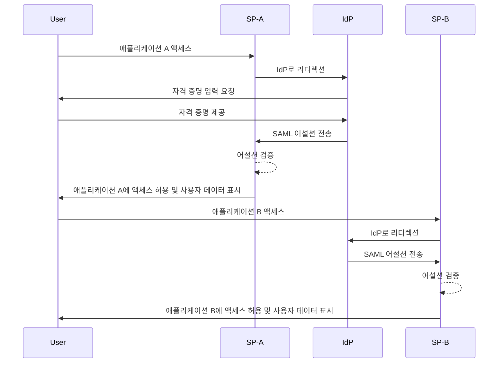
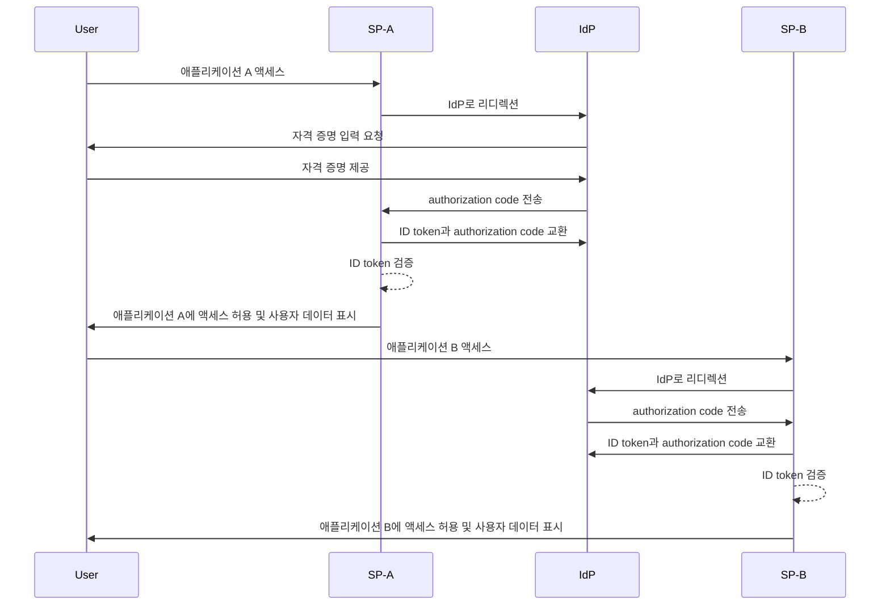

## 싱글 사인온 (SSO)이란 무엇인가?

싱글 사인온 (Single sign-on, SSO)은 사용자가 하나의 자격 증명 세트를 이용해 여러 애플리케이션이나 서비스에 액세스할 수 있도록 하는 <Ref slug="authentication" /> 방법입니다. 각 시스템에 대해 개별 로그인을 관리하는 대신, 사용자는 한 번 인증을 받고 연결된 모든 플랫폼에 자동으로 로그인됩니다.

SSO는 개인 및 비즈니스 환경 모두에서 일반적으로 사용되며, 특히 직원이나 원격 근무자가 다양한 SaaS 애플리케이션에 의존하여 업무를 수행하는 기업 환경에서 더욱 그렇습니다. SSO를 구현함으로써 조직은 보안을 강화하고, 액세스 관리에 소요되는 시간을 줄이며 사용자 생산성을 높일 수 있습니다.

잘 알려진 SSO의 예로는 Gmail, Google 드라이브, Google 캘린더와 같은 Google의 서비스가 있습니다. 사용자가 Google 계정에 로그인하면 자격 증명을 다시 입력하지 않고도 이러한 모든 서비스를 쉽게 이용할 수 있습니다.

## 싱글 사인온은 어떻게 작동하는가?

SSO는 <Ref slug="service-provider" />로 알려진 애플리케이션이나 서비스와 <Ref slug="identity-provider" /> 간의 신뢰 관계에 기반하여 작동합니다. IdP는 사용자 인증을 처리하고 SP에 액세스 권한을 부여하기 위해 필요한 정보를 안전하게 공유합니다. 이 신뢰는 페더레이션이라는 과정을 통해 확립되며, SP와 IdP 모두가 인증 데이터를 안전하게 교환하기 위한 특정 표준 및 프로토콜에 동의합니다.

사용자가 SSO 적용 애플리케이션에 액세스하려고 하면, SP는 인증을 위해 사용자를 IdP로 리디렉션합니다. IdP는 사용자에게 자격 증명을 요청하고, 사용자의 신원을 검증한 후, 사용자의 정보를 포함한 보안 토큰이나 어설션을 생성합니다. 이 토큰은 SP로 전송되며, SP는 이를 사용하여 액세스를 허용합니다.

사용자가 다른 SSO 적용 애플리케이션에 액세스하려고 하면, 이 과정이 자동으로 반복되며, 사용자가 다시 로그인할 필요가 없습니다. IdP는 필요한 인증 데이터를 SP로 직접 전송하여 사용자가 원활하게 새로운 애플리케이션에 접근할 수 있도록 합니다.

<Ref slug="saml" /> 및 <Ref slug="openid-connect" />는 SSO를 구현하기 위해 널리 사용되는 두 가지 프로토콜입니다. 이 표준들은 IdP와 SP 간의 인증 데이터가 안전하고 신뢰성 있게 교환되는 방법을 정의합니다.

### SAML 기반 SSO

SAML 기반 SSO에서, 사용자가 IdP에 의해 인증되면 XML 기반 SAML 어설션이 생성, 서명되어 SP로 안전하게 전송됩니다. SP는 이 어설션을 검증하고 사용자의 신원에 따라 액세스를 허용합니다.

### OIDC 기반 SSO

OIDC는 <Ref slug="oauth-2.0" /> 위에 구축된 보다 현대적인 SSO 접근 방식입니다. <Ref slug="jwt" />를 사용하여 IdP와 SP 간의 신원 정보를 교환하여 보안을 강화하고 유연성을 제공합니다.

## 싱글 사인온의 이점

1. **향상된 보안**: SSO는 사용자가 기억해야 할 자격 증명의 수를 최소화하여 비밀번호 관련 보안 침해의 위험을 줄입니다. 또한 조직이 <Ref slug="mfa" />와 같은 강력한 인증 방법을 적용하여 사용자 계정을 보호할 수 있도록 합니다.

2. **개선된 사용자 경험**: 사용자는 여러 애플리케이션에 원활하게 접근할 수 있으며, 생산성을 높이고 불만을 줄일 수 있습니다. SSO는 로그인 과정을 단순화하고, 서로 다른 플랫폼 간에 일관된 사용자 경험을 제공합니다.

3. **중앙 집중식 액세스 관리**: 조직은 IdP를 통해 사용자 액세스 및 권한을 중앙에서 관리함으로써, 모든 연결된 애플리케이션 전반에 걸쳐 일관된 보안 정책 및 액세스 컨트롤을 보장할 수 있습니다. 이는 사용자 프로비저닝, 디프로비저닝 및 감사 프로세스를 단순화합니다.

## 싱글 사인온을 사용할 때

1. **기업 및 조직 환경**: SSO는 워크플로우를 간소화하기 위해 여러 애플리케이션과 서비스를 사용하는 비즈니스에 특히 유익합니다. 사용자 액세스를 단순화하고 IT 팀이 개별 사용자 계정을 관리하는 부담을 줄여줍니다. 예를 들어, CRM, HR, 협업 도구와 같은 다수의 SaaS 애플리케이션을 사용하는 기업.
2. **고객 대면 애플리케이션**: SSO는 온라인 서비스 또는 전자 상거래 플랫폼에 접속하는 고객에게도 사용자 경험을 향상시킬 수 있습니다. 예를 들어, 각 서비스에 별도로 계정을 생성하지 않고 소셜 미디어 계정이나 이메일 주소로 로그인할 수 있도록 허용합니다.
3. **멀티 프로덕트 서비스**: 상호 연결된 제품이나 서비스를 제공하는 회사는 SSO를 활용하여 사용자 경험을 원활하게 제공할 수 있습니다. 사용자는 반복적인 로그인 없이 서로 다른 애플리케이션 간에 쉽게 이동할 수 있습니다. 예를 들어, Google의 G Suite. 사용자는 Chrome 브라우저에 한 번 로그인하면 자격 증명을 다시 입력하지 않고도 여러 Google 서비스를 이용할 수 있습니다.

SSO의 사용은 이러한 시나리오에 국한되지 않으며, 조직이나 애플리케이션의 특정 요구에 따라 다양한 용례에 적응할 수 있습니다. SSO는 보안, 사용자 경험, 운영 효율성을 향상시키기 위한 모던 디지털 환경의 모범 사례로 널리 인정받고 있습니다.

<SeeAlso slugs={["enterprise-sso"]} />