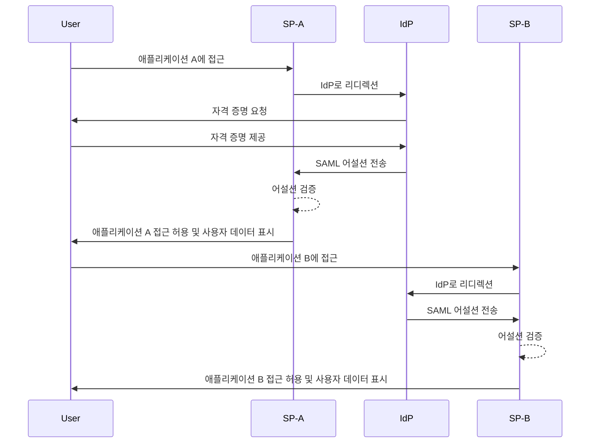
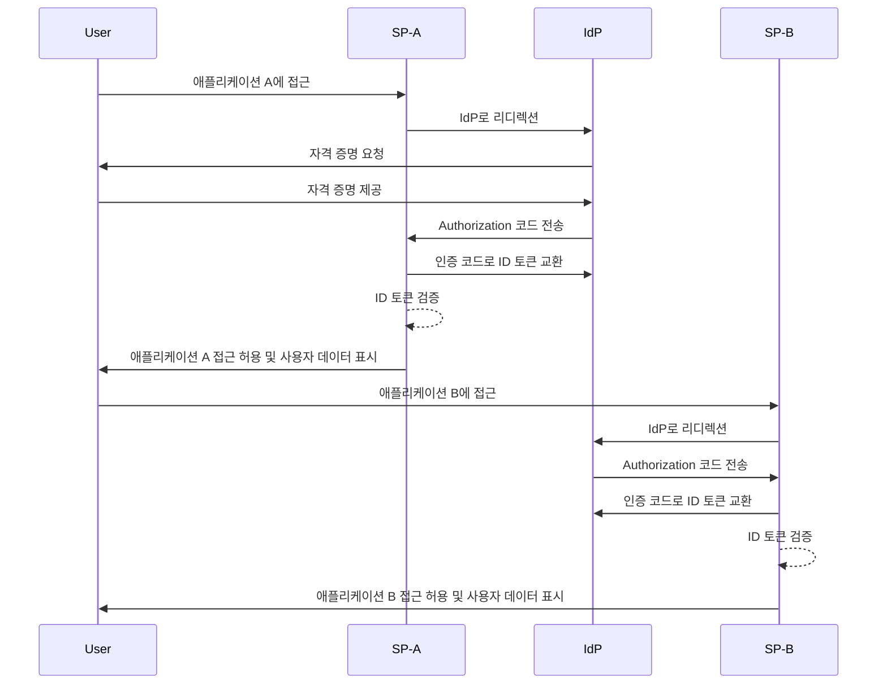

## 싱글 사인온 (SSO)이란?

싱글 사인온 (SSO)은 사용자가 단일 자격 증명 세트를 사용하여 여러 애플리케이션이나 서비스에 접근할 수 있게 해주는 인증 방법입니다. 각 시스템에 대한 별도의 로그인을 관리하는 대신, 사용자는 한 번 인증을 거치면 모든 연결된 플랫폼에 자동으로 로그인됩니다.

SSO는 개인 및 비즈니스 환경 모두에서 일반적으로 사용되며, 특히 직원이나 원격 근무자가 다양한 SaaS 애플리케이션에 의존하여 작업을 수행하는 엔터프라이즈 환경에서 많이 사용됩니다. SSO를 구현함으로써 조직은 보안을 강화하고, 접근 관리의 효율성을 높이며, 사용자 생산성을 증대시킬 수 있습니다.

SSO의 잘 알려진 예로는 Gmail, Google Drive, Google Calendar와 같은 Google의 서비스 모음이 있습니다. Google 계정에 로그인한 후에는 별도의 자격 증명을 다시 입력하지 않고 이러한 모든 서비스에 쉽게 접근할 수 있습니다.

## 싱글 사인온은 어떻게 작동하나요?

SSO는 <Ref slug="service-provider" />로 알려진 애플리케이션이나 서비스와 <Ref slug="identity-provider" /> 간의 신뢰 관계에 기반합니다. IdP는 사용자 인증을 처리하고 필요한 정보를 SP와 안전하게 공유하여 접근을 허용합니다. 이 신뢰는 페더레이션이라는 과정을 통해 확립되며, SP와 IdP는 인증 데이터를 안전하게 교환하기 위해 특정 표준과 프로토콜에 동의합니다.

사용자가 SSO가 활성화된 애플리케이션에 접근하려고 하면, SP는 사용자를 인증하기 위해 IdP로 리디렉션합니다. IdP는 사용자에게 자격 증명을 요청하고, 사용자의 신원을 확인하고, 사용자의 정보를 포함한 보안 토큰이나 어설션을 생성합니다. 이 토큰은 SP로 보내져, SP가 이를 사용해 접근을 허용합니다.

사용자가 다른 SSO가 활성화된 애플리케이션에 접근을 시도하면, 동일한 과정이 자동으로 반복되어 다시 로그인할 필요가 없습니다. IdP는 필요한 인증 데이터를 직접 SP로 보내어 사용자가 새로운 애플리케이션에 원활하게 접근할 수 있도록 합니다.

SAML (Security Assertion Markup Language)과 OIDC (OpenID Connect)는 SSO를 구현하는 데 널리 사용되는 두 가지 프로토콜입니다. 이러한 표준은 IdP와 SP 간에 인증 데이터가 교환되는 방식을 정의하며, 안전하고 신뢰할 수 있는 통신을 보장합니다.

### SAML 기반 SSO

SAML 기반 SSO에서 사용자가 IdP에 의해 인증되면, XML 기반 SAML 어설션이 생성되고, 서명되어 SP로 안전하게 전송됩니다. SP는 어설션을 검증한 후, 사용자의 신원을 바탕으로 접근을 허용합니다.

### OIDC 기반 SSO

OIDC는 반면에 OAuth 2.0 위에 구축된 방식으로, 보다 현대적인 SSO 접근 방식을 제공합니다. IdP와 SP 간에 JSON 웹 토큰 (JWT)을 사용하여 신원 정보를 교환하며, 보안을 강화하고 더 큰 유연성을 제공합니다.

## 싱글 사인온의 장점

1. **보안 강화**: SSO는 사용자가 기억해야 할 자격 증명 수를 줄여 비밀번호와 관련된 보안 위협을 줄입니다. 또한, 다중 인증 (MFA)과 같은 강력한 인증 방법을 적용하여 사용자 계정을 보호할 수 있습니다.

2. **개선된 사용자 경험**: 사용자는 여러 애플리케이션에 원활하게 접근할 수 있으며, 반복적으로 로그인할 필요가 없어 생산성을 높이고 좌절을 줄입니다. SSO는 로그인 과정을 단순화하고 다양한 플랫폼에서 일관된 사용자 경험을 제공합니다.

3. **중앙 집중식 접근 관리**: 조직은 IdP를 통해 사용자 접근 및 권한을 중앙에서 관리할 수 있으며, 모든 연결된 애플리케이션에 일관된 보안 정책과 액세스 컨트롤을 적용할 수 있습니다. 이는 사용자 프로비저닝, 프로비저닝 해제 및 감사 프로세스를 단순화합니다.

## 싱글 사인온을 사용할 때

1. **엔터프라이즈 및 조직 환경**: SSO는 여러 애플리케이션과 서비스를 통해 워크플로우를 효율화하는 데 의존하는 비즈니스에 특히 유용합니다. 이는 사용자 접근을 단순화하고, IT 팀이 개별 사용자 계정을 관리해야 하는 부담을 줄입니다. 예를 들어, CRM, HR 및 협업 도구와 같은 여러 SaaS 애플리케이션을 사용하는 회사들.
2. **고객 대상 애플리케이션**: SSO는 고객이 온라인 서비스나 전자상거래 플랫폼에 접근할 때의 사용자 경험을 향상시킬 수 있습니다. 예를 들어, 사용자에게 각 서비스에 대해 새로운 계정을 만드는 대신 소셜 미디어 계정이나 이메일 주소로 로그인할 수 있도록 허용합니다.
3. **멀티 제품 서비스**: 상호 연결된 제품 또는 서비스를 제공하는 회사는 SSO를 활용해 각 제품 간의 사용자 경험을 원활하게 할 수 있습니다. 사용자는 반복적인 로그인의 번거로움 없이 다양한 애플리케이션을 탐색할 수 있습니다. 예를 들어, Google의 G Suite. 사용자는 Chrome 브라우저에서 한 번 로그인하고 여러 Google 서비스를 다시 인증할 필요 없이 사용할 수 있습니다.

SSO의 사용은 이러한 시나리오로 국한되지 않으며, 특정 조직이나 애플리케이션의 필요에 따라 다양한 사용 사례에 맞추어 조정될 수 있습니다. 이는 현대 디지털 환경에서 보안 강화, 사용자 경험 개선 및 운영 효율성 증대를 위한 모범 사례로 널리 간주됩니다.

<SeeAlso slugs={['enterprise-sso']} />
