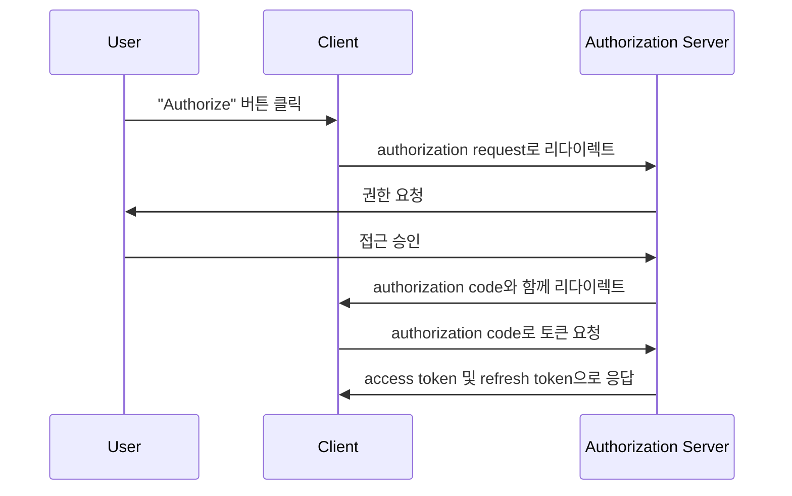
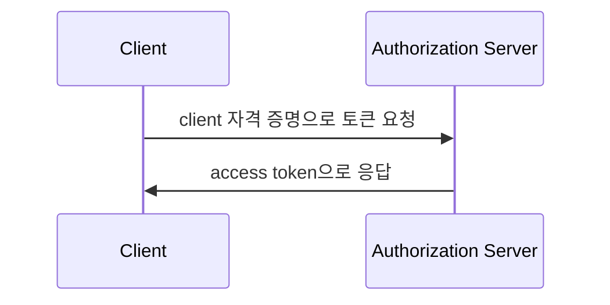

## 토큰 요청이란 무엇인가?

<Ref slug="oauth-2.0" /> 및 <Ref slug="openid-connect" />에서 토큰 요청은 자격 증명(예: authorization code, refresh token)을 토큰 세트와 교환하기 위한 <Ref slug="authorization-server" /> (OIDC에서는 <Ref slug="openid-connect" headingId="openid-provider-op" />)에 대한 요청입니다. 토큰 세트에는 일반적으로 다음 중 하나 이상이 포함됩니다:

- <Ref slug="access-token" />: 보호된 자원에 대한 접근 권한을 부여하는 토큰.
- <Ref slug="id-token" />: 사용자 정보를 포함하는 토큰 (OIDC 전용).
- <Ref slug="refresh-token" />: 사용자 상호 작용 없이 새 access token을 얻기 위해 사용할 수 있는 토큰.

사용된 <Ref slug="oauth-2.0-grant">grant 타입</Ref>에 따라 요청은 다양한 매개변수를 포함하고 다양한 토큰을 반환할 수 있습니다.

예를 들어, <Ref slug="client-credentials-flow" />에서는 <Ref slug="client" />가 client 자격 증명을 사용하여 직접 <Ref slug="access-token" />을 요청합니다. 다음은 토큰 요청의 비표준 예시입니다:

```http
POST /token HTTP/1.1
Host: authorization-server.example.com
Content-Type: application/x-www-form-urlencoded

grant_type=client_credentials
  &client_id=client-id
  &client_secret=client-secret
  &scope=read
```

요청이 성공하면 authorization server는 access token으로 응답합니다:

```http
HTTP/1.1 200 OK
Content-Type: application/json

{
  "access_token": "eyJhbGci...zHg",
  "token_type": "Bearer",
  "expires_in": 3600,
  "scope": "read"
}
```

## 토큰 요청은 어떻게 작동하는가?

위의 예시에서 보듯이, 토큰 요청 자체는 간단합니다. 클라이언트는 필요한 매개변수와 함께 authorization server의 토큰 엔드포인트로 HTTP 요청을 보냅니다. authorization server는 요청을 검증하고 처리한 후 응답으로 토큰을 반환합니다.

하지만 사용된 특정 grant 타입(플로우)에 따라 토큰 요청이 더 많은 준비를 필요로 할 수 있습니다.

### Authorization code flow

<Ref slug="authorization-code-flow" />에서 클라이언트는 먼저 authorization server와 <Ref slug="authorization-request" /> (OIDC에서는 <Ref slug="authentication-request" />)를 시작하여 authorization code를 얻습니다. 사용자가 권한을 부여하면 클라이언트는 토큰 요청을 통해 authorization code를 access token 및 선택적으로 refresh token으로 교환합니다.

다음은 authorization code flow의 단순화된 순서도입니다:



### Client credentials flow

첫 번째 섹션의 예시에서 보듯이, <Ref slug="client-credentials-flow" />는 훨씬 간단합니다. 클라이언트는 client 자격 증명을 사용하여 직접 access token을 요청합니다. authorization server는 client 자격 증명을 검증하고 성공 시 access token을 발급합니다.

다음은 client credentials flow의 비표준 순서도입니다:



### 리프레시 토큰

일부 grant 타입에서는 클라이언트가 authorization 요청에 `offline_access` scope를 포함하여 <Ref slug="offline-access" />를 요청할 수 있습니다. 만약 승인된다면, authorization server는 access token과 함께 refresh token을 발급합니다. 클라이언트는 refresh token을 사용하여 사용자 상호 작용 없이 토큰 요청을 통해 새 access token을 얻을 수 있습니다.

다음은 새 access token을 얻기 위해 refresh token을 사용하는 비정상적인 예시입니다:

```http
POST /token HTTP/1.1
Host: authorization-server.example.com
Content-Type: application/x-www-form-urlencoded

grant_type=refresh_token
  &refresh_token=refresh-token
  &client_id=client-id
  &client_secret=client-secret
```

---

다른 <Ref slug="oauth-2.0-grant">grant 타입들</Ref>도 토큰 요청을 포함할 수 있지만 기본적인 아이디어는 동일합니다.

## 토큰 요청의 주요 매개변수

다음은 토큰 요청에서 일반적으로 사용되는 주요 매개변수들입니다:

- **`grant_type`**: 요청되는 grant의 타입. 일반적인 값으로는 `authorization_code`, `client_credentials`, `refresh_token` 등이 있습니다.
- **`client_id`**: authorization server가 발급한 클라이언트 식별자.
- **`client_secret`**: authorization server가 발급한 클라이언트 비밀 (기밀 클라이언트의 경우).
- **`code`**: authorization code flow용으로 authorization server에서 얻은 code.
- **`refresh_token`**: access token을 갱신하기 위한 authorization server에서 얻은 refresh token.
- **`scope`**: access token을 위한 요청된 <Ref slug="scope">scopes</Ref> (권한들).
- **`redirect_uri`**: authorization code flow에서 authorization server가 응답을 보내는 URI.
- **`code_verifier`**: <Ref slug="pkce" /> 확장에서 사용되는 코드 검증기 (authorization code flow 용).

토큰 요청에 대한 실제 매개변수와 그 값은 grant 타입 및 애플리케이션의 특정 요구 사항에 따라 달라집니다. 토큰 요청을 하기 전에 사용 중인 특정 grant 타입에 대한 매개변수 전체 목록을 참조해야 합니다.

<SeeAlso slugs={["oauth-2.0", "openid-connect", "authorization-request", "authentication-request"]} />
