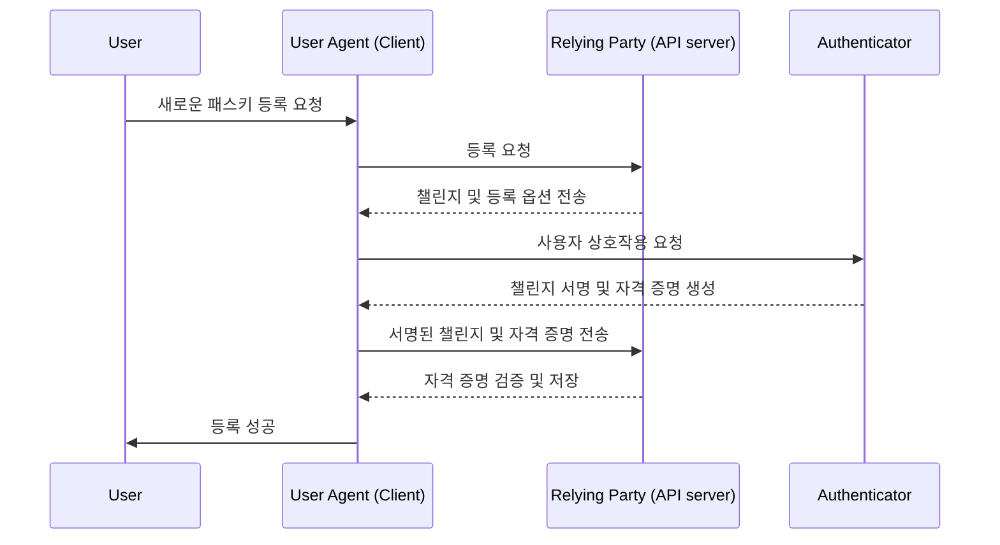
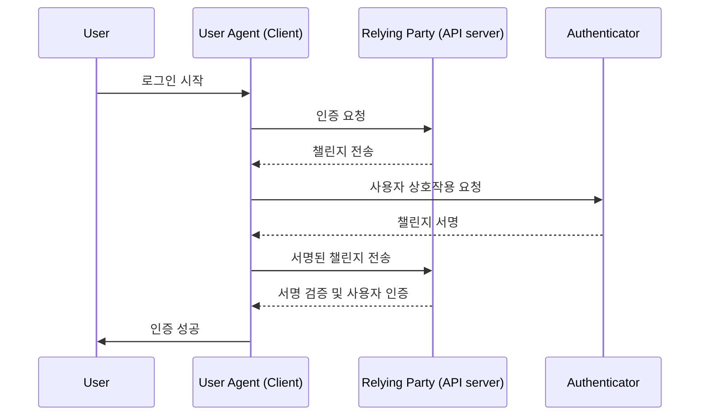

## WebAuthn이란 무엇인가?

WebAuthn (Web Authentication API)은 [W3C](https://www.w3.org/)와 [FIDO Alliance](https://fidoalliance.org/)가 개발한 FIDO2 표준을 사용한 안전한 웹 인증을 위한 명세입니다. WebAuthn은 웹사이트가 공개 키 암호화로 보호된 피싱 저항 자격 증명인 <Ref slug="passkey" />를 구현할 수 있도록 API를 제공합니다. 패스키는 비밀번호 없는 로그인과 <Ref slug="mfa" /> 모두에 대해 비밀번호를 대체할 수 있습니다.

## WebAuthn 워크플로우는 어떻게 생겼나요?

더 잘 이해하기 위해 실제 예를 들어보겠습니다. 당신은 다중 요소 인증을 위한 패스키를 구현하기 위해 WebAuthn API를 통합하고자 하는 웹 애플리케이션 MyApp을 가지고 있습니다.

**등록 단계:** 이메일 확인과 새 비밀번호 설정 후, 사용자는 패스키를 생성하라는 메시지를 받습니다. 그들은 지문을 사용하여 자신의 장치를 연결하기로 선택합니다. 이는 그들의 장치에 패스키를 안전하게 설정합니다.

**인증 단계:** 다음 로그인 시, 사용자는 비밀번호를 입력한 후 패스키를 확인하라는 요청을 받습니다. 간단한 지문 스캔만으로 쉽게 인증 과정을 완료할 수 있습니다.


더 자세한 설명을 제공하기 위해, 우리는 이 과정을 등록과 인증의 두 단계로 나눌 수 있습니다. 먼저, WebAuthn 흐름에 관련된 네 가지 주요 엔티티를 이해하는 것이 중요합니다.

### 4개의 주요 엔티티

1. **사용자:** 웹 애플리케이션에 접근하려는 개인.
2. **사용자 에이전트:** WebAuthn API 호출을 처리하고 사용자, 신뢰 당사자, 인증자 간의 인증 과정을 관리하는 웹 브라우저.
3. **신뢰 당사자:** 사용자가 접근하려는 서비스, 애플리케이션 또는 API 서버.
4. **인증자:** 사용자의 신원을 확인하는 데 사용되는 하드웨어 또는 소프트웨어 구성 요소. 이는 플랫폼이나 브라우저 기능에 따라 보안 키(예: Yubikeys), 전화기 또는 태블릿(블루투스, NFC 또는 USB로 연결), 장치 기반 생체 인식 또는 PIN 등 다양한 형태를 취할 수 있습니다.

### WebAuthn 등록

비대칭 공개 키 암호화가 핵심 과정입니다.

1. **키 쌍 생성:** 
사용자 에이전트가 공개-비공개 키 쌍을 생성합니다.
    - **공개 키:** 신뢰 당사자와 공유됩니다.
    - **비공개 키:** 사용자의 인증자에 안전하게 저장됩니다.
2. **등록 챌린지:** 
사용자가 패스키를 등록하려고 할 때, 신뢰 당사자는 사용자 에이전트에 등록 챌린지를 보냅니다.
3. **사용자 확인:** 
사용자 에이전트는 챌린지를 인증자에게 전달하고, 인증자는 사용자에게 확인을 요청합니다(예: 생체 인증 또는 하드웨어 보안 키).
4. **암호화 서명:** 
인증자는 자신의 비공개 키를 사용하여 챌린지를 서명하고 암호화 서명을 생성합니다.
5. **검증 및 접근:** 
사용자 에이전트는 서명된 챌린지를 신뢰 당사자에게 다시 보내고, 신뢰 당사자는 공개 키를 사용하여 서명을 검증하고 등록 과정을 완료합니다.



### WebAuthn 인증

1. **인증 챌린지:**
사용자가 로그인하려고 할 때, 신뢰 당사자는 사용자 에이전트에 인증 챌린지를 보냅니다.
2. **사용자 확인:**
사용자 에이전트는 챌린지를 인증자에게 보내고, 인증자는 사용자에게 확인을 요청합니다(예: 생체 인증 또는 하드웨어 보안 키).
3. **암호화 서명:**
인증자는 자신의 비공개 키를 사용하여 챌린지를 서명하고 암호화 서명을 생성합니다.
4. **검증 및 접근:**
사용자 에이전트는 공개 키를 사용하여 서명을 검증하고 신뢰 당사자에게 성공적인 인증을 알립니다. 검증이 성공하면 접근이 허용됩니다.



## WebAuthn을 어떻게 사용하나요?

WebAuthn API는 패스키 로그인 또는 2단계 인증을 구현하는 데 사용할 수 있습니다. 패스키 경험에 대한 자세한 내용을 참조하세요.

안전한 인증을 위한 Web Authentication API (WebAuthn)를 사용하려면 등록과 인증의 두 가지 주요 과정을 처리해야 합니다. 다음은 JavaScript를 사용하여 이러한 과정을 구현하는 방법에 대한 간단한 코드 예제입니다.

**등록**

신뢰 당사자(웹 애플리케이션)는 `navigator.credentials.create()` 메서드를 호출하여 등록 과정을 시작합니다.

```jsx
// 등록
navigator.credentials.create({
  publicKey: {
    rp: {
      name: "Your Relying Party Name",
      id: "your-relying-party-id"
    },
    user: {
      id: "user-id",
      displayName: "User Name",
      name: "User Name"
    },
    challenge: "your-challenge-value",
    timeout: 60000 // 60초
  }
}).then(credential => {
  // 미래 인증을 위해 자격 증명의 id를 저장
  localStorage.setItem("credentialId", credential.id);
}).catch(error => {
  console.error("등록 오류:", error);
});
```

신뢰 당사자는 `navigator.credentials.get()` 메서드를 호출하여 인증 과정을 시작합니다.

```jsx
// 인증
navigator.credentials.get({
  publicKey: {
    rp: {
      name: "Your Relying Party Name",
      id: "your-relying-party-id"
    },
    challenge: "your-challenge-value",
    timeout: 60000 // 60초
  }
}).then(credential => {
  // 자격 증명의 id 및 기타 속성 검증
  if (credential.id === localStorage.getItem("credentialId")) {
    // 인증 성공
    console.log("사용자 인증 성공");
  } else {
    console.error("유효하지 않은 자격 증명");
  }
}).catch(error => {
  console.error("인증 오류:", error);
});
```

자세한 내용을 배우려면 사양을 읽어보세요: https://fidoalliance.org/specifications/download/.

참고: WebAuthn 작업에서는 등록이든 인증이든 "rp ID" (신뢰 당사자 ID)가 필수 필드입니다. 이는 현재 웹 페이지의 도메인 호스트명을 나타냅니다. 현재 도메인과 일치하지 않으면 브라우저가 요청을 거부합니다. 이는 패스키가 특정 도메인에 묶여 있으며, 현재로서는 기존 패스키를 다른 도메인으로 이전할 방법이 없음을 의미합니다. 또한, 패스키는 다른 도메인 간에 사용할 수 없습니다.

## WebAuth와 OpenID Connect (OIDC)

WebAuthn의 강력한 보안과 OIDC의 표준화된 아이덴티티 프로토콜을 결합함으로써 더 안전하고 사용자 친화적인 인증 경험을 만들 수 있습니다.

작동 방식에 대해 알아보세요:

- **등록 단계**: 사용자는 표준 <Ref slug="openid-connect" /> 등록 과정을 완료합니다(예: 이메일 확인 및 비밀번호 생성). WebAuthn은 공개-비공개 키 쌍을 생성하고, 공개 키를 OIDC <Ref slug="identity-provider" />에 저장하며 비공개 키는 사용자의 장치에 보관합니다.
- **인증 단계**: 사용자는 OIDC로 보호된 리소스에 접근하고 로그인 페이지로 리디렉션됩니다. 기본 자격 증명(예: 이메일 및 비밀번호)을 제공한 후, 시스템은 패스키 인증을 위해 WebAuthn을 호출합니다. 패스키가 확인되면, OIDC는 사용자 접근을 위한 Access Token 또는 ID Token을 발급합니다.

## WebAuthn과 CTAP2의 차이점은 무엇인가요?

**WebAuthn**과 **CTAP2**는 모두 FIDO2 표준의 필수 구성 요소이지만, 서로 다른 목적을 가지고 있습니다:

- **CTAP2 (Client to Authenticator Protocol 2):** 이 프로토콜은 보안 키나 스마트폰과 같은 장치가 웹 애플리케이션과 통신하는 방법을 정의합니다. 이는 **인증자**와 **사용자 장치** 간의 안전한 채널을 설정하여 민감한 인증 데이터를 보호합니다.
- **WebAuthn (Web Authentication API):** 이 API는 웹 애플리케이션이 CTAP2 호환 인증자와 상호작용할 수 있는 표준화된 방법을 제공합니다. 이는 인증 과정을 처리하며, **사용자 장치**와 **신뢰 당사자** 간의 인증 데이터 교환을 포함합니다.

<SeeAlso slugs={["passkey", "mfa", "openid-connect"]} />

<Resources
  urls={[
    "https://fidoalliance.org/specs/fido-v2.0-id-20180227/fido-client-to-authenticator-protocol-v2.0-id-20180227.html",
    "https://blog.logto.io/webauthn-nextjs",
    "https://blog.logto.io/webauthn-base-knowledge"
  ]}
/>