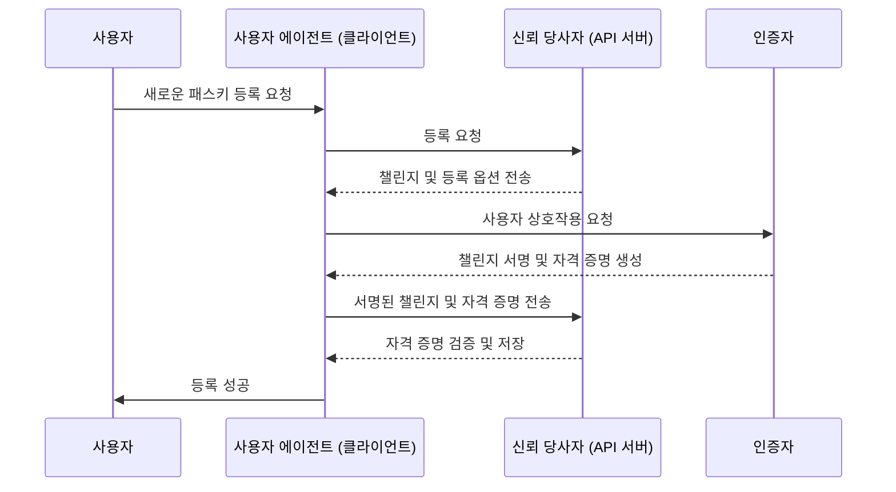
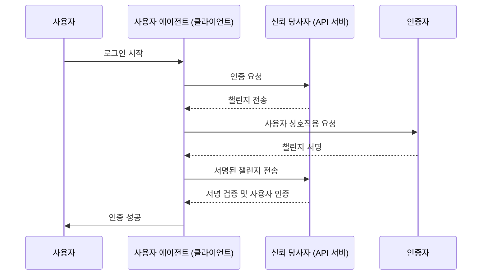

## WebAuthn이란 무엇인가?

WebAuthn (Web Authentication API, 웹 인증 API)은 [W3C](https://www.w3.org/)와 [FIDO Alliance](https://fidoalliance.org/)에 의해 개발된 FIDO2 표준을 사용하는 안전한 웹 인증을 위한 규격입니다. WebAuthn는 웹사이트가 공개 키 암호화로 보호된 피싱 저항 자격 증명인 <Ref slug="passkey" />를 구현할 수 있는 API를 제공합니다. 패스키는 비밀번호 없는 로그인 및 다중 요소 인증 (MFA) 모두에서 비밀번호를 대체할 수 있습니다.

## WebAuthn 워크플로우는 어떻게 생겼나?

더 자세한 설명을 위해 이 과정을 등록과 인증이라는 두 단계로 나눌 수 있습니다. 먼저 WebAuthn 흐름에 관련된 네 개의 주요 개체를 이해하는 것이 중요합니다.

### 4개의 주요 개체

1. **사용자:** 웹 애플리케이션에 액세스하려고 시도하는 개인.
2. **사용자 에이전트:** WebAuthn API 호출을 처리하고 사용자, 신뢰 당사자 및 인증자 간의 인증 프로세스를 관리하는 웹 브라우저.
3. **신뢰 당사자:** 사용자가 액세스하려는 서비스, 애플리케이션 또는 API 서버.
4. **인증자:** 사용자의 신원을 확인하는 데 사용되는 하드웨어 또는 소프트웨어 구성 요소. 플랫폼 또는 브라우저 기능에 따라 보안 키(Yubikeys와 같은), 블루투스, NFC 또는 USB로 연결된 전화기 또는 태블릿, 디바이스 기반의 바이오메트릭스 또는 PIN 등 다양한 형태를 취할 수 있습니다.

### WebAuthn 등록

비대칭 공개 키 암호화가 핵심 프로세스입니다.

1. **키 쌍 생성:**
사용자 에이전트는 공개-비공개 키 쌍을 생성합니다.
    - **공개 키:** 신뢰 당사자와 공유됩니다.
    - **비공개 키:** 사용자의 인증자에 안전하게 저장됩니다.
2. **등록 챌린지:**
사용자가 패스키를 등록하려고 할 때, 신뢰 당사자는 사용자 에이전트에게 등록 챌린지를 보냅니다.
3. **사용자 확인:**
사용자 에이전트는 챌린지를 인증자에게 전달하고, 인증자는 사용자의 확인을 요청합니다(예: 바이오메트릭 인증 또는 하드웨어 보안 키).
4. **암호화 서명:**
인증자는 자신의 비공개 키를 사용해 챌린지에 서명하여 암호화 서명을 만듭니다.
5. **검증 및 접근:**
사용자 에이전트는 서명된 챌린지를 신뢰 당사자에게 보내고, 신뢰 당사자는 공개 키를 사용하여 서명을 확인한 후 등록 프로세스를 완료합니다.



### WebAuthn 인증

1. **인증 챌린지:**
사용자가 로그인하려고 할 때, 신뢰 당사자는 사용자 에이전트에게 인증 챌린지를 보냅니다.
2. **사용자 확인:**
사용자 에이전트는 챌린지를 인증자에게 보내어 사용자의 확인을 요청합니다(예: 바이오메트릭 인증 또는 하드웨어 보안 키).
3. **암호화 서명:**
인증자는 자신의 비공개 키를 사용해 챌린지에 서명하여 암호화 서명을 만듭니다.
4. **검증 및 접근:**
사용자 에이전트는 공개 키를 사용해 서명을 검증하고 신뢰 당사자에게 성공적인 인증을 알립니다. 검증이 성공하면 접근이 허용됩니다.



## WebAuthn을 어떻게 사용할까?

WebAuthn API는 패스키 로그인 또는 2단계 확인을 구현하는 데 사용할 수 있습니다. 패스키 경험에 대한 더 많은 정보를 참조하세요.

안전한 인증을 위해 Web Authentication API (WebAuthn)를 사용하려면 두 가지 주요 프로세스, 즉 등록과 인증을 처리해야 합니다. 다음은 JavaScript를 사용하여 이러한 프로세스를 구현하는 간단한 코드 예제입니다.

**등록**

신뢰 당사자(귀하의 웹 애플리케이션)는 `navigator.credentials.create()` 메서드를 호출하여 등록 프로세스를 시작합니다.

```jsx
// Registration
navigator.credentials.create({
  publicKey: {
    rp: {
      name: "Your Relying Party Name",
      id: "your-relying-party-id"
    },
    user: {
      id: "user-id",
      displayName: "User Name",
      name: "User Name"
    },
    challenge: "your-challenge-value",
    timeout: 60000 // 60 seconds
  }
}).then(credential => {
  // Store the credential's id for future authentication
  localStorage.setItem("credentialId", credential.id);
}).catch(error => {
  console.error("Registration error:", error);
});
```

신뢰 당사자는 `navigator.credentials.get()` 메서드를 호출하여 인증 프로세스를 시작합니다.

```jsx
// Authentication
navigator.credentials.get({
  publicKey: {
    rp: {
      name: "Your Relying Party Name",
      id: "your-relying-party-id"
    },
    challenge: "your-challenge-value",
    timeout: 60000 // 60 seconds
  }
}).then(credential => {
  // Verify the credential's id and other properties
  if (credential.id === localStorage.getItem("credentialId")) {
    // Authentication successful
    console.log("User authenticated successfully");
  } else {
    console.error("Invalid credential");
  }
}).catch(error => {
  console.error("Authentication error:", error);
});
```

자세한 내용을 알고 싶다면 사양을 읽어보세요: https://fidoalliance.org/specifications/download/.

참고: WebAuthn 작업에서 등록 또는 인증 여부에 관계없이 "rp ID" (신뢰 당사자 ID)는 필수 필드입니다. 이는 현재 웹 페이지의 도메인 호스트명을 나타냅니다. 현재 도메인과 일치하지 않으면 브라우저가 요청을 거부합니다. 이는 패스키가 특정 도메인에 묶여 있으며, 현재로서는 기존 패스키를 다른 도메인으로 이전하는 방법이 없음을 의미합니다. 또한 패스키는 다른 도메인 간에 사용할 수 없습니다.

## WebAuthn과 CTAP2의 차이점은 무엇인가?

**WebAuthn**과 **CTAP2**는 FIDO2 표준의 필수 구성 요소이지만, 서로 다른 목적을 가지고 있습니다:

- **CTAP2 (Client to Authenticator Protocol 2, 클라이언트-인증자 프로토콜 2):** 이 프로토콜은 보안 키 또는 스마트폰과 같은 장치가 웹 애플리케이션과 통신하는 방법을 정의합니다. 이는 **인증자**와 **사용자 디바이스** 간에 안전한 채널을 설정하여 민감한 인증 데이터를 보호합니다.
- **WebAuthn (Web Authentication API, 웹 인증 API):** 이 API는 웹 애플리케이션이 CTAP2 준수 인증자와 상호 작용할 수 있는 표준화된 방법을 제공합니다. 이는 **사용자 디바이스**와 **신뢰 당사자** 간의 인증 데이터 교환을 포함하여 인증 프로세스를 처리합니다.

## 알아야 할 용어들

- <Ref slug="passkey" />
- FIDO
- FIDO2
- CTAP2
- MFA
- 인증자

<Resources
  urls={[
    "https://fidoalliance.org/specs/fido-v2.0-id-20180227/fido-client-to-authenticator-protocol-v2.0-id-20180227.html",
    "https://blog.logto.io/webauthn-nextjs",
    "https://blog.logto.io/webauthn-base-knowledge"
  ]}
/>