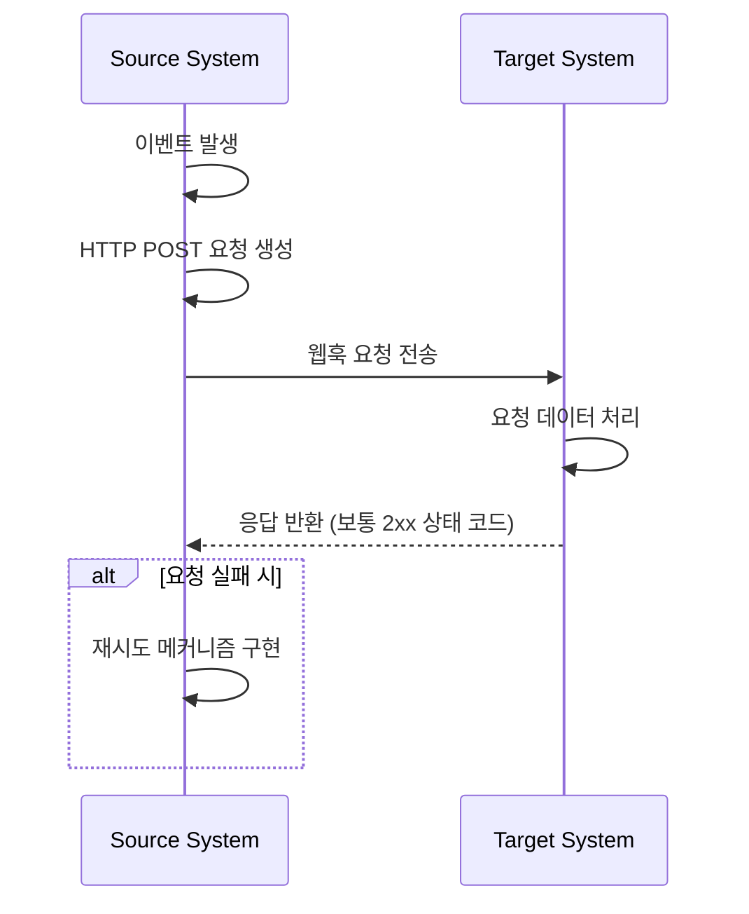
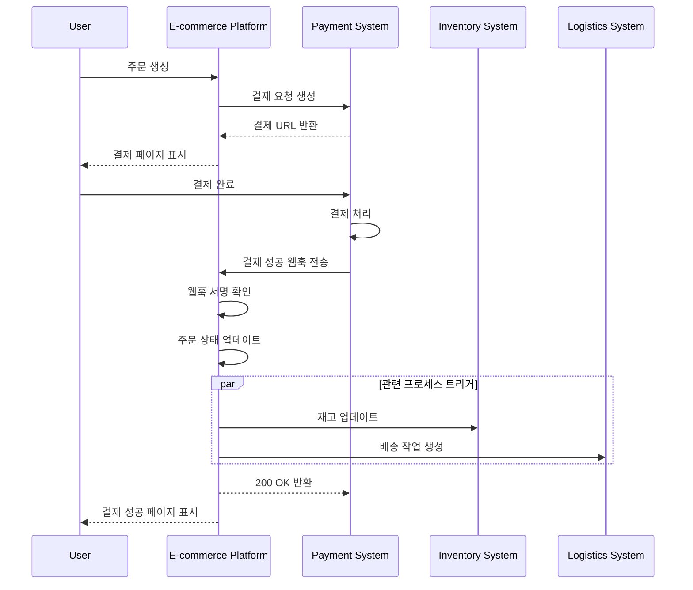

## 웹훅 (Webhook)이란 무엇인가?

웹훅 (Webhook)은 특정 이벤트가 발생할 때 애플리케이션이 미리 정의된 URL로 실시간 알림을 보낼 수 있는 HTTP 콜백 메커니즘입니다. 이 메커니즘은 시스템 간 자동 데이터 교환과 실시간 소통을 가능하게 합니다.

## 웹훅 (Webhook)은 어떻게 작동하나요?



1. 소스 시스템에서 특정 이벤트가 발생합니다.
2. 소스 시스템은 이벤트 데이터를 포함한 HTTP POST 요청을 생성합니다.
3. 소스 시스템은 사전 구성된 대상 시스템 URL로 요청을 보냅니다.
4. 대상 시스템은 요청을 수신하고 데이터를 처리합니다.
5. 대상 시스템은 소스 시스템에 응답을 반환합니다.
6. 요청이 실패하면 소스 시스템이 재시도 메커니즘을 구현할 수 있습니다.

## 웹훅 (Webhook)의 일반적인 사용 사례는 무엇인가요?

1. 결제 시스템: 주문 상태 변경 알림
2. 버전 관리 시스템: 코드 커밋, 병합 요청 및 기타 이벤트 알림
3. CRM 시스템: 고객 정보 업데이트 알림
4. IoT 장치: 장치 상태 변경 알림
5. 소셜 미디어 플랫폼: 새로운 메시지 및 댓글 알림

## 실제 세계 시나리오에서 웹훅 (Webhook)은 어떻게 작동하나요?

서드파티 결제 시스템과 통합된 전자 상거래 플랫폼을 다루는 시나리오를 살펴보겠습니다:

### 시나리오

전자 상거래 플랫폼은 주문 결제를 처리하기 위해 서드파티 결제 시스템을 사용합니다. 사용자가 결제를 완료하면, 결제 시스템은 설정된 웹훅 (Webhook)을 통해 결제 상태를 전자 상거래 플랫폼에 실시간으로 알릴 필요가 있습니다. 이를 통해 플랫폼은 주문 상태를 업데이트하고 관련 프로세스를 트리거할 수 있습니다.

### 웹훅 (Webhook) 구현 흐름



1. 주문 생성 및 결제 요청:
   - 사용자가 전자 상거래 플랫폼에서 주문을 생성합니다.
   - 플랫폼은 결제 시스템에 결제 요청을 보냅니다.
   - 결제 시스템은 결제 URL을 반환하고, 플랫폼은 이를 사용자에게 표시합니다.

2. 사용자 결제:
   - 사용자는 결제 시스템에서 결제를 완료합니다.

3. 웹훅 트리거:
   - 결제 시스템이 "결제 성공" 이벤트를 감지합니다.
   - 결제 세부 정보를 포함한 웹훅 페이로드를 생성합니다.

4. 웹훅 전송:
   - 결제 시스템은 사전 구성된 전자 상거래 플랫폼의 URL로 POST 요청을 보냅니다.

5. 수신 처리:
   - 전자 상거래 플랫폼은 웹훅을 수신하고, 먼저 요청 서명을 확인하여 보안을 보장합니다.
   - 확인 후, 관련 주문 상태를 "결제 완료"로 업데이트합니다.
   - 플랫폼은 재고 업데이트 및 배송 작업 생성과 같은 후속 프로세스를 트리거합니다.

6. 응답 처리:
   - 전자 상거래 플랫폼은 웹훅 수신 시 즉시 200 OK 응답을 반환합니다.
   - 처리 중 오류가 발생하면, 플랫폼은 백그라운드에서 재시도를 하거나 수동 개입을 진행합니다.

7. 사용자 경험:
   - 전자 상거래 플랫폼은 사용자에게 결제 완료 페이지를 표시합니다.

이 예시는 웹훅을 통해 서드파티 결제 시스템과 전자 상거래 플랫폼 간의 실시간 소통이 어떻게 이루어지는지를 보여줍니다. 웹훅을 통해 결제 시스템은 결제 완료 시점을 전자 상거래 플랫폼에 즉시 알릴 수 있으며, 이를 통해 주문 상태의 즉각적 업데이트와 빠른 후속 비즈니스 프로세스 트리거가 가능합니다. 이는 전체 시스템의 응답성과 효율성을 향상시켜 궁극적으로 사용자에게 더 나은 쇼핑 경험을 제공합니다.

## 웹훅 (Webhook) 구현을 위한 베스트 프랙티스는 무엇인가요?

웹훅을 보내는 측 (생산자)일 경우 다음 사항을 고려하십시오:

### 웹훅 설계

명확하고 일관된 웹훅 구조를 설계하십시오:

- 명확한 이벤트 타입 정의: 예를 들어 `order.created`, `user.updated` 등.
- 표준 JSON 형식 사용: 데이터 구조가 명확하고 파싱이 쉬워야 합니다.
- 버전 관리: 요청 헤더나 페이로드에 버전 정보를 포함하십시오. 예를 들어:

  ```javascript
  // 요청 헤더에서
  headers: {
    'Content-Type': 'application/json',
    'X-Webhook-Version': '1.0'
  }
  
  // 또는 페이로드에서
  {
    "version": "1.0",
    "event_type": "order.created",
    "data": {
      // 이벤트 세부 사항
    }
  }
  ```

- 충분한 문맥 제공: 이벤트가 발생한 시점의 타임스탬프, 관련 리소스의 고유 식별자 등을 포함하십시오.
- 일관성 유지: 모든 이벤트 타입에 대해 일관된 명명 규칙과 데이터 구조를 사용하십시오.

### 전송 메커니즘

신뢰할 수 있는 웹훅 전송 메커니즘을 구현하십시오:

- 비동기 작업 큐 사용: 메인 프로그램을 차단하지 않고 시스템 응답성을 향상시킵니다.
- 재시도 메커니즘 구현: 네트워크 장애나 수신자 일시적 부재를 처리합니다.

### 재시도 전략

적절한 재시도 전략을 설계하십시오:

- 지수 백오프 구현: 시스템과 수신자에 부담을 줄 수 있는 빈번한 재시도를 피하십시오.
- 최대 재시도 횟수 설정: 무한 재시도로 시스템 자원이 소모되지 않도록 합니다.
- 수동 재시도 메커니즘 제공: 궁극적으로 실패한 웹훅에 대한 수동 재시도를 위한 인터페이스를 제공합니다.

### 보안 구현

수신자가 요청의 신뢰성을 확인할 수 있도록 서명 메커니즘을 구현하십시오:

```javascript
const crypto = require('crypto');

function generateSignature(payload, secret) {
  return crypto.createHmac('sha256', secret)
    .update(JSON.stringify(payload))
    .digest('hex');
}

function sendWebhookWithSignature(url, payload, secret) {
  const signature = generateSignature(payload, secret);
  return axios.post(url, payload, {
    headers: { 'X-Webhook-Signature': signature }
  });
}
```

### 성능 최적화

웹훅 전송 성능을 최적화하십시오:

- 연결 풀 사용: 연결 설정의 오버헤드를 줄이고 성능을 향상시킵니다.
- 배치 처리 구현: 네트워크 상호작용 수를 줄이기 위해 적절히 웹훅을 배치로 보냅니다.

### 문서와 테스트 도구

웹훅 사용자 지원:

- 상세 API 문서: 가능한 모든 이벤트 타입, 요청 형식 및 필드 설명을 포함합니다.
- 테스트 도구 제공: 사용자가 웹훅 알림 수신을 시뮬레이션할 수 있는 웹훅 테스트 엔드포인트를 구현하십시오.
- 샘플 코드: 다양한 프로그래밍 언어로 통합 예제를 제공합니다.

## 웹훅 (Webhook) 사용을 위한 베스트 프랙티스는 무엇인가요?

웹훅을 수신하는 측 (소비자)일 경우 다음 사항을 고려하십시오:

### 보안

웹훅 수신 끝점은 일반적으로 공개되어 있으므로 보안이 중요한 문제입니다. 다음 사항을 주의하십시오:

- 요청의 신뢰성 확인: 예상된 발신자에게서 요청이 왔는지 확인하기 위한 서명 확인 메커니즘을 구현하십시오.
  
  ```javascript
  const crypto = require('crypto');

  function verifySignature(payload, signature, secret) {
    const expectedSignature = crypto
      .createHmac('sha256', secret)
      .update(JSON.stringify(payload))
      .digest('hex');
    
    return crypto.timingSafeEqual(
      Buffer.from(signature),
      Buffer.from(expectedSignature)
    );
  }
  ```

- HTTPS 사용: 웹훅 수신 끝점이 HTTPS를 사용하여 데이터가 전송 중에 가로채이거나 변조되지 않도록 하십시오.
- IP 화이트리스트 구현: 신뢰할 수 있는 IP 주소에서만 웹훅 요청을 받아 공격의 위험을 줄이십시오.

### 신뢰성

수신된 웹훅을 신뢰성 있게 처리하기 위해:

- 멱등 처리 구현: 발신자가 실패한 요청을 재시도할 수 있으므로 중복된 웹훅 알림을 올바르게 처리하는 시스템을 설계하십시오.
- 즉시 응답: 웹훅 요청을 수신한 즉시 응답(보통 2xx 상태 코드)을 반환하여 발신자가 요청이 실패했다고 간주하고 재시도를 트리거하지 않도록 하십시오.

### 성능

효율적인 시스템 운영을 유지하기 위해:

- 비동기 처리: 웹훅을 수신한 후 응답을 차단하지 않고 실제 데이터 처리를 백그라운드에서 수행하십시오.
- 타임아웃 한도 설정: 시스템 성능에 영향을 미칠 수 있는 장기 작업을 방지하기 위해 웹훅 처리에 대한 합리적인 타임아웃 기간을 설정하십시오.

### 오류 처리

잠재적인 오류 상황을 적절히 처리하십시오:

- 로깅: 수신된 웹훅 요청과 처리 절차의 상세한 기록을 유지하여 문제 해결을 돕습니다.
- 우아한 악화: 웹훅을 처리할 수 없는 경우 적절한 오류 처리 메커니즘을 갖추어 시스템의 다른 부분에 영향을 주지 않도록 하십시오.

### 버전 호환성

웹훅 형식은 시간이 지남에 따라 변경될 수 있습니다:

- 버전 정보 처리: 웹훅 형식의 다른 버전을 처리할 준비를 하십시오. 버전 정보는 보통 URL이나 요청 헤더에 제공됩니다.
- 하위 호환성: 웹훅 처리 로직을 업데이트할 때, 이전 형식 버전에 대한 지원을 계속 유지하십시오.

### 모니터링

웹훅 수신과 처리 상황을 지속적으로 모니터링하십시오:

- 경고 설정: 비정상 상황(예: 높은 실패율이나 비정상적인 트래픽)에 대한 실시간 모니터링과 경고를 구현하십시오.
- 성능 메트릭: 웹훅 처리 성능 메트릭(응답 시간, 성공률 등)을 추적하십시오.

<Resources
  urls={[
    "https://docs.logto.io/docs/recipes/webhooks/",
    "https://docs.logto.io/docs/recipes/webhooks/securing-your-webhooks/",
    "https://en.wikipedia.org/wiki/Webhook"
  ]}
/>