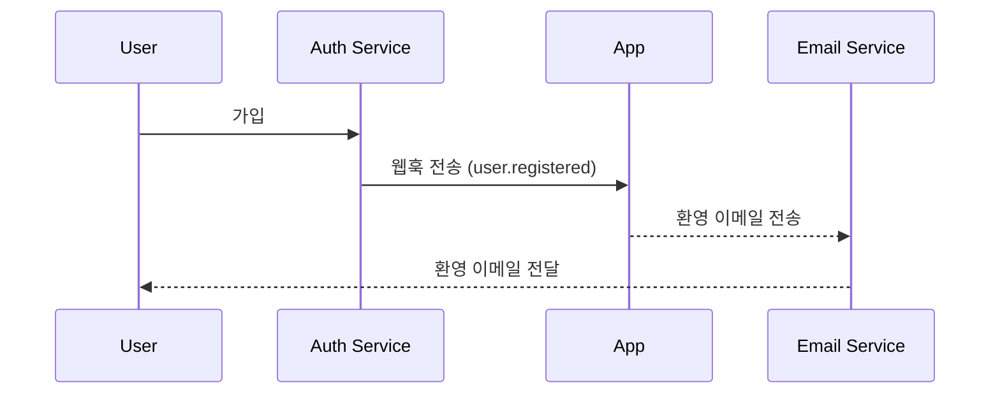

## 웹훅 (Webhook)이란 무엇인가?

웹훅 (Webhook)은 특정 이벤트가 발생할 때 애플리케이션이 미리 정의된 URL로 실시간 알림을 보낼 수 있는 HTTP 콜백 메커니즘입니다. 이 메커니즘은 시스템 간의 자동화된 데이터 교환과 실시간 통신을 가능하게 합니다.

## 웹훅 (Webhook)은 어떻게 작동하나요?


1. 소스 시스템에서 특정 이벤트가 발생합니다.
2. 소스 시스템은 이벤트 데이터를 포함한 HTTP POST 요청을 생성합니다.
3. 소스 시스템은 요청을 사전 구성된 대상 시스템 URL로 전송합니다.
4. 대상 시스템은 요청을 수신하고 데이터를 처리합니다.
5. 대상 시스템은 소스 시스템에 응답을 반환합니다.
6. 요청이 실패하면 소스 시스템은 재시도 메커니즘을 구현할 수 있습니다.

## 웹훅 (Webhook)이 실제 시나리오에서 어떻게 작동하나요?

인증 (auth) 서비스와 통합된 애플리케이션을 예로 들어보겠습니다. 새로운 사용자가 가입하면 애플리케이션은 사용자에게 환영 이메일을 보냅니다.

일반적으로, 인증 (auth) 서비스는 새로운 사용자가 등록을 완료할 때 트리거되는 `user.registered` 웹훅 이벤트를 제공합니다.

웹훅 이벤트 페이로드에는 이메일 및 사용자 이름과 같은 사용자의 정보가 포함되어 있으며, 이를 사용하여 환영 이메일을 보낼 수 있습니다:

```json
// 참고: 실제 페이로드 구조는 인증 (auth) 서비스에 따라 다릅니다.
{
  "event": "user.registered",
  "timestamp": "2024-03-21T08:00:00Z",
  "data": {
    "user_id": "u_1234567890",
    "email": "john@example.com",    // 환영 이메일을 보내기 위한 이메일 주소
    "username": "johndoe",          // 이메일을 개인화하기 위한 사용자 이름
    "registered_at": "2024-03-21T08:00:00Z"
  }
}
```

웹훅 흐름은 다음과 같이 작동합니다:



## 웹훅 (Webhook)을 구현하기 위한 모범 사례는 무엇인가요?

웹훅의 발신자 (생산자)일 때 다음 측면을 고려하세요:

### 웹훅 디자인

명확하고 일관된 웹훅 구조를 설계하세요:

- 명확한 이벤트 유형 정의: 예를 들어, `order.created`, `user.updated` 등.
- 표준 JSON 형식 사용: 데이터 구조가 명확하고 파싱하기 쉬운지 확인하세요.
- 버전 관리: 요청 헤더나 페이로드에 버전 정보를 포함하세요. 예를 들어:

  ```javascript
  // 요청 헤더에
  headers: {
    'Content-Type': 'application/json',
    'X-Webhook-Version': '1.0'
  }
  
  // 또는 페이로드에
  {
    "version": "1.0",
    "event_type": "order.created",
    "data": {
      // 이벤트 세부 정보
    }
  }
  ```

- 충분한 컨텍스트 제공: 이벤트가 발생한 타임스탬프, 관련 리소스의 고유 식별자 등을 포함하세요.
- 일관성 유지: 모든 이벤트 유형에 대해 일관된 명명 규칙과 데이터 구조를 사용하세요.

### 전송 메커니즘

신뢰할 수 있는 웹훅 전송 메커니즘을 구현하세요:

- 비동기 작업 큐 사용: 메인 프로그램을 차단하지 않고 시스템 응답성을 향상시킵니다.
- 재시도 메커니즘 구현: 네트워크 오류나 수신자의 일시적 비가용성을 처리합니다.

### 재시도 전략

적절한 재시도 전략을 설계하세요:

- 지수 백오프 구현: 시스템과 수신자에 부담을 주는 빈번한 재시도를 피하세요.
- 최대 재시도 횟수 설정: 무한 재시도로 인해 시스템 리소스가 소모되지 않도록 합니다.
- 수동 재시도 메커니즘 제공: 최종적으로 실패한 웹훅에 대해 수동 재시도를 위한 인터페이스를 제공합니다.

### 보안 구현

수신자가 요청의 진위를 확인할 수 있도록 서명 메커니즘을 구현하세요:

```javascript
const crypto = require('crypto');

function generateSignature(payload, secret) {
  return crypto.createHmac('sha256', secret)
    .update(JSON.stringify(payload))
    .digest('hex');
}

function sendWebhookWithSignature(url, payload, secret) {
  const signature = generateSignature(payload, secret);
  return axios.post(url, payload, {
    headers: { 'X-Webhook-Signature': signature }
  });
}
```

### 성능 최적화

웹훅 전송 성능을 최적화하세요:

- 연결 풀 사용: 연결 설정의 오버헤드를 줄이고 성능을 향상시킵니다.
- 배치 처리 구현: 적절할 때 웹훅을 배치로 전송하여 네트워크 상호작용 횟수를 줄입니다.

### 문서화 및 테스트 도구

웹훅 사용자에 대한 지원을 제공하세요:

- 상세한 API 문서: 가능한 모든 이벤트 유형, 요청 형식 및 필드 설명을 포함하세요.
- 테스트 도구 제공: 사용자가 웹훅 알림 수신을 시뮬레이션할 수 있도록 웹훅 테스트 엔드포인트를 구현하세요.
- 샘플 코드: 다양한 프로그래밍 언어로 통합 예제를 제공하세요.

## 웹훅 (Webhook)을 사용할 때의 모범 사례는 무엇인가요?

웹훅의 수신자 (소비자)일 때 다음 측면을 고려하세요:

### 보안

웹훅 수신 엔드포인트는 일반적으로 공개적으로 접근 가능하므로 보안이 주요 관심사입니다. 다음 사항에 주의하세요:

- 요청 진위 확인: 예상된 발신자로부터 요청이 왔는지 확인하기 위해 서명 확인 메커니즘을 구현하세요.
  
  ```javascript
  const crypto = require('crypto');

  function verifySignature(payload, signature, secret) {
    const expectedSignature = crypto
      .createHmac('sha256', secret)
      .update(JSON.stringify(payload))
      .digest('hex');
    
    return crypto.timingSafeEqual(
      Buffer.from(signature),
      Buffer.from(expectedSignature)
    );
  }
  ```

- HTTPS 사용: 웹훅 수신 엔드포인트가 HTTPS를 사용하여 전송 중 데이터가 가로채이거나 변조되지 않도록 하세요.
- IP 화이트리스트 구현: 신뢰할 수 있는 IP 주소에서만 웹훅 요청을 수락하여 공격 위험을 줄이세요.

### 신뢰성

수신된 웹훅을 신뢰성 있게 처리하려면:

- 멱등 처리 구현: 발신자가 실패한 요청을 재시도할 수 있으므로 중복 웹훅 알림을 올바르게 처리하도록 시스템을 설계하세요.
- 빠른 응답: 웹훅 요청을 수신한 후 즉시 응답(보통 2xx 상태 코드)을 반환하여 발신자가 요청이 실패했다고 간주하고 재시도를 트리거하지 않도록 하세요.

### 성능

효율적인 시스템 운영을 유지하세요:

- 비동기 처리: 웹훅을 수신한 후 실제 데이터 처리를 백그라운드에서 수행하여 응답을 차단하지 않도록 하세요.
- 타임아웃 제한 설정: 웹훅 처리를 위한 합리적인 타임아웃 기간을 설정하여 장기 실행 작업이 시스템 성능에 영향을 미치지 않도록 하세요.

### 오류 처리

잠재적인 오류 상황을 적절히 처리하세요:

- 로깅: 수신된 웹훅 요청 및 처리 절차에 대한 자세한 기록을 유지하여 문제 조사를 용이하게 하세요.
- 우아한 강등: 웹훅을 처리할 수 없는 경우 적절한 오류 처리 메커니즘을 갖추어 시스템의 다른 부분에 영향을 미치지 않도록 하세요.

### 버전 호환성

웹훅 형식은 시간이 지남에 따라 변경될 수 있으므로:

- 버전 정보 처리: 다양한 버전의 웹훅 형식을 처리할 준비를 하세요. 버전 정보는 보통 URL이나 요청 헤더에 제공됩니다.
- 하위 호환성: 웹훅 처리 로직을 업데이트할 때 이전 형식 버전에 대한 지원을 계속 제공하세요.

### 모니터링

웹훅의 수신 및 처리를 지속적으로 모니터링하세요:

- 알림 설정: 비정상적인 상황(예: 높은 실패율이나 비정상적인 트래픽)에 대한 실시간 모니터링 및 알림을 구현하세요.
- 성능 메트릭: 웹훅 처리의 성능 메트릭(예: 응답 시간 및 성공률)을 추적하세요.

<Resources
  urls={[
    "https://docs.logto.io/docs/recipes/webhooks/",
    "https://docs.logto.io/docs/recipes/webhooks/securing-your-webhooks/",
    "https://en.wikipedia.org/wiki/Webhook"
  ]}
/>