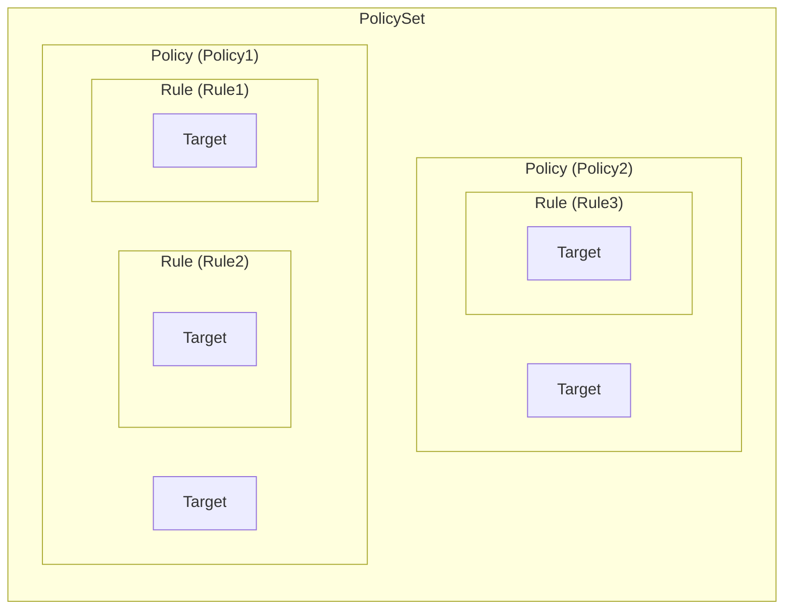
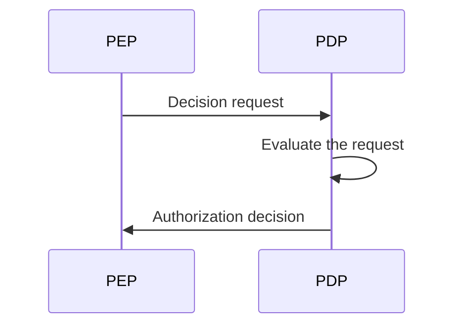
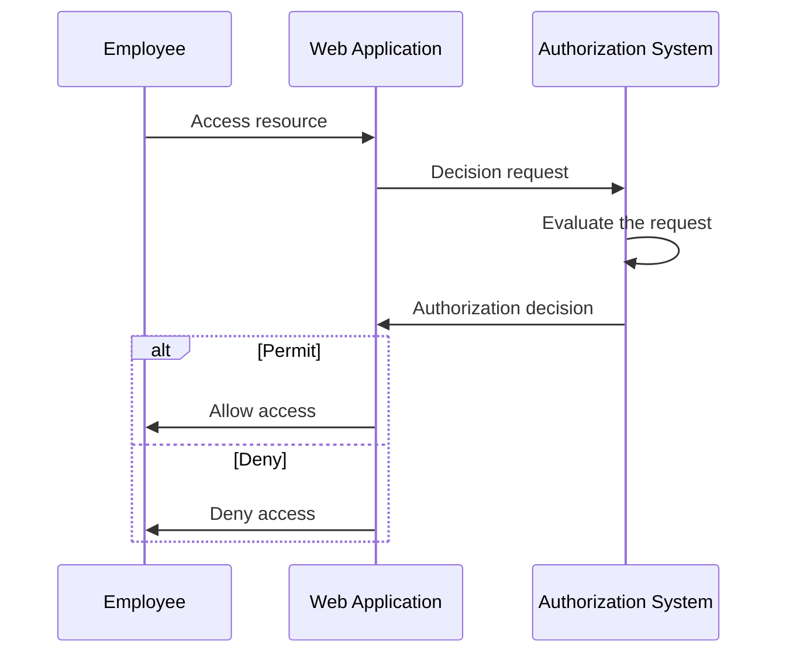
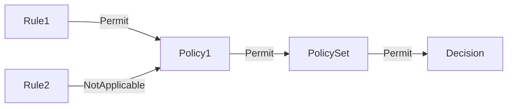
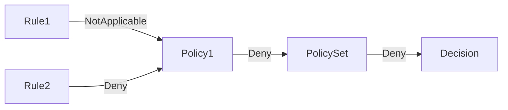
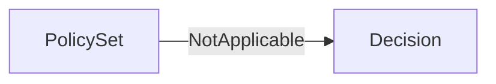

## XACML이란 무엇인가?

이름에서 알 수 있듯이, eXtensible Access Control Markup Language (XACML)은 주로 접근 제어를 위해 사용되는 XML 기반 언어입니다. 이는 구조화된 정보 기준 발전 기구 (OASIS)에 의해 정의된 표준입니다.

[XACML 3.0](https://docs.oasis-open.org/xacml/3.0/xacml-3.0-core-spec-os-en.html)은 2013년에 발표된 최신 버전의 표준입니다. 특정한 접근 제어 모델을 지정하지는 않지만, XACML은 종종 <Ref slug="abac" /> 정책을 구현하는 데 사용됩니다. XACML이 어떻게 abac 정책을 표현할 수 있는지 간단한 예를 살펴보겠습니다:

```xml
<PolicySet PolicySetId="ABAC_Policies" PolicyCombiningAlgId="urn:oasis:names:tc:xacml:3.0:policy-combining-algorithm:deny-overrides">
  <Description>ABAC Policies</Description>
  <Policy PolicyId="Policy1" RuleCombiningAlgId="urn:oasis:names:tc:xacml:3.0:rule-combining-algorithm:deny-overrides">
    <Description>Employees can read data</Description>
    <Target>
      <AnyOf>
        <AllOf>
          <Match MatchId="urn:oasis:names:tc:xacml:1.0:function:string-equal">
            <AttributeValue DataType="http://www.w3.org/2001/XMLSchema#string">read</AttributeValue>
            <AttributeDesignator
              AttributeId="urn:oasis:names:tc:xacml:1.0:action:action-id"
              Category="urn:oasis:names:tc:xacml:3.0:attribute-category:action"
              DataType="http://www.w3.org/2001/XMLSchema#string"
              MustBePresent="true"
            />
          </Match>
        </AllOf>
      </AnyOf>
    </Target>
    <Rule RuleId="Rule1" Effect="Permit">
      <Target>
        <AnyOf>
          <AllOf>
            <Match MatchId="urn:oasis:names:tc:xacml:1.0:function:string-equal">
              <AttributeValue DataType="http://www.w3.org/2001/XMLSchema#string">employee</AttributeValue>
              <AttributeDesignator
                AttributeId="urn:oasis:names:tc:xacml:1.0:subject:subject-id"
                Category="urn:oasis:names:tc:xacml:1.0:subject-category:access-subject"
                DataType="http://www.w3.org/2001/XMLSchema#string"
                MustBePresent="true"
              />
            </Match>
          </AllOf>
        </AnyOf>
      </Target>
    </Rule>
    <Rule RuleId="Rule2" Effect="Deny">
      <Target>
        <AnyOf>
          <AllOf>
            <Match MatchId="urn:oasis:names:tc:xacml:1.0:function:string-equal">
              <AttributeValue DataType="http://www.w3.org/2001/XMLSchema#string">user</AttributeValue>
              <AttributeDesignator
                AttributeId="urn:oasis:names:tc:xacml:1.0:subject:subject-id"
                Category="urn:oasis:names:tc:xacml:1.0:subject-category:access-subject"
                DataType="http://www.w3.org/2001/XMLSchema#string"
                MustBePresent="true"
              />
            </Match>
          </AllOf>
        </AnyOf>
      </Target>
    </Rule>
  </Policy>
  <!-- ...other policies... -->
</PolicySet>
```

XACML은 자기 설명적인 명명 규칙을 잘 따릅니다. 이 언어는 사람이 읽기 쉽고 이해하기 쉽게 설계되었습니다.

간단히 말해서, 이 정책은 직원들이 데이터를 읽을 수 있도록 하고, 사용자들이 데이터를 읽는 것을 거부하는 것입니다. 주요 구성 요소를 분석하여 정책을 분해해 보겠습니다:

- `<PolicySet>`: 정책 집합의 루트 요소입니다. `PolicySet`은 여러 `Policy` 및 `PolicySet` 요소를 포함할 수 있으며, 이는 정책의 계층 구조를 형성합니다.
- `<Policy>`: 하나 이상의 규칙을 포함하는 정책입니다. 각 정책은 다음을 포함할 수 있습니다:
  - 정책이 적용되는 조건을 지정하는 `Target` 요소.
  - 접근 제어 규칙을 정의하는 여러 `Rule` 요소.
  - 규칙을 결합하여 결정을 내리는 방법을 지정하는 `RuleCombiningAlgId` 속성.
- `<Rule>`: 접근 허용 또는 거부 조건을 정의하는 규칙입니다. 각 규칙은 다음을 포함합니다:
  - 규칙이 적용되는 조건을 지정하는 `Target` 요소.
  - 규칙이 접근을 허용하는지 거부하는지를 지정하는 `Effect` 속성.

> [!Note]
> XACML에서 사용할 수 있는 구성 요소와 속성은 여기서 언급한 것들에 한정되지 않습니다. 전체 요소와 속성 목록은 [XACML 3.0 명세서](https://docs.oasis-open.org/xacml/3.0/xacml-3.0-core-spec-os-en.html)를 참조하세요.

아래는 서로 다른 주요 구성 요소 간의 관계를 그래픽으로 표현한 것입니다:



예제에 있는 다른 요소와 속성에 대한 자세한 설명은 다음 섹션에서 제공됩니다.

## XACML의 작동 원리

단순화를 위해 위의 정책 집합에서 오직 하나의 정책만 정의되어 있다고 가정합니다. 정책 평가 프로세스를 시작하려면 **결정 요청**이 **정책 집행 점 (PEP)**에서 **정책 결정 점 (PDP)**으로 전송되어야 합니다. PDP는 요청을 정책과 대조하여 평가한 후 **인가 결정**을 PEP에 반환합니다.



- PEP: PDP에 결정 요청을 보내고 인가 결정을 시행하는 구성 요소 (즉, <Ref slug="access-control" /> 수행).
- PDP: 결정 요청을 정책과 대조하여 평가하고 인가 결정을 반환하는 구성 요소.

실제 사례를 사용하여 셰익스피어 언어를 대체해 봅시다. 직원들이 특정 리소스에 접근할 수 있도록 허용하는 웹 애플리케이션이 있고, 이 애플리케이션이 XACML 기반 인가 시스템과 통합되어 있다고 가정합니다.

직원이 리소스에 접근하려고 할 때, 웹 애플리케이션(**PEP**)은 인가 시스템(**PDP**)에 **결정 요청**을 보냅니다. 인가 시스템이 요청을 XACML 정책과 대조 평가한 후, 웹 애플리케이션에 **인가 결정**을 반환합니다.



## 결정 요청

XACML에서 결정 요청은 다음과 같은 주요 구성 요소로 구성됩니다:

- **Subject**: 리소스에 대한 접근을 요청하는 주체입니다. 사용자, 장치 또는 기타 엔터티가 될 수 있습니다.
- **Resource**: 접근 중인 리소스입니다. 파일, 데이터베이스, API 엔드포인트 또는 기타 리소스일 수 있습니다.
- **Action**: 리소스에 대해 수행되는 작업입니다. 읽기, 쓰기, 삭제 또는 기타 작업이 될 수 있습니다.
- **Environment**: 접근 요청이 이루어진 환경입니다. 정보나 위치, 또는 기타 상황 정보를 포함할 수 있습니다.

여기 XACML의 결정 요청 예시가 있습니다:

```xml
<Request>
  <Attributes Category="urn:oasis:names:tc:xacml:3.0:attribute-category:resource">
    <Attribute AttributeId="urn:oasis:names:tc:xacml:1.0:resource:resource-id" DataType="http://www.w3.org/2001/XMLSchema#string">
      <AttributeValue>http://example.com/data</AttributeValue>
    </Attribute>
  </Attributes>
  <Attributes Category="urn:oasis:names:tc:xacml:3.0:attribute-category:action">
    <Attribute AttributeId="urn:oasis:names:tc:xacml:1.0:action:action-id" DataType="http://www.w3.org/2001/XMLSchema#string">
      <AttributeValue>read</AttributeValue>
    </Attribute>
  </Attributes>
  <Attributes Category="urn:oasis:names:tc:xacml:3.0:attribute-category:subject">
    <Attribute AttributeId="urn:oasis:names:tc:xacml:1.0:subject:subject-id" DataType="http://www.w3.org/2001/XMLSchema#string">
      <AttributeValue>employee</AttributeValue>
    </Attribute>
  </Attributes>
</Request>
```

## 평가 프로세스

PDP가 정책 집합을 검색한 후, 결정 요청을 다음과 같이 평가합니다:

1. **대상 일치**: 각 정책에 대해 PDP는 요청이 정책의 대상과 일치하는지를 확인합니다. 요청이 대상과 일치하면, PDP는 규칙을 평가합니다.
2. **규칙 평가**: PDP는 정책 내 각 규칙을 평가합니다. 규칙의 대상이 요청과 일치하면, PDP는 규칙의 조건을 평가합니다. 조건이 `true`로 평가되면, PDP는 규칙의 효과(승인 또는 거부)를 반환합니다. 조건이 `false`로 평가되면, PDP는 다음 규칙을 평가합니다.
3. **규칙 결합**: PDP는 정책의 `RuleCombiningAlgId` 속성을 기반으로 모든 규칙의 효과를 결합합니다. 결합된 효과는 정책의 결정으로 반환됩니다.
4. **정책 결합**: 정책 집합에 여러 정책이 포함된 경우, PDP는 정책 집합의 `PolicyCombiningAlgId` 속성을 기반으로 모든 정책의 결정을 결합합니다. 결합된 결정은 최종 인가 결정으로 반환됩니다.

### 예제 1

예를 들어, 위의 정책 집합에서 결정 요청이 위 예시와 같다고 가정해 봅시다. PDP는 `Policy1` 정책에 대해 요청을 다음과 같이 평가합니다:

#### 대상 일치

정책의 `Target`은 행동 ID가 `read`인 주체에 대해 정책을 평가하도록 지정합니다. 요청의 행동이 `read`이므로, 요청은 정책의 대상과 일치합니다.

#### 규칙 평가

정책은 두 가지 규칙을 포함합니다:

1. `Rule1`: 요청의 주체 ID가 `employee`이므로, 규칙의 조건이 `true`로 평가되고, 규칙의 효과는 `Permit`입니다.
2. `Rule2`: 요청의 주체 ID가 `user`가 아니므로, 규칙의 조건이 `false`로 평가되고, 규칙의 효과는 `NotApplicable`입니다.

#### 규칙 및 정책 결합

- `Policy1`은 `deny-overrides` 규칙 결합 알고리즘을 사용하므로, 정책 결정은 `Permit`입니다. `Rule1`이 접근을 허용하기 때문에 그 효과가 `Rule2`의 `NotApplicable` 효과를 무효화합니다.
- 정책 집합도 `deny-overrides` 정책 결합 알고리즘을 사용하므로, 최종 결정은 정책 결정인 `Permit`입니다.

평가 프로세스를 비규범적으로 그래픽으로 표현한 것입니다:



### 예제 2

이제 주체 ID가 `employee` 대신 `user`인 경우 다른 결정 요청을 고려해 봅시다. 다른 속성은 동일합니다.

#### 대상 일치

행동이 변하지 않았으므로, 요청은 여전히 정책의 대상과 일치합니다.

#### 규칙 평가

- `Rule1`: 요청의 주체 ID가 `employee`가 아니므로, 규칙의 조건이 `false`로 평가되고, 규칙의 효과는 `NotApplicable`입니다.
- `Rule2`: 요청의 주체 ID가 `user`이므로, 규칙의 조건이 `true`로 평가되고, 규칙의 효과는 `Deny`입니다.

#### 규칙 및 정책 결합

- 정책 결정은 `Deny`입니다. `Rule2`가 접근을 거부하며, 그 효과가 `Rule1`의 `NotApplicable` 효과를 무효화합니다.
- 최종 결정은 `Deny`입니다. 정책 집합의 `deny-overrides` 정책 결합 알고리즘이 가장 제한적인 결정을 반환하기 때문입니다.

평가 프로세스를 비규범적으로 그래픽으로 표현한 것입니다:



### 예제 3

마지막으로, 행동이 `read` 대신 `write`인 결정 요청을 고려해 봅시다. 다른 모든 속성은 예제 1과 동일합니다.

#### 대상 일치

요청은 더 이상 행동이 `read`가 아니라 `write`이므로 정책의 대상에 일치하지 않습니다. 따라서 정책은 평가되지 않습니다.

#### 규칙 및 정책 결합

정책이 평가되지 않았으므로, 최종 결정은 `NotApplicable`입니다.

평가 프로세스를 비규범적으로 그래픽으로 표현한 것입니다:



## 결합 알고리즘

XACML은 여러 표준 결합 알고리즘을 정의하며, 이는 여러 규칙이나 정책의 효과를 결합하여 결정하는 방식을 결정합니다. 위의 예제에서는 둘 다의 규칙과 정책에 대해 `deny-overrides` 결합 알고리즘을 언급했습니다.

이름에서 알 수 있듯이, `deny-overrides` 알고리즘은 `Deny` 결정을 `Permit` 결정보다 우선시합니다. `deny-overrides` 알고리즘이 작동하는 방식을 간단히 설명하면 다음과 같습니다:

- 어떤 규칙이나 정책이든 접근을 거부하면, 최종 결정은 `Deny`입니다; 
- 규칙이나 정책이 접근을 거부하지 않고, 적어도 하나의 규칙이나 정책이 접근을 허용하면 최종 결정은 `Permit`입니다;
- 규칙이나 정책이 접근을 거부하지 않고, 어떤 규칙이나 정책도 접근을 허용하지 않으면 최종 결정은 `NotApplicable`입니다.

실제 알고리즘은 더 복잡하며 `Indeterminate{D}`, `Indeterminate{P}`와 같은 다른 결정도 고려합니다.

> [!Note]
> 이 알고리즘은 요청과 일치하는 규칙이나 정책이 없는 경우 "대체" 결정을 제공하지 않습니다. 이러한 경우에는 결정이 `NotApplicable`입니다.

결합 알고리즘과 그들의 작동 원리에 대한 전체 목록은 [XACML 3.0 명세서](https://docs.oasis-open.org/xacml/3.0/xacml-3.0-core-spec-os-en.html#_Toc325047268)를 참조하세요.

## 구현 시 고려 사항

XACML은 속성 기반 접근 제어 정책을 표현하기 위한 강력한 언어입니다. 시스템에 XACML을 구현하기 전에 다음을 고려하세요:

- 접근 제어 설계: XACML은 유연하고 표현력이 높지만, 복잡한 정책 집합을 수반할 수 있어 예기치 않은 결과를 초래할 수 있으므로 신중한 설계가 필요합니다.
- 복잡성: XACML 정책은 종종 복잡하며 관리하기 어려울 수 있습니다. 대부분의 애플리케이션에서는 더 간단한 <Ref slug="rbac" />와 같은 접근 제어 모델이 더 적합할 수 있습니다.
- 성능: XACML 정책을 평가하는 것은 특히 대규모 정책 집합을 다룰 때 계산적으로 비용이 많이 들 수 있습니다. 시스템에서 XACML을 사용할 때 성능 영향을 고려하십시오.

<SeeAlso slugs={['abac', 'rbac', 'access-control', 'authorization']} />

<Resources
  urls={[
    'https://docs.oasis-open.org/xacml/3.0/xacml-3.0-core-spec-os-en.html',
  ]}
/>