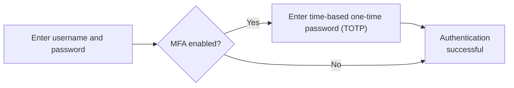

## What is multi-factor authentication (MFA)?

Multi-factor authentication (MFA) enhances security by requiring users to provide multiple forms of identification to verify their identity. It adds an extra layer of security to the <Ref slug="authentication" /> process, making it more difficult for attackers to gain unauthorized access.

Here's an example of MFA:

### The definition of "factor"

In the above example, there are two factors:

1. Username and password
2. <Ref slug="totp" /> from a mobile app

Each factor represents a different category of credentials that can be used to authenticate a user (prove you are who you say you are). In practice, factors can be categorized into three main types:

|            | What it means      | Verification factors                                                                  |
| ---------- | ------------------ | ------------------------------------------------------------------------------------- |
| Knowledge  | Something you know | Password, Email verification code, Backup code                                        |
| Possession | Something you have | SMS verification code, Authenticator app OTP, Hardware OTP (Security key), Smart card |
| Inherence  | Something you are  | Biometrics like fingerprints, face ID                                                 |

A common MFA setup involves combining two factors from different categories, such as a password (knowledge) and a <Ref slug="totp" /> from an authenticator app (possession).

### Why is MFA important?

> There is no such thing as perfect security, only varying levels of insecurity. —Salman Rushdie

The significance of MFA is evident in the numbers: MFA reduces the risk of compromise by 99.22% across the entire population and by 98.56% in cases of leaked credentials[^1]. With the help MFA, more critical actions can be taken with confidence, such as accessing sensitive data and performing financial transactions. It's a simple yet effective way to offer a much higher level of security than just a password or single factor authentication.

## MFA in modern applications

As the name suggests, MFA can involve more than two factors. As the number of factors increases, so does the security level and the complexity of the authentication process which may be less user-friendly. While <Ref slug="totp" /> is a popular choice for the recent years, new technologies like <Ref slug="passkey" /> are emerging to provide an even more secure and user-friendly MFA experience.

For example, modern applications may use the <Ref slug="webauthn" /> API to implement MFA with passkeys, which are phishing-resistant credentials secured by public key cryptography. Companies like Apple have integrated passkeys with biometric authentication (Touch ID, Face ID) to natively add the inherence factor to the MFA process, increasing security and user convenience.

Let's do a quick comparison for a better understanding. Assuming we have a user who has:

1. An authenticator app installed on their phone to generate TOTP codes.
2. A passkey integrated with their device's biometric authentication.

When they sign in to a website with MFA enabled on their laptop, the two processes would look like this:

```mermaid
graph TD
  subgraph TOTP
    A[Enter username and password]
    A -->|MFA enabled| B[Prompt for TOTP code]
    B --> C[Open authenticator app]
    C --> D[Find the TOTP for the website]
    D --> E[Enter the TOTP code]
    E --> F[Authentication<br/>successful]
  end

  subgraph WebAuthn
    G[Enter username and password]
    G -->|MFA enabled| H[Prompt for biometric authentication]
    H --> I["Authenticate with biometrics (e.g., Touch ID)"]
    I --> J[Authentication<br/>successful]
  end
```

It's clear that the WebAuthn process takes fewer steps and much less time for users. Even more, companies like Apple support passkey synchronization across devices (e.g., iPhone, iPad, Mac) to make the MFA process smoother while maintaining a high level of security.

## Security considerations

When implementing MFA, some security considerations should be taken into account:

- Use a combination of factors from different categories to ensure a higher level of security. For example, combining a password (knowledge) with a TOTP code (possession).
- Avoid using SMS as an MFA factor due to its susceptibility to SIM swapping attacks.
- Recovery options should not bypass MFA. For example, if a user loses their authenticator app, they should be required to use a backup code or another MFA factor to regain access.
- Enforce cooldown periods between failed MFA attempts to prevent brute-force attacks.

[^1]: [How effective is multifactor authentication at deterring cyberattacks?](https://query.prod.cms.rt.microsoft.com/cms/api/am/binary/RW166lD)

<SeeAlso slugs={["totp", "webauthn", "passkey"]} />

<Resources
  urls={[
    "https://blog.logto.io/elaborate-mfa",
    "https://blog.logto.io/web-authn-and-passkey-101",
    "https://blog.logto.io/webauthn-base-knowledge",
  ]}
/>
