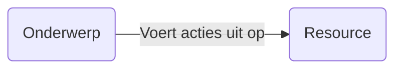
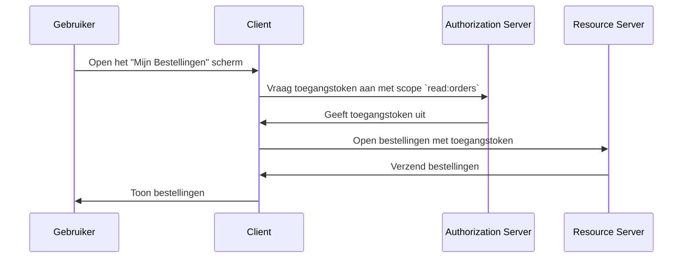

## Wat is toegangsbeheer?

Toegangsbeheer omvat drie hoofdcomponenten:

- **Onderwerp**: Een entiteit die acties uitvoert op resources. Onderwerpen kunnen gebruikers, services of apparaten zijn.
- **Resource**: Een entiteit die wordt beschermd door toegangsbeheer. Resources kunnen bestanden, databases, API's of andere digitale activa zijn.
- **Actie**: Een bewerking die een onderwerp kan uitvoeren op een resource. Acties kunnen lezen, schrijven, uitvoeren of andere operaties zijn.

> Toegangsbeheer definieert de selectieve beperking van toegang tot **resources** op basis van het **onderwerp** en de **actie**.

Hier zijn enkele voorbeelden uit de praktijk van toegangsbeheer:

- Een gebruiker (onderwerp) **kan** zijn bestellingen (resource) lezen (actie) in een e-commerce systeem.
- Een gebruiker (onderwerp) **kan niet** het profiel van een andere gebruiker verwijderen (actie) in een sociaal netwerk.
- Een service (onderwerp) **kan** gegevens schrijven (actie) naar een database (resource) in een microservices-architectuur.

Soms wordt de resource genegeerd in technische implementaties en wordt toegangsbeheer gedefinieerd als de beperking van wie (onderwerp) welke acties kan uitvoeren. Bijvoorbeeld, het basis OAuth 2.0 framework specificeert alleen acties door scopes (machtigingen) te gebruiken en definieert geen resources.

De ondersteuning voor toegangsbeheer kan variëren afhankelijk van de <Ref slug="authorization-server" /> of de <Ref slug="identity-provider" />. Sommige systemen kunnen [Resource Indicators voor OAuth 2.0](https://datatracker.ietf.org/doc/html/rfc8707) ondersteunen, een uitbreiding van OAuth 2.0 waarmee clients de resources kunnen specificeren die ze willen openen.

## Modellen voor toegangsbeheer ||access-control-models||

Het bepalen van beperkingen voor enkele onderwerpen en resources is eenvoudig, maar niet schaalbaar. Daarom heeft de industrie veel modellen voor toegangsbeheer ontwikkeld om het effectief te beheren. In de context van <Ref slug="iam" />, zijn de volgende enkele veel voorkomende modellen voor toegangsbeheer:

- <Ref slug="rbac" />: Een model dat machtigingen toewijst aan rollen, en vervolgens rollen toewijst aan onderwerpen. Bijvoorbeeld, een admin-rol kan toegang hebben tot alle resources, terwijl een gebruikersrol mogelijk toegang heeft tot beperkte resources.
- <Ref slug="abac" />: Een model dat attributen (eigenschappen) van het onderwerp, de resource en de omgeving gebruikt om beslissingen over toegangsbeheer te nemen. Bijvoorbeeld, een gebruiker met het attribuut "afdeling=engineering" heeft mogelijk toegang tot technische resources.

Er zijn ook andere modellen voor toegangsbeheer zoals [policy-based access control (PBAC)](https://csrc.nist.gov/glossary/term/policy_based_access_control). Elk model heeft zijn eigen sterke en zwakke punten, en de keuze van het model hangt af van jouw gebruikssituatie en vereisten.

## Toegangsbeheer in OAuth 2.0

In de context van OAuth 2.0 wordt toegangsbeheer meestal geïmplementeerd met behulp van <Ref slug="scope">scopes</Ref>. Gewoonlijk is de waarde van een scope een string die de resource en de actie combineert. Bijvoorbeeld, `read:orders` of `write:profile`.

> [!Note]
> De term "scopes" is in de meeste gevallen uitwisselbaar met "machtigingen".

Het is belangrijk op te merken dat OAuth 2.0 de structuur en betekenis van scopes niet definieert. De interpretatie van scopes is overgelaten aan de <Ref slug="resource-server" />, en de uitgifte van scopes is overgelaten aan de <Ref slug="authorization-server" />.

Bijvoorbeeld, een gebruiker (onderwerp) moet zijn bestellingen (resource) openen in een e-commerce systeem. Door gebruik te maken van OAuth 2.0, kun je een scope `read:orders` definiëren en een webapplicatie (client) zal deze scope aanvragen van de authorization server. Hier is een vereenvoudigde flow:

In deze flow, afhankelijk van de technische architectuur, kan de resource server een API-service zijn of kan het de client (webapplicatie) zelf zijn zolang deze de mogelijkheid heeft om toegang te krijgen tot de resource (bestellingen).

### De resource indicator parameter

Hoewel mensen vaak scopes definiëren met resource en actie (bijv. `read:orders`, waarbij `orders` de resource is en `read` de actie), is de schaalbaarheid van deze benadering beperkt wanneer het aantal resources en acties toeneemt. RFC 8707 introduceert de `resource` parameter (dwz <Ref slug="resource-indicator">resource indicators</Ref>) aan OAuth 2.0, waardoor clients de resources kunnen specificeren die ze willen openen.

De RFC specificeert dat de `resource` parameter een URI moet zijn die de resource vertegenwoordigt. In plaats van eenvoudigweg `orders` te gebruiken, zou je bijvoorbeeld `https://api.example.com/orders` kunnen gebruiken. Deze methode helpt naamsconflicten te voorkomen en verbetert de precisie van resource matching door het daadwerkelijke resource-URL te gebruiken.

### Ondersteuning van de authorization server

OAuth 2.0 definieert niet hoe de authorization server toegangsbeheer moet uitvoeren. Het laat de implementatiedetails over aan de authorization server. Daarom kan de keuze van authorization server een grote invloed hebben op het toegangsbeheersmechanisme. Bijvoorbeeld, sommige authorization servers kunnen resource indicators ondersteunen, terwijl andere dat misschien niet doen. Het is belangrijk om te beslissen welk model voor toegangsbeheer je wilt gebruiken op basis van je zakelijke vereisten en vervolgens een authorization server te kiezen die dat model ondersteunt. Als je niet zeker bent over het toegangsbeheermodel, is <Ref slug="rbac" /> voldoende voor de meeste gevallen.

<SeeAlso slugs={["rbac", "abac", "resource-indicator", "authorization"]} />

<Resources
  urls={[
    "https://blog.logto.io/mastering-rbac",
    "https://blog.logto.io/rbac-and-abac",
    "https://datatracker.ietf.org/doc/html/rfc8707",
    "https://blog.logto.io/organization-and-role-based-access-control",
  ]}
/>
