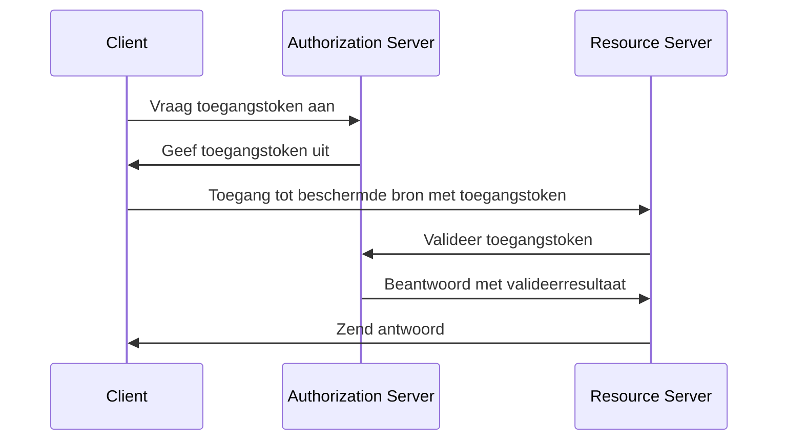
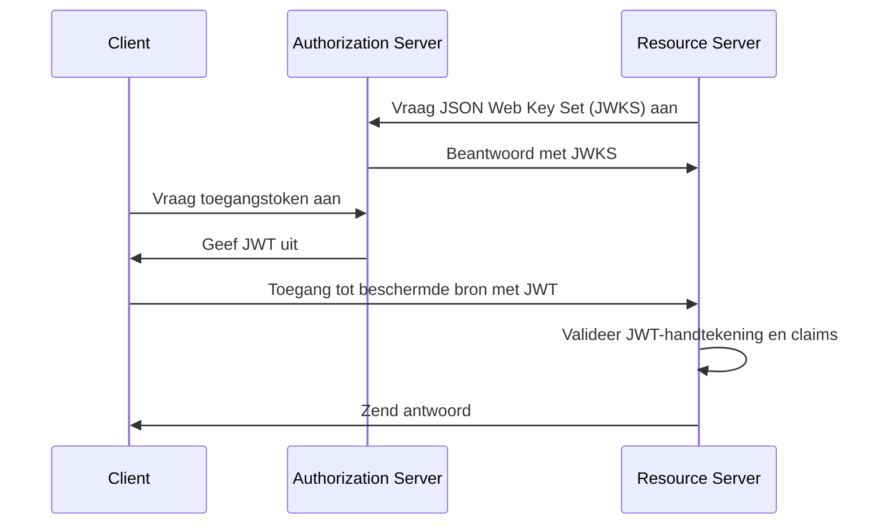
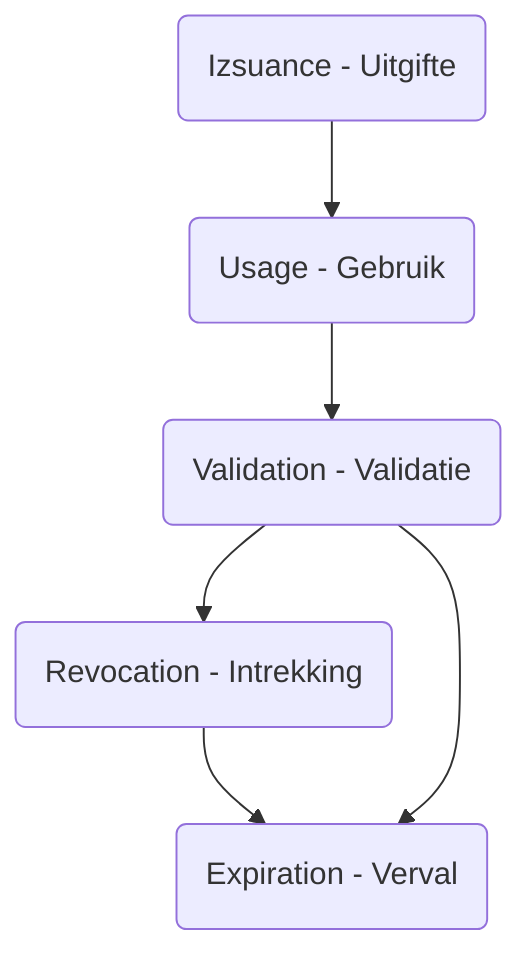

## Wat is een toegangstoken (Access token)?

Een toegangstoken (Access token) is een referentie, meestal een reeks karakters, die wordt gebruikt om toegang te krijgen tot beschermde bronnen. In de context van OAuth 2.0 en OpenID Connect (OIDC) kunnen <Ref slug="authorization-server">authorization servers</Ref> toegangstokens (Access tokens) uitgeven aan cliënten (applicaties) na succesvolle authenticatie en autorisatie.

Hoewel de RFC's voor OAuth 2.0 en OIDC de implementatiedetails van toegangstokens (Access tokens) niet specificeren, zijn er twee gangbare soorten toegangstokens die in de praktijk worden gebruikt:

- <Ref slug="opaque-token" />: Een willekeurige reeks die geen betekenis heeft ("ondoorzichtig") voor de cliënt. De cliënt biedt het token aan de resource server, die het token valideert bij de authorization server.
- <Ref slug="jwt" />: Een zelfbeheerd token dat <Ref slug="claim">claims</Ref> bevat (bijv. gebruikers-ID, vervaltijd) met een digitale handtekening. De resource server kan het token valideren zonder een extra verzoek te doen aan de authorization server.

## Hoe werkt een toegangstoken (Access token)?

Afhankelijk van het type toegangstoken (Access token), kan de stroom van het gebruik van een toegangstoken variëren.

Hier is een vereenvoudigd voorbeeld van het gebruik van een ondoorzichtig toegangstoken (opaque access token):

Hier is een vereenvoudigd voorbeeld van het gebruik van een JWT:

Het verschil tussen de twee typen toegangstokens (Access tokens) is hoe de resource server het token valideert:

- De resource server moet een extra verzoek doen aan de authorization server om een ondoorzichtig token te valideren elke keer dat het een token ontvangt.
- De resource server kan een JWT valideren zonder een extra verzoek te doen aan de authorization server omdat het token alle benodigde informatie bevat en de resource server de publieke sleutel kan cachen van de JSON Web Key Set (JWKS) van de authorization server.

Toegangstokens (Access tokens) zijn meestal van korte duur en hebben een vervaltijd (bijv. 1 uur). Cliënten moeten een nieuw toegangstoken aanvragen wanneer het huidige token verloopt.

## Welk type token moet ik gebruiken?

De keuze tussen een ondoorzichtig token en een JWT hangt af van het gebruiksscenario en de veiligheidsvereisten van de applicatie. Hier is een vergelijking van de twee typen tokens:

|                | Ondoorzichtig Token            | JWT                                                           |
|----------------|--------------------------------|---------------------------------------------------------------|
| Formaat        | Willekeurige reeks             | Zelfbeheerde JSON-objecten                                   |
| Prestatie      | Vereist een extra verzoek      | Snellere validatie                                            |
| Zelfbeheerd    | Nee                            | Ja                                                            |
| Tokensize      | Kleiner                        | Groter                                                        |
| Intrekking     | Onmiddellijk                   | Vereist tokenverloop of een interactie met authorization server |
| Uitbreidbaarheid| Beperkt                        | Aangepaste claims                                             |
| Stateless      | Nee                            | Ja                                                            |
| Veiligheid     | Vereist tokenvalidatie         | Vereist handtekeningvalidatie                                 |
| Standaard      | Nee                            | Ja (RFC 7519)                                                 |

Voor meer informatie over het kiezen tussen de twee typen tokens, zie [Opaque token vs JWT](https://blog.logto.io/opaque-token-vs-jwt).

## De rollen van de authorization server en de resource server

In de meeste gevallen heeft de <Ref slug="authorization-server" /> de volgende verantwoordelijkheden:

- Geeft toegangstokens (Access tokens) uit aan cliënten na succesvolle authenticatie en autorisatie. De authorization server kan het toegangsniveau verkleinen (de scopes verkleinen tot een subset) of het tokenverzoek afwijzen op basis van de toegangspolicies (bijv. gebruikersinstemming, <Ref slug="rbac" />, <Ref slug="abac" />).
- Controleert of het toegangstoken door de authorization server is uitgegeven en niet verlopen of ingetrokken is (<Ref slug="token-introspection" />).
- Biedt informatie over het token (bijv. scopes, vervaltijd) via token introspection of <Ref slug="userinfo-endpoint" />.

Je zult merken dat de authorization server de betekenis van het toegangstoken niet interpreteert. Bijvoorbeeld, het toegangstoken kan een scope `read:orders` bevatten, maar de authorization server weet niet wat de scope betekent. De resource server is verantwoordelijk voor het interpreteren van het toegangstoken en het afdwingen van de <Ref slug="access-control" /> op basis van de scopes van het token. Dat wil zeggen dat de <Ref slug="resource-server" /> meestal de volgende verantwoordelijkheden heeft:

- Valideer de <Ref slug="claim">claims</Ref> in het toegangstoken (bijv. vervaltijd, resource indicator, scopes).
- Dwingt de toegangspolicy af op basis van de claims van het token (meestal scopes).
- Biedt de beschermde bronnen als het toegangstoken geldig is.

## Levenscyclus van een toegangstoken (Access token)

De levenscyclus van een toegangstoken bestaat meestal uit de volgende fasen:

<SeeAlso slugs={['opaque-token', 'jwt', 'token-introspection', 'userinfo-endpoint', 'access-control']} />

<Resources
  urls={[
    "https://blog.logto.io/opaque-token-vs-jwt",
    "https://blog.logto.io/oauth2-token-introspection",
    "https://blog.logto.io/understanding-tokens-in-oidc",
    {
      url: "https://datatracker.ietf.org/doc/html/rfc6749#section-1.4",
      result: {
        ogTitle: "OAuth 2.0 Access Token",
      },
    },
    "https://datatracker.ietf.org/doc/html/rfc7662",
  ]}
/>
