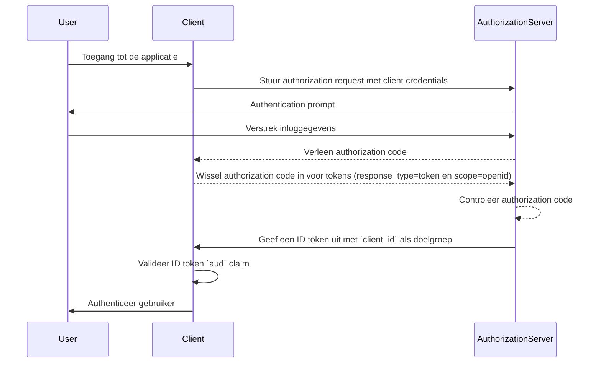
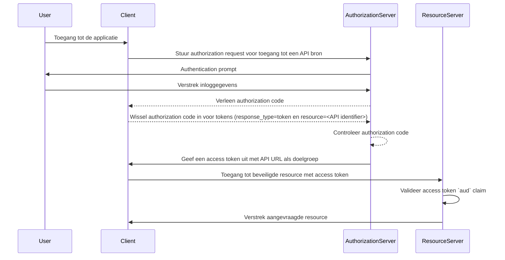

## Wat is doelgroep (audience)?

In de context van <Ref slug="authentication" /> en <Ref slug="authorization" /> is doelgroep (audience) een essentieel onderdeel dat de beoogde ontvangers van een authorization token definieert. Verwezen als de [aud](https://datatracker.ietf.org/doc/html/rfc7519#section-4.1.3) claim in <Ref slug="jwt" />, zorgt deze claim ervoor dat het token alleen wordt geaccepteerd door de aangewezen dienst of applicatie. Meestal bevat de doelgroepclaim ofwel de client_id van de applicatie waarvoor het token bedoeld is, of een URL die de API of bron vertegenwoordigt waartoe het token gemachtigd is toegang te krijgen. Door de doelgroep te specificeren, dient het als een beveiligingscontrole om misbruik door ongeautoriseerde diensten of gebruikers te voorkomen.

## Hoe werkt doelgroep (audience)?

Wanneer een client een <Ref slug="access-token" /> aanvraagt bij een authorization server, wordt de doelgroepclaim opgenomen in de tokenresponse. Deze doelgroepwaarde wordt vervolgens gevalideerd door de resource server wanneer het token wordt gepresenteerd. De resource server controleert of de doelgroepclaim in het token overeenkomt met zijn eigen identificator of de identificator van de dienst die het beschermt. Als dat niet het geval is, wordt het token afgewezen, waardoor de beveiliging in gedistribueerde systemen wordt verbeterd, met name in scenario's die meerdere microservices of API's omvatten. Door controle over de doelgroepclaim kunnen ontwikkelaars ervoor zorgen dat tokens in de juiste context worden gebruikt, waardoor een extra beveiligingslaag wordt toegevoegd aan de authentication en authorization workflows van hun applicatie.

- **Aanvrager**: De client applicatie specificeert de doelgroepwaarde wanneer een token wordt aangevraagd.
- **Uitgever (Issuer)**: De authorization server neemt de doelgroepclaim op in de tokenresponse.
- **Verificateur**: De ontvanger van het token controleert de doelgroepclaim tegen zijn eigen identificator. Als de doelgroepclaim overeenkomt met de identificator van de ontvanger, wordt het token als geldig beschouwd. Anders wordt het afgewezen.

## Voorbeeld van doelgroep (audience) in JWT

### Doelgroep (audience) claim in een OpenID Connect (OIDC) ID token

```json
{
  "header": {
    "alg": "RS256",
    "typ": "JWT",
    "kid": "abc123"
  },
  "payload": {
    "iss": "https://auth.logto.io",
    "sub": "test_user",
    "aud": "client_id_foo",
    "exp": 1516239022,
    "iat": 1516239022,
    "nonce": "n-0S6_WzA2Mj",
    "primary_email": "foo@logto.io",
    "email_verified": true,
    "username": "foo"
  },
  "signature": "..."
}
```

Een <Ref slug="id-token" /> in <Ref slug="openid-connect" /> is een security token dat informatie bevat over de geauthenticeerde gebruiker, geleverd aan de client applicatie na een succesvolle authentication. In tegenstelling tot access tokens, die worden gebruikt om toegang tot resources te verlenen, zijn ID tokens specifiek ontworpen om gebruikersidentiteitsinformatie over te dragen aan de relying party (client). Deze tokens worden meestal gecodeerd als JWTs en omvatten claims zoals de gebruikersidentifier (sub claim), de issuer (iss claim) en de doelgroep (aud claim) onder andere.

In dit geval specificeert de `aud` claim de beoogde doelgroep van het ID token, namelijk de client applicatie. De waarde van de `aud` claim komt meestal overeen met de `client_id` van de applicatie die het token heeft aangevraagd. Wanneer de client applicatie het ID token ontvangt, kan het de doelgroepclaim verifiëren om ervoor te zorgen dat het token voor zijn consumptie is uitgegeven. Deze validatiestap helpt tokenmisbruik en ongeautoriseerde toegang tot gebruikersinformatie te voorkomen, waardoor de beveiliging van het authentication proces wordt versterkt.



### Doelgroep (audience) claim in een access token

```json
{
  "header": {
    "alg": "RS256",
    "typ": "JWT",
    "kid": "abc123"
  },
  "payload": {
    "iss": "https://auth.logto.io",
    "sub": "test_user",
    "aud": "https://example.logto.app/api/users",
    "exp": 1516239022,
    "iat": 1516239022,
    "scope": "read write",
    "client_id": "client_id_foo"
  },
  "signature": "..."
}
```

In tegenstelling tot ID tokens worden <Ref slug="access-token" /> gebruikt om toegang tot beveiligde resources te autoriseren, zoals API's of diensten. De `aud` claim in een access token specificeert de beoogde ontvanger van het token, meestal de API of dienst die het token is geautoriseerd om toegang toe te krijgen. Meestal heeft de resource server die de API host een andere domein dan de client applicatie die het token heeft aangevraagd. In dit geval bevat de `aud` claim in plaats van een `client_id` de URL van het API-endpoint waarvoor het token bedoeld is. Deze URL, vaak bekend als de resource indicator of API identifier, identificeert de doelresource uniek.

Wanneer de resource server een access token ontvangt, valideert hij de `aud` claim om ervoor te zorgen dat het token voor zijn consumptie is bedoeld. Door de doelgroep te controleren kan de resource server ongeautoriseerde toegang tot zijn resources voorkomen en access control beleidslijnen afdwingen op basis van de bedoelde doelgroep van het token. Dit mechanisme helpt gevoelige data te beschermen en zorgt ervoor dat access tokens in de juiste context worden gebruikt, waardoor de beveiliging van het systeem als geheel wordt verbeterd.



## Veelgestelde vragen

### Waarom is de doelgroepclaim belangrijk bij tokenvalidatie?

De doelgroepclaim is cruciaal bij tokenvalidatie omdat het ervoor zorgt dat het token alleen door de beoogde ontvanger wordt geaccepteerd. Door de doelgroepclaim te verifiëren, kan de ontvanger tokenmisbruik en ongeautoriseerde toegang tot resources voorkomen. Deze beveiligingscontrole is vooral belangrijk in gedistribueerde systemen waar meerdere diensten met elkaar communiceren, omdat het helpt access control beleidslijnen af te dwingen en gevoelige data te beschermen.

### Kan een token meerdere doelgroepen hebben?

Om veiligheidsredenen wordt aanbevolen dat een token een enkele doelgroep heeft om ambiguïteit te voorkomen en ervoor te zorgen dat het token in de juiste context wordt gebruikt. Sommige scenario's kunnen echter tokens met meerdere doelgroepen vereisen, bijvoorbeeld wanneer een token is bedoeld voor meerdere diensten of API's binnen hetzelfde domein. In dergelijke gevallen moeten ontwikkelaars zorgvuldig de implicaties van het gebruik van multi-doelgroep-tokens overwegen en passende beveiligingsmaatregelen implementeren om mogelijke risico's te beperken.

### Wat moet ik gebruiken als mijn API identifier in de doelgroepclaim?

Bij het specificeren van de doelgroepclaim in een access token die een API of dienst vertegenwoordigt, wordt aanbevolen om een absolute URI te gebruiken die de bron uniek identificeert. Deze URI kan de basis-URL van het API-endpoint zijn of een specifiek resourcepad waartoe het token gemachtigd is toegang te krijgen. Door een URI te gebruiken als de API identifier, kun je ervoor zorgen dat de doelgroepclaim ondubbelzinnig is en accuraat de beoogde ontvanger van het token vertegenwoordigt.