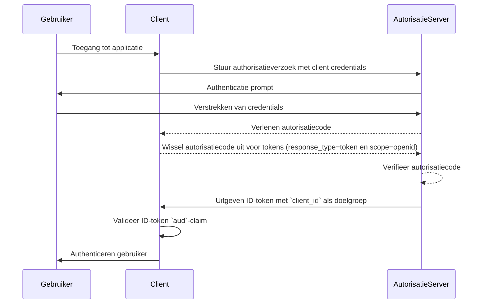
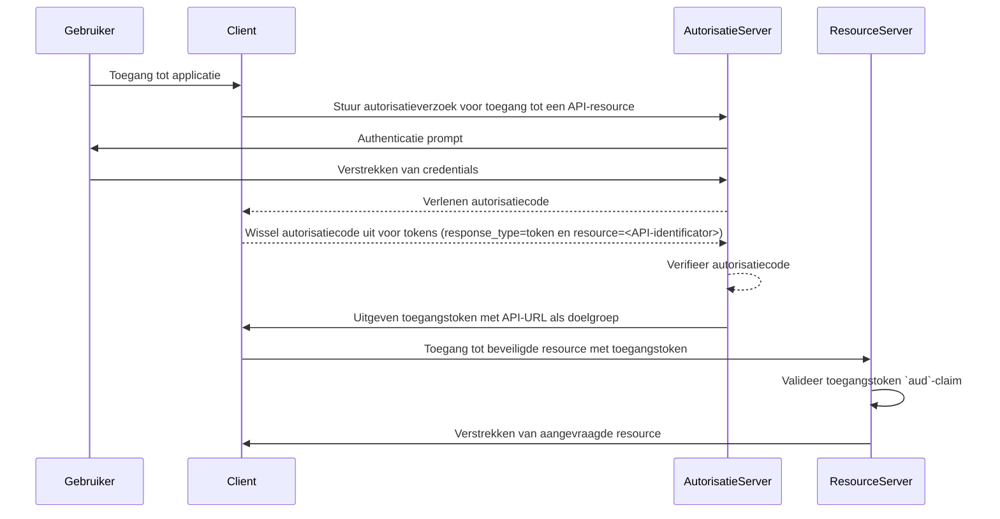

## Wat is de doelgroep (audience)?

In de context van authenticatie (authentication) en autorisatie (authorization) is de doelgroep (audience) een sleutelcomponent die de beoogde ontvangers van een autorisatietoken definieert. Verwezen naar als de [aud](https://datatracker.ietf.org/doc/html/rfc7519#section-4.1.3) claim in <Ref slug="jwt" />, zorgt deze claim ervoor dat het token alleen wordt geaccepteerd door de aangewezen service of applicatie. Meestal bevat de doelgroepclaim hetzij de client_id van de applicatie waarvoor het token bedoeld is of een URL die de API of resource vertegenwoordigt waarvoor het token geautoriseerd is. Door de doelgroep te specificeren, dient het als een beveiligingscontrole om misbruik door ongeautoriseerde services of gebruikers te voorkomen.

## Hoe werkt de doelgroep (audience)?

Wanneer een client een toegangstoken aanvraagt van een autorisatieserver (authorization server), wordt de doelgroepclaim opgenomen in het tokenrespons. Deze doelgroepwaarde wordt vervolgens gevalideerd door de resource server wanneer het token wordt gepresenteerd. De resource server controleert of de doelgroepclaim in het token overeenkomt met zijn eigen identificator of de identificator van de service die het beschermt. Als dit niet zo is, zal het token worden afgewezen, waardoor de beveiliging in gedistribueerde systemen wordt verbeterd, vooral in scenario’s met meerdere microservices of APIs. Door de doelgroepclaim te beheersen, kunnen ontwikkelaars ervoor zorgen dat tokens in de juiste context worden gebruikt, waardoor een extra beveiligingslaag wordt toegevoegd aan de authenticatie- en autorisatieworkflows van hun applicatie.

- **Aanvrager**: De client applicatie specificeert de doelgroepwaarde wanneer een token wordt aangevraagd.
- **Issuer**: De autorisatieserver (authorization server) voegt de doelgroepclaim toe aan het tokenrespons.
- **Verifier**: De ontvanger van het token controleert de doelgroepclaim met zijn eigen identificator. Als de doelgroepclaim overeenkomt met de identificator van de ontvanger, wordt het token als geldig beschouwd. Anders wordt het afgewezen.

## Voorbeeld van doelgroep in JWT

### Doelgroepclaim in een OpenID Connect (OIDC) ID-token

```json
{
  "header": {
    "alg": "RS256",
    "typ": "JWT",
    "kid": "abc123"
  },
  "payload": {
    "iss": "https://auth.logto.io",
    "sub": "test_user",
    "aud": "client_id_foo",
    "exp": 1516239022,
    "iat": 1516239022,
    "nonce": "n-0S6_WzA2Mj",
    "primary_email": "foo@logto.io",
    "email_verified": true,
    "username": "foo"
  },
  "signature": "..."
}
```

Een <Ref slug="id-token" /> in OpenID Connect (OIDC) is een beveiligingstoken dat informatie bevat over de geauthenticeerde gebruiker, geleverd aan de client applicatie na een succesvolle authenticatie. In tegenstelling tot toegangstokens, die worden gebruikt om toestemming te geven voor toegang tot resources, zijn ID-tokens specifiek ontworpen om gebruikersidentiteitsinformatie over te brengen naar de relying party (client). Deze tokens worden meestal gecodeerd als JWT's (JSON Web Tokens) en bevatten claims zoals de gebruikersidentificator (sub-claim), de issuer (iss-claim) en de doelgroep (aud-claim), naast anderen.

In dit geval specificeert de `aud`-claim de bedoelde doelgroep voor het ID-token, namelijk de client applicatie. De waarde van de `aud`-claim komt meestal overeen met de `client_id` van de applicatie die het token heeft aangevraagd. Wanneer de client applicatie het ID-token ontvangt, kan het de doelgroepclaim verifiëren om ervoor te zorgen dat het token is uitgegeven voor zijn consumptie. Deze validatiestap helpt misbruik van tokens en ongeoorloofde toegang tot gebruikersinformatie te voorkomen, waardoor de beveiliging van het authenticatieproces wordt verbeterd.



### Doelgroepclaim in een toegangstoken

```json
{
  "header": {
    "alg": "RS256",
    "typ": "JWT",
    "kid": "abc123"
  },
  "payload": {
    "iss": "https://auth.logto.io",
    "sub": "test_user",
    "aud": "https://example.logto.app/api/users",
    "exp": 1516239022,
    "iat": 1516239022,
    "scope": "read write",
    "client_id": "client_id_foo"
  },
  "signature": "..."
}
```

In tegenstelling tot ID-tokens worden toegangstokens gebruikt om toegang te autoriseren tot beveiligde resources, zoals APIs of services. De `aud`-claim in een toegangstoken specificeert de bedoelde ontvanger van het token, wat meestal de API of service is waar het token voor geautoriseerd is. Meestal heeft de resource server die de API host, een ander domein dan de client applicatie die het token heeft aangevraagd. In dit geval bevat de `aud`-claim in plaats van een `client_id` de URL van het API-eindpunt waarvoor het token bedoeld is. Deze URL staat vaak bekend als de resource-indicator of API-identificator die de doelresource uniek identificeert.

Wanneer de resource server een toegangstoken ontvangt, valideert het de `aud`-claim om ervoor te zorgen dat het token bedoeld is voor zijn consumptie. Door de doelgroep te controleren, kan de resource server voorkomen dat ongeoorloofde toegang tot zijn resources wordt verkregen en toegangscontrolestrategieën afdwingen op basis van de bedoelde doelgroep van het token. Dit mechanisme helpt gevoelige gegevens te beschermen en ervoor te zorgen dat toegangstokens in de juiste context worden gebruikt, waardoor de algehele beveiliging van het systeem wordt verbeterd.



## Veelgestelde vragen

### Waarom is de doelgroepclaim belangrijk in tokenvalidatie?

De doelgroepclaim is cruciaal in tokenvalidatie omdat het ervoor zorgt dat het token alleen wordt geaccepteerd door de bedoelde ontvanger. Door de doelgroepclaim te verifiëren, kan de ontvanger misbruik van tokens en ongeoorloofde toegang tot resources voorkomen. Deze beveiligingscontrole is met name belangrijk in gedistribueerde systemen waar meerdere services met elkaar communiceren, omdat het helpt toegangscontrolestrategieën af te dwingen en gevoelige gegevens te beschermen.

### Kan een token meerdere doelgroepen hebben?

Om veiligheidsredenen wordt aanbevolen dat een token een enkele doelgroep heeft om dubbelzinnigheid te voorkomen en ervoor te zorgen dat het token in de juiste context wordt gebruikt. Sommige scenario’s vereisen echter tokens met meerdere doelgroepen, zoals wanneer een token bedoeld is voor meerdere services of APIs binnen hetzelfde domein. In dergelijke gevallen moeten ontwikkelaars zorgvuldig de implicaties van het gebruik van multi-doelgroep tokens overwegen en passende beveiligingsmaatregelen implementeren om mogelijke risico's te beperken.

### Wat moet ik gebruiken als mijn API-identificator in de doelgroepclaim?

Bij het specificeren van de doelgroepclaim in een toegangstoken dat een API of service vertegenwoordigt, wordt aanbevolen een absolute URI te gebruiken die de resource uniek identificeert. Deze URI kan de basis-URL zijn van het API-eindpunt of een specifiek resourcepad waartoe het token bevoegd is om toegang te verlenen. Door een URI als de API-identificator te gebruiken, kun je ervoor zorgen dat de doelgroepclaim eenduidig is en de bedoelde ontvanger van het token nauwkeurig vertegenwoordigt.