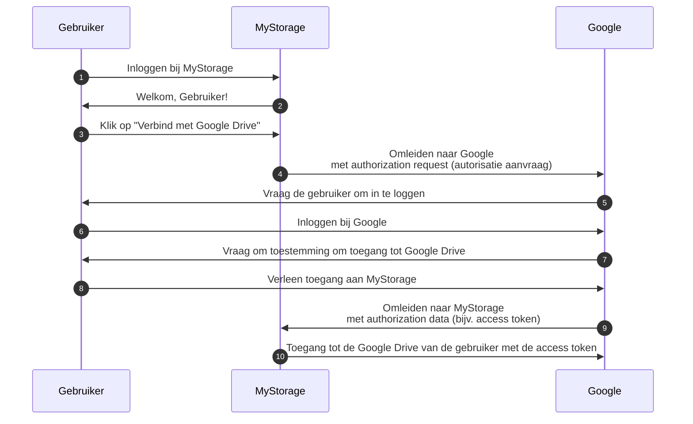

## Auth

Deze pagina is een uitleg voor de term "auth". Het wordt vaak gebruikt als een afkorting voor:

- <Ref slug="authentication" />: Het proces van het verifiëren van de identiteitsbezit (bijvoorbeeld gebruiker of dienst). Het beantwoordt de vraag "Welke identiteit bezit je?"
- <Ref slug="authorization" />: Het proces van het bepalen welke acties een identiteit kan uitvoeren op een resource. Het beantwoordt de vraag "Wat kan je doen?"

> [!Opmerking]
> Soms worden authentication (verificatie) en authorization (autorisatie) aangeduid als "AuthN" en "AuthZ", respectievelijk.

Deze twee concepten zijn beide essentieel in het <Ref slug="iam" /> domein, maar ze zijn fundamenteel verschillend. Laten we een voorbeeld bekijken: Een webapplicatie MyStorage heeft de mogelijkheid om bestanden te uploaden en verbinding te maken met Google Drive. Een typische gebruikersstroom zou zijn:

In deze stroom voert de gebruiker twee authentication (verificatie) stappen uit: één met MyStorage (stap 1) en een andere met Google (stap 6); en één authorization (autorisatie) stap: toegang verlenen tot Google Drive (stap 8).

## Welke bedoel je?

Wanneer je de term "auth" ziet, is het belangrijk om te verduidelijken of het verwijst naar authentication (verificatie) of authorization (autorisatie); anders zou je kunnen verwachten dat beide processen worden behandeld (net zoals deze website doet).

<SeeAlso slugs={["authentication", "authorization", "iam", "oauth-2.0", "openid-connect"]} />