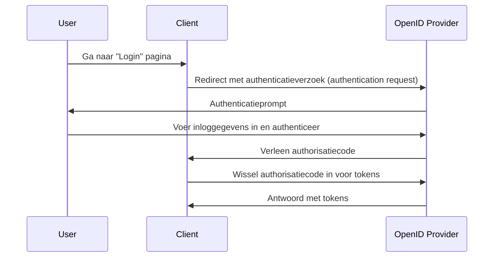

## Wat is een authenticatieverzoek (authentication request)?

Hoewel de betekenis van een authenticatieverzoek (authentication request) kan variëren afhankelijk van de context, zullen we ons richten op de definitie in de OpenID Connect (OIDC) specificatie. In OIDC is een authenticatieverzoek (authentication request) een <Ref slug="authorization-request" /> aan de authorization server voor het authenticeren van een gebruiker.

De standaarddefinitie lijkt erg verwarrend omdat er vergelijkbare termen worden gebruikt, zoals "autorisatieverzoek (authorization request)". Dit komt omdat OIDC is gebouwd op OAuth 2.0, dat voornamelijk is ontworpen voor autorisatie, en OIDC erft de OAuth 2.0 terminologie en breidt deze uit om authenticatie te ondersteunen.

Om het te verduidelijken, laten we wat context toevoegen aan de definitie:

> Een (OpenID Connect) authenticatieverzoek (authentication request) is een (OAuth 2.0 autorisatie) verzoek (request) aan de (OpenID Connect autorisatie) server voor het authenticeren van een gebruiker.

Het wordt nog langer! Laten we nu alle haakjes verwijderen:

> Een authenticatieverzoek (authentication request) is een verzoek (request) aan de server voor het authenticeren van een gebruiker.

Nadat alle attributen zijn verwijderd, wordt de definitie eenvoudig. Hier zijn de analyses van de termen:

- **Authenticatieverzoek (authentication request)**: De term uit de OIDC-specificatie.
- <Ref slug="authorization-request" />: De term uit de OAuth 2.0 specificatie. OIDC hergebruikt de specificatie en breidt deze uit.
- <Ref slug="authorization-server" />: De term uit de OAuth 2.0 specificatie. OIDC gebruikt ook de term <Ref slug="openid-connect" headingId="openid-provider-op" /> om naar dezelfde entiteit te verwijzen die in staat is gebruikers te authenticeren.

In de volgende secties zullen we "OpenID Provider (OP)" gebruiken om te verwijzen naar de authorization server die OIDC ondersteunt.

## Hoe werkt een authenticatieverzoek (authentication request)?

Wanneer een client-toepassing een gebruiker wil authenticeren, initieert het een authenticatieverzoek (authentication request) naar de OpenID Provider (OP). Zoals we eerder vermeld hebben, is het authenticatieverzoek (authentication request) ook een autorisatieverzoek (authorization request) in OAuth 2.0; bepaalde OAuth 2.0 grant types (flows) kunnen dus worden gebruikt om het authenticatieproces te voltooien.

OIDC definieert drie grant types (flows) ter ondersteuning van authenticatie:

1. <Ref slug="authorization-code-flow" />: De meest aanbevolen authenticatiestroom. Het wordt meestal gebruikt met <Ref slug="pkce" /> voor betere beveiliging en is geschikt voor de meeste toepassingen.
2. <Ref slug="implicit-flow" />: Een vereenvoudigde stroom die is afgeschaft in <Ref slug="oauth-2.1" /> vanwege beveiligingsproblemen.
3. <Ref slug="hybrid-flow" />: Een combinatie van de authorization code flow en de implicit flow.

Het authenticatieverzoek (authentication request) is de eerste stap in de OIDC authenticatiestroom. De daadwerkelijke parameters om op te nemen en de stappen om te volgen zijn afhankelijk van de stroom die je kiest. Klik op de stroomnamen hierboven om meer te leren over elke stroom.

Hier is een vereenvoudigd voorbeeld van een authenticatieverzoek (authentication request) met gebruik van de authorization code flow:

Zodra de client de tokens ontvangt, kan het deze gebruiken (bijv. <Ref slug="access-token" />) om namens de gebruiker toegang te krijgen tot beschermde bronnen (bijv. een API).

### Belangrijke parameters in een authenticatieverzoek (authentication request)

Hier zijn enkele belangrijke parameters in een authenticatieverzoek (authentication request):

- **`response_type`**: Het type reactie dat de client verwacht van de authorization server. Dit kan `code` zijn voor de authorization code flow, `id_token` voor de implicit flow, of `code id_token` voor de hybrid flow.
- **`client_id`**: De client identifier uitgegeven door de OpenID Provider (OP).
- **`redirect_uri`**: De URI waarnaar de authorization server de user-agent zal doorsturen na het authenticatieverzoek (authentication request).
- **`scope`**: De aangevraagde <Ref slug="scope">scopes</Ref> (permissies) voor de <Ref slug="id-token" /> en <Ref slug="access-token" />.
- **`resource`**: De optionele parameter die de <Ref slug="resource-indicator" /> specificeert voor de aangevraagde bronnen. De authorization server moet [RFC 8707](https://datatracker.ietf.org/doc/html/rfc8707) ondersteunen om deze parameter te gebruiken.

Let op dat de bovenstaande parameters niet uitputtend zijn. Voordat je een authenticatieverzoek (authentication request) maakt, moet je verwijzen naar de volledige lijst van parameters voor de specifieke stroom die je gebruikt.

<SeeAlso slugs={["openid-connect", "oauth-2.0", "authorization-code-flow", "implicit-flow", "hybrid-flow"]} />

<Resources
  urls={[
    "https://openid.net/specs/openid-connect-core-1_0.html",
  ]}
/>