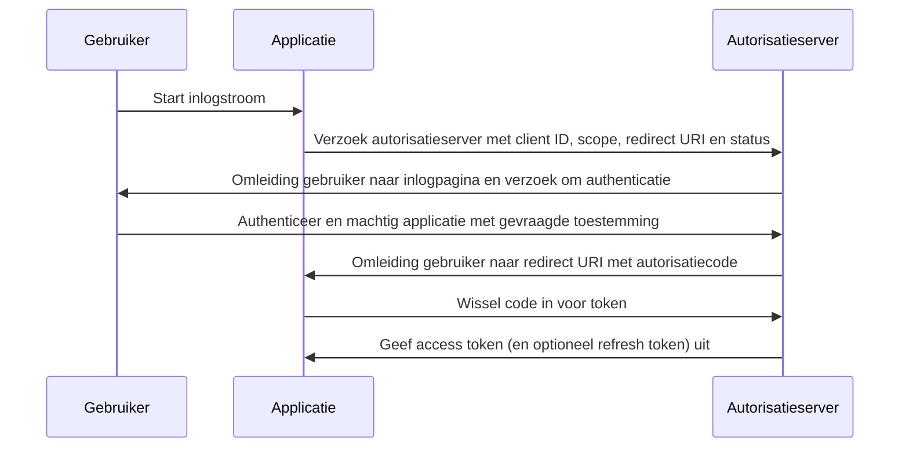

## Wat is autorisatiecode stroom (authorization code flow)?

De autorisatiecode stroom (authorization code flow) (ook bekend als authorization code grant), gedefinieerd in [OAuth 2.0 RFC 6749, sectie 4.1](https://datatracker.ietf.org/doc/html/rfc6749#section-4.1), is een veelgebruikte OAuth 2.0 autorisatie mechanisme die applicaties toestaat om een access token te verkrijgen namens een gebruiker. Deze stroom is bijzonder geschikt voor vertrouwelijke applicaties (bijv. traditionele server-side webapplicaties) waar het clientgeheim veilig kan worden opgeslagen.

Autorisatiecode stroom (authorization code flow) is een robuuste en veilige methode voor het verkrijgen van access tokens in OAuth 2.0, waardoor het een voorkeur heeft voor veel webapplicaties. Het begrijpen van deze stroom is essentieel voor ontwikkelaars die werken met OAuth 2.0 en API-integraties.

## Hoe werkt autorisatiecode stroom (authorization code flow)?

De autorisatiecode stroom (authorization code flow) omvat de volgende stappen:

1. **Start van de stroom**: De gebruiker start de stroom meestal door op een link of knop in de applicatie te klikken om in te loggen. De applicatie leidt de gebruiker door naar het autorisatieserver's autorisatie endpoint, waarbij de client ID, de gevraagde scope, een redirect URI en een statusparameter worden meegegeven. Het autorisatieserver valideert de parameters en verzoekt de gebruiker om zich te authenticeren op de sign-in pagina van het autorisatieserver.
2. **Gebruikersauthenticatie en autorisatie**: De gebruiker authenticeert zich met het autorisatieserver en geeft de applicatie toestemming om toegang te krijgen tot de gevraagde bronnen.
3. **Generatie van code en omleiding**: Het autorisatieserver genereert een autorisatiecode en leidt de gebruiker terug naar de applicatie met behulp van de eerder opgegeven redirect URI. De autorisatiecode is opgenomen in de querystring van de redirect URI.
4. **Code-uitwisseling**: De applicatie haalt de autorisatiecode uit de querystring en maakt een POST-verzoek naar het autorisatieserver's token endpoint om de autorisatiecode in te wisselen voor een access token. De applicatie moet ook de client ID, het clientgeheim, de redirect URI en de autorisatiecode in het verzoek opnemen.
5. **Haalt het access token op**: Het autorisatieserver valideert de autorisatiecode en geeft een access token (en optioneel een refresh token) aan de applicatie na succesvolle validatie. De applicatie kan vervolgens het access token gebruiken om geautoriseerde API-verzoeken namens de gebruiker te doen.

De stappen kunnen worden geïllustreerd met het volgende sequentiediagram:



## Authenticatie verzoek (Authentication request)

Aanvraagparameters zijn als volgt:

- **client_id**: VEREIST. Geldige OAuth 2.0 client id.
- **scope**: VEREIST. Deze waarde specificeert een set van bronnen die de gebruiker aanvraagt van het autorisatieserver. Bijv., `openid profile email`.
- **response_type**: VEREIST. De waarde moet `code` zijn om aan te geven dat de applicatie een autorisatiecode verwacht.
- **redirect_uri**: VEREIST. De URI waar de authenticatierespons naar wordt verzonden en moet exact overeenkomen met de redirect URI die de client vooraf heeft geregistreerd bij het autorisatieserver.
- **state**: AANBEVOLEN. Een ondoorzichtige waarde gebruikt om de status tussen het verzoek en de callback te behouden. Het wordt ook gebruikt om <Ref slug="csrf" /> aanvallen te voorkomen.
- **nonce**: OPTIONEEL. Een willekeurige string gebruikt om een clientsessie te associëren met een id-token en om replay-aanvallen te verzachten.
- **prompt**: OPTIONEEL. Spatie-gescheiden, hoofdlettergevoelige lijst van stringwaarden die specificeert of het autorisatieserver de eindgebruiker vraagt om opnieuw authenticatie en toestemming. De gedefinieerde waarden zijn:
  - **none**: Het autorisatieserver MAG GEEN enkele authenticatie- of toestemmingsgebruikersinterfacepagina's weergeven. Er wordt een fout geretourneerd als een eindgebruiker nog niet geauthenticeerd is of als de client geen vooraf geconfigureerde toestemming voor de gevraagde Claims heeft of niet aan andere voorwaarden voldoet voor het verwerken van het verzoek. De foutcode zal doorgaans zijn `login_required`, `interaction_required`. Dit kan worden gebruikt als een methode om te controleren op bestaande authenticatie en/of toestemming.
  - **login**: Het autorisatieserver MOET de eindgebruiker vragen om opnieuw authenticatie. Als het de eindgebruiker niet opnieuw kan authenticeren, MOET het een fout retourneren, doorgaans `login_required`.
  - **consent**: Het autorisatieserver MOET de eindgebruiker vragen om toestemming voordat informatie naar de client wordt geretourneerd. Als het geen toestemming kan verkrijgen, MOET het een fout retourneren, doorgaans `consent_required`.
  - **select_account**: Het autorisatieserver MOET de eindgebruiker vragen om een gebruikersaccount te selecteren. Dit stelt een eindgebruiker die meerdere accounts heeft bij het autorisatieserver in staat om te kiezen uit de meerdere accounts waarvoor ze wellicht huidige sessies hebben. Als het geen accountselectiekeuze kan verkrijgen die door de eindgebruiker is gemaakt, MOET het een fout retourneren, doorgaans `account_selection_required`.

[Volledige definitie van aanvraagparameters](https://openid.net/specs/openid-connect-core-1_0.html#AuthRequest)

### Voorbeeld van een authenticatie verzoek

```bash
curl -X GET "https://authorization-server.com/auth" \
  -d "response_type=code" \
  -d "client_id=YOUR_APPLICATION_ID" \
  -d "redirect_uri=https://yourapp.com/callback" \
  -d "scope=openid profile email" \
  -d "state=RANDOM_STRING_FOR_STATE"
```

Een typisch succesvol antwoord:

```http
HTTP/1.1 302 Found
Location: https://yourapp.com/callback?
  code=YOUR_AUTHORIZATION_CODE
  &state=RANDOM_STRING_FOR_STATE
```

## Tokenuitwisseling verzoek (Token exchange request)

Zodra op het bovenstaande authenticatie verzoek succesvol is gereageerd, zal de client automatisch worden doorgestuurd naar de callback URI `https://yourapp.com/callback`, met de code als een URI-parameter.

De client wordt verwacht de `code` te verkrijgen en te verwerken met een daaropvolgend tokenuitwisseling verzoek, om in te ruilen voor de toegangstoken.

### Voorbeeld van een tokenuitwisseling verzoek

```bash
curl -X POST "https://authorization-server.com/token" \
  -H "Content-Type: application/x-www-form-urlencoded" \
  -d "client_id=YOUR_CLIENT_ID" \
  -d "code=YOUR_AUTHORIZATION_CODE" \
  -d "redirect_uri=https://yourapp.com/callback" \
  -d "grant_type=authorization_code" \
```

## Voordelen

- **Verbeterde veiligheid**: Het clientgeheim wordt nooit blootgesteld aan de browser van de gebruiker, waardoor het risico op clientvervalsing wordt verminderd.
- **Eenmalige autorisatiecode**: De autorisatiecode heeft een korte levensduur en kan slechts eenmaal worden gebruikt, waardoor het risico op onderschepping en replayaanvallen wordt verminderd.
- **Kortlevende tokens**: Access tokens uitgegeven in deze stroom zijn kortlevend (meestal 1 uur), wat het risico op ongeautoriseerde toegang minimaliseert als de token wordt gecompromitteerd.
- **Refresh token**: Het autorisatieserver kan optioneel een refresh token uitgeven, waarmee de applicatie een nieuwe access token kan verkrijgen zonder tussenkomst van de gebruiker.

## Wat is het verschil tussen autorisatiecode stroom (authorization code flow) en impliciete stroom (implicit flow)?

Het belangrijkste verschil tussen de autorisatiecode stroom (authorization code flow) en de impliciete stroom (implicit flow) is hoe de access token wordt verkregen:

- **Autorisatiecode stroom (authorization code flow)**: De clientapplicatie ontvangt eerst een autorisatiecode van het autorisatie endpoint en wisselt deze vervolgens in voor een access token in een daaropvolgend POST-verzoek naar het token endpoint.
- **Impliciete stroom (implicit flow)**: De clientapplicatie ontvangt de access token direct van het autorisatie endpoint.

## Wat is het verschil tussen autorisatiecode stroom (authorization code flow) en client-credentials stroom (client credentials flow)?

Het belangrijkste verschil tussen de autorisatiecode stroom (authorization code flow) en de client-credentials stroom (client credentials flow) is de context waarin de stroom wordt gebruikt:

- **Autorisatiecode stroom (authorization code flow)**: Wordt gebruikt wanneer de clientapplicatie toegang nodig heeft tot bronnen namens een gebruiker. De stroom omvat gebruikersauthenticatie en autorisatie.
- **Client-credentials stroom (client credentials flow)**: Wordt gebruikt wanneer de clientapplicatie toegang nodig heeft tot bronnen namens zichzelf. De stroom omvat clientauthenticatie maar niet gebruikersauthenticatie, en is het beste geschikt voor machine-to-machine communicatie.

## Wat zijn de typische gebruikssituaties voor autorisatiecode stroom (authorization code flow)?

- Traditionele webapplicaties die gebruikersauthenticatie en toegang tot API's vereisen.
- Applicaties die veilig toegang nodig hebben tot gebruikersgegevens van externe diensten.

<SeeAlso slugs={['device-flow', 'implicit-flow', 'client-credentials-flow']} />

<Resources urls={['https://datatracker.ietf.org/doc/html/rfc6749']} />