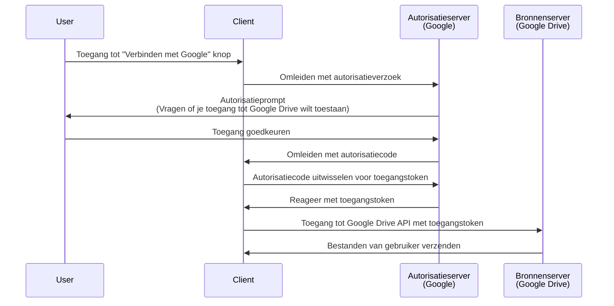

## Wat is een autorisatieverzoek (authorization request)?

Afhankelijk van de context kan de term "autorisatieverzoek" (authorization request) naar verschillende dingen verwijzen. In dit artikel zullen we ons richten op de definitie in de <Ref slug="oauth-2.0" /> specificatie.

In OAuth 2.0 zijn er verschillende types "grant" (flows) die definiëren hoe een <Ref slug="client" /> autorisatie van een gebruiker kan verkrijgen om toegang te krijgen tot beveiligde bronnen.

> ![Opmerking]
> "Autorisatieverzoeken" (authorization requests) worden vaak verward met "authenticatieverzoeken" (authentication requests) in de context van <Ref slug="openid-connect" />. Zie <Ref slug="authentication-request" /> voor OIDC-specifieke details.

## Hoe werkt een autorisatieverzoek (authorization request)?

Wanneer een client (applicatie) toegang wil krijgen tot beveiligde bronnen namens een gebruiker, start het een autorisatieverzoek (authorization request) naar de <Ref slug="authorization-server" />. De client moet het gevraagde "grant" type vermelden samen met de nodige parameters in het verzoek.

Hier zijn enkele typische "grant" types (flows) voor eindgebruiker autorisatie in OAuth 2.0:

- <Ref slug="authorization-code-flow" />: De meest aanbevolen flow voor eindgebruikersautorisatie. Het wordt meestal gebruikt met <Ref slug="pkce" /> voor betere beveiliging en is geschikt voor de meeste applicaties.
- <Ref slug="implicit-flow" />: Een vereenvoudigde flow die gedegradeerd is in <Ref slug="oauth-2.1" /> vanwege beveiligingsproblemen.
- [Resource owner password credentials (ROPC) grant](https://datatracker.ietf.org/doc/html/rfc6749#section-4.3): Een "grant" (flow) waarbij de inloggegevens van de gebruiker direct worden uitgewisseld voor een toegangstoken. Deze flow wordt niet aanbevolen vanwege beveiligingsrisico's.

Er zijn ook andere extensies, zoals de <Ref slug="device-flow" /> voor apparaten met beperkte invoermogelijkheden. Elke flow heeft zijn eigen kenmerken en toepassingsgebieden. Voor de meeste webapplicaties is de autorisatiecode flow de aanbevolen keuze.

> <Ref slug="machine-to-machine" /> autorisatie wordt typisch uitgevoerd met behulp van de <Ref slug="client-credentials-flow" /> die geen gebruikersinteractie vereist.

Bijvoorbeeld, een client (applicatie) kan autorisatie aanvragen om toegang te krijgen tot de Google Drive bestanden van een gebruiker. Hier is een vereenvoudigd sequentiediagram van de autorisatiecode flow:

Zodra het <Ref slug="access-token" /> is verkregen, kan de client dit gebruiken om toegang te krijgen tot de Google Drive bestanden van de gebruiker namens de gebruiker.

### Belangrijke parameters in een autorisatieverzoek (authorization request)

Het OAuth 2.0 autorisatieverzoek bevat meestal de volgende parameters:

- **`response_type`**: Het type reactie dat de client verwacht. Veelvoorkomende waarden zijn `code` voor de autorisatiecode flow en `token` voor de impliciete flow.
- **`client_id`**: De client identifier uitgegeven door de autorisatieserver.
- **`redirect_uri`**: De URI waarnaar de autorisatieserver de gebruiker stuurt na het autorisatieproces.
- **`scope`**: De gevraagde <Ref slug="scope">scopes</Ref> (toestemmingen) voor het toegangstoken.
- **`resource`**: De optionele parameter die de <Ref slug="resource-indicator" /> voor de gevraagde bronnen specificeert. De autorisatieserver moet [RFC 8707](https://datatracker.ietf.org/doc/html/rfc8707) ondersteunen om deze parameter te gebruiken.

De bovenstaande parameters zijn niet uitputtend. De daadwerkelijke parameters en hun waarden zijn afhankelijk van het "grant" type en de specifieke vereisten van de applicatie.

<SeeAlso slugs={["oauth-2.0", "authentication-request", "authorization-code-flow", "implicit-flow", "device-flow"]} />

<Resources
  urls={[
    { url: "https://datatracker.ietf.org/doc/html/rfc6749#section-4", result: {
      ogTitle: "Verkrijgen van autorisatie in OAuth 2.0",
      ogDescription: " Om een toegangstoken aan te vragen, krijgt de client autorisatie van de bron eigenaar."
    } }
  ]}
/>