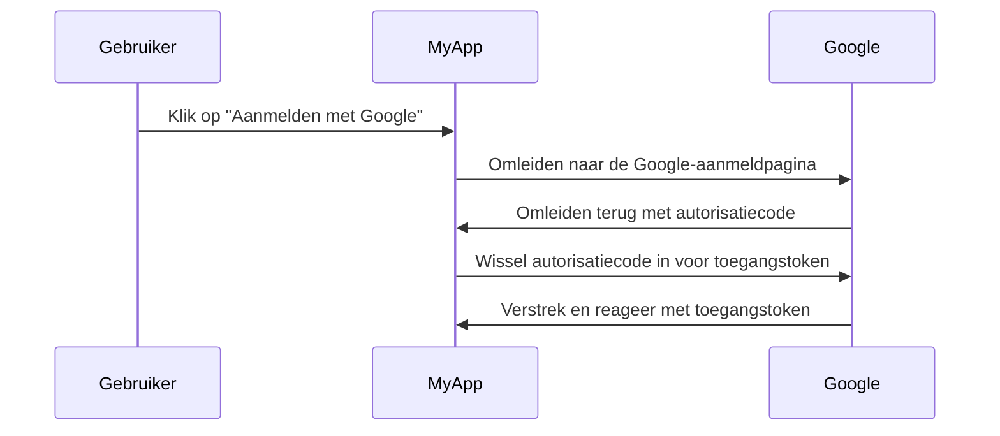

## Wat is een autorisatieserver?

De term "autorisatieserver" kan een algemene term zijn die verwijst naar elke server die autorisatie uitvoert. We richten ons op de definitie in de context van de <Ref slug="oauth-2.0" /> en <Ref slug="openid-connect" /> frameworks.

In OAuth 2.0 is een autorisatieserver een component dat <Ref slug="access-token">toegangstokens (access tokens)</Ref> uitgeeft aan <Ref slug="client">clients</Ref> na succesvolle authenticatie en autorisatie. De toegangstokens worden door clients gebruikt om toegang te krijgen tot beschermde bronnen namens de gebruiker (resource owner).

Te veel termen? Laten we een voorbeeld uit de echte wereld bekijken: een gebruiker klikt op "Aanmelden met Google" op een applicatie "MyApp" die <Ref slug="authorization-code-flow" /> gebruikt voor Google-aanmelding.

In dit voorbeeld fungeert Google als de **autorisatieserver** die een toegangstoken uitgeeft aan de **client** (MyApp) nadat de gebruiker succesvol is aangemeld. De client kan dan het **toegangstoken** gebruiken om het gebruikersprofiel (beschermde bron) op Google op te halen.

### Autorisatieserver in OpenID Connect (OIDC)

Aangezien OpenID Connect is gebouwd bovenop OAuth 2.0, hergebruikt het sommige termen en concepten van OAuth 2.0. OIDC voegt de authenticatiefunctie toe aan de OAuth 2.0 autorisatieserver, waardoor de autorisatieserver ook een <Ref slug="openid-connect" headingId="openid-provider-op" /> wordt. Om dubbelzinnigheid te voorkomen, raden we aan altijd de term "OpenID Provider" te gebruiken wanneer wordt verwezen naar de autorisatieserver in OIDC.

Naast het uitgeven van toegangstokens geeft de OpenID Provider (autorisatieserver) in OIDC ook <Ref slug="id-token">ID-tokens</Ref> aan clients uit. De ID-tokens bevatten gebruikersinformatie en worden gebruikt om gebruikers te authenticeren.

## Hoe werkt een autorisatieserver?

Een autorisatieserver moet de <Ref slug="oauth-2.0-grant">OAuth 2.0 grants (flows)</Ref> ondersteunen om toegangstokens aan clients uit te geven. Een grant type bestaat meestal uit een reeks stappen die de client en de autorisatieserver volgen om een toegangstoken te verkrijgen.

- Voor gebruikersautorisatie vereisen de meeste grant types dat de client een <Ref slug="authorization-request" /> naar de autorisatieserver initieert. In het bovengenoemde Google-aanmelding voorbeeld is de stap "Omleiden naar de Google-aanmeldpagina" een autorisatieverzoek dat door de client is geïnitieerd.
- Voor <Ref slug="machine-to-machine" /> autorisatie kan de client de <Ref slug="client-credentials-flow" /> gebruiken om rechtstreeks een <Ref slug="token-request" /> naar de autorisatieserver te sturen.

De autorisatieserver moet ook het verzoek van de client valideren, de client authenticeren en de identiteit van de gebruiker verifiëren voordat hij een toegangstoken uitgeeft. Het kan ook aanvullende beveiligingsmaatregelen afdwingen, zoals <Ref slug="pkce" /> voor de <Ref slug="authorization-code-flow" />.

## Gebruikscases voor autorisatieservers

Zoals de naam suggereert, worden autorisatieservers gebruikt om <Ref slug="authorization" /> te verwerken. De autorisatieserver kan eerste en derde partijen betreffen:

- Het bovengenoemde Google-aanmelding voorbeeld.
- Een e-commercewebsite (client) die toegang vraagt tot de betalingsinformatie van een gebruiker (beschermde bron) van een andere website.
- Een mobiele app (client) die toegang vraagt tot de locatiegegevens van een gebruiker (beschermde bron) van een locatieprovider.

Of het kan alleen worden gebruikt voor interne autorisatie, zoals:

- Een gebruiker moet toegang krijgen tot hun bestellingen (beschermde bron) op een e-commercewebsite (client).
- Een service (client) moet toegang krijgen tot een database (beschermde bron) in een microservices-architectuur.

In moderne applicaties kan een autorisatieserver ook een <Ref slug="identity-provider" /> zijn die ook <Ref slug="openid-connect" /> ondersteunt voor gebruikersauthenticatie.

<SeeAlso slugs={["oauth-2.0", "authorization-request", "access-token"]} />
 
<Resources
  urls={[
    "https://blog.logto.io/ciam-102-authz-and-rbac",
    "https://tools.ietf.org/html/rfc6749",
  ]}
/>
