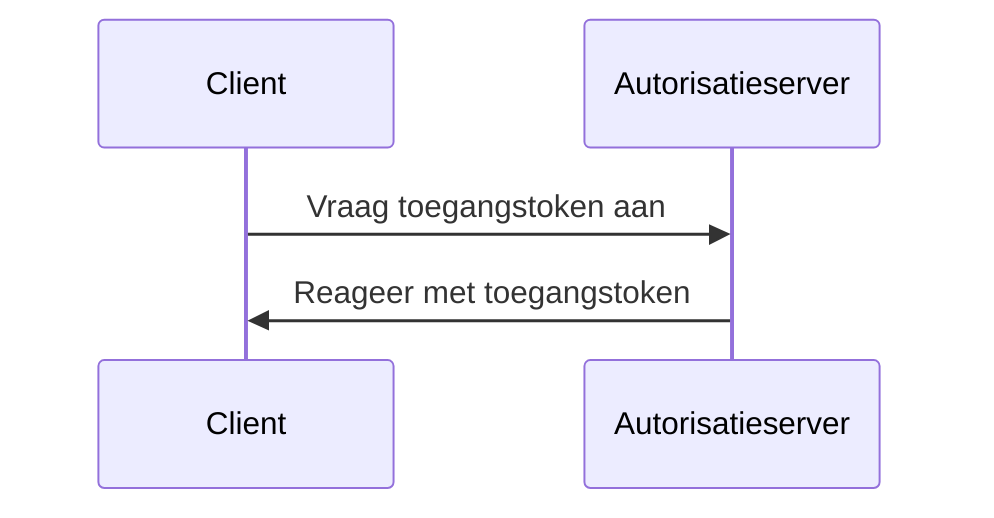
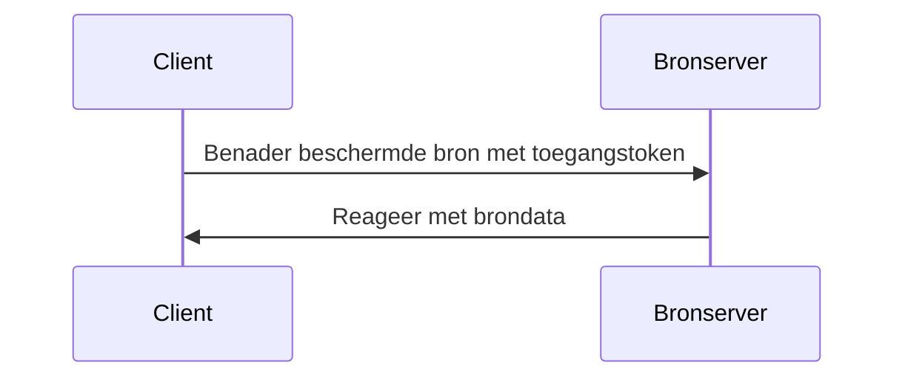

## Wat is clientreferentiestroom (client credentials flow)?

De clientreferentiestroom (client credentials flow) is een <Ref slug="oauth-2.0-grant" /> type waarmee vertrouwelijke clients <Ref slug="access-token">toegangstokens</Ref> kunnen verkrijgen om beschermde bronnen te benaderen. Meestal wordt deze stroom gebruikt voor <Ref slug="machine-to-machine" /> communicatie waar de client een server of een dienst is.

> [!Note]
> De client credentials flow is niet geschikt voor eindgebruikerauthorisatie (end-user authorization). Voor eindgebruikerauthorisatie moet je <Ref slug="authentication-request" /> of <Ref slug="authorization-request" /> gebruiken.

## Hoe werkt de clientreferentiestroom (client credentials flow)?

De client credentials flow is een eenvoudig tweestapsproces:

1. **Tokenaanvraag (Token request)**: De client stuurt een <Ref slug="token-request" /> met zijn clientreferenties (client ID en client secret) en de gevraagde <Ref slug="scope">scopes</Ref>.
2. **Tokenantwoord (Token response)**: De <Ref slug="authorization-server" /> valideert de clientreferenties en geeft een toegangstoken af als de client is geautoriseerd.

Hier is een vereenvoudigd sequentiediagram van de client credentials flow:



Hier is een niet-normatief voorbeeld van een tokenaanvraag in de client credentials flow:

```http
POST /token HTTP/1.1
Host: your-authorization-server.com
Content-Type: application/x-www-form-urlencoded

grant_type=client_credentials
  &client_id=YOUR_CLIENT_ID
  &client_secret=YOUR_CLIENT_SECRET
  &scope=read write
```

De autorisatieserver valideert de clientreferenties en geeft een toegangstoken af als de client is geautoriseerd. Zodra de client het toegangstoken ontvangt, kan het dit gebruiken om beschermde bronnen (bijvoorbeeld een API) namens zichzelf te benaderen. Hier is een voorbeeld van hoe een client het toegangstoken gebruikt om een API te benaderen:



Let op dat de <Ref slug="resource-server" /> het toegangstoken moet valideren en de <Ref slug="access-control" /> beleidsregels moet afdwingen om ervoor te zorgen dat de client de benodigde rechten heeft om de bron te benaderen.

### Belangrijkste parameters in een tokenaanvraag van de client credentials flow

In tegenstelling tot andere OAuth 2.0 flows heeft de client credentials flow een eenvoudige <Ref slug="token-request" /> met de volgende sleutelparameters:

- **`grant_type`**: Het grant-type moet worden ingesteld op `client_credentials` om de clientreferentiestroom aan te geven.
- **`client_id`**: De clientidentifier die is uitgegeven door de autorisatieserver.
- **`client_secret`**: Het clientgeheim dat is uitgegeven door de autorisatieserver.
- **`scope`**: De gevraagde <Ref slug="scope">scopes</Ref> (rechten) voor het toegangstoken.
- **`resource`**: De optionele parameter die de <Ref slug="resource-indicator" /> voor de gevraagde bronnen specificeert. De autorisatieserver moet [RFC 8707](https://datatracker.ietf.org/doc/html/rfc8707) ondersteunen om deze parameter te gebruiken.

## Overwegingen voor beveiliging

### Vertrouwelijke clients

De client credentials flow is geschikt voor <Ref slug="client" headingId="confidential-clients" /> (vertrouwelijke clients) die het clientgeheim veilig kunnen opslaan. Als de cliënt een openbare cliënt is (bijvoorbeeld een single-page applicatie), mag het de client credentials flow niet gebruiken omdat het clientgeheim kan worden blootgesteld.

### Tokenverval

Hoewel het toegangstoken verkregen in de client credentials flow een lange vervaltijd kan hebben, wordt aanbevolen om kortdurende toegangstokens te gebruiken (bijvoorbeeld 1 uur) om het risico op ongeautoriseerde toegang te verminderen als het token wordt aangetast.

### Rotatie van clientgeheim

Om de beveiliging te verbeteren, wordt aanbevolen om het clientgeheim periodiek te roteren. De autorisatieserver moet rotatie van clientgeheimen ondersteunen zonder de mogelijkheid van de client om toegangstokens te verkrijgen te beïnvloeden. De autorisatieserver moet bijvoorbeeld meerdere clientgeheimen ondersteunen voor achterwaartse compatibiliteit tijdens het rotatieproces.

<SeeAlso slugs={["machine-to-machine", "token-request", "access-token", "scope", "resource-indicator"]} />

<Resources
  urls={[
    "https://blog.logto.io/programmatic-authentication-methods",
    { 
      url: "https://datatracker.ietf.org/doc/html/rfc6749#section-4.4",
      result: {
        ogTitle: "Client Credentials Grant",
        ogDescription: "De client kan een toegangstoken aanvragen met alleen zijn clientreferenties (of andere ondersteunde middelen van authenticatie) wanneer de client toegang vraagt tot de beschermde bronnen onder zijn beheer, of die van een andere bron eigenaar die eerder is overeengekomen met de autorisatieserver."
      }
    }
  ]}
/>
