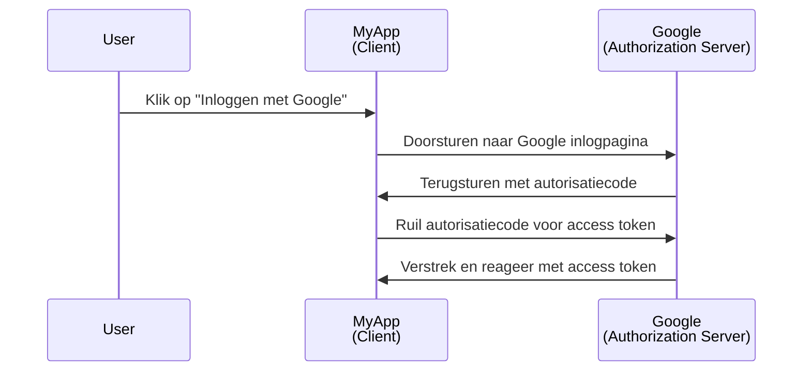
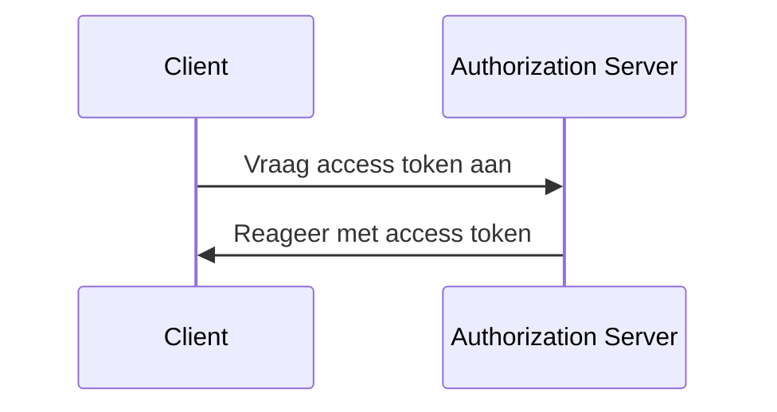

## Wat is een client?

Een client, in de context van <Ref slug="oauth-2.0" /> en <Ref slug="openid-connect" />, is een applicatie die authenticatie (authentication) of autorisatie (authorization) aanvraagt. Bijvoorbeeld, wanneer een gebruiker klikt op "Inloggen met Google" in een applicatie, fungeert de applicatie als een **client** die autorisatie van Google aanvraagt.

> "Client" en "applicatie" worden vaak door elkaar gebruikt in de context van <Ref slug="iam" />.

Er zijn meerdere categoriseringen van clients op basis van hun capaciteiten en vertrouwensniveaus, maar voor de frameworks is een belangrijk onderscheid tussen openbare en vertrouwelijke clients. Dit beïnvloedt hoe de client tokens kan verkrijgen en de soorten grants die het kan gebruiken.

### Openbare clients ||public-clients||

Openbare clients zijn applicaties die hun inloggegevens niet vertrouwelijk kunnen houden, wat betekent dat de resource owner (gebruiker) er toegang toe kan hebben. Voorbeelden van openbare clients zijn:

- Single-page applicaties (SPAs)
- Mobiele apps
- Desktop-apps

Je zou kunnen beweren dat mobiele en desktop-apps beveiligde opslagmogelijkheden hebben, maar de meeste frameworks beschouwen ze als openbare clients omdat ze worden gedistribueerd naar eindgebruikers en aangenomen wordt dat de eindgebruikers toegang kunnen hebben tot de inloggegevens.

### Vertrouwelijke clients ||confidential-clients||

Vertrouwelijke (privé) clients zijn applicaties die gevoelige informatie vertrouwelijk kunnen opslaan zonder deze bloot te stellen aan resource owners (eindgebruikers). Voorbeelden van vertrouwelijke clients zijn:

- Webservers
- Backend-diensten

## Hoe werkt een client?

### Gebruikersauthenticatie (authentication) en autorisatie (authorization)

Wanneer een client een gebruiker wil authenticeren (authentication), initieert een client een <Ref slug="authorization-request" /> naar de <Ref slug="authorization-server" /> om een <Ref slug="access-token" /> te verkrijgen. De client moet noodzakelijke parameters in het verzoek opnemen, zoals de client-ID, redirect URI en scopes. Hier is een vereenvoudigd sequentiediagram van de authorization code flow (autorisatiecode stroom):

In dit voorbeeld fungeert Google als de **authorization server** die een access token verstrekt aan de **client** (MyApp) nadat de gebruiker succesvol is ingelogd. De client kan vervolgens het **access token** gebruiken om het profiel van de gebruiker (beschermde bron) op Google op te halen.

Voor OpenID Connect (OIDC) clients moet de client een <Ref slug="authentication-request" /> initiëren om de gebruiker te authenticeren. Het gebruikt hetzelfde eindpunt als de autorisatieaanvraag, maar de parameters en de respons zijn verschillend.

### Machine-to-machine communicatie

Voor <Ref slug="machine-to-machine" /> communicatie kan de client de <Ref slug="client-credentials-flow" /> gebruiken om direct een <Ref slug="token-request" /> naar de authorization server te sturen. De client moet de client-ID, client secret, en scopes in het verzoek opnemen. Hier is een vereenvoudigd sequentiediagram van de client credentials flow:

De authorization server valideert de client-inloggegevens en verstrekt een access token als de client geautoriseerd is. Omdat de client het client secret moet verzenden, is het belangrijk om de client credentials flow alleen voor vertrouwelijke clients te gebruiken.

## Veiligheidsoverwegingen

### Clienttypes

Het clienttype (openbaar of privé) beïnvloedt de veiligheidsoverwegingen voor de client.

- Openbare clients moeten de client credentials flow niet gebruiken omdat ze het client secret niet veilig kunnen opslaan. In plaats daarvan wordt de <Ref slug="authorization-code-flow" /> met <Ref slug="pkce" /> aanbevolen voor openbare clients om gebruikers te authenticeren.
- Vertrouwelijke clients kunnen de client credentials flow gebruiken voor machine-to-machine communicatie. Ze moeten het client secret veilig opslaan en alleen gebruiken in beveiligde omgevingen.

### Tokenopslag

Clients moeten het hoogste niveau van mogelijke beveiliging gebruiken om tokens op te slaan. Bijvoorbeeld, in webapplicaties worden HTTP-only cookies aanbevolen voor het opslaan van access tokens om XSS-aanvallen te voorkomen.

### Tokenverval

Access tokens hebben een beperkte levensduur om het risico op ongeautoriseerde toegang te verminderen. Clients moeten tokenverval op een goede manier afhandelen door <Ref slug="refresh-token">refresh tokens</Ref> te gebruiken om nieuwe access tokens te verkrijgen.

### Tokenintrekking

Clients moeten voorbereid zijn om met tokenintrekking om te gaan. Als de gebruiker zich afmeldt of de authorization server het token intrekt, moet de client het token uit de opslag aan de clientzijde wissen.

<SeeAlso slugs={["oauth-2.0", "oauth-2.0-grant", "openid-connect", "authorization-request", "authentication-request"]} />

<Resources
  urls={[
    "https://blog.logto.io/secure-cloud-apps-with-oauth-and-openid-connect",
    "https://datatracker.ietf.org/doc/html/rfc6749",
    "https://openid.net/specs/openid-connect-core-1_0.html"
  ]}
/>
