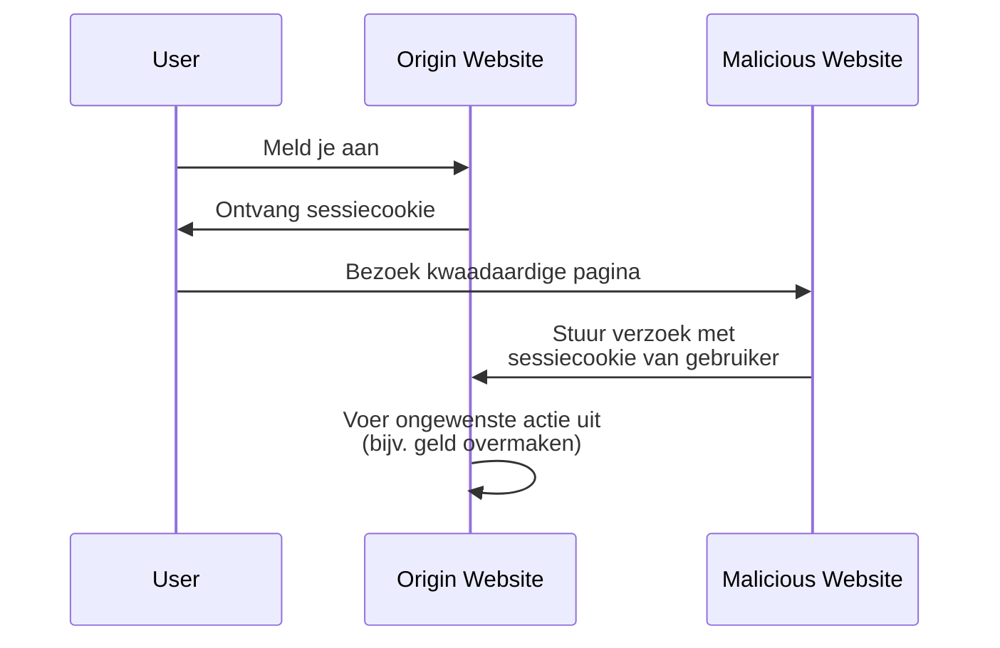

## Wat is cross-site request-vervalsing (CSRF)?

Bij het ontwikkelen van webapplicaties is CSRF een vaak gehoorde term die angst inboezemt bij ontwikkelaars en beveiligingsprofessionals. Het is een type aanval die geverifieerde gebruikers misleidt (of tracht) om ongewenste acties uit te voeren op een webapplicatie zonder hun toestemming.

CSRF is ook bekend als een "one-click attack" of "session riding" omdat het vertrouwt op de actieve sessie van de gebruiker om kwaadaardige acties uit te voeren.

## Hoe werkt CSRF?

De CSRF-aanval werkt door het vertrouwen dat een webapplicatie heeft in de browser van de gebruiker te misbruiken. Hier is hoe het doorgaans gebeurt:



Je hebt misschien vragen over deze volgorde. Laten we de redenen erachter verkennen.

### Waarom kan de kwaadaardige website een verzoek naar de oorspronkelijke website sturen?

Het Same-Origin Policy (SOP) is een beveiligingsfunctie in webbrowsers die beperkt hoe een document of script geladen van één oorsprong kan omgaan met een bron (bijv. cookies, DOM) van een andere oorsprong. Echter, de SOP voorkomt niet dat de browser verzoeken naar een andere oorsprong stuurt.

Dus, hoewel de kwaadaardige website de sessiecookie niet direct kan lezen of wijzigen, kan het nog steeds verzoeken naar de oorspronkelijke website sturen met gebruik van de actieve sessie van de gebruiker.

Je zou kunnen beweren dat de meeste webapplicaties ook [CORS](https://developer.mozilla.org/en-US/docs/Web/HTTP/CORS) gebruiken om ongeautoriseerde cross-origin-verzoeken te voorkomen, maar CSRF heeft nog steeds een manier om het te omzeilen:

1. Get-gebaseerde aanvallen: De kwaadaardige website kan de gebruiker misleiden om een URL te bezoeken die een actie uitvoert op de oorspronkelijke website:

    - Een omleiding naar `https://example.com/transfer?amount=1000&to=attacker`.
    - Een afbeeldingstag die `https://example.com/transfer?amount=1000&to=attacker` laadt.

    Dat is een belangrijke reden waarom GET-verzoeken geen bijwerkingen zouden moeten hebben.

2. Formulier-gebaseerde aanvallen: De kwaadaardige website kan een verborgen formulier maken dat gegevens naar de oorspronkelijke website indient. Bijvoorbeeld, een POST-verzoek naar `https://example.com/transfer` met verborgen formulier velden.

### Waarom heeft de kwaadaardige website de sessiecookie van de gebruiker?

De browser van de gebruiker stuurt automatisch cookies naar de oorspronkelijke website wanneer er verzoeken worden gedaan. Dit is hoe de oorspronkelijke website weet dat de gebruiker is geverifieerd en kan acties namens hen uitvoeren.

In feite heeft de kwaadaardige website de sessiecookie niet "in bezit"; het misbruikt alleen het gedrag van de browser om de cookie samen met het verzoek te verzenden.

## Hoe CSRF-aanvallen te voorkomen?

Het voorkomen van CSRF-aanvallen vereist een gelaagde aanpak die zowel de server als de client betreft. Hier zijn enkele veelvoorkomende technieken om CSRF-kwetsbaarheden te verminderen:

### Gebruik anti-CSRF tokens

Anti-CSRF tokens zijn willekeurige waarden die door de server worden gegenereerd en ingebed in de formulieren van de webapplicatie. Wanneer het formulier wordt ingediend, valideert de server de token om te verzekeren dat het verzoek legitiem is.

Bijvoorbeeld, een verborgen invoerveld in een HTML-formulier:

```html
<form action="/transfer" method="post">
  <input type="hidden" name="csrf_token" value="random_token_here" />
  <!-- Other form fields -->
  <button type="submit">Overboeken</button>
</form>
```

Met deze aanpak kan de kwaadaardige website geen verzoek vervalsen omdat het de anti-CSRF token niet kent. De `state` parameter in <Ref slug="redirect-uri" /> is een vergelijkbaar concept.

### Gebruik SameSite cookies

Met de `SameSite` attribuut in cookies kunnen CSRF-aanvallen worden voorkomen door te beperken wanneer cookies naar de server worden gestuurd:

| `SameSite` waarde | Beschrijving                                                                          |
|-------------------|---------------------------------------------------------------------------------------|
| `Strict`          | Cookies worden alleen in een eerste-partij context verzonden.                         |
| `Lax`             | Cookies worden verzonden in een eerste-partij context en met GET-verzoeken van externe sites. |
| `None`            | Cookies worden in alle contexten verzonden. Vereist `Secure` attribuut.               |

Door de `SameSite` attribuut in te stellen op `Strict` of `Lax` zonder bijwerkingen in je GET-verzoeken, kan je CSRF-aanvallen voorkomen.

Daarnaast moet de `Secure` attribuut altijd worden ingesteld om ervoor te zorgen dat de cookie alleen wordt verzonden via HTTPS-verbindingen.

### Controleer de headers

1. **Origin header**: De `Origin` header wordt door de browser verzonden om de oorsprong van het verzoek aan te geven. De server kan deze header controleren om te verzekeren dat het verzoek van een verwachte oorsprong komt.
2. **Referer header**: De `Referer` header bevat de URL van de vorige pagina. Hoewel deze kan worden vervalst, kan het toch worden gebruikt als een extra beschermingslaag.

<SeeAlso slugs={["authorization-code-flow", "redirect-uri"]} />

<Resources
  urls={[
    'https://blog.logto.io/csrf',
    "https://cheatsheetseries.owasp.org/cheatsheets/Cross-Site_Request_Forgery_Prevention_Cheat_Sheet.html",
  ]}
/>
