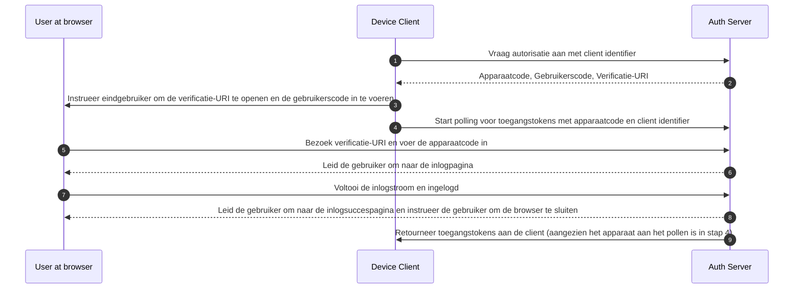

## Wat is apparaatstroom (device flow)?

De [OAuth Apparaat Autorisatie Stroom](https://www.rfc-editor.org/rfc/rfc8628), ook bekend als apparaatstroom (device flow), is een <Ref slug="oauth-2.0-grant" /> ontworpen voor apparaten met beperkte invoermogelijkheden (bijv. smart-tv's, IoT-apparaten, spelconsoles) of toepassingen zonder interface (bijv. CLI-tools). Het stelt gebruikers in staat om <Ref slug="authorization-request">autorisatieverzoeken</Ref> op deze apparaten te initiëren en vervolgens het proces te voltooien met behulp van een apparaat met meer invoermogelijkheden, zoals een smartphone of laptop.

## Wanneer gebruik je apparaatstroom (device flow)?

1. **Apparaten met beperkte invoermogelijkheden**
    - Inloggen op Smart-tv's (bijv. media-apps)
    - Inloggen op Spelconsoles (bijv. spelsystemen of media-apps)
    - Inloggen op Vergaderapparaten (bijv. officiële apps of videovergaderapps)
    - Inloggen op Draagbare Apparaten (bijv. smartwatches met beperkte invoer)
    - Toegang tot IoT-apparaten (bijv. printers, video-encoders of luidsprekers)
2. **Toepassingen zonder interface**
    - Command-Line Interface inloggen (bijv. GitHub CLI of Stripe CLI)
3. **QR-code inloggen voor Desktoptoepassingen**
    - Snel en veilig inloggen op desktoptoepassingen door een QR-code te scannen met je smartphone (bijv. Telegram, Steam inloggen op desktop). Deze QR-code inlogstroom kan worden beschouwd als een variant van de traditionele OAuth 2.0 apparaatstroom.

## Hoe ziet de eindgebruikersstroom van apparaatstroom (device flow) eruit?

Als we de QR-code inlogvariant negeren, richten we ons op de standaard OAuth 2.0 apparaatstroom. Er zijn twee soorten apparaten betrokken:

### Apparaatcode weergaveapparaat

Dit is het apparaat met beperkte invoer of de toepassing zonder interface waar de gebruiker toegang moet autoriseren. Het toont de [apparaatcode en verificatie-URI](#what-does-device-flow-workflow-look-like), en begeleidt de gebruiker over hoe verder te gaan.

De basis UI is:


Om de gebruikerservaring te verbeteren, genereren diensten vaak een QR-code voor de Verificatie-URL:


Voor nog meer efficiëntie, vervang de QR-codebron in de `verification_uri` (bijv. `https://example.com/device`) met `verification_uri_complete` (bijv. `https://example.com/device?user_code=DSHP-SNCT`), die de apparaatcode in de URL bevat, waardoor gebruikers de apparaatcode vooraf kunnen invullen in velden.

### Autorisatieapparaat

Volgens de instructies op het inlogdoelapparaat zal de gebruiker:

1. Een ander apparaat met browsertoegang en invoermogelijkheden gebruiken om de Verificatie-URL te openen.
2. De weergegeven apparaatcode invoeren (die mogelijk vooraf is ingevuld) en doorgaan.
3. Als er geen bestaande sessies in de browser zijn, zal de gebruiker eerst inloggen op de dienst.
4. Een toestemmingspagina zal de gebruikers vragen om de apparaat inlog te autoriseren.
5. Ten slotte zal een succesvolle pagina worden weergegeven na autorisatie.


Hier zijn enkele gevestigde producten' apparaatstroom Verificatie-URL's voor je testen:

- Log in op [YouTube op smart-tv's](https://www.youtube.com/watch?v=yTcuazSy5Cs): [youtube.com/activate](https://youtube.com/activate)
- Log in op Disney+ op smart-tv: [disneyplus.com/begin](https://disneyplus.com/begin)
- Log in op [Shopify op Samsung Galaxy Watch](https://www.drmare.com/spotify-music/spotify-on-galaxy-watch.html): [spotify.com/pair](https://spotify.com/pair)
- Log in op [Zoom op vergaderapparaten](https://developers.zoom.us/blog/device-authorization/): [zoom.us/oauth_device](https://zoom.us/oauth_device)
- Log in op [GitHub CLI](https://docs.github.com/en/apps/oauth-apps/building-oauth-apps/authorizing-oauth-apps#device-flow): [github.com/login/device](https://github.com/login/device)
- Gebruik [Google apparaatstroom](https://www.oauth.com/oauth2-servers/device-flow/user-flow/): https://www.google.com/device

## Hoe ziet het workflow van apparaatstroom (device flow) eruit?

Ten eerste moet je de parameters van de apparaat autorisatie respons begrijpen, die worden gebruikt om de informatie op het apparaatcode weergaveapparaat te verwerken:

| Parameter                              | Beschrijving                                                                                                                                                                    |
| -------------------------------------- | ------------------------------------------------------------------------------------------------------------------------------------------------------------------------------ |
| `device_code`                          | De apparaat verificatiecode.                                                                                                                                                  |
| `user_code`                            | De eindgebruikers verificatiecode.                                                                                                                                                |
| `verification_uri`                     | De eindgebruikers verificatie-URI op de autorisatieserver. De URI moet kort en gemakkelijk te onthouden zijn, aangezien eindgebruikers worden gevraagd deze handmatig in te typen in hun user agent. |
| `verification_uri_complete` (optioneel) | Een verificatie-URI die de "user_code" bevat (of andere informatie met dezelfde functie als de "user_code"), die is ontworpen voor niet-tekstuele transmissie.             |
| `expires_in`                           | De levensduur in seconden van de "device_code" en "user_code".                                                                                                                  |
| `interval`                             | De minimale hoeveelheid tijd in seconden die de client MOET wachten tussen pollingverzoeken naar het token endpoint. Als er geen waarde is opgegeven, MOETEN clients 5 als standaard gebruiken. |

```json
{
    "device_code": "GmRhmhcxhwAzkoEqiMEg_DnyEysNkuNhszIySk9eS",
    "user_code": "WDJBMJHT",
    "verification_uri": "https://custom.domain.com/device",
    "verification_uri_complete":
        "https://custom.domain.com/device?user_code=WDJB-MJHT",
    "expires_in": 900,
    "interval": 5
}
```

Wanneer een gebruiker de apparaatstroom gebruikt voor authenticatie, omvat dit voornamelijk de volgende stappen:



1. De apparaatclient vraagt autorisatie aan bij de auth server met een client identifier (meestal de client id op het auth server platform).
2. De auth server reageert naar de apparaatclient met apparaatcode, gebruikerscode en verificatie-URI.
3. De apparaatclient toont de verificatie-URI en gebruikerscode aan de gebruiker in de vorm van tekst (of een QR-code, etc.), en instrueert de gebruiker om de URI te bezoeken en de code in te voeren.
4. Tegelijkertijd met stap 3, start de apparaatclient met pollen voor toegangstokens met apparaatcode en client identifier van de auth server en begint te wachten tot de gebruiker de <Ref slug="authorization-request" /> beoordeelt en de gebruikersautorisatie voltooit.
5. De gebruiker bezoekt de verificatie-URI gehost door de auth server, via een browser op een ander apparaat, en voert de gebruikerscode in.
6. De auth server leidt de gebruiker om naar de inlogpagina en instrueert de gebruiker om het inloggen te voltooien.
7. De gebruiker voltooit de inlogstroom en is succesvol ingelogd.
8. De auth server leidt de gebruiker om naar de inlogsuccespagina en instrueert de gebruiker om de browser te sluiten.
9. Tegelijkertijd met stap 8, retourneert de auth server toegangstokens aan de apparaatclient aangezien de client aan het pollen is sinds stap 4.

Na deze processen zal de apparaatclient in staat zijn om de <Ref slug="access-token" /> te verkrijgen voor volgende diensten.

Voor meer details, lees [RFC 8628 OAuth 2.0 Apparaat Autorisatie Grant](https://datatracker.ietf.org/doc/html/rfc8628#autoid-3).

## Wat zijn de beveiligingsoverwegingen voor apparaatstroom (device flow)?

De apparaatstroom omvat interactie tussen twee apparaten, waardoor het blootgesteld wordt aan potentiële beveiligingsrisico's zoals apparaatcodeblootstelling, brute-force aanvallen of man-in-the-middle (MitM) aanvallen.

Hoewel het verkrijgen van een apparaatcode alleen niet onmiddellijk autorisatie verleent (aangezien de gebruiker nog steeds moet authenticeren en autoriseren), kan een aanvaller proberen een apparaatcodeverzoek te herhalen tijdens de geldigheidsperiode. Dit kan resulteren in ongeautoriseerde herhaalde toegang. Om de beveiliging te verbeteren, overweeg de volgende voorzorgsmaatregelen:

- **Verkort de `expires_in` duur:** Verminder het venster voor aanvallen door de geldigheidsperiode van de apparaatcode te minimaliseren.
- **Beperk mislukte pogingen:** Beperk het aantal onjuiste code-invoeringen om brute-force aanvallen te voorkomen.
- **Handhaaf HTTPS:** Zorg ervoor dat alle communicatie tussen het apparaat en de autorisatieserver is versleuteld met HTTPS om man-in-the-middle aanvallen te voorkomen.
- **Beperk eenmalig gebruik van apparaatcodes:** Beperk elke apparaatcode tot **een enkele sessie** om hergebruik door ongeautoriseerde partijen te voorkomen.

Merk op dat eenmalig gebruik voor apparaatcodes geen ingebouwde vereiste is van de OAuth 2.0 Apparaatstroom. Het is een optionele beste praktijk. Sommige ontwikkelaars kunnen opzettelijk ontwerpen voor gelijktijdige apparaatautorisaties met dezelfde code (bijv. op honderden apparaten), maar deze aanpak verhoogt de beveiligingsrisico's en moet zorgvuldig worden geëvalueerd.

## Ondersteunen OIDC-providers apparaatstroom (device flow)?

Hoewel apparaatstroom traditioneel wordt geassocieerd met OAuth, kunnen <Ref slug="openid-connect" /> providers het ook ondersteunen. OIDC biedt extra voordelen naast OAuth's primaire focus op autorisatie. Het breidt zich uit naar authenticatie, waardoor toepassingen zowel <Ref slug="access-token" /> als <Ref slug="id-token" /> in een enkele stroom kunnen verkrijgen.

OIDC's robuuste geïntegreerde identiteitsbeheer, inclusief tokenvalidatie en <Ref slug="refresh-token">verversing</Ref>, maakt het goed geschikt voor veilige, betrouwbare <Ref slug="authentication" /> en <Ref slug="authorization" /> tussen apparaten en toepassingen, met name die met beperkte invoermogelijkheden.

<SeeAlso slugs={['oauth-2.0-grant', 'authorization-code-flow', 'implicit-flow', 'client-credentials-flow']} />

<Resources urls={['https://blog.logto.io/a-brief-introduction-to-oauth2-device-flow', 'https://datatracker.ietf.org/doc/html/rfc8628']} />