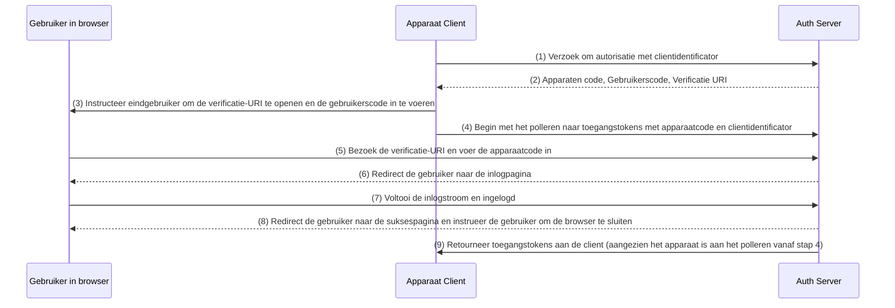

## Wat is apparaatstroom (device flow)?

De [OAuth Device Authorization Flow](https://www.rfc-editor.org/rfc/rfc8628), ook bekend als Device Flow, is een implementatie van [OAuth 2.0](https://oauth.net/2/) ontworpen voor apparaten met beperkte invoermogelijkheden (bijv. smart-tv's, IoT-apparaten, spelconsoles) of headless apps (bijv. CLI-tools). Het stelt gebruikers in staat om autorisatieverzoeken op deze apparaten te starten en vervolgens het proces te voltooien met behulp van een apparaat dat meer invoermogelijkheden heeft, zoals een smartphone of laptop.

## Wanneer gebruik je apparaatstroom (device flow)?

1. **Apparaten met beperkte invoer**
    - Inloggen op Smart-TV's (bijv. media-apps)
    - Inloggen op spelconsoles (bijv. spelsysteem of media-apps)
    - Inloggen op Meet-apparaten (bijv. officiële apps of videovergadering-apps)
    - Inloggen op draagbare apparaten (bijv. smartwatches met beperkte invoer)
    - Toegang tot IoT-apparaten (bijv. printers, video-encoders of luidsprekers)
2. **Headless applicaties**
    - Command-Line Interface inloggen (bijv. GitHub CLI of Stripe CLI)
3. **QR-code inloggen voor desktopapplicaties**
    - Snel en veilig inloggen op desktopapplicaties door een QR-code te scannen met je smartphone (bijv. Telegram, Steam-inlog op desktop). Deze QR-code inlogstroom kan worden beschouwd als een variant van de traditionele OAuth 2.0 apparaatstroom.

## Hoe ziet de eindgebruikersstroom van apparaatstroom (device flow) eruit?

Als we de QR-code inlogvariant negeren, laten we ons richten op de standaard OAuth 2.0 apparaatstroom. Er zijn twee soorten apparaten betrokken:

### Apparaatcodeweergave-apparaat

Dit is het apparaat met beperkte invoer of headless applicatie waar de gebruiker toegang moet autoriseren. Het toont de [apparaatcode en verificatie-URI](#wat-ziet-apparaatstroom-werkstroom-eruit), en begeleidt de gebruiker hoe verder te gaan.

De basis UI is:


Om de gebruikerservaring te verbeteren, genereren diensten vaak een QR-code voor de verificatie-URL:


Voor nog meer efficiëntie, vervang de QR-codebron in de `verification_uri` (bijv. `https://example.com/device`) met `verification_uri_complete` (bijv. `https://example.com/device?user_code=WDJB-MJHT`), die de apparaatcode in de URL bevat, waardoor gebruikers de apparaatcode in velden kunnen vooraf invullen.

### Autorisatie-apparaat

Volgend op de instructies op het inlogdoelapparaat, zal de gebruiker:

1. Een ander apparaat gebruiken met browsertoegang en invoermogelijkheden om de verificatie-URL te openen.
2. De weergegeven apparaatcode invoeren (die mogelijk vooraf is ingevuld) en doorgaan.
3. Als er geen bestaande sessies in de browser zijn, moet de gebruiker eerst inloggen bij de dienst.
4. Een toestemmingspagina zal gebruikers vragen om de apparaat-inlog te autoriseren.
5. Ten slotte wordt een pagina met succes weergegeven na autorisatie.

Hier zijn enkele gevestigde producten met apparaatstroom Verificatie-URL's voor je testen:

- Inloggen bij [YouTube op smart-tv's](https://www.youtube.com/watch?v=yTcuazSy5Cs): [youtube.com/activate](https://youtube.com/activate)
- Inloggen bij Disney+ op smart-tv: [disneyplus.com/begin](https://disneyplus.com/begin)
- Inloggen bij [Shopify op Samsung Galaxy Watch](https://www.drmare.com/spotify-music/spotify-on-galaxy-watch.html): [spotify.com/pair](https://spotify.com/pair)
- Inloggen bij [Zoom op vergaderapparaten](https://developers.zoom.us/blog/device-authorization/): [zoom.us/oauth_device](https://zoom.us/oauth_device)
- Inloggen bij [GitHub CLI](https://docs.github.com/en/apps/oauth-apps/building-oauth-apps/authorizing-oauth-apps#device-flow): [github.com/login/device](https://github.com/login/device)
- Gebruik de [Google apparaatstroom](https://www.oauth.com/oauth2-servers/device-flow/user-flow/): https://www.google.com/device

## Hoe ziet de werkstroom van apparaatstroom (device flow) eruit?

Ten eerste moet je de parameters van het apparaatautorisatierespons begrijpen, die worden gebruikt om de informatie weer te geven op het apparaatcodeweergave-apparaat:

| Parameter                              | Beschrijving                                                                                                                                                                    |
| -------------------------------------- | ------------------------------------------------------------------------------------------------------------------------------------------------------------------------------ |
| `device_code`                          | De verificatiecode van het apparaat.                                                                                                                                            |
| `user_code`                            | De verificatiecode van de eindgebruiker.                                                                                                                                        |
| `verification_uri`                     | De verificatie-URI van de eindgebruiker op de autorisatieserver. De URI moet kort en gemakkelijk te onthouden zijn, omdat eindgebruikers gevraagd zullen worden deze handmatig in te typen in hun user agent. |
| `verification_uri_complete` (optioneel) | Een verificatie-URI die de "user_code" bevat (of andere informatie met dezelfde functie als de "user_code"), welke is ontworpen voor niet-tekstuele transmissie.             |
| `expires_in`                           | De levensduur in seconden van de "device_code" en "user_code".                                                                                                                  |
| `interval`                             | De minimale tijd in seconden die de client MOET wachten tussen de pollingverzoeken naar de token endpoint. Als er geen waarde is opgegeven, MOETEN clients 5 als standaard gebruiken. |

```json
{
    "device_code": "GmRhmhcxhwAzkoEqiMEg_DnyEysNkuNhszIySk9eS",
    "user_code": "WDJBMJHT",
    "verification_uri": "https://custom.domain.com/device",
    "verification_uri_complete":
        "https://custom.domain.com/device?user_code=WDJB-MJHT",
    "expires_in": 900,
    "interval": 5
}
```

Wanneer een gebruiker de apparaatstroom voor authenticatie gebruikt, omvat het voornamelijk de volgende stappen:



1. De apparaatclient vraagt autorisatie van de auth server met een clientidentificator (meestal de client-ID op het auth serverplatform).
2. De auth server reageert op de apparaatclient met apparaatcode, gebruikerscode en verificatie-URI.
3. De apparaatclient toont de verificatie-URI en gebruikerscode aan de gebruiker in de vorm van tekst (of een QR-code, enz.), en instrueert de gebruiker om de URI te bezoeken en de code in te voeren.
4. Tegelijkertijd met stap 3 begint de apparaatclient te polleren naar toegangstokens met apparaatcode en clientidentificator van de auth server en begint te wachten tot de gebruiker het autorisatieverzoek beoordeelt en de gebruikersautorisatie voltooit.
5. De gebruiker bezoekt de verificatie-URI gehost door de auth server, via een browser op een ander apparaat, en voert de gebruikerscode in.
6. De auth server leidt de gebruiker naar de inlogpagina en instrueert de gebruiker om de inlogstroom te voltooien.
7. De gebruiker heeft de inlogstroom voltooid en is succesvol ingelogd.
8. De auth server leidt de gebruiker naar de inlogsuccespagina en instrueert de gebruiker om de browser te sluiten.
9. Tegelijkertijd met stap 8 retourneert de auth server toegangstokens aan de apparaatclient, aangezien de client heeft gepollt sinds stap 4.

Na deze processen kan de apparaatclient het access token verkrijgen voor volgende diensten!

Voor meer details, lees [RFC 8628 OAuth 2.0 Device Authorization Grant](https://datatracker.ietf.org/doc/html/rfc8628#autoid-3).

<SeeAlso slugs={['authorization-code-flow', 'implicit-flow', 'client-credentials-flow']} />

<Resources urls={['https://blog.logto.io/a-brief-introduction-to-oauth2-device-flow', 'https://datatracker.ietf.org/doc/html/rfc8628']} />