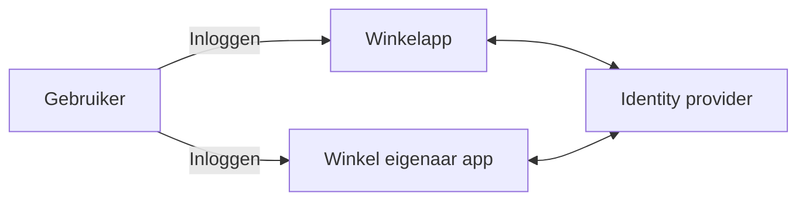
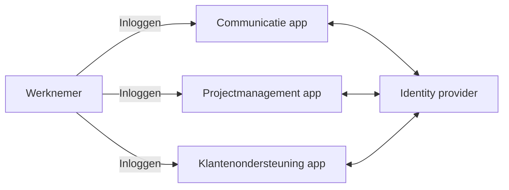
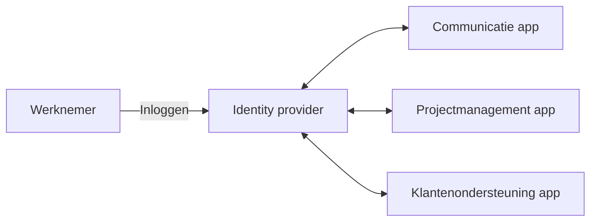
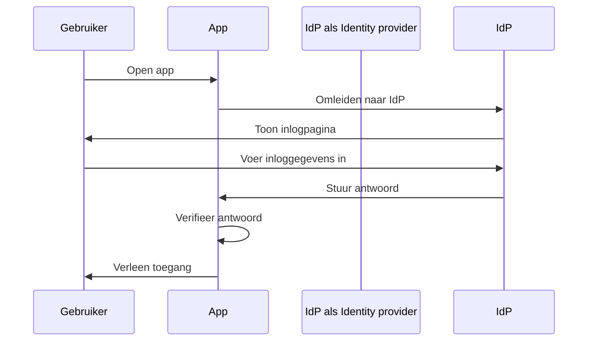
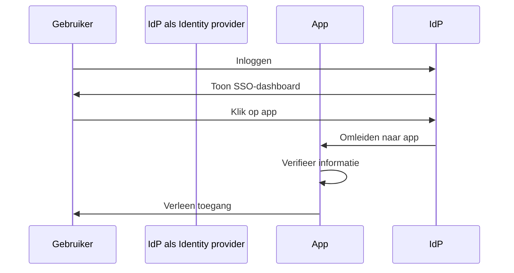
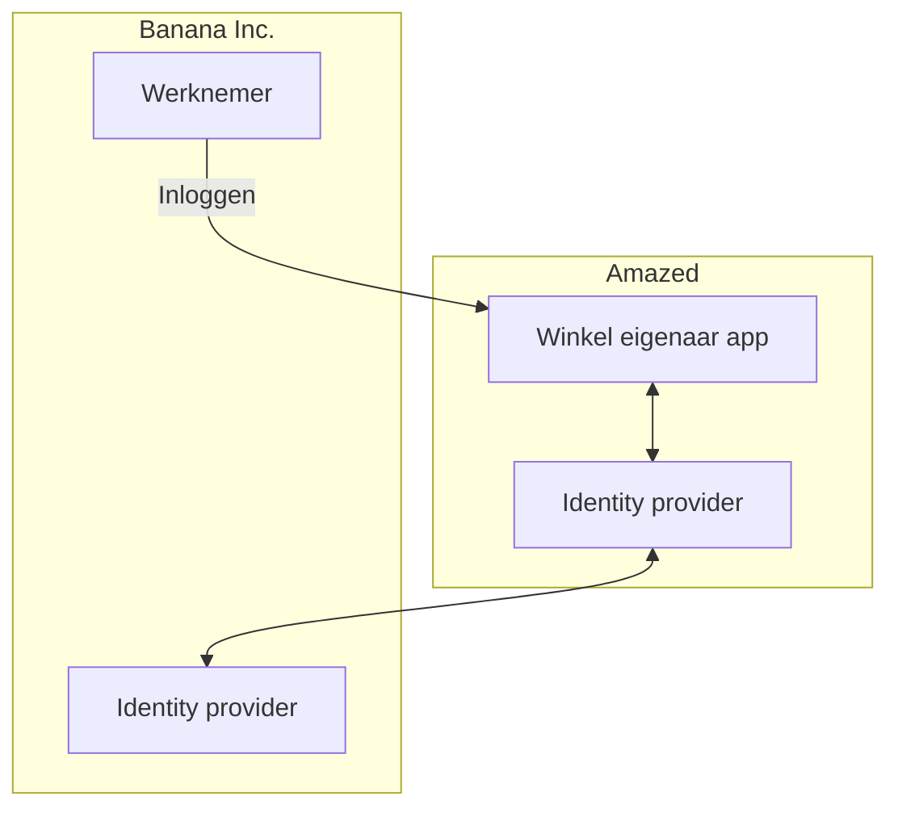

## Wat is Enterprise SSO?

Voordat we de definitie induiken, is het belangrijk om het verschil tussen SSO en Enterprise SSO te verduidelijken, aangezien dit vaak voor verwarring kan zorgen.

- <Ref slug="single-sign-on" /> is een algemene term die verwijst naar het vermogen van een gebruiker om eenmalig in te loggen en toegang te krijgen tot meerdere applicaties of bronnen zonder opnieuw in te loggen.
- Enterprise SSO is een specifiek type SSO ontworpen voor werknemers binnen een organisatie.

Nog steeds niet zeker? Laten we naar een voorbeeld kijken:

Een online winkelwebsite genaamd _Amazed_ heeft twee webapplicaties: één voor klanten en één voor winkel eigenaren. Klanten loggen in op de winkelapp om producten te kopen, terwijl winkel eigenaren inloggen op de winkel eigenaar app om hun winkels te beheren. Beide apps gebruiken dezelfde identiteit provider (identity provider) voor authenticatie (authentication). Hierdoor hoeven gebruikers maar één keer in te loggen om toegang te krijgen tot beide apps, wat een single sign-on ervaring biedt.

Intern gebruikt _Amazed_ meerdere applicaties voor teamcommunicatie, projectmanagement en klantenondersteuning. Om dagelijkse workflows te stroomlijnen, implementeert _Amazed_ Enterprise SSO voor zijn werknemers. Met Enterprise SSO kunnen werknemers toegang krijgen tot alle interne applicaties met een enkele login.

Typisch bieden Enterprise SSO-oplossingen ook een gecentraliseerd dashboard voor werknemers om met één klik toegang te krijgen tot alle applicaties. Dit dashboard wordt vaak het SSO-dashboard genoemd.

Kort gezegd, beide scenario's zijn voorbeelden van single sign-on (SSO). Het verschil is dat het eerste voorbeeld een algemene SSO is, terwijl het tweede Enterprise SSO is. Dit zijn typische use-cases voor Klant IAM (Identity and Access Management) en Workforce IAM, respectievelijk.

## Hoe werkt Enterprise SSO?

Enterprise SSO werkt door meerdere applicaties te verbinden met een gecentraliseerde identity provider. De verbinding kan eenrichtingsverkeer zijn (van de applicatie naar de identity provider) of tweerichtingsverkeer (tussen de applicatie en de identity provider). Verschillende standaarden en protocollen, zoals SAML, OpenID Connect en OAuth 2.0, worden gebruikt voor deze verbindingen.

Ongeacht het protocol is de basisworkflow meestal vergelijkbaar:

1. De gebruiker opent een applicatie (bijvoorbeeld een communicatie-app) die authenticatie vereist.
2. De applicatie leidt de gebruiker om naar de identity provider voor authenticatie.
3. De gebruiker logt in bij de identity provider.
4. De identity provider stuurt een authenticatie-antwoord terug naar de applicatie.
5. De applicatie verifieert het antwoord en verleent de gebruiker toegang.

Wanneer de gebruiker een andere applicatie opent (bijvoorbeeld een projectmanagement-app) die is verbonden met dezelfde identity provider, wordt hij automatisch ingelogd zonder opnieuw zijn inloggegevens in te voeren. In dit geval wordt stap 3 overgeslagen en aangezien stappen 2, 4 en 5 op de achtergrond plaatsvinden, merkt de gebruiker het authenticatieproces mogelijk niet eens op.

Dit proces wordt Service Provider (SP)-Initiated SSO genoemd, waarbij de applicatie (SP) het authenticatieproces initieert.

In een ander scenario biedt de identity provider een gecentraliseerd dashboard voor gebruikers om toegang te krijgen tot alle verbonden applicaties. Een vereenvoudigde workflow is:

1. De gebruiker logt in bij de identity provider.
2. De identity provider toont een lijst van applicaties waartoe de gebruiker toegang heeft.
3. De gebruiker klikt op een applicatie (bijvoorbeeld de klantenondersteuningsapp) om toegang te krijgen.
4. De identity provider leidt de gebruiker om naar de applicatie met authenticatie-informatie.
5. De applicatie verifieert de informatie en verleent de gebruiker toegang.

Dit proces wordt Identity Provider (IdP)-Initiated SSO genoemd, waarbij de identity provider (IdP) het authenticatieproces initieert.

## Waarom is Enterprise SSO belangrijk?

### Enterprise SSO in Workforce IAM

#### Gecentraliseerd beheer

Het primaire voordeel van Enterprise SSO is niet alleen gemak voor werknemers, maar ook verbeterde beveiliging en naleving voor organisaties. In plaats van meerdere inloggegevens voor verschillende applicaties te beheren en authenticatie en autorisatie voor elk afzonderlijk te configureren, kunnen organisaties het beheer van gebruikersidentiteiten, toegangscontrolebeleid en auditlogs centraliseren.

Bijvoorbeeld, wanneer een werknemer het bedrijf verlaat, kan de IT-afdeling het account van de werknemer in de identity provider uitschakelen, waardoor onmiddellijk toegang tot alle applicaties wordt ingetrokken. Dit is cruciaal om ongeautoriseerde toegang en datalekken te voorkomen, een proces dat bekend staat als levenscyclusbeheer.

#### Toegangscontrole

Enterprise SSO oplossingen omvatten vaak toegangscontrolefuncties, zoals role-based access control (RBAC) en attribute-based access control (ABAC). Deze functies stellen organisaties in staat gedetailleerde toegangsbeleidsregels te definiëren op basis van gebruikersrollen, attributen en andere contextuele informatie, waardoor werknemers het juiste toegangs niveau tot de juiste bronnen hebben.

Voor een gedetailleerde vergelijking tussen RBAC en ABAC, bekijk [RBAC en ABAC: De toegangscontrolemodellen die je moet kennen](https://blog.logto.io/rbac-and-abac).

#### Verbeterde beveiliging

Een ander voordeel is de mogelijkheid om sterke authenticatiemethoden af te dwingen, zoals multi-factor authentication (MFA), passwordless authentication en adaptieve authenticatie, voor alle applicaties. Deze methoden helpen bij het beschermen van gevoelige gegevens en voldoen aan industriële regelgeving.

Voor meer informatie over MFA, raadpleeg [Exploring MFA: Looking at authentication from a product perspective](https://blog.logto.io/elaborate-mfa).

### Enterprise SSO in Customer IAM

De term "Enterprise SSO" komt ook voor in Customer IAM-oplossingen. Wat betekent het in deze context? Laten we het _Amazed_ voorbeeld opnieuw bekijken: Sommige winkeleigenaren zijn opgericht als bedrijven. Een winkeleigenaar, _Banana Inc._, implementeert Enterprise SSO voor zijn werknemers. Als onderdeel van de overeenkomst vereist _Banana Inc._ van _Amazed_ om Enterprise SSO af te dwingen voor alle e-mailadressen van _Banana Inc._ (bijvoorbeeld `*@banana.com`) bij toegang tot de winkeleigenaar app.

In dit geval moet _Amazed_ zijn identity provider integreren met de identity provider van _Banana Inc._ om Enterprise SSO voor _Banana Inc._ werknemers mogelijk te maken. Deze integratie, vaak gedaan via standaardprotocollen zoals SAML, OpenID Connect of OAuth, wordt vaak aangeduid als Enterprise SSO-verbinding, Enterprise SSO-connector of SSO-federatie.

Voor een diepgaande uitleg van Customer IAM, bekijk de CIAM-serie:

- [CIAM 101: Authenticatie, Identiteit, SSO](https://blog.logto.io/ciam-101-intro-authn-sso)
- [CIAM 102: Autorisatie & Role-Based Access Control](https://blog.logto.io/ciam-102-authz-and-rbac)

#### Klaar voor de enterprise

In B2B (business-to-business) scenario's is Enterprise SSO een must-have functie voor SaaS-providers zoals _Amazed_ om hun zakelijke klanten te ondersteunen. Het gaat niet alleen om gemak; het gaat om beveiliging en naleving voor beide partijen. Enterprise SSO kan afdwingen dat alle identiteiten beheerd door de zakelijke klant authentiseren via de enterprise-identity provider, waardoor de onderneming controle behoudt over zijn gebruikers, gegevens, toegang en beveiligingsbeleid.

Enterprise SSO is een belangrijke factor in het bereiken van _enterprise readiness_, wat betekent dat het mogelijk is om te voldoen aan de behoeften van zakelijke klanten. Echter, identity en access management, vooral in de context van zakelijke klanten, is complex en vereist een aanzienlijke investering in tijd, middelen en expertise. Moderne SaaS-providers kiezen er vaak voor om IAM-platformen te gebruiken om deze complexiteiten te behandelen.

<SeeAlso slugs={['single-sign-on']} />
