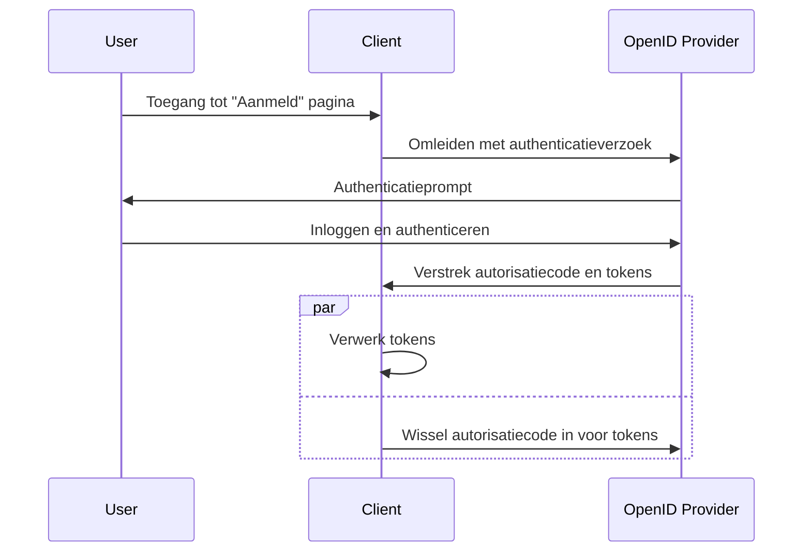

## Wat is hybride stroom (Hybrid flow)?

De hybride stroom (Hybrid flow) is een authenticatieproces dat de kenmerken combineert van de <Ref slug="authorization-code-flow" /> en de <Ref slug="implicit-flow" />. Het is belangrijk op te merken dat de hybride stroom geen onderdeel is van de <Ref slug="oauth-2.0" /> specificatie, maar een uitbreiding is die wordt geboden door <Ref slug="openid-connect" />.

Deze stroom is ontworpen om een balans te bieden tussen veiligheid en bruikbaarheid voor gebruikersauthenticatie. Echter, de hybride stroom wordt niet aanbevolen voor nieuwe applicaties vanwege de [veiligheidsoverwegingen](#security-considerations) die gepaard gaan met de impliciete stroom. Een populair alternatief voor de hybride stroom is het gebruik van de autorisatiecode stroom (authorization code flow) met <Ref slug="pkce" /> voor betere beveiliging.

## Hoe werkt de hybride stroom (Hybrid flow)?

Hier zijn de belangrijkste stappen van de hybride stroom:

1. Net als andere OIDC stromen, begint de hybride stroom met de <Ref slug="client" /> die een <Ref slug="authentication-request" /> naar de <Ref slug="openid-connect" headingId="openid-provider-op" /> initieert.

    Opmerking: De client moet de `response_type` parameter opnemen met de combinatie van `code` en ten minste één van `id_token` of `token`, wat betekent dat er drie mogelijke combinaties zijn:

      - `code id_token`: De client verwacht een autorisatiecode en een ID-token.
      - `code token`: De client verwacht een autorisatiecode en een toegangstoken (access token).
      - `code id_token token`: De client verwacht een autorisatiecode, een ID-token en een toegangstoken (access token).

    De eis is duidelijk: de client verwacht zowel een autorisatiecode als een of meer tokens, wat respectievelijk overeenkomt met de autorisatiecode stroom (authorization code flow) en de impliciete stroom (implicit flow).
2. De gebruiker authenticeert zich op de <Ref slug="openid-connect" headingId="openid-provider-op" />.
3. De <Ref slug="openid-connect" headingId="openid-provider-op" /> leidt de gebruiker terug naar de clientapplicatie met de autorisatiecode en de aangevraagde tokens.
4. De clientapplicatie verwerkt de tokens en kan ze gebruiken om namens de gebruiker toegang te krijgen tot beveiligde bronnen; het kan ook de autorisatiecode gebruiken om extra tokens te verkrijgen via de <Ref slug="token-request" />.

Hier is een vereenvoudigd sequentiediagram van de hybride stroom:



Hier is een niet-normatief voorbeeld van een hybride stroom authenticatieverzoek:

```http
GET /authorize?response_type=code%20id_token
  &client_id=YOUR_CLIENT_ID
  &redirect_uri=https%3A%2F%2Fclient.example.com%2Fcallback
  &scope=openid%20profile%20email
  &nonce=123456
  &state=abc123 HTTP/1.1
Host: your-openid-provider.com
```

### Belangrijke parameters in een hybride stroom authenticatieverzoek

Het hybride stroom authenticatieverzoek omvat de volgende belangrijke parameters:

- **`response_type`**: De waarde moet een combinatie zijn van `code` en ten minste één van `id_token` of `token`. Bijvoorbeeld, `code id_token` of `code token`.
- **`client_id`**: De clientidentifier uitgegeven door de <Ref slug="openid-connect" headingId="openid-provider-op" /> (autorisatieserver).
- **`redirect_uri`**: De URI waar de autorisatieserver de gebruiker naartoe stuurt na het authenticatieproces.
- **`scope`**: De aangevraagde <Ref slug="scope">scopes</Ref> (machtigingen) voor de tokens.
- **`resource`**: De optionele parameter die de <Ref slug="resource-indicator" /> voor de aangevraagde bronnen specificeert. De autorisatieserver moet [RFC 8707](https://datatracker.ietf.org/doc/html/rfc8707) ondersteunen om deze parameter te kunnen gebruiken.

Voor de volledige lijst van parameters en hun beschrijvingen, zie [Authenticatie met de Hybrid Flow](https://openid.net/specs/openid-connect-core-1_0.html#HybridFlowAuth).

## Veiligheidsoverwegingen

De hybride stroom omvat de impliciete stroom, die bekend staat om zijn beveiligingsbeperkingen. Tokens worden nog steeds via het frontkanaal (browser) verzonden, wat ze blootstelt aan mogelijke aanvallen. De impliciete stroom zal worden uitgefaseerd in <Ref slug="oauth-2.1" /> vanwege deze zorgen.

<Ref slug="authorization-code-flow" /> met <Ref slug="pkce" /> is het aanbevolen alternatief voor de hybride stroom. Het biedt een veiliger manier om gebruikers te authenticeren zonder tokens in het frontkanaal bloot te stellen.

<SeeAlso slugs={["openid-connect", "oauth-2.1", "authorization-code-flow", "pkce", "implicit-flow"]} />

<Resources
  urls={[
    "https://blog.logto.io/implicit-flow-is-dead",
    "https://blog.logto.io/oauth-2-1",
    "https://openid.net/specs/openid-connect-core-1_0.html#HybridFlowAuth",
  ]}
/>