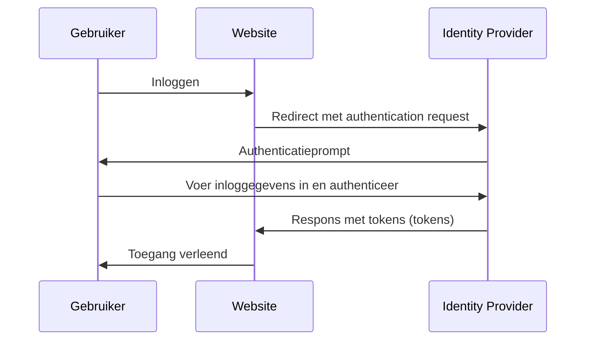

## Wat is identiteit en toegangsbeheer (IAM)?

Zoals de definitie suggereert, is identiteit en toegangsbeheer (IAM) een breed concept dat vele aspecten van het beheren van digitale identiteiten en het uitvoeren van <Ref slug="access-control" /> omvat. Laten we eerst de termen opsplitsen:

- **Identiteit**: Een digitale representatie van een gebruiker, dienst of apparaat. Een identiteit kan attributen bevatten zoals identificaties, rollen en permissies.
- **Toegang**: Het vermogen om te interageren met middelen, acties uit te voeren of diensten te gebruiken. Samengevat gaat toegang over welke acties op bepaalde middelen mogen worden uitgevoerd.

### Identiteitsbeheer

Identiteitsbeheer is het proces van het beheren, authenticeren en beveiligen van digitale identiteiten. Het omvat de volgende kernactiviteiten:

- **Identiteitsregistratie**: Het creëren van nieuwe identiteiten voor gebruikers, diensten of apparaten.
- **Identiteitsauthenticatie (authentication)**: Het verifiëren van het eigenaarschap van een identiteit via verschillende mechanismen zoals wachtwoorden, biometrie of multi-factor authentication (mfa).
- **Identiteitsbeveiliging**: Het beschermen van identiteiten tegen ongeautoriseerde toegang, misbruik of ongeoorloofde openbaarmaking.

Elk onderwerp is uitgebreid en kan verder onderverdeeld worden in subonderwerpen zoals wachtwoordbeheer, identiteitsfederatie en identiteitslevenscyclusbeheer.

### Toegangsbeheer

Toegangsbeheer (of <Ref slug="access-control" />) is het proces van controleren wie welke acties op bepaalde middelen kan uitvoeren. Het omvat de volgende kernactiviteiten:

- **Toegangscontrolebeleid**: Het definiëren van regels en beleid die bepalen wie welke middelen kan benaderen en welke acties ze mogen uitvoeren.
- **Toegangsafdwinging**: Het afdwingen van toegangscontrolebeleid via mechanismen zoals authentication (authenticatie), authorization (autorisatie) en auditing.
- **Toegangsgovernance**: Het monitoren en beheren van toegangsrechten om naleving van wet- en regelgeving en beveiligingspraktijken te waarborgen.

Elke activiteit speelt een belangrijke rol in moderne toepassingen en systemen om ervoor te zorgen dat alleen geautoriseerde identiteiten (gebruikers, diensten of apparaten) middelen kunnen benaderen op basis van de gedefinieerde beleidsregels.

## Wat zijn de componenten van IAM?

In de praktijk wordt IAM geïmplementeerd met behulp van een combinatie van software, diensten en best practices. Twee belangrijke componenten van IAM zijn:

- **<Ref slug="identity-provider" />**: Een dienst die gebruikersidentiteiten en authentication beheert.
- **<Ref slug="service-provider" />**: Een dienst die vertrouwt op een identity provider voor authentication en authorization. In de meeste gevallen is dit de toepassing of dienst die je ontwikkelt.

Een duidelijke scheiding tussen de identity provider en service provider zal helpen om IAM los te koppelen van de applicatielogica, waardoor het gemakkelijker te beheren en schalen is.

## Identiteit en toegangsbeheer in de praktijk

Laten we een voorbeeld bekijken van hoe IAM werkt: wanneer je je aanmeldt bij een website, kan het proces van verifiëren wie je bent en je toegang verlenen tot de website worden beschouwd als een identiteit en toegangsbeheerproces.

Meestal omvat het IAM-proces twee hoofdfasen: authentication en authorization:

- <Ref slug="authentication" /> beantwoordt de vraag “Welke identiteit bezit je?”
- <Ref slug="authorization" /> beantwoordt de vraag “Wat kan je doen?”

> Soms zal authentication worden geïnterpreteerd als "Wie ben je?" Echter, bij het bespreken van digitale identiteiten is het nauwkeuriger om authentication te demonstreren door "het eigenaarschap van identiteit te bewijzen".

Bovendien is het concept van identiteit en toegangsbeheer zelfs groot genoeg om nieuwe concepten te laten ontstaan, zoals WIAM (Workforce IAM) en CIAM (Customer IAM).

Hoewel WIAM en CIAM dezelfde basis delen, hebben ze verschillende gebruikscases: WIAM wordt meestal gebruikt voor interne gebruikers, terwijl CIAM wordt gebruikt voor externe klanten. Enkele voorbeelden:

- **WIAM**: Je bedrijf heeft een uniform identiteitsysteem voor werknemers, zodat iedereen hetzelfde account kan gebruiken om toegang te krijgen tot bedrijfsbronnen, zoals software-abonnementen, cloud computing-diensten, enz.
- **CIAM**: Jouw online boekwinkel vereist een gebruikersidentiteitssysteem voor klanten en verkopers. De inlogervaring is een cruciaal onderdeel van onboarding, aangezien het zich aan de top van de conversietrechter bevindt.

Om meer te leren over het concept van CIAM en gerelateerde onderwerpen, kun je verwijzen naar [CIAM 101: Authentication, Identity, SSO](https://blog.logto.io/ciam-101-intro-authn-sso).

### Authenticatie

Hier zijn enkele veelgebruikte authenticatiemethoden die worden gebruikt in IAM:

- **Wachtwoordgebaseerde authenticatie**: De meest gebruikelijke methode, waarbij gebruikers een gebruikersnaam en wachtwoord opgeven om hun identiteit te bewijzen.
- **<Ref slug="passwordless" /> authenticatie**: Een methode die gebruikers toestaat in te loggen zonder een wachtwoord, zoals door een eenmalige code naar hun e-mail of telefoon te sturen. Merk op dat passwordless-authenticatie ook naar andere methoden kan verwijzen, zoals biometrische authenticatie.
- **Sociale login**: Een methode die gebruikers toestaat in te loggen met hun sociale media accounts, zoals Google, Facebook of Twitter.
- **<Ref slug="passkey" /> (WebAuthn)**: Een methode die gebruikers toestaat in te loggen met een beveiligingssleutel, zoals een USB-sleutel of een smartphone die WebAuthn ondersteunt.
- **Biometrische authenticatie**: Een methode die fysieke kenmerken, zoals vingerafdrukken, gezichtsherkenning of stemherkenning gebruikt om de identiteit van een gebruiker te verifiëren.
- **<Ref slug="machine-to-machine" /> authenticatie**: Een methode die diensten of apparaten toestaat elkaar te authenticeren zonder menselijke tussenkomst, zoals door gebruik te maken van API-keys of certificaten.

Voor een extra beveiligingslaag kan <Ref slug="mfa" /> worden gebruikt in combinatie met deze authenticatiemethoden. MFA vereist dat gebruikers twee of meer factoren opgeven om hun identiteit te bewijzen, zoals iets dat ze weten (wachtwoord), iets dat ze hebben (beveiligingssleutel of <Ref slug="totp" />), of iets dat ze zijn (biometrische gegevens).

### Autorisatie

Met authentication op zijn plaats, bepaalt authorization welke acties een identiteit kan uitvoeren. Authorization kan gebaseerd zijn op verschillende factoren, zoals de rol van de identiteit, groepslidmaatschap, permissies, attributen, beleidsregels, enzovoort. Er zijn verschillende veelvoorkomende autorisatiemodellen:

- **<Ref slug="rbac" />**: Een model dat permissies toewijst aan rollen, en vervolgens rollen aan identiteiten. Bijvoorbeeld, een werknemerrol mag toegang hebben tot bepaalde middelen, terwijl een adminrol toegang heeft tot alle middelen.
- **<Ref slug="abac" />**: Een model dat attributen (eigenschappen) van de identiteit, het middel en de omgeving gebruikt om beslissingen te nemen over <Ref slug="access-control" />. Bijvoorbeeld, een identiteit met het attribuut "afdeling=techniek" mag toegang hebben tot technische middelen.
- **Policy-based access control (PBAC)**: Een model dat beleid gebruikt om regels voor toegang te definiëren. Beleid kan gebaseerd zijn op verschillende factoren, zoals tijd van de dag, locatie, apparaattype, enzovoort.
- **Fijnmazige toegangscontrole**: Een model dat meer gedetailleerde controle over toegang biedt, waardoor permissies kunnen worden ingesteld op het niveau van individuele middelen of acties.

## Wat zijn de veelgebruikte open standaarden voor IAM?

Er zijn verschillende open standaarden en protocollen die veel worden gebruikt in IAM:

- **<Ref slug="oauth-2.0" />**: Een protocol dat applicaties toestaat om toegang te krijgen tot middelen namens een gebruiker zonder de inloggegevens van de gebruiker te delen. OAuth 2.0 wordt vaak gebruikt voor authorization, zoals het toestaan van een derde-partij applicatie om toegang te krijgen tot een gebruikers Google Drive-bestanden.
- **<Ref slug="openid-connect" />**: Een identiteitslaag die bovenop OAuth 2.0 is gebouwd en applicaties toestaat de identiteit van een gebruiker te verifiëren en basisprofielinformatie over de gebruiker te verkrijgen. Single sign-on (SSO) is een veelvoorkomende toepassing voor OpenID Connect. Het combineren van OAuth 2.0 en OpenID Connect is een veelvoorkomende praktijk voor moderne IAM.
- **<Ref slug="saml" />**: Een XML-gebaseerde standaard voor het uitwisselen van authenticatie en authorization gegevens tussen identity providers en service providers. SAML wordt vaak gebruikt voor SSO in bedrijfsomgevingen.
- **SCIM (System for Cross-domain Identity Management)**: Een standaard voor het automatiseren van de uitwisseling van gebruikersidentiteitsinformatie tussen identity providers en service providers. SCIM wordt meestal gebruikt voor gebruikersvoorziening en het intrekken van gebruikersautorisaties in cloudgebaseerde toepassingen.

## Wat zijn de belangrijkste ontwerpcriteria voor IAM?

Bij het ontwerpen van een IAM-systeem zijn er verschillende belangrijke overwegingen om in gedachten te houden:

- **Beveiliging**: Beveiliging is van het grootste belang in IAM. Zorg ervoor dat authenticatiemethoden de beste praktijken volgen, zoals het gebruik van sterke wachtwoordhashing, het afdwingen van mfa, en bescherming tegen veelvoorkomende aanvallen zoals phishing en brute force.
- **Privacy**: Respecteer de privacy van gebruikers door alleen de nodige informatie te verzamelen en gebruikers toestemming te vragen wanneer dat nodig is.
- **Schaalbaarheid**: Maak het IAM-systeem schaalbaar om een groot aantal gebruikers en applicaties te kunnen verwerken. Overweeg het gebruik van cloudgebaseerde identity providers voor schaalbaarheid.
- **Interoperabiliteit**: Een voordeel van het gebruik van open standaarden is dat het interoperabiliteit tussen verschillende systemen mogelijk maakt. Bijvoorbeeld, de meeste populaire identity providers zoals Google, Facebook en Microsoft ondersteunen OAuth 2.0 en OpenID Connect.
- **Gebruikerservaring**: De gebruikerservaring voor authentication en authorization heeft een grote invloed op gebruikersconversie en -retentie. Balanceren van beveiliging met gebruiksgemak is een kunst in IAM.

<SeeAlso slugs={['openid-connect', 'oauth-2.0', 'single-sign-on', 'enterprise-sso']} />

<Resources
  urls={[
    "https://blog.logto.io/ciam-101-intro-authn-sso",
    "https://blog.logto.io/ciam-102-authz-and-rbac"
  ]}
/>
