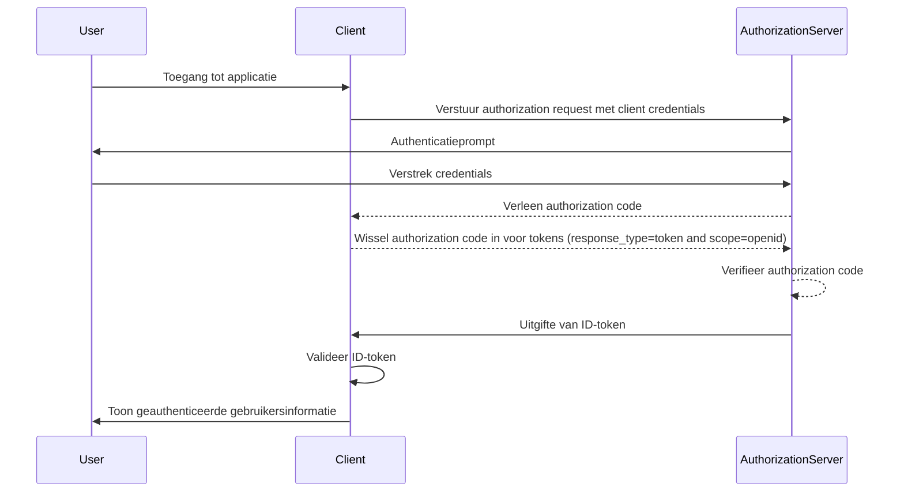

## Wat is een ID-token?

Een ID-token is een specifiek type veiligheidstoken dat informatie bevat over de geauthenticeerde gebruiker, geleverd aan de clienttoepassing na een succesvolle <Ref slug="authentication" />. Het ID-token is het kenmerk dat <Ref slug="openid-connect" /> onderscheidt van <Ref slug="oauth-2.0" />. Terwijl OAuth 2.0 zich uitsluitend richt op authorization, bouwt OIDC hierop voort door gebruikersauthenticatie toe te voegen met behulp van het ID-token.

In het OIDC-authenticatieproces initieert een clienttoepassing (relying party) de authenticatie door de gebruiker om te leiden naar een authorization server. Na succesvolle authenticatie reageert de server met een ID-token, samen met andere tokens zoals het <Ref slug="access-token" />. Het ID-token is doorgaans gecodeerd als een <Ref slug="jwt" /> en bevat belangrijke claims zoals de identificatie van de gebruiker (sub), de issuer (iss), audience (aud) en andere gebruikersspecifieke informatie.

De primaire functie van het ID-token is om de identiteit van de gebruiker te verifiëren en deze informatie aan de clienttoepassing door te geven. Dit stelt de applicatie in staat om de gebruiker te authenticeren zonder direct met credentials om te gaan. Aangezien de client het ID-token pas ontvangt nadat de gebruiker is geauthenticeerd door de authorization server, kan het ID-token worden gebruikt als een veilige manier om de identiteit van de gebruiker te verifiëren.

## Hoe werkt een ID-token?

De clienttoepassing start het authenticatieproces door de gebruiker om te leiden naar de authorization server. De gebruiker authenticeert zich bij de server, die vervolgens een ID-token afgeeft samen met andere tokens zoals het access token. Het ID-token wordt teruggestuurd naar de clienttoepassing, die het vervolgens kan gebruiken om de identiteit van de gebruiker te verifiëren.

Omdat OIDC een populaire en gestandaardiseerde protocol is, bieden veel bibliotheken en frameworks ingebouwde ondersteuning voor het verwerken van ID-tokens. Dit maakt ID-tokens eenvoudig te integreren in clienttoepassingen, en ze worden veel gebruikt in <Ref slug="single-sign-on" /> en federated identity-scenario's.

## Claims in een ID-token

Een ID-token is een JWT die een set <Ref slug="claim" /> bevat over de geauthenticeerde gebruiker. Deze claims omvatten zowel standaard JWT-claims die zijn gedefinieerd in de [JWT-specificatie](https://datatracker.ietf.org/doc/html/rfc7519#section-4), als OIDC-specifieke claims die worden gebruikt om gebruikersidentiteitsinformatie over te brengen.

Standaard JWT-tokenclaims:

- **iss (Issuer)**: VEREIST. De issuer claim identificeert de issuer van het ID-token. Dit is doorgaans de URL van de authorization server die het token heeft uitgegeven.
- **sub (Subject)**: VEREIST. De subject claim identificeert de gebruiker waar het ID-token over gaat. Dit is doorgaans een unieke identifier voor de gebruiker.
- **aud (Audience)**: VEREIST. De audience claim identificeert de <Ref slug="audience" /> voor het ID-token. Dit is doorgaans de clienttoepassing die het token heeft aangevraagd.
- **exp (Expiration time)**: VEREIST. De expiration time claim identificeert het tijdstip waarop het token verloopt. Na deze tijd mag het token niet meer verwerkt worden.
- **iat (Issued at)**: VEREIST. De issued at claim identificeert het tijdstip waarop het token is uitgegeven.
- **auth_time (Authentication time)**: OPTIONEEL. De authentication time claim identificeert het tijdstip waarop de gebruiker geauthenticeerd werd. Deze claim is alleen aanwezig als de gebruiker tijdens de huidige sessie is geauthenticeerd.
- **nonce**: OPTIONEEL. De nonce claim wordt gebruikt om een clientsessie te associëren met een ID-token. Het wordt doorgaans gebruikt om replay-aanvallen te voorkomen.

OIDC-standaard gebruikersinformatieclaims:

- **name**: De volledige naam van de gebruiker.
- **given_name**: De voornaam van de gebruiker.
- **family_name**: De achternaam van de gebruiker.
- **middle_name**: De tweede naam van de gebruiker.
- **nickname**: De bijnaam of andere korte naam van de gebruiker.
- **preferred_username**: De geprefereerde gebruikersnaam van de gebruiker.
- **profile**: Een URL die naar de profielpagina van de gebruiker leidt.
- **picture**: Een URL die naar de profielfoto van de gebruiker leidt.
- **website**: Een URL die naar de website van de gebruiker leidt.
- **email**: Het e-mailadres van de gebruiker.
- **email_verified**: Een booleaanse waarde die aangeeft of het e-mailadres van de gebruiker is geverifieerd.
- **gender**: Het geslacht van de gebruiker.
- **birthdate**: De geboortedatum van de gebruiker. Wordt weergegeven als een string in het formaat JJJJ-MM-DD.
- **zoneinfo**: De tijdzone van de gebruiker. String uit de [IANA Time Zone Database](https://www.iana.org/time-zones).
- **locale**: De taal- en regiovoorkeur van de gebruiker. Vertegenwoordigt de voorkeursinstellingen van de gebruiker voor het formatteren van datums, tijden en nummers.
- **phone_number**: Het telefoonnummer van de gebruiker.
- **phone_number_verified**: Een booleaanse waarde die aangeeft of het telefoonnummer van de gebruiker is geverifieerd.
- **address**: Het postadres van de gebruiker. De waarde is een JSON-object dat de adresinformatie van de gebruiker bevat.
- **updated_at**: Het tijdstip waarop de informatie van de gebruiker voor het laatst is bijgewerkt.

Deze claims bieden een gestandaardiseerde manier om gebruikersidentiteitsinformatie in het ID-token over te brengen. Terwijl in de specificatie alleen een set van standaardclaims wordt gedefinieerd, kunnen ook aangepaste claims worden opgenomen in het ID-token om aanvullende gebruikersspecifieke informatie over te brengen indien nodig.

## Validatie van ID-tokens

Wanneer de clienttoepassing een ID-token ontvangt, moet deze het token valideren om de authenticiteit en integriteit ervan te waarborgen. Het validatieproces omvat doorgaans de volgende stappen:

1. **Controleer de handtekening**: De client moet de handtekening van het ID-token verifiëren met behulp van de openbare sleutel van de authorization server. Dit zorgt ervoor dat het token niet is gewijzigd en is uitgegeven door de verwachte partij.
2. **Controleer de issuer**: De client moet verifiëren dat de `iss`-claim in het ID-token overeenkomt met de URL van de authorization server die het token heeft uitgegeven. Dit helpt token-substitutieaanvallen te voorkomen.
3. **Controleer de audience**: De client moet verifiëren dat de `aud`-claim in het ID-token overeenkomt met de `client_id` van de clienttoepassing. Dit zorgt ervoor dat het token is uitgegeven voor de clienttoepassing.
4. **Controleer de vervaltijd**: De client moet verifiëren dat de `exp`-claim in het ID-token niet is verstreken. Als het token is verlopen, moet het niet worden geaccepteerd. Implementaties kunnen een speling bieden om rekening te houden met tijdsverschillen.
5. **Controleer de nonce**: Als de client een `nonce`-parameter heeft opgenomen in de authentication request, moet ze verifiëren dat de `nonce`-claim in het ID-token overeenkomt met de waarde van de `nonce`-parameter. Dit helpt om replay-aanvallen te voorkomen.

## ID-token versus access token

Hoewel zowel ID-tokens als access tokens veel worden gebruikt in OIDC, hebben ze verschillende doelen en kenmerken:

|              | ID-token                                                                               | Access token                                                                                                                 |
| ------------ | -------------------------------------------------------------------------------------- | ---------------------------------------------------------------------------------------------------------------------------- |
| **Doel**     | Verifieert de identiteit van de gebruiker en stuurt gebruikersinformatie naar de clienttoepassing. | Biedt toegang tot beschermde resources namens de gebruiker.                                                                |
| **Formaat**  | Doorgaans een JWT die gebruikersidentiteitsclaims bevat.                               | Kan een JWT of een <Ref slug="opaque-token" /> zijn.                                                                        |
| **Audience** | Bedoeld voor de clienttoepassing die het token heeft aangevraagd.                      | Bedoeld voor de resource server die de beschermde resources host.                                                          |
| **Levensduur** | Kortstondig token dat doorgaans enkele minuten geldig is. Eenmalig gebruik.           | Langere levensduur, geldig voor een langere periode (bijvoorbeeld uren). Kan meerdere keren worden hergebruikt binnen de geldigheidsperiode. |
| **Inhoud**   | Bevat gebruikersidentiteitsinformatie zoals naam, e-mail en andere gebruikersspecifieke gegevens. | Bevat informatie over de machtigingen (scopes) van de gebruiker tot specifieke resources.                                   |

## Best practices voor het gebruik van ID-tokens

Bij het werken met ID-tokens in OIDC is het belangrijk om best practices te volgen om de veiligheid en integriteit van het authenticatieproces te waarborgen. Enkele belangrijke best practices zijn:

1. **Valideer ID-tokens**: Valideer altijd het ID-token dat is ontvangen van de authorization server om de authenticiteit en integriteit ervan te waarborgen. Dit helpt token-substitutieaanvallen en ongeautoriseerde toegang te voorkomen.
2. **Gebruik beveiligde kanalen**: Zorg ervoor dat ID-tokens worden overgedragen via beveiligde kanalen (bijv. HTTPS) om onderschepping en manipulatie te voorkomen.
3. **Bescherm gevoelige informatie**: Aangezien JWT's doorgaans zijn gecodeerd maar niet versleuteld, waardoor de inhoud transparant is. Vermijd het opnemen van gevoelige informatie in de payload van het ID-token om blootstelling van gevoelige gegevens bij tokenlekkage te voorkomen.
4. **Niet voor authorization**: ID-tokens zijn bedoeld voor gebruikerauthenticatie en mogen niet worden gebruikt voor authorization-doeleinden. Gebruik access tokens voor authorization om toegang te krijgen tot beschermde resources.
5. **Eenmalig gebruik**: ID-tokens zijn over het algemeen bedoeld voor eenmalig gebruik. Zodra een clienttoepassing een ID-token heeft gevalideerd, mag het niet opnieuw worden gebruikt voor latere verzoeken of sessiestatusbehoud. Om de status van de gebruikerssessie te behouden, moeten clienttoepassingen mechanismen gebruiken zoals <Ref slug="refresh-token" /> en tokenuitwisselingsverzoeken. (Refresh tokens zijn langlevende opaque tokens die kunnen worden gebruikt om nieuwe access tokens en ID-tokens te krijgen wanneer ze verlopen.)

<SeeAlso slugs={["openid-connect", "jwt", "signing-key", "access-token"]} />